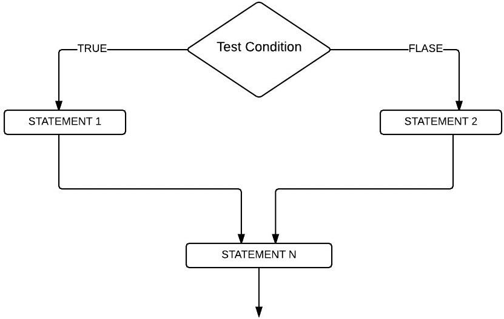
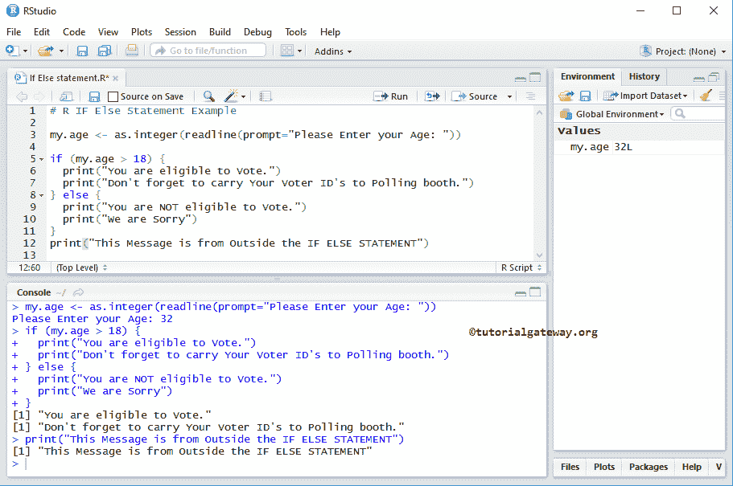
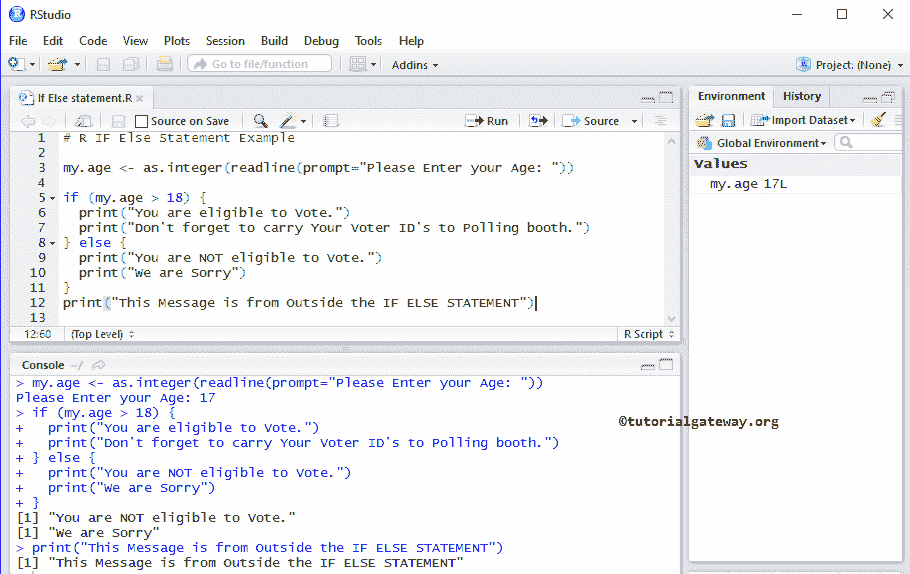

# `if-else`语句

> 原文：<https://www.tutorialgateway.org/r-if-else-statement/>

`if-else`语句是`if`语句的扩展。让我们通过一个例子来看看如何实时使用这个 R `if-else`语句。我们知道 `if`语句只有在给定条件为真时才执行代码。如果条件为假，它将不会执行任何代码块。

在现实世界中，当条件失败时，执行一些东西是很好的。为此，我们可以在 R 语言中使用这个 If else。这里，当条件失败时，Else 块执行代码。

## `if-else`语句语法

R 语言中 If Else 的基本语法是:

```
if (Boolean_Expression)  {
     #If the Boolean_Expression result is TRUE, these will be executed
     True code
} else  {
     #If the Boolean_Expression result is FALSE, these will be executed
     False code
}
```

从上面的 R `if-else`语句代码片段中，如果上述语法中的测试条件/布尔表达式为真，则执行 true 代码。如果表达式的计算结果为假，则执行假代码。

### 如果没有，语句流程图

下图为 R 语言中 `if-else`语句后面的流程图



*   从“如果没有”流程图中，如果测试条件为真，则执行 STATEMENT1，然后执行 STATEMENTN。
*   如果条件为假，则执行 STATEMENT2，然后执行 STATEMENTN。这里，STATEMENTN 的执行与测试结果无关。因为它放置在 If Else 条件块之外，所以与条件结果无关。

## 若有则语句示例

该程序允许用户输入他们的年龄，并使用 [R 语言](https://www.tutorialgateway.org/r-programming/)中的 `if-else`语句检查他们是否有资格投票。

在这个 R `if-else`语句程序中，我们将放置 4 个不同的打印消息。如果条件为真，我们将打印两个不同的语句。如果条件为假，我们将打印另外两个语句。请参考 [If 条件](https://www.tutorialgateway.org/r-if-statement/)一文。

```
# R IF Else Statement Example

my.age <- as.integer(readline(prompt="Please Enter your Age: "))

if (my.age > 18) {
  print("You are eligible to Vote.") # 1
  print("Don't forget to carry Your Voter ID's to Polling booth.") # 2
} else {
  print("You are NOT eligible to Vote.") # 3
  print("We are Sorry") # 4
}
print("This Message is from Outside the IF ELSE STATEMENT") # 5
```

用户输入他/她的年龄。如果年龄大于或等于 18 岁，则打印 1 和 2。如果年龄小于 18 岁，则输出 3 和 4。在 If Else 块之外，我们放置了一个打印函数 5，不管表达式结果如何，这个消息都会被执行。

输出 1:让我们进入 32 岁。表达结果为真



让我们进入年龄= 17 岁的状态。所以，它是假的

