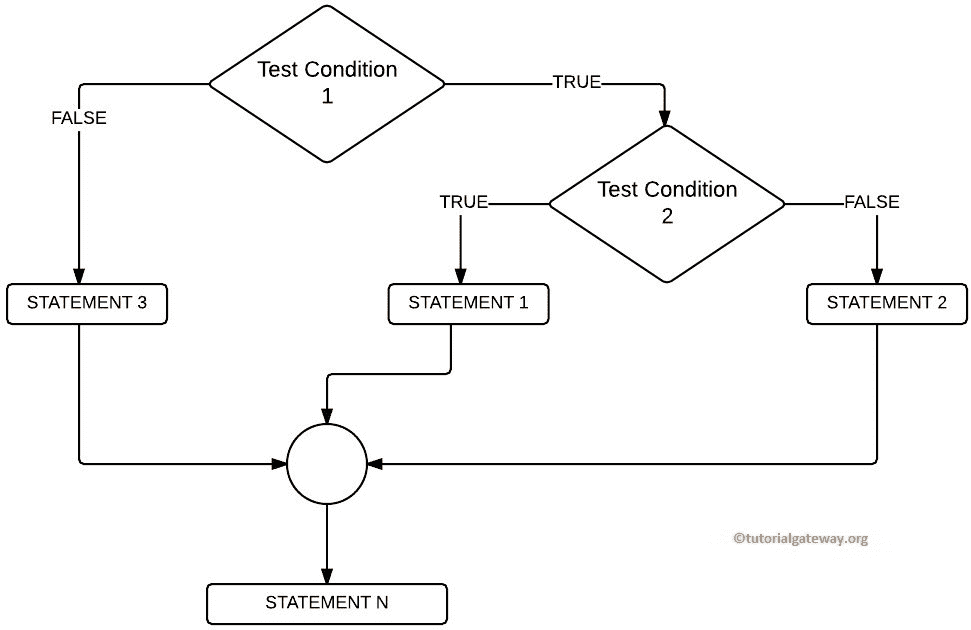
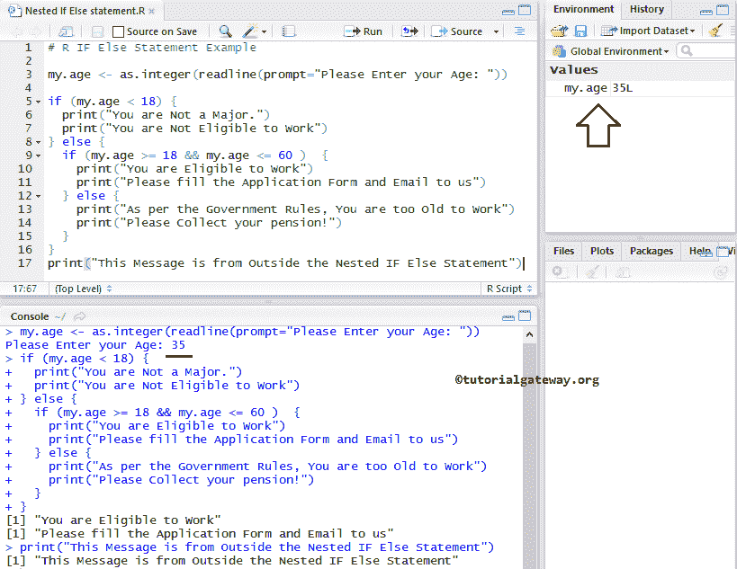
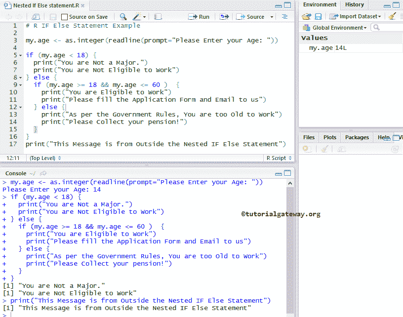
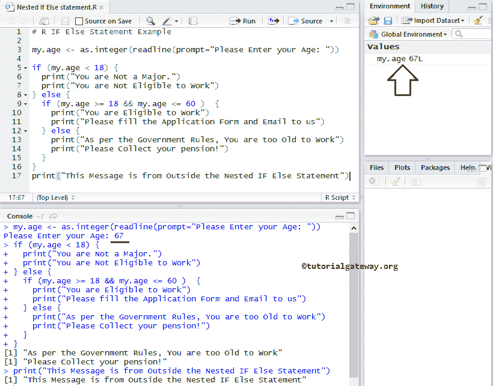

# R 中嵌套的`If Else`

> 原文：<https://www.tutorialgateway.org/nested-if-else-in-r/>

在 R 语言中，将一个 `if`语句放在另一个作为嵌套`if-else` 调用的 `if`语句中。`if-else`语句允许我们根据表达式结果(真或假)打印不同的语句。有时，当条件为真时，我们必须进一步检查。在这些情况下，我们可以在 R 中使用这个嵌套的`if-else` 概念，但是使用时请小心。

例如，如果一个人年满 18 岁或以上，他就有资格工作。但是，政府或任何公司都不会给每个人一份工作。因此，我们在 R 语言中使用另一个 `if`语句也称为嵌套 `if-else`语句来检查他以前的经验、教育背景或任何特定于工作的要求。

在本文中，我们将通过示例向您展示如何用 R 语言编写嵌套的 `if-else`语句。在我们进入这个例子之前，让我们看看嵌套的 `if-else`语句背后的语法。

## R 语法中的嵌套`if-else`

R 语言中嵌套 `if-else`语句的基本语法如下:

```
if (Boolean_Expression 1)  {
     #Boolean_Expression 1 result is TRUE then, it will check for Boolean_Expression 2
     if (Boolean_Expression 2)  {
          #Boolean_Expression 2 result is TRUE, then these statements will be executed
          Boolean_Expression 2 True statements
     } else {
          #Boolean_Expression 2 result is FALSE then, these statements will be executed
          Boolean_Expression 2 False statements
} else  {
     #If the Boolean_Expression 1 result is FALSE, these statements will be executed
     Boolean_Expression 1 False statements
}
```

## R 流程图中的嵌套`if-else`

下图显示了 R 语言中嵌套 `if`语句的流程图。

*   如果测试条件 1 为假，则执行语句 3。
*   如果测试条件 1 为真，则它将检查测试条件 2。如果为真，则执行语句 1。否则，执行语句 2。



## R 语言示例中的嵌套`if-else`

这个嵌套的`if-else` 程序允许用户输入他们的年龄，然后我们将它存储在变量 my.age 中。如果用户指定的年龄小于 18 岁，我们将打印两个语句。如果条件失败，我们再检查一个条件(R Nested If Else)，如果成功，我们就打印一些东西。如果嵌套条件失败，我们会打印一些其他的东西。

```
# Nested IF Else in R Programming Example

my.age <- as.integer(readline(prompt="Please Enter your Age: "))

if (my.age < 18) {
  print("You are Not a Major.") 
  print("You are Not Eligible to Work")
} else {
  if (my.age >= 18 && my.age <= 60 )  {
    print("You are Eligible to Work")
    print("Please fill the Application Form and Email to us")
  } else {
    print("As per the Government Rules, You are too Old to Work")
    print("Please Collect your pension!")
  }  
}
print("This Message is from Outside the Nested IF Else Statement")
```

在 R 嵌套`if-else` 程序示例中，如果指定人员的年龄小于 18 岁，则他没有资格工作。如果年龄大于或等于 18 岁，第一个条件失败，它将检查 else 语句。在 Else 语句中，还有另一个布尔表达式(称为嵌套`if-else`)。

*   R 嵌套 `if-else`语句检查该人的年龄是否大于或等于 18 岁且小于或等于 60 岁。如果表达式为真，那么他可以申请这份工作。
*   如果表达结果为假，那么他太老了，不能按照政府的规定工作。
*   我们在 If Else 块外放置了一个 print 语句，它将执行，而不管条件结果如何。

请参考 [R 语言](https://www.tutorialgateway.org/r-programming/)中 [`if-else`语句](https://www.tutorialgateway.org/r-if-else-statement/)和 [`if`语句](https://www.tutorialgateway.org/r-if-statement/)的文章。

输出 1:我们将输入年龄= 35 意味着第一个 IF 条件为 FALSE。它将转到 else 块，并在 else 块内检查 if(年龄> = 18 &&年龄<=60), which is TRUE. So, it will print the statements inside this block.



输出 2:从下面的 R 嵌套`if-else` 截图中，可以观察到我们输入的年龄= 14 意味着，第一个 If 条件为 TRUE。这就是为什么执行第一个 `if`块中的语句。



这一次，我们要进入年龄= 67 意味着第一如果条件为假。它将转到 else 块，在 else 块中，它将检查表达式 if(年龄> = 18 && age <=60), which is FALSE. That’s why it will print the statements inside Nested else block.

