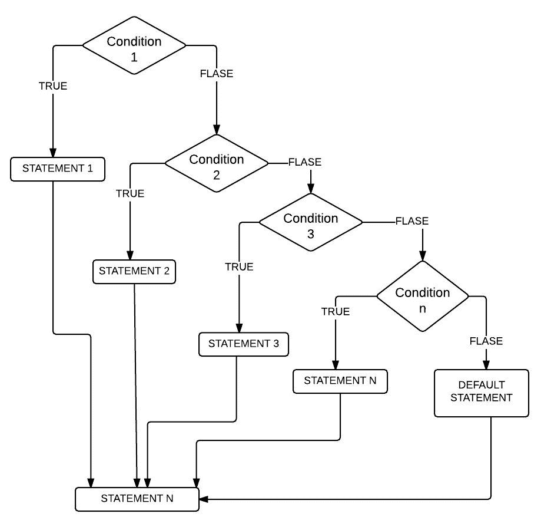
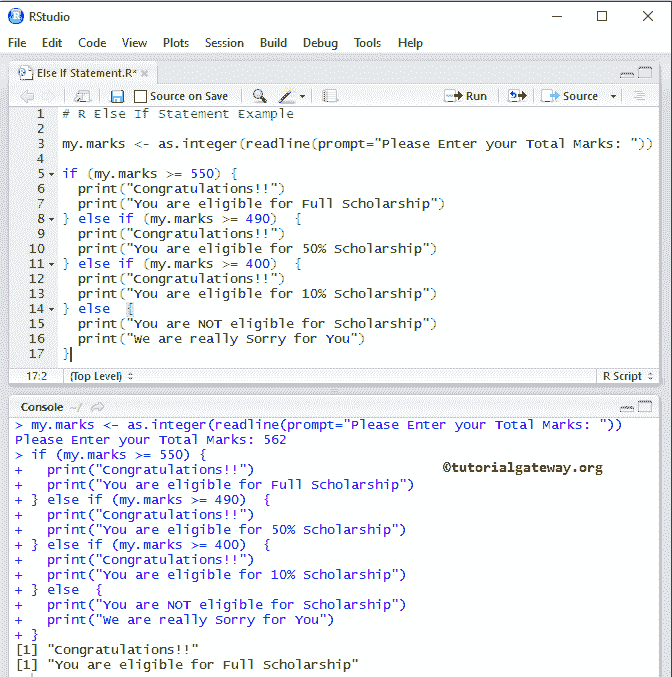
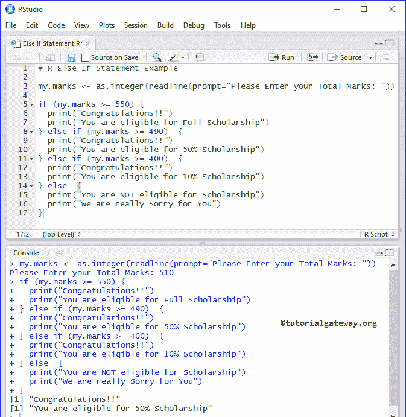
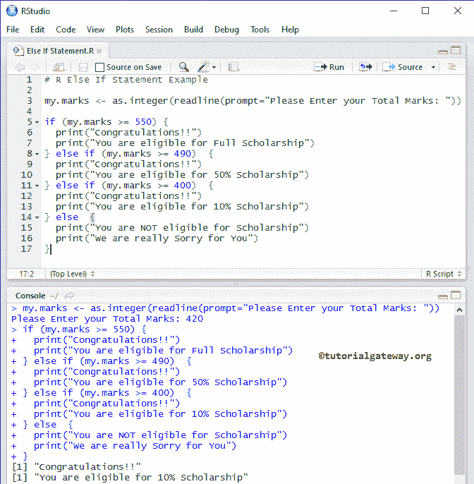
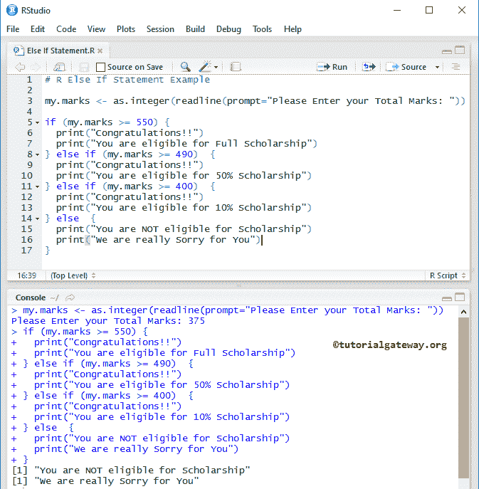

# `else if`语句

> 原文：<https://www.tutorialgateway.org/r-else-if-statement/>

R `else if`语句是 If-Else 的扩展，当我们必须检查几个条件时，它非常有用。我们也可以使用嵌套的 `if-else`语句来获得 R `else if`语句的结果。但是，随着条件数量的增加，代码的复杂性也会增加。

在本文中，我们通过一个例子展示了如何在 R 语言中编写 `else if`语句。在进入 R 语言示例中的 Else if 之前，让我们看看语法

## 否则 `if`语句语法

R 语言中 `else if`语句的基本语法是

```
if (Boolean_Expression 1)  {
     Statement 1
} else if (Boolean_Expression 2)  {
     Statement 2
.........
} else if (Boolean_Expression N)  {
     Statement N
} else  {
     Default statements
}
```

R 中的 `else if`语句可以通过顺序执行多个表达式来有效地处理它们。否则 `if`语句将检查第一个表达式，如果表达式为真，那么它将执行该块中的代码。如果表达式为假，那么它将检查下一个(否则为布尔表达式)等等。会有表达式 1、表达式 2 为真的情况，例如:

x = 98，y = 65

表达式 1: if (x！= y)//真

表达式 2:否则 if(x > y)//真

在这些情况下，执行表达式 1 下的代码块，因为只有当它的前一个 IF 或 ELSE IF 失败时，才会执行 R ELSE IF 条件。

## `else if`语句的流程图

下面的截图会给你展示在 R 语言



中这个 Else If 后面的流程图

## `else if`语句示例

如果在 r 程序中允许用户输入他们的总成绩(总共 6 个科目成绩)，则为“否则”。在 R 语言中使用 Else if，我们将计算他/她是否有资格获得奖学金。

请参考[编程](https://www.tutorialgateway.org/r-programming/)中 [If-Else](https://www.tutorialgateway.org/r-if-else-statement/) 和[嵌套`if-else`](https://www.tutorialgateway.org/nested-if-else-in-r/) 的文章

```
# R Else If Statement Example

my.marks <- as.integer(readline(prompt="Please Enter your Total Marks: "))

if (my.marks >= 550) {
  print("Congratulations!!") 
  print("You are eligible for Full Scholarship")
} else if (my.marks >= 490)  {
  print("Congratulations!!") 
  print("You are eligible for 50% Scholarship")
} else if (my.marks >= 400)  {
  print("Congratulations!!") 
  print("You are eligible for 10% Scholarship")
} else  {
  print("You are NOT eligible for Scholarship")
  print("We are really Sorry for You")
}
```

输出 1:从下面的 Else 截图中，您可以观察到我们输入了 my.marks = 562。这里第一个如果条件为真，那么将执行第一个如果块内的打印消息。



输出 2:在这里，我们输入 my.marks = 510 表示 R Else If 程序中的第一个 `if`语句为 FALSE。它将检查 else if(我的标记> = 490)，这是真的，所以它将在这个块中打印消息。虽然如果(我的分数> = 400)条件为真，但它不会检查此条件。



我们将输入 my.marks = 420 表示前两个:IF 条件，否则 if (my.marks >= 490)为 FALSE。因此，它将检查 else if (my.marks >= 400)，这是真的，所以它将在这个块中打印代码。



这一次，我们输入 my.marks = 375 表示所有的 If & Else If 条件失败。因此，它将打印 else 块中的语句。

