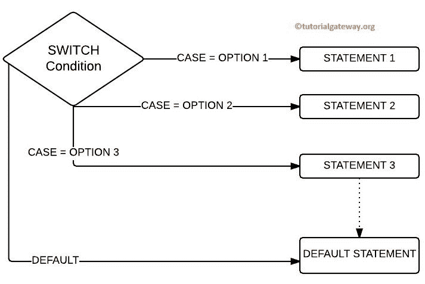
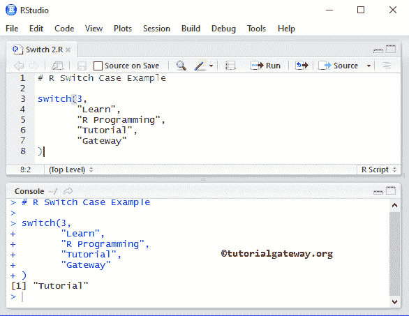
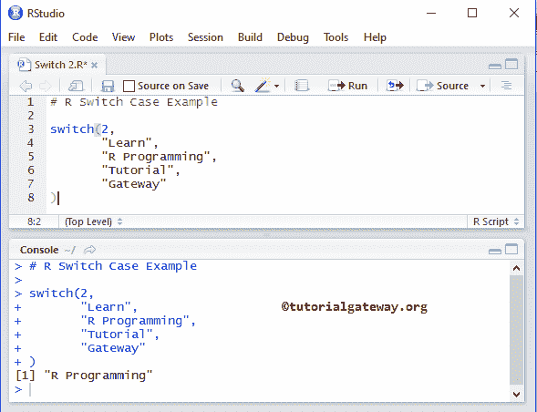
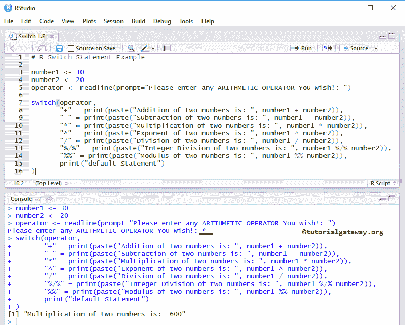
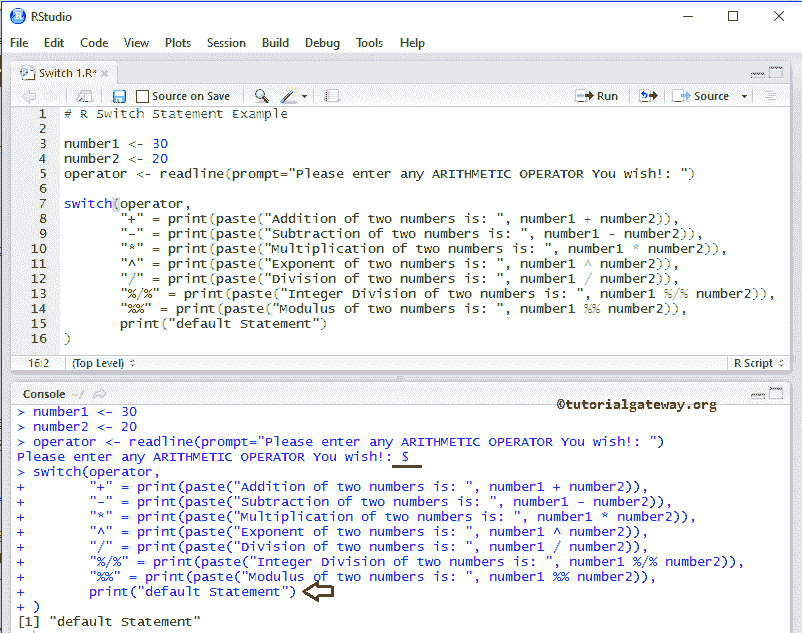

# r 开关语句

> 原文：<https://www.tutorialgateway.org/r-switch-statement/>

If Else 语句允许我们在 TRUE 或 FALSE 之间进行选择，当有两个以上的选项时，我们使用嵌套的 If Else 语句。比如说，如果我们有 12 个选择呢？，如果我们在这种情况下使用 Nested If Else，编程逻辑将很难理解。在 R 编程中，Switch 语句和 Else if 可以有效地处理这类问题。

R 编程中开关盒的工作功能几乎与 If 语句相同。如前所述，R 中的 Switch 语句可能有 n 个选项。因此，开关情况将表达式值与在位置中指定的值进行比较。如果表达式值和大小写值都匹配，那么出现在该位置的代码将被执行。为了更好地理解，让我们看看 R 开关的语法。

## 开关语法

R 编程语言中开关的基本语法是

```
switch (Expression, "Option 1", "Option 2", "Option 3", ....., "Option N")
```

r 中 Switch 语句有点复杂的语法方法是:

```
switch (Expression,
        "Option 1" = Execute when the expression result match Option 1,
        "Option 2" = Execute when the expression result match Option 2,
        "Option 3" = When the expression result match Option 3, Execute these,
        ....
        ....
        "Option N" = When the expression result match Option N, Execute these lines,
        Default Statements
)
```

*   表达式值应该是整数或字符(我们也可以将表达式写成 n/2，但结果应该是整数或可转换的整数)。
*   R Switch 语句允许我们添加一个默认语句。如果表达式值或索引位置与任何情况都不匹配，则将执行默认语句。
*   如果有多个匹配项，将返回第一个匹配语句。

我们已经在之前的 [R 编程](https://www.tutorialgateway.org/r-programming/)文章中讨论了[否则的话](https://www.tutorialgateway.org/r-else-if-statement/)。因此，让我们在这里探索 R 开关语句。建议大家参考 [If Else](https://www.tutorialgateway.org/r-if-else-statement/) 、[嵌套 If Else](https://www.tutorialgateway.org/nested-if-else-in-r/) 、 [If 从句](https://www.tutorialgateway.org/r-if-statement/)的文章。

## 右侧开关箱流程图

下面的截图会给大家展示这个切换案例



背后的流程图

*   如果案例=选项 1，则执行 STATEMENT1。
*   如果案例=选项 2，则执行 STATEMENT2。
*   案例=选项 3，执行 STATEMENT3。
*   如果选项 1、选项 2 和选项 3 失败，则执行 DEFAULT 语句。

## Switch 语句示例

这个程序用 R 编程语言向你展示了开关盒的基本功能。

```
# R Switch Case Example

switch(3, 
       "Learn",
       "R Programming",
       "Tutorial",
       "Gateway"
)
```



让我们改变数值，看看



## 右开关案例示例

该程序允许用户输入任意[算术运算符](https://www.tutorialgateway.org/r-arithmetic-operators/ "ARITHMETIC OPERATORS IN C")，使用 R 编程语言中的 Switch 语句执行算术运算。

```
# R Switch Statement Example

number1 <- 30
number2 <- 20
operator <- readline(prompt="Please enter any ARITHMETIC OPERATOR You wish!: ")

switch(operator,
       "+" = print(paste("Addition of two numbers is: ", number1 + number2)),
       "-" = print(paste("Subtraction of two numbers is: ", number1 - number2)),
       "*" = print(paste("Multiplication of two numbers is: ", number1 * number2)),
       "^" = print(paste("Exponent of two numbers is: ", number1 ^ number2)),
       "/" = print(paste("Division of two numbers is: ", number1 / number2)),
       "%/%" = print(paste("Integer Division of two numbers is: ", number1 %/% number2)),
       "%%" = print(paste("Division of two numbers is: ", number1 %% number2))
)
```

输出 1:让我们输入*运算符并查看



输出 2:让我们输入错误的运算符$来检查默认值



首先，我们声明了两个变量 number1 和 number2，并分配了一些随机值:30 和 20

```
number1 <- 30
number2 <- 20
```

以下语句将允许用户输入单个字符(它应该是任何算术运算符)。我们将用户输入的字符分配给一个名为运算符的变量。

```
operator <- readline(prompt="Please enter any ARITHMETIC OPERATOR You wish!: ")
```

接下来，我们将使用带有运算符的 R Switch 语句作为选项。如果用户输入+作为操作符，则打印以下代码。

```
print(paste("Addition of two numbers is: ", number1 + number2))
```

如果用户输入–作为操作员，则打印以下行。

```
print(paste("Subtraction of two numbers is: ", number1 - number2))
```

当用户以操作员身份输入*时，将打印以下消息。

```
print(paste("Multiplication of two numbers is: ", number1 * number2)
```

如果用户输入的运算符(字符)不在上述任何一项中，则可以指定一些默认语句，如:

```
switch(operator,
 "+" = print(paste("Addition of two numbers is: ", number1 + number2)),
 "-" = print(paste("Subtraction of two numbers is: ", number1 - number2)),
 "*" = print(paste("Multiplication of two numbers is: ", number1 * number2)),
 "^" = print(paste("Exponent of two numbers is: ", number1 ^ number2)),
 "/" = print(paste("Division of two numbers is: ", number1 / number2)),
 "%/%" = print(paste("Integer Division of two numbers is: ", number1 %/% number2)),
 "%%" = print(paste("Division of two numbers is: ", number1 %% number2)),
 print("default") # Default Statement
)
```