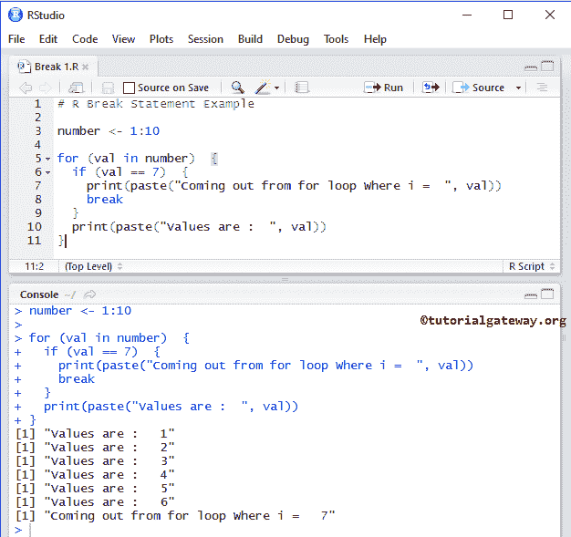
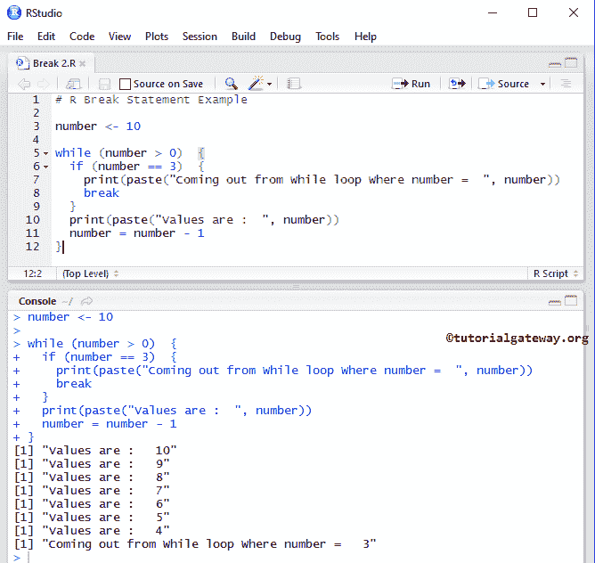

# 休息声明

> 原文：<https://www.tutorialgateway.org/r-break-statement/>

R 程序设计中的中断和下一步是用来改变程序流程的两个基本语句。在 R 编程中，循环用于执行特定的代码块 N 次，直到测试表达式为假。在某些情况下，我们必须终止循环而不执行所有的行。在这些情况下，我们可以使用这个 R Break 和 Next 语句。

## 休息声明

R Break 语句对于退出任何循环(如 For、While 和 Repeat)都非常有用。在执行这些代码时，如果 R 在其中找到 break 语句，它将停止执行代码并立即退出循环。

例如，我们在循环内部有 15 条语句，当某个条件为 True 时，我们希望退出循环；否则，它必须执行所有这些命令。在这种情况下，我们可以使用 If 条件来检查表达式，并将 Break 语句放在 If 块中。如果条件为真，那么它将执行 break 语句，break 将从循环中完全退出控制器。否则，它将执行所有这些命令。

## 中断语句语法

R 编程语言中 Break 语句的语法是

```
break
```

在本文中，我们将分享两个示例来显示 [While](https://www.tutorialgateway.org/while-loop-in-r/) 和的[中 Break 语句的工作功能。请参考](https://www.tutorialgateway.org/r-for-loop/) [R 重复](https://www.tutorialgateway.org/r-repeat/)文章了解 [R 编程](https://www.tutorialgateway.org/r-programming/)重复循环示例

## 循环中断语句

在这个 R 程序中，我们使用 for 循环中的 break 语句退出迭代。

```
# R Break Statement Example

number <- 1:10

for (val in number)  {
  if (val == 7)  {
    print(paste("Coming out from for loop Where i =  ", val))
    break
  }
  print(paste("Values are :  ", val))
}
```



在 For 循环中，我们放置 [If 语句](https://www.tutorialgateway.org/r-if-statement/)来测试 I 是否等于 7。

*   如果表达式为假，那么它将跳过 Break 并输出该数字(在我们的例子中是 1、2、3、4、5、6)。
*   如果表达式为真，则执行中断，迭代将在该数字处停止，而不打印行:打印(粘贴(“值为:“，val”)。

## R While 循环中断语句

在这个程序中，我们使用 While 循环中的 R break 语句退出迭代。

```
# R Break Statement Example

number <- 10

while (number > 0)  {
  if (number == 3)  {
    print(paste("Coming out from While loop Where number =  ", number))
    break
  }
  print(paste("Values are :  ", number))
  number = number - 1
}
```



首先，我们在代码的开头将数字的值初始化为 10。在 While 循环中，我们检查数字是否大于 0。

```
while (number > 0)  {
```

在 While 循环中，我们放置 [If 语句](https://www.tutorialgateway.org/r-if-statement/)来测试 I 是否等于 3。

*   如果条件为假，那么它将跳过并打印该数字作为输出(在我们的例子中是 10、9、8、7、6、5、4)。
*   如果该条件为真，则执行 R Break 语句，迭代将在该数字处停止，而不打印(粘贴)(“值为:“，数字”)。