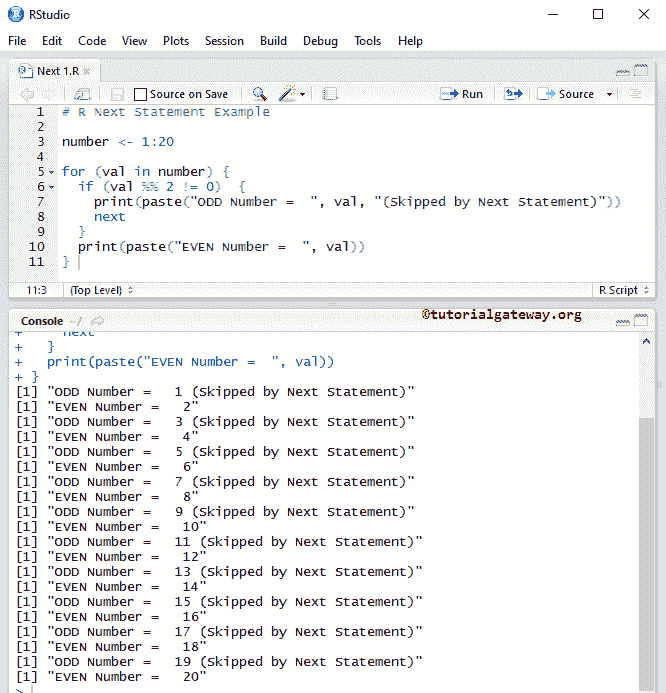
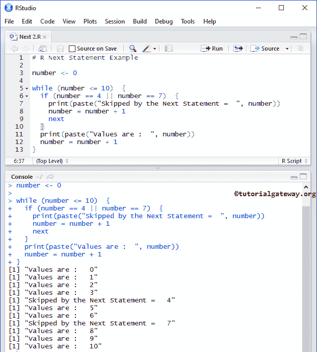

# R `next`语句

> 原文：<https://www.tutorialgateway.org/r-next-statement/>

R `next`语句是控制 R 循环流的最有用的语句之一。我们通常在 `for`循环和 `while`循环中使用这个 R `next`语句。在执行这些循环时，如果编译器在其中找到 R `next`语句，它将停止当前循环迭代，并从头开始新的迭代。

例如，如果循环中有 10 条语句，当某个条件为真时，我们希望跳过执行后 5 行(statement6 — statement10)。否则，它必须执行循环中的所有 10 条语句。在这种情况下，我们将 If 条件与某个条件放在一起，并在该条件中放置 R `next`语句。如果条件为真，它将停止执行语句 6 至 10。否则，它将执行语句 1 到 10。

## 下一条语句语法

R 语言中 `next`语句的语法是

```
Next
```

在本文中，我们想分享两个例子来展示 `while`循环和 `for`循环中 R `next`语句的工作功能。

## `for`循环中的下一条语句

在这个程序中，我们通过例子展示了如何在 `for`循环中使用 R `next`语句。该程序将显示给定范围内的偶数和奇数。

```
# R Next Statement Example

number <- 1:20

for (val in number) {
  if (val %% 2 != 0)  {
    print(paste("ODD Number =  ", val, "(Skipped by Next Statement)"))
    next
  }
  print(paste("EVEN Number =  ", val))
}
```



在 `for`循环中，我们放置了 [`if`语句](https://www.tutorialgateway.org/r-if-statement/)来测试(val %% 2！= 0).

*   如果该表达式结果为真，则执行 `next`语句。迭代将在该数字处停止，而不打印另一个数字:print(paste)(“偶数=”，val))。
*   如果表达式结果为假，则它将跳过 [R 语言](https://www.tutorialgateway.org/r-programming/) `next`语句，并将该数字打印为输出(在我们的情况下为偶数)。

## R `while`循环示例中的下一条语句

在这个程序中，我们通过例子展示了如何在 [`while`循环](https://www.tutorialgateway.org/while-loop-in-r/)中使用 R `next`语句。该程序允许用户输入任何整数值。然后它将显示从 0 到给定数字的所有值，除了 4 和 7。

```
# R Next Statement Example

number <- 0

while (number <= 10)  {
  if (number == 4 || number == 7)  {
    print(paste("Skipped by the Next Statement =  ", number))
    number = number + 1
    next
  }
  print(paste("Values are :  ", number))
  number = number + 1
}
```



在 `while`循环中，我们放置 [`if`语句](https://www.tutorialgateway.org/r-if-statement/)来测试 I 是等于 4 还是 7。

*   如果该条件为真，则执行 R `next`语句，迭代将在该数字处停止，而不打印另一个数字:print(粘贴)(“值为:“，数字”)。为了更好地理解，我们在 If 条件中放置了 print(粘贴)(“被`next`语句跳过=”，数字))。因此，每当迭代中断时，这个值就会从这个语句中打印出来。
*   如果条件为假，则它将跳过下一条语句，并将该数字作为输出输出(在我们的例子中，是 0，1，2，3，5，6，8，9，10)。