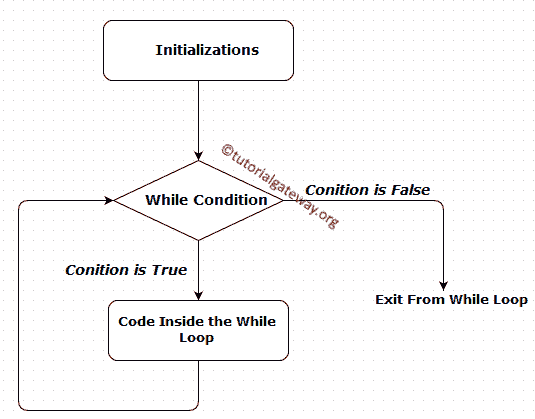
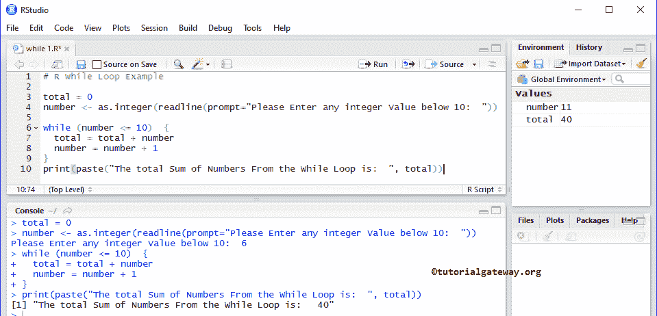
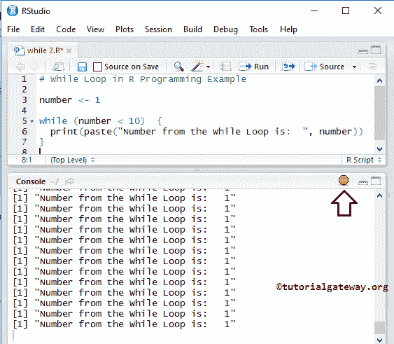
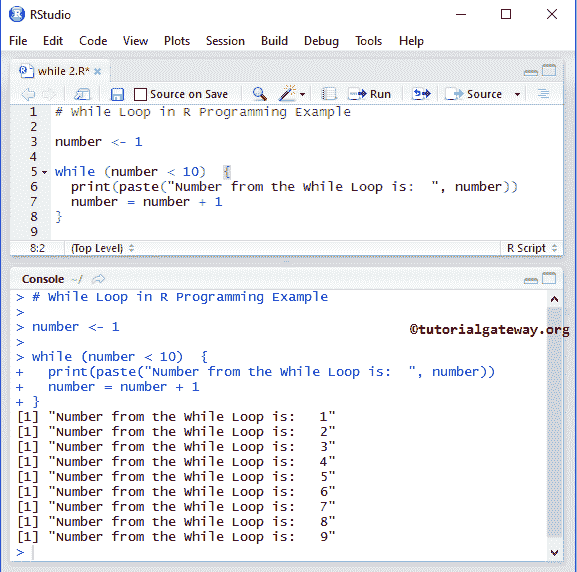

# 当在 R 中循环时

> 原文：<https://www.tutorialgateway.org/while-loop-in-r/>

R 编程中的 While 循环用于将一个语句块重复给定的次数，直到指定的表达式为 False。R 中的 While 循环以表达式开始，如果表达式为 True，那么将执行 while 循环中的语句。如果指定的表达式为 false，则至少不会执行一次。这意味着，R while 循环可以执行零次或更多次，while 循环的语法是:

## 当循环语法

R 编程语言中 While 循环的语法是

```
While ( Expression )  {
    statement 1
    statement 2
    ………….
    statement N;
    # Increment or Decrements the Values
}
#This statement is from Outside the While Loop
```

首先，它将检查 While 循环中的表达式。如果表达式结果为真，则将执行 while 循环块下的语句或语句组。如果表达式返回为 False，那么它将退出循环，并在 while 循环之外执行其他语句。

## R 中一个 While 循环的流程图

下图将向您展示 R While Loop



背后的流程图

而 r 中的循环将在开始时检查衰退。

1.  如果 While 中的表达式为真，则它执行循环中的语句。
2.  接下来，我们必须增加或减少 R while 循环中的值。
3.  值增加后，它将再次检查表达式。只要条件为真，while 循环中的语句就会执行。
4.  如果条件为假，则它将退出“当”循环。

为了更好地理解，让我们看看 R 编程中 While 循环的例子。

## R 编程示例中的 While 循环

这个程序在 r 中循环一段时间，允许用户输入一个整数值。使用这个值，它会将这些值加到 10。

```
# R While Loop Example

total = 0
number <- as.integer(readline(prompt="Please Enter any integer Value below 10:  "))

while (number <= 10)  {
  total = total + number
  number = number + 1
}

print(paste("The total Sum of Numbers From the While Loop is:  ", total))
```

输出:对于这个 [R 编程](https://www.tutorialgateway.org/r-programming/)的例子，我们要输入数字= 6。意思是，总计= 6 + 7 + 8 + 9 + 10 = 40



在这个 r while 循环的以下语句中，首先，我们声明了总变量，并将其赋值为零。接下来，它将要求用户输入任何低于 10 的整数值，我们将用户输入的值分配给一个数字变量。

```
total = 0
number <- as.integer(readline(prompt="Please Enter any integer Value below 10:  "))
```

下一行，我们使用了 While 循环，While 循环中的表达式将确保给定的数字小于或等于 10。

```
while (number <= 10)  {
  total = total + number
  number = number + 1
}
```

在 R 示例的 while 循环中，用户输入了值:number= 6，我们初始化了 total = 0。

第一次迭代

total = total+number
total = 0+6 = =>6

接下来，数字将增加 1(数字=数字+ 1)。请参考 [R 算术运算符](https://www.tutorialgateway.org/r-arithmetic-operators/)一文了解这个+符号。

第二次迭代

在 r while 循环的第一次迭代中，数字和总数的值都改变为数字= 7 和总数= 6

总计= 6 + 7 ==> 13

接下来，数字将增加 1。

第三次迭代

在第二次迭代中，数字和总数的值都被更改为数字= 8 和总数= 13

总计= 13 + 8 ==> 21

接下来，数字增加 1。

第四次迭代

在第三次迭代中，数值= 9，总数= 21

总计= 21 + 9 ==> 30

接下来，数字增加 1

第五次迭代

在第四次迭代中，数值= 10，总数= 30

总计= 30 + 10 ==> 40

接下来，数字增加 1

这里 Number= 11，所以 while 循环中存在的条件(number <= 10)将失败

最后一个打印语句将打印给定输出中的数字总和。

```
print(paste("The total Sum of Numbers From the While Loop is:  ", total))
```

## R 程序设计中的无限边循环

如果您忘记增加或减少 while 循环中的值，那么 while 循环将执行无限次(也称为无限 while 循环)。

```
# Infinite While Loop in R Programming Example

number <- 1

while (number < 10)  {
  print(paste("Number from the While Loop is:  ", number))
}
```



这里，在这个 R while 循环的例子中，数字总是 1，并且数字总是小于 10。所以，虽然循环执行无限次。现在，让我们在 while 循环中为上面的例子添加+运算符(number= number + 1)。

```
# Infinite While Loop in R Programming Example

number <- 1

while (number < 10)  {
  print(paste("Number from the While Loop is:  ", number))
  number = number + 1
}
```

现在，当它达到 10 时，条件(数字< 10) will fail. Let us see the output of the example

