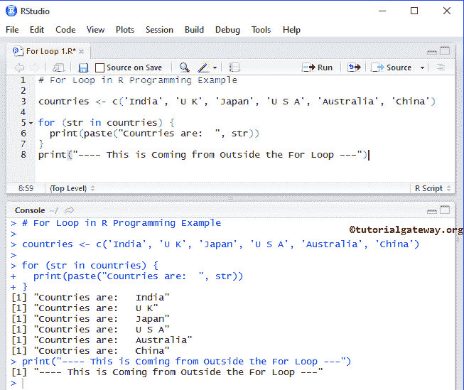

# 用于循环

> 原文：<https://www.tutorialgateway.org/r-for-loop/>

循环用于重复一个语句块，直到向量中没有任何项。它是任何编程语言中最常用的循环之一。让我们看看 R 中 For 循环的语法:

R 编程语言中 For 循环的基本语法是

```
for(val in vector)  {
     Statement 1
     Statement 2
     ………
     Statement N
}
```

如果你观察上面 R 中 for 循环的语法，Vector 可以是字符串或整数，或者任何你想迭代的东西。

*   它以对象开始，意味着它将迭代向量，然后将第一项赋值。例如，值是 A: E 的意思是，它会将 A 赋给 val。
*   接下来，它将执行 R For 循环中的语句。
*   完成语句后，它将转到向量并将下一个值赋给 val。
*   该过程将重复进行，直到没有项目。

## 循环流程图

下面的截图将向您展示 R 编程中 For 循环背后的流程图。


R 中 for 循环的执行过程是:

1.  初始化:我们在这里初始化变量。例 x =1。
2.  序列/向量中的项目:它将检查项目，如果序列中有项目(真)，那么它将在 r 中的 for 循环内执行语句。如果序列中没有项目(假)，那么它将从该块退出。
3.  在完成每次迭代后，它将遍历下一个项目到给定的次数。
4.  它将再次检查矢量中的新项目。只要项目可用，其中的语句就会被执行。

## 循环示例

在这个例子中，我们将解释如何使用这个循环从向量中提取单个项目或数据。

在这个 [R 编程](https://www.tutorialgateway.org/r-programming/)的例子中，首先，我们声明了国家并分配了以下值。

在这里，我们使用 R for 循环来遍历国家向量，并显示其中存在的每个单独的项目。

在下一行中，我们在它之外使用了一个 print 语句。该语句将在编译器退出时执行。

```
countries <- c('India', 'U K', 'Japan', 'U S A', 'Australia', 'China')

for (str in countries) {
  print(paste("Countries are:  ", str))
}
print("----This is Coming from Outside the For Loop---")
```



从上面的截图中，您可以观察到我们在 R 示例代码的第二个 for 循环中使用了国家列表。

```
countries <- c('India', 'U K', 'Japan', 'U S A', 'Australia', 'China')
```

第一次迭代

*   第一次迭代，国家=印度。
*   这意味着向量中有一些项，所以它将在循环内部执行 print 语句。

第二次迭代

*   在循环的第二次迭代中，国家=英国。
*   这意味着向量中有一些项目，所以它将在其中执行打印。

第三次迭代

*   国家= '日本'。
*   这意味着其中有一些项，所以它执行语句。

第四次迭代

*   国家=美国。
*   这意味着向量中有一些项，所以它执行 print 语句。

第五次迭代

*   国家= '澳大利亚'，条件测试。
*   意思是里面有一些项目，所以执行 print 语句。

第六次迭代

*   国家= '中国'。
*   这意味着向量中有一些项，所以它会编译其中的 print 语句。

第七次迭代，向量中没有要分配给国家变量的项目。所以，它会退出。

### 例 2

在 R 示例中的 for 循环中，我们将解释它在整数向量上的工作功能。

```
numbers <- c(1:10)

for (num in numbers) {
  print(9 * num)
}
print("---- This is Coming from Outside the For Loop ---")
```

