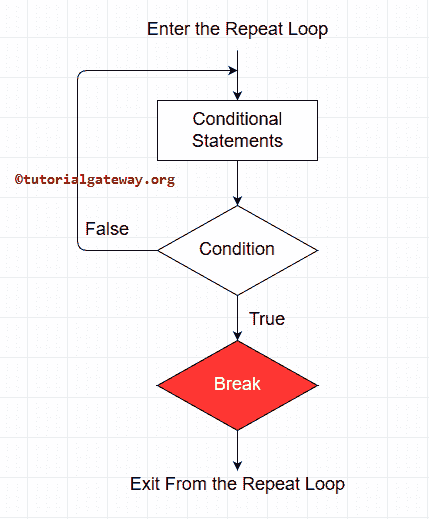
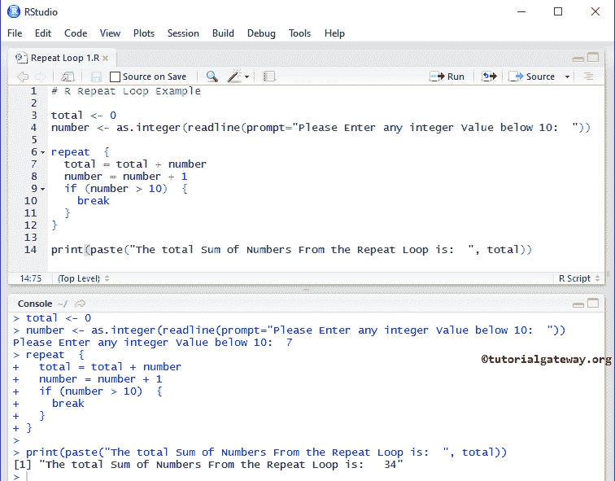
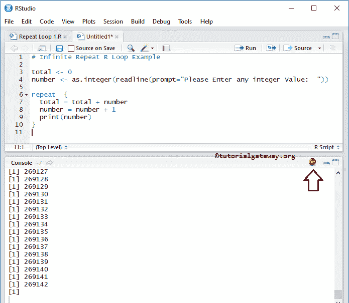
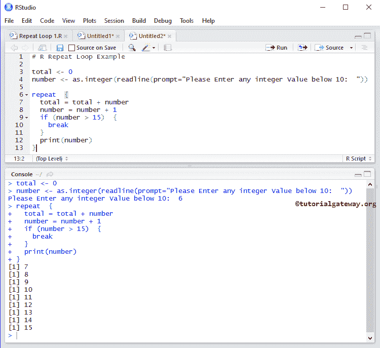

# 重复

> 原文：<https://www.tutorialgateway.org/r-repeat/>

R repeat 多次执行代码块中的语句。R 编程中的重复循环不提供任何检查条件，所以我们必须给出从重复循环退出的条件。在本文中，我们将通过示例向您展示如何在 R 编程中使用 repeat。在我们进入这个案例之前，让我们看看 R repeat 的语法。

## 重复循环语法

R 编程语言中重复的语法是

```
repeat  {
    statement 1
    statement 2
    ………….
    statement N
    # Please provide Condition to exit or use Break Statement
}
#This statement is from Outside the Repeat Loop
```

首先，它将执行循环中的语句，如果有任何循环中断语句，它将退出循环。

## 重复流程图

下图将为您展示



R 重复后面的流程图

重复流程图顺序为:

1.  首先，我们初始化变量。接下来，它将进入重复循环。
2.  它将在循环中执行这组语句。
3.  接下来，我们必须使用循环中的任何表达式来退出。
4.  现在它会检查情况。如果条件为真，则执行中断语句退出循环。
5.  如果条件为假，则再次执行重复循环中的语句。

## 重复循环示例

这个程序帮助我们理解 R 程序设计中的重复。它允许用户输入一个小于 10 的整数值。使用这个值，它会将这些值加到 10。

```
# R repeat Loop Example

total <- 0
number <- as.integer(readline(prompt="Please Enter any integer Value below 10:  "))

repeat  {
  total = total + number
  number = number + 1
  if (number > 10)  {
    break
  }
}

print(paste("The total Sum of Numbers From the Repeat Loop is:  ", total))
```

在这个 [R 编程](https://www.tutorialgateway.org/r-programming/)的例子中，我们要输入 number = 7。意思是总计= 7 + 8 + 9 + 10 = 34



在下面的语句中，首先，我们声明了总变量并将其赋值为零。接下来，它将要求用户输入任何低于 10 的整数值，我们将用户输入的值分配给一个数字变量。

```
total <- 0
number <- as.integer(readline(prompt="Please Enter any integer Value below 10:  "))
```

下一行，我们使用了 [While 循环](https://www.tutorialgateway.org/while-loop-in-r/)，While 循环里面的表达式会保证给定的数字小于等于 10。

```
repeat  {
  total = total + number
  number = number + 1
}
```

在这个重复的例子中，用户输入的值:数字= 7，我们初始化总数= 0

第一次迭代

*   总计=总计+数字
*   总计= 0 + 7 ==> 7

接下来，数字将增加 1(数字=数字+ 1)。请参考 [R 算术运算符](https://www.tutorialgateway.org/r-arithmetic-operators/)一文了解这个+符号。

第二次迭代

在第一次迭代中，数字和总数的值都变成了数字= 8 和总数= 7

*   总计=总计+数字
*   总计= 7 + 8 ==> 15

接下来，数字增加 1。

重复第三次迭代

在第二次迭代中，数字和总数的值都变成了数字= 9 和总数= 15

*   总计=总计+数字
*   总计= 15 + 9 ==> 24

接下来，数字=数字+ 1

第四次迭代

在第三次迭代中，数字和总数的值都变成了数字= 10 和总数= 24

*   总计=总计+数字
*   总计= 24 + 10 ==> 34

接下来，数字=数字+ 1

这里，数字= 11，如果陈述(数字> 10)为真，则[内的条件为真。因此，](https://www.tutorialgateway.org/r-if-statement/) [Break 语句](https://www.tutorialgateway.org/r-break-statement/)被执行，它将退出循环

```
 if (number> 10)  {
    break
  }
```

最后一个打印语句打印给定数字中的数字总和作为输出。

```
print(paste("The total Sum of Numbers From the While Loop is:  ", total))
```

## R 程序设计中的无限重复

如果您忘记使用条件或中断语句来终止 R Repeat 循环，那么循环内的语句将执行无限次(也称为无限循环)。

```
# Infinite Repeat R Loop Example

total <- 0
number <- as.integer(readline(prompt="Please Enter any integer Value:  "))

repeat  {
  total = total + number
  number = number + 1
  print(number)
}

```



在这个 R repeat 示例中，没有要检查的条件，也没有要中断循环的 break 语句，因此 repeat 循环将无限次地继续执行这些语句。现在，让我们在 If 语句中添加 Break 语句。

```
total <- 0
number <- as.integer(readline(prompt="Please Enter any integer Value below 10:  "))

repeat  {
  total = total + number
  number = number + 1
  if (number > 15)  {
    break
  }
  print(number)
}
```

现在，当它达到 15 时，条件就会失效。让我们看看输出

