# 向量

> 原文：<https://www.tutorialgateway.org/r-vector/>

向量是 R 程序设计中最基本的数据结构。R Vector 可以保存类似类型元素的集合(类型可以是整数、双精度、char、Boolean 等。)如果在单个 R 向量中键入不同的数据类型，那么所有元素都将转换为单个类型。在本文中，我们展示了如何创建一个向量，如何访问和操作元素。接下来，对 r 中的向量执行算术运算

## 在 R 中创建向量

在 R 编程中，每个变量都将在内部转换为 Vector。在这个例子中，我们将在单个元素的 R 中创建一个向量。最基本的创造方式是。

```
# with 1 integer Element
print(10L)

# with 1 String element
print("Hello")
```

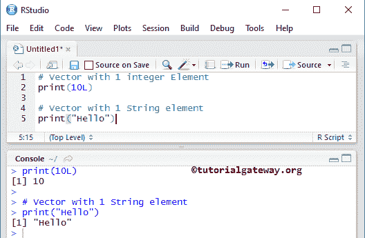

### 使用范围创建向量

在 R 编程中，有一个特殊的运算符叫做 Range 或冒号，这将有助于创建一个向量。例如，i

```
# with Range
i <- 1:10
print(i)

# with Decimal Range
j <- 1.5:5.5
print(j)

# with Decimal Range
k <- 1.5:5.5
print(k)

# with Decimal Range
n <- -10:-20
print(n)

# Letter with Range
l <- LETTERS[1:6]
print(l)
```

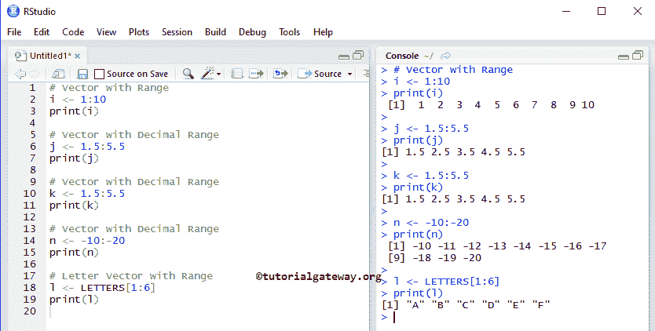

### 使用序列运算符创建向量

这里，我们在 R 编程中使用序列运算符或简单的序列运算符创建一个向量。序列运算符将按顺序返回值。

```
# with Sequence
a <- seq(from = 1, to = 10, by = 1) 
print(a)

# Here, from =, to =, by = values are option so you can remove them too
b <- seq(11, to = 15, by = 1) # Removing from
print(b)

c <- seq(15, 25, by = 3) # Removing both from, to
print(c)

d <- seq(2, 20, 2) # removing from, to, and by
print(d)
```

它将在 R 中创建一个向量，从索引位置 1 的值 1 开始，到索引位置 10 的值 10 结束，方法是将该值增加 1。意思是 1，2，3，4，5，6，7，8，9，10

```
a <- seq(from = 1, to = 10, by = 1)
```

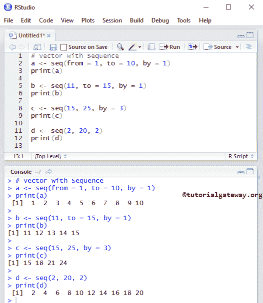

### 使用连接 c 创建向量 R

这个例子用 c 语言创建了一个 R 向量，或者我们称之为连接。这是最流行的 [R 编程](https://www.tutorialgateway.org/r-programming/)方法，通常我们更喜欢这种方式。

```
# with Concatenation

# Numeric 
a <- c(1, 2, 3, 4) 
print(a)

# Character 
b <- c("India", "China", "Japan", "Russia", "Sri Lanka") 
print(b)

#Boolean 
d <- c(TRUE, FALSE, FALSE, TRUE, TRUE) 
print(d)

# Mixed and its Type will be Character
e <- c("India", 2, "China", 1, TRUE) 
print(e)
typeof(e) # this will return the Data type of e

# Placing or Nesting One inside the another
f <- c("UK", "USA", TRUE, FALSE, b) # b is another one
print(f)
```

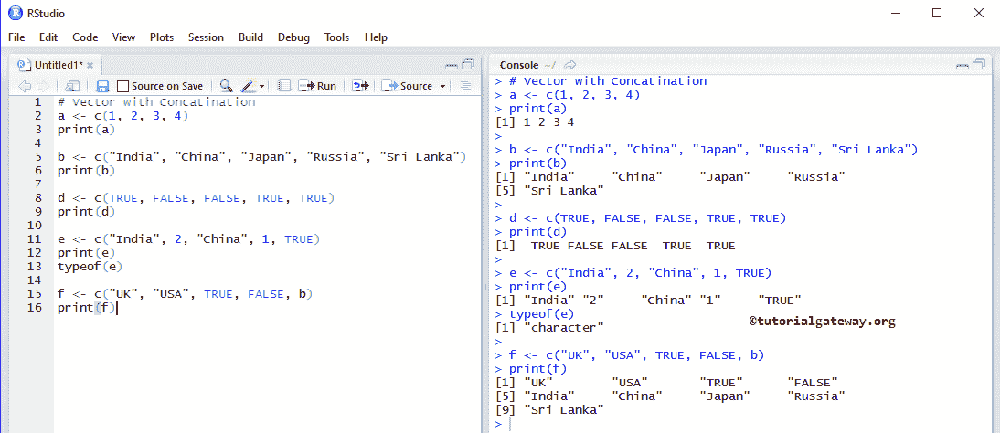

## 访问向量元素

在 R 编程中，我们可以使用索引位置来访问向量中的元素。使用这个索引值，我们可以访问或修改/改变每个单独的元素。索引值从 1 开始，到 n 结束，其中 n 是长度。

例如，如果我们声明一个存储 10 个元素的向量，那么索引从 1 开始，到 10 结束。要访问或更改第 1 个<sup>值，请使用矢量名称[1]，要更改或访问第 10 个<sup>值，请使用矢量名称[10]。</sup></sup>

```
# Elements Accessing
a <-  c("India", "China", "Japan", "UK", "USA", "Russia", "Sri Lanka") 
print(a)

print(a[1])
print(a[3])

print(a[1:3])
print(a[4:6])
```

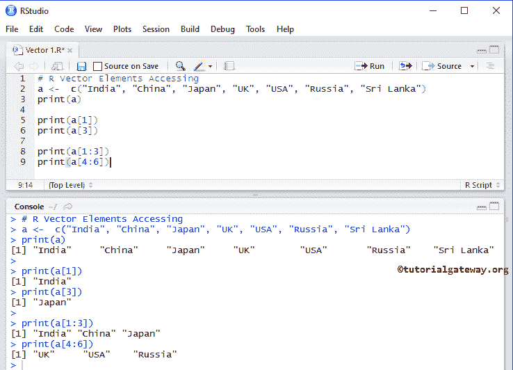

首先，我们声明了一个名为 a 的向量，并分配了以下值

```
a <-  c("India", "China", "Japan", "UK", "USA", "Russia", "Sri Lanka")
```

这里，[1]表示第一位置的元素(即印度)，[3]表示第三位置的元素(即日本)。

```
print(a[1])
print(a[3])
```

在下一行中，我们使用了特殊的运算符 Range(或冒号)。它打印从 1 到 3(即 1、2、3)的元素

```
print(a[1:3])
```

### 使用矢量访问

这个例子使用另一个向量来访问元素

在第六行打印(a[b])中，我们使用这些数字作为索引位置来访问元素。意思是，打印索引位置 2、4 和 6 的元素。

```
# Elements Accessing
a <-  c("India", "China", "Japan", "UK", "USA", "Russia", "Sri Lanka") 
print(a)

b <- c(2, 4, 6)
print(a[b])

print(a[c(5, 7)])

print(a[c(7, 4, 1)])
```

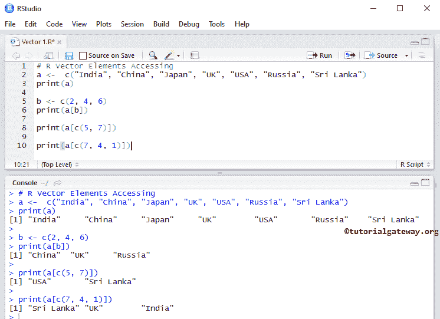

### 在 R 向量中使用负值

使用负值和布尔值访问元素。在 R 向量中，负索引位置用于省略这些值。

```
# Elements Accessing
a <-  c("India", "China", "Japan", "UK", "USA", "Russia", "Sri Lanka") 
print(a)

b <- c(-3, -7)
print(a[b])

print(a[c(-4, -6, -7)])

print(a[c(TRUE, FALSE, TRUE, TRUE, FALSE, TRUE, FALSE)])
```

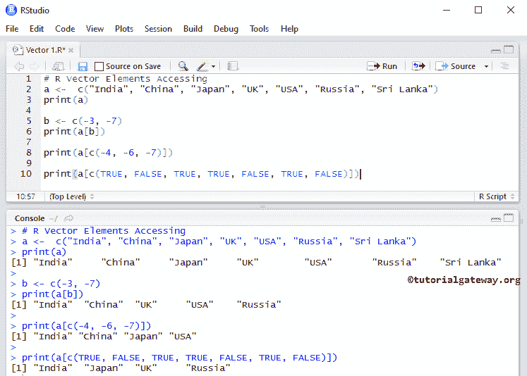

首先，我们声明负数-3 和-7 的 b。

```
b <- c(-3, -7)
```

在下一行中，我们使用这些数字作为索引位置来访问元素。这意味着，打印除索引位置 3 和 7 的值之外的元素。

```
print(a[b])
```

在下一行中，我们声明了一个布尔值。我们使用这些布尔值作为索引位置来访问元素。这里，真表示打印值，假表示不打印。这意味着在位置 1，3，4，6 打印元素。

```
print(a[c(TRUE, FALSE, TRUE, TRUE, FALSE, TRUE, FALSE)])
```

### 使用字符向量作为索引

在这个例子中，我们展示了如何使用字符索引值来访问向量元素。这里，我们用字母索引来声明 v，它可以帮助我们使用字母提取元素。

```
v <-  c("a" = 10, "b" = 20, "c" = 30, "d" = -15, "e" = 40) 
print(v)

print(v["a"])

print(v["d"])

print(v[c("a", "c")])
```

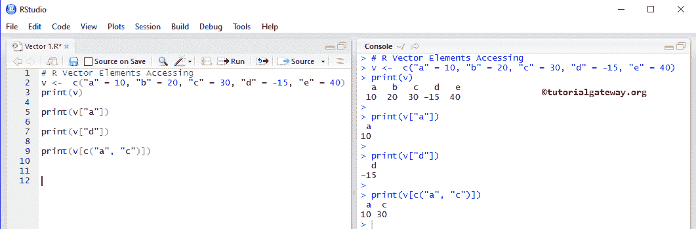

## 操纵向量元素

在 R 编程中，我们可以通过以下方式操作向量元素:

```
# Elements Manipulation
a <-  c(10, 20, 30, -15, 40, -25, 60, -5) 
print(a)

a[7] <- 77 
print(a)

a[a < 0] <- 99
print(a)

# Truncating the Elements
a <- a[1:5]
print(a)

# Deleting
a <- NULL
print(a)
```

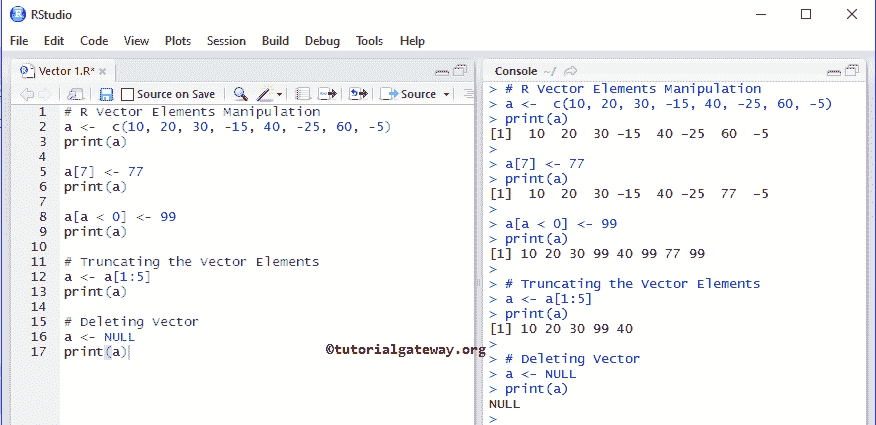

在 7 号位置分配 77 号。

```
a[7] <- 77
```

它将为所有值小于 0 的元素分配 99。这里< 0 将检查元素是否小于零，如果条件为真，则该元素将被 99 替换。

```
a[a < 0] <- 99
```

在向量切片中，第一个整数值是切片开始的索引位置，第二个整数值是切片结束的索引位置。

```
a <- a[1:5]
```

它完全消除了

```
a <- NULL
```

## 向量的重要功能

以下函数是 R 编程中向量支持的一些最有用的函数。

*   类型:返回数据类型。
*   排序(向量名称):以升序对项目进行排序。
*   长度(Vector_name):计算项目数。
*   head(Vector_name，limit):返回前六项(如果省略了限制)。如果您将限制指定为 4，则它会返回前 4 项。
*   tail(Vector_name，limit):它返回最后六项(如果省略了限制)。如果将限制指定为 2，则它会返回最后两项。

```
# Elements Accessing
a <-  c(10, 20, 30, -15, 40, -25, 60, -5) 
print(a)

# Some of the Important Functions
typeof(a)
length(a)

head(a)
head(a, 4)

tail(a)
tail(a, 3)

x <- sort(a)
print(x)
```

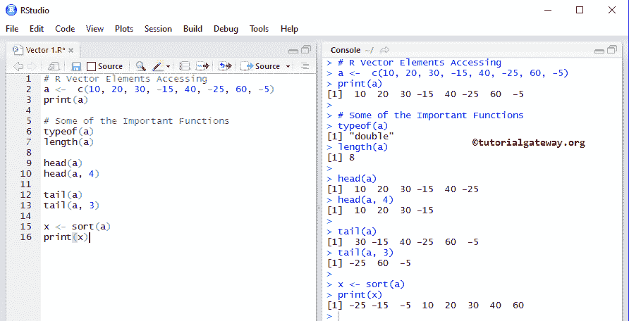

## 向量上的算术运算

使用[算术运算符](https://www.tutorialgateway.org/r-arithmetic-operators/)执行算术运算。

```
a <-  c(10, 20, 30, 40)
b <-  c(12, 26, 38, 44)

print(a + b)

print(b - a)

print(a * b)

print (2 * a)

d <- c(12, 44)
print(a + d)
```

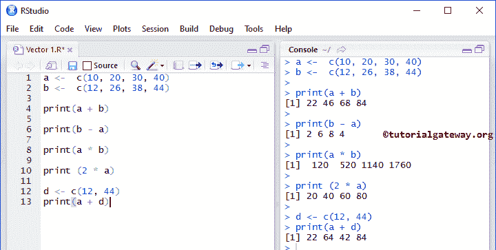

首先，我们声明了两个长度相同的数字 a 和 b

接下来，我们对这个 R 向量执行加法、减法和乘法。这里 a + b 表示(10 + 12，20 + 26，30 + 38，40 + 44) = (22，46，38，44)

```
print(a + b)
print(b - a)
print(a * b)
```

只要长度相同，以上的东西都可以。但是，如果长度不同，那么元素循环就会发生。它会移动，并将每个项目乘以 2，直到完成元素。

```
print (2 * a)
```

接下来，我们声明两个元素的 d 并执行加法。这里 a + d 的意思是(10 + 12，20 + 44，30 + 12，40 + 44)，因为我们在 d 中只有两个项目，所以这两个项目会重复。

```
d <- c(12, 44)
print(a + d)
```