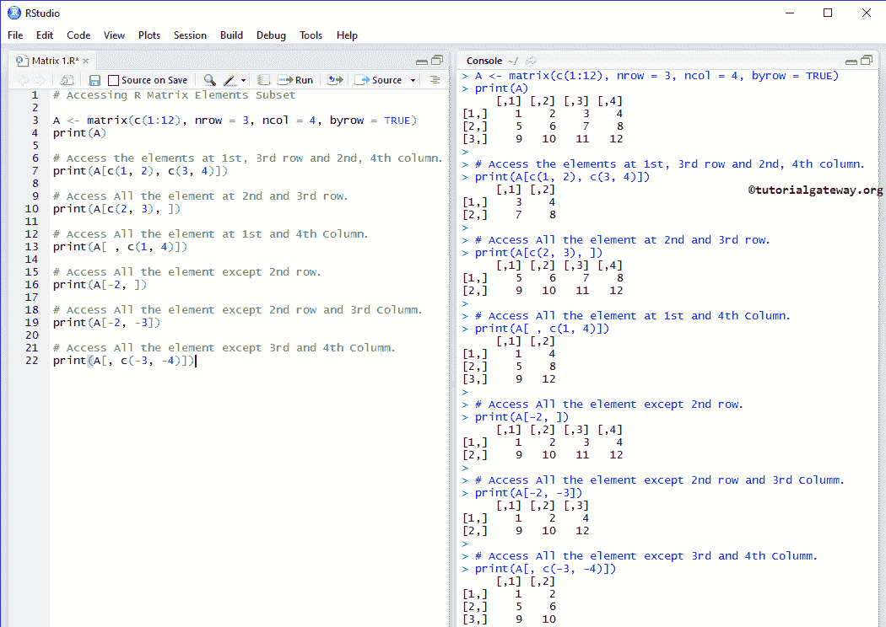

# r 矩阵

> 原文：<https://www.tutorialgateway.org/r-matrix/>

R 中的矩阵是最二维的数据结构。在 R Matrix 中，数据存储在行和列中，我们可以同时使用行索引和列索引来访问矩阵元素(就像 Excel 文件一样)。让我们看看如何创建矩阵，如何访问和操作矩阵元素。并举例对 R 矩阵进行算术运算

## 矩阵语法

R 编程中矩阵的语法是:

```
Matrix_Name <- matrix(data, nrow, ncol, byname, dimnames)
```

如果观察上面的语法，数据是一个向量

*   nrow:要创建的行数。例如，nrow = 3 将创建一个 3 行的矩阵
*   ncol:要创建的列数。例如，ncol = 2 将创建一个包含 2 列的矩阵
*   拜罗:默认情况下是假的。如果为真，则元素将按行排列
*   dimnames:用于将默认的行和列名称更改为更有意义的名称。

## 在 R 中创建矩阵

在这个例子中，我们将创建一个由 12 个元素组成的矩阵。在 R 编程中创建矩阵最传统的方法是。

```
A <- matrix(c(1:12), nrow = 3, ncol = 4)
print(A)

# Elements are arranged sequentially by column.
B <- matrix(c(1:12), nrow = 3, ncol = 4, byrow = FALSE)
print(B)

# Elements are arranged sequentially by row.
D <- matrix(c(1:12), nrow = 3, ncol = 4, byrow = TRUE)
print(D)
```


它创建了一个由排列成三行四列的 12 个元素组成的矩阵。

```
A <- matrix(c(1:12), nrow = 3, ncol = 4)
```

如您所见，元素是按列排列的。为了显示相同的内容，我们显式地指定了 byrow 参数

```
B <- matrix(c(1:12), nrow = 3, ncol = 4, byrow = FALSE)
```

让我们将 byrow 选项从 FALSE 更改为 TRUE，以逐行排列元素

```
D <- matrix(c(1:12), nrow = 3, ncol = 4, byrow = TRUE)
```

### R 中创建矩阵的简单方法

在 [R 编程](https://www.tutorialgateway.org/r-programming/)中并不总是要求指定 nrow 和 ncol。

```
# It will create a Matrix of 3 Rows and the remaining items will be arranged Accordingly
A <- matrix(c(1:12), nrow = 3)
print(A)

# It will create 4 Columns and the remaining (row) items will be arranged Accordingly
B <- matrix(c(1:12), ncol = 4)
print(B)

# It will create 3 rows and 4 Columns
D <- matrix(c(1:12), 3, 4)
print(D)

# It will create a 3 rows
E <- matrix(c(1:12), 3)
print(E)

# It will create 4 Rows. To create 4 Columns you have to specify ncol = 4 explicitly
G <- matrix(c(1:12), 4)
print(G)
```


### 使用 cbind 和 rbind 创建 R 矩阵

这个例子展示了在 R 编程中创建矩阵的另一种方法。cbind 用于按列绑定向量，rbind 用于按行绑定向量

```
A <- c(1, 2, 3) 
B <- c(20, 30, 40)

X <- cbind(A, B)
print(X)

Y <- rbind(A, B)
print(Y)
```


### 在 R 中定义矩阵的行名和列名

我们将替换行和列的默认名称，或者为 R 矩阵中的行和列定义新的名称。我们可以使用 dimnames 作为:x

```
A <- matrix(20:31, 3, 4, byrow = TRUE, dimnames = list(c("X", "Y", "Z"), c("A", "B", "C", "D")))
print(A)

# Defining names
row.names <- c("Row1", "Row2", "Row3")
column.names <-c("Col1", "Col2", "Col3", "Col4")

B <- matrix(c(1:12), nrow = 3, dimnames = list(row.names, column.names))
print(B)
```


### 带有回收元素的矩阵

以上所有具体示例都运行良好，因为我们在 row 和 columns 中指定了精确的元素，例如排列在 3 行 4 列中的 12 个元素。如果我们指定较少数量的元素会发生什么？。

```
A <- matrix(c(44: 46), nrow = 3, ncol = 3)
print(A)

B <- matrix(c(44: 46), nrow = 3, ncol = 3, byrow = TRUE)
print(B)
```


它创建了一个由排列成三行四列的 12 个项目组成的矩阵。这里将重复 44、45 和 46，直到它完成创建 3*4。

```
A <- matrix(c(44: 46), nrow = 3, ncol = 3)
```

这里，44、45 和 46 按列排列。为了改变回收方式，我们将 byrow 选项从 FALSE 改为 TRUE。这将按行排列元素。

```
B <- matrix(c(44: 46), nrow = 3, ncol = 3, byrow = TRUE)
```

### 矩阵在 R 中的重要作用

在 R 编程中，Class 函数将定义其类型，dim 函数将返回矩阵的维数。

```
# Data Type and Dimensions

A <- matrix(c(1:12), nrow = 3, ncol = 4, byrow = TRUE)
print(A)

class(A)

dim(A)
```


## 访问矩阵元素

在 R 编程中，我们可以使用索引位置来访问矩阵元素。使用这个索引值，我们可以改变每个元素。索引从 1 开始，到 n 结束，其中 n 是行或列的大小。

例如，我们声明一个 6 * 4，这意味着它将存储 6 个行元素和 4 个列元素。要访问或更改 1 <sup>st</sup> 值，请使用 Matrix.name[1，1]，要访问或更改 2 <sup>nd</sup> 行 3 <sup>rd</sup> 列值，请使用 Matrix.name[2，3]，要访问 6 <sup>th</sup> 行 4 <sup>th</sup> 列，请使用 Matrix.name[6，4]。

```
# Accessing Items

A <- matrix(c(1:12), nrow = 3, ncol = 4, byrow = TRUE)
print(A)

# Access the Items at 1st row and 2nd column.
print(A[1, 2])

# Access the items at 3rdrow and 4thcolumn.
print(A[3, 4])

# Access only the 2ndrow.
print(A[2,])

# Access only the 4th column.
print(A[, 4])

# Access All
print(A[ , ])
```


### 访问 R 中矩阵的子集

这里，我们展示了如何从中访问多个项目的子集。为此，我们使用 [R 向量](https://www.tutorialgateway.org/r-vector/)。

提示:负索引位置用于省略那些值

```
# Accessing Items Subset

A <- matrix(c(1:12), nrow = 3, ncol = 4, byrow = TRUE)
print(A)

# Access the Items at 1st, 3rd row and 2nd, 4th column.
print(A[c(1, 2), c(3, 4)])

# Access All the element at 2nd and 3rd row.
print(A[c(2, 3), ])

# Access All the element at 1st and 4th Column.
print(A[ , c(1, 4)])

# Access All the element except 2nd row.
print(A[-2, ])

# Access All the items except 2ndrow and 3rdColumn.
print(A[-2, -3])

# Access All the element except 3rd and 4th Column.
print(A[, c(-3, -4)])
```



### 用布尔向量访问矩阵元素

在这个例子中，我们声明了一个布尔向量。我们使用这些布尔值作为索引位置来访问矩阵 A 元素。这里，真表示对值的访问，假表示省略。

```
# Accessing Elements using Boolean Vector

A <- matrix(c(1:12), nrow = 3, ncol = 4, byrow = TRUE)
print(A)

# Access the elements at 1st, 3rd row and 2nd, 4th column.
print(A[c(TRUE, FALSE, TRUE), c(FALSE, TRUE, FALSE, TRUE)])

# Access All the element at 1ST AND 2nd row.
print(A[c(TRUE, TRUE, FALSE), ])

# Access All the element at 1st and 4th Column.
print(A[ , c(FALSE, TRUE)])

# Access the elements at 1st, 2nd row and 2nd, 4th column.
print(A[c(1, 2), c(FALSE, TRUE, FALSE, TRUE)])
```


### 使用字符索引访问 R 矩阵元素

它显示了如何使用字符向量索引值访问矩阵元素。在这里，我们分配了行名和列名，它们可以帮助我们使用行名作为索引值来提取项目。

```
# Accessing Elements using Char Index

# Defining Row names and Column names of Matrix in R
row.names <- c("Row1", "Row2", "Row3")
column.names <-c("Col1", "Col2", "Col3", "Col4")

B <- matrix(c(1:12), nrow = 3, dimnames = list(row.names, column.names))
print(B)

# Access the elements at 1st row and 3rd Column.
print(B["Row1", "Col3"])

# Access only the 2nd row.
print(B["Row2",])

# Access only the 4th column.
print(B[, "Col4"])

# Access the elements at 2nd row and 2, 3, 4th Column.
print(B["Row2", 2:4])

# Access the elements at 1st, 3rd row and 1, 2, 3rd Column.
print(B[c("Row1", "Row2"), 2:4])
```


## 修改 R 矩阵元素

在 R 编程中，我们可以使用索引位置来修改矩阵中的元素。例如，如果我们声明一个存储 12 个元素(3 行 4 列)的 3 * 4。要访问或更改 1 <sup>st</sup> 值，请使用 MatrixName[1，1]，要访问或更改 2 <sup>nd</sup> 行 3 <sup>rd</sup> 列值，请使用 MatrixName[2，3]。

```
# Modifying

A <- matrix(c(1:9), nrow = 3, ncol = 3)
print(A)

A[2, 2] <- 100
print(A)

A[A < 5] <- 222
print(A)
```


它将为第二行第二列的项目分配 100。

```
A[2, 2] <- 100
```

它为所有值小于 5 的元素分配 222。这里 A < 5 将检查 A 中的元素是否小于 5，如果条件为真，则该项将被 222 替换。

```
A[A < 5] <- 222
```

## 矩阵加减

在 R 编程中使用 R 算术运算符对矩阵进行算术运算。

```
# Addition and Subtraction 

# Create 2x3 matrices.
a <-  matrix( c(15, 34, 38, 44, 75, 93), nrow = 2)
b <-  matrix( c(10, 20, 30, 40, 50, 60), nrow = 2)

print(a)
print(b)

# Adding two
print(a + b)

# Subtraction One from another
print(a - b)
```

这里，a + b 表示(15 + 10、34 + 20、38 + 30、44 + 40、75 + 50、93 + 60)


## 乘法和除法

我们使用[算术运算符](https://www.tutorialgateway.org/r-arithmetic-operators/)来执行矩阵乘法和除法。

首先，我们声明了两行三列的 a 和 b。

接下来，我们对它们进行矩阵乘法和除法运算。这里 a * b 表示(25 * 5，30 * 3，28 * 2，12 * 3，90 * 3，64 * 4)，a / b 表示(25 / 5，30 / 3，28 / 2，12 / 3，90 / 3，64 / 4)

```
# Multiplication and Division

# Create 2x3 matrices.
a <-  matrix( c(25, 30, 28, 12, 90, 64), nrow = 2)
b <-  matrix( c(5, 3, 2, 3, 3, 4), nrow = 2)

print(a)
print(b)

# Multiplication
print(a * b)

# Division
print(a / b)
```

