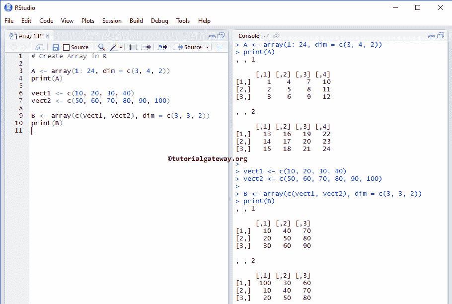
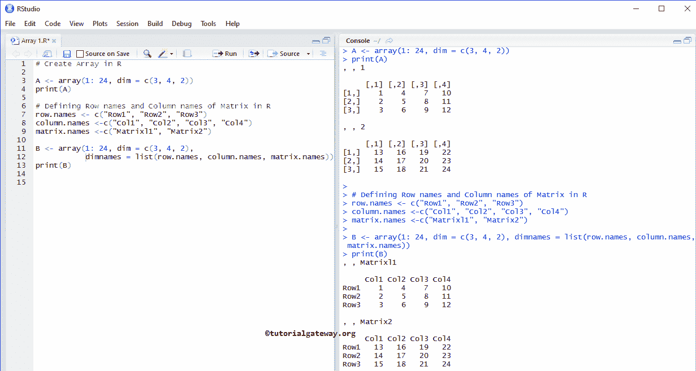
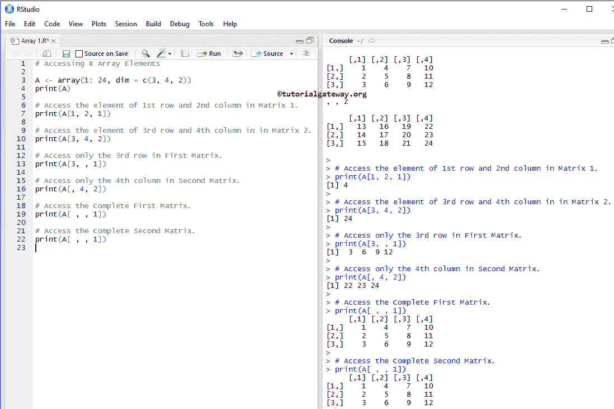
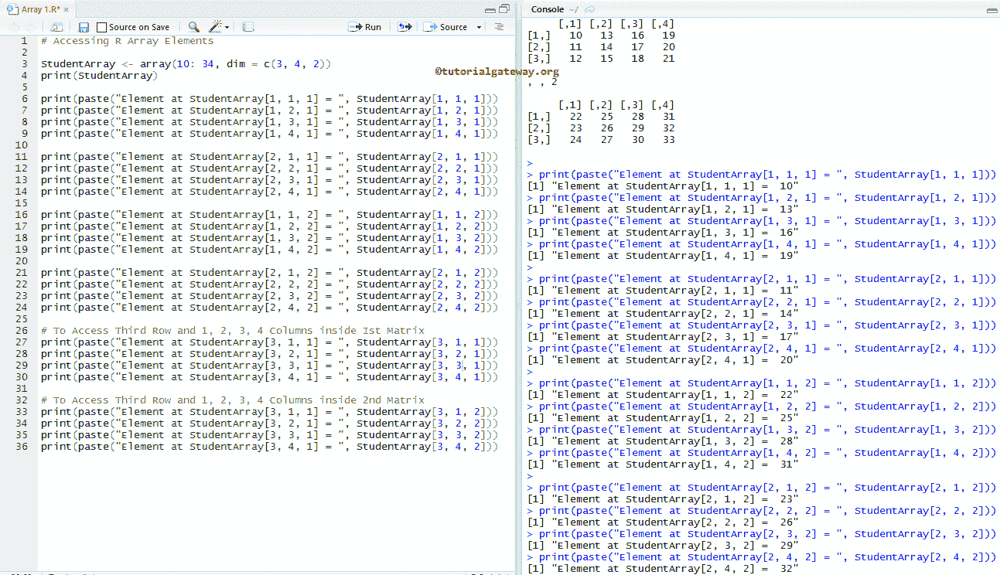
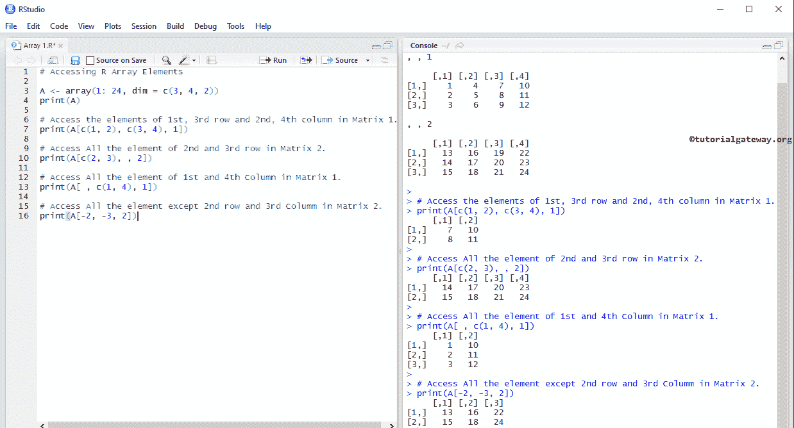
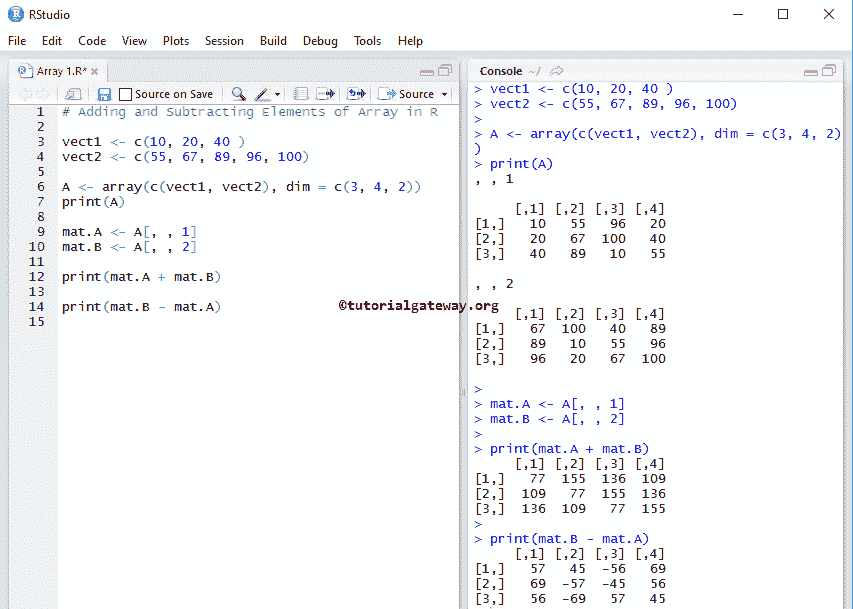

# R 程序设计中的数组

> 原文：<https://www.tutorialgateway.org/array-in-r-programming/>

R 编程中的数组简称为多维数据结构。在 R Array 中，数据存储在矩阵、行和列中，我们可以使用矩阵级别、行索引和列索引来访问矩阵元素。

在本文中，我们展示了如何在 R 中创建数组，如何访问数组元素，在 R 编程中对数组执行算术运算，并给出了一个例子

## 数组语法

R 编程语言中数组的语法是

```
Array_Name <- array(data, dim = (row_Size, column_Size, matrices, dimnames)
```

如果观察上面的代码片段，数据是一个向量

*   矩阵:它将决定一个数组可以接受的矩阵数量。R 中的数组始终是多维的，它意味着不止 1 个有行和列的矩阵。
*   Row_Size:请指定一个数组可以存储的行数。例如，Row_Size =5，那么数组中的每个矩阵将有 5 行。
*   列大小:数组可以存储的列元素的数量。例如，Column_Size = 6，那么数组中的每个矩阵将有 6 列。
*   dimnames:用于将默认的行、列、矩阵名称更改为更有意义的名称。

## 在 R 中创建数组

在本例中，我们将创建一个数组。下面的代码片段将向您展示在 [R 编程](https://www.tutorialgateway.org/r-programming/)语言中创建数组的最传统的方法。

```
# Create 

A <- array(1: 24, dim = c(3, 4, 2))
print(A)

vect1 <- c(10, 20, 30, 40)
vect2 <- c(50, 60, 70, 80, 90, 100)

B <- array(c(vect1, vect2), dim = c(3, 3, 2))
print(B)
```



下面的语句将创建一个由 1 到 24 个元素组成的数组，排列成两个矩阵，每个矩阵包含三行四列。

```
A <- array(1: 24, dim = c(3, 4, 2))
```

接下来，我们创建了两个向量

```
vect1 <- c(10, 20, 30, 40)
vect2 <- c(50, 60, 70, 80, 90, 100)
```

从上面的截图中，你可以观察到我们正在使用 c 或连接函数来组合那些向量，以创建一个元素排列在两个[矩阵](https://www.tutorialgateway.org/r-matrix/)中的数组。每个矩阵将包含三行三列。

```
B <- array(c(vect1, vect2), dim = c(3, 3, 2))
```

### 为数组定义行名和列名

在本例中，我们将展示如何替换行、列和矩阵的默认名称，或者为数组中的行、列和矩阵定义新名称。我们可以使用 dimnames 作为:x

```
A <- array(1: 24, dim = c(3, 4, 2))
print(A)

# Defining Row names and Column names of Matrix in R
row.names <- c("Row1", "Row2", "Row3")
column.names <-c("Col1", "Col2", "Col3", "Col4")
matrix.names <-c("Matrixl1", "Matrix2")

B <- array(1: 24, dim = c(3, 4, 2), dimnames = list(row.names, column.names, matrix.names))
print(B)
```



## 访问数组元素

在 R 编程中，我们可以使用索引位置来访问数组元素。使用索引，我们可以访问或修改/改变数组中的每个元素。索引值从 1 开始，到 n 结束，其中 n 是矩阵、行或列的大小。

这个数组访问背后的语法是:

数组名称[行位置，列位置，矩阵级别]。

例如，我们声明了一个由大小为 6 行* 4 列的两个矩阵组成的数组。若要访问或更改第一个值，请使用 Array_name[1，1，1]，若要访问或更改第一个矩阵级别的第二行第三列值，请使用 Array_name[2，3，1]，若要访问第二个矩阵级别的第六行第四列，请使用 Array_name[6，4，2]。让我们看看这个例子，以便更好地理解:

```
# Accessing Array Elements

A <- array(1: 24, dim = c(3, 4, 2))
print(A)

# Access the element of 1st row and 2nd column in Matrix 1.
print(A[1, 2, 1])

# Access the element of 3rd row and 4th column in in Matrix 2.
print(A[3, 4, 2])

# Access only the 3rd row in First Matrix.
print(A[3, , 1])

# Access only the 4th column in Second Matrix.
print(A[, 4, 2])

# Access the Complete First Matrix.
print(A[ , , 1])

# Access the Complete Second Matrix.
print(A[ , , 1])

```



### 访问数组中的所有元素

在本例中，我们向您展示了访问数组中每个元素的过程

```
# Accessing Array Elements

StudentArray <- array(10: 34, dim = c(3, 4, 2))
print(StudentArray)

print(paste("Element at StudentArray[1, 1, 1] = ", StudentArray[1, 1, 1]))
print(paste("Element at StudentArray[1, 2, 1] = ", StudentArray[1, 2, 1]))
print(paste("Element at StudentArray[1, 3, 1] = ", StudentArray[1, 3, 1]))
print(paste("Element at StudentArray[1, 4, 1] = ", StudentArray[1, 4, 1]))

print(paste("Element at StudentArray[2, 1, 1] = ", StudentArray[2, 1, 1]))
print(paste("Element at StudentArray[2, 2, 1] = ", StudentArray[2, 2, 1]))
print(paste("Element at StudentArray[2, 3, 1] = ", StudentArray[2, 3, 1]))
print(paste("Element at StudentArray[2, 4, 1] = ", StudentArray[2, 4, 1]))

print(paste("Element at StudentArray[1, 1, 2] = ", StudentArray[1, 1, 2]))
print(paste("Element at StudentArray[1, 2, 2] = ", StudentArray[1, 2, 2]))
print(paste("Element at StudentArray[1, 3, 2] = ", StudentArray[1, 3, 2]))
print(paste("Element at StudentArray[1, 4, 2] = ", StudentArray[1, 4, 2]))

print(paste("Element at StudentArray[2, 1, 2] = ", StudentArray[2, 1, 2]))
print(paste("Element at StudentArray[2, 2, 2] = ", StudentArray[2, 2, 2]))
print(paste("Element at StudentArray[2, 3, 2] = ", StudentArray[2, 3, 2]))
print(paste("Element at StudentArray[2, 4, 2] = ", StudentArray[2, 4, 2]))

# To Access Third Row and 1, 2, 3, 4 Columns inside Ist Matrix  
print(paste("Element at StudentArray[3, 1, 1] = ", StudentArray[3, 1, 1]))
print(paste("Element at StudentArray[3, 2, 1] = ", StudentArray[3, 2, 1]))
print(paste("Element at StudentArray[3, 3, 1] = ", StudentArray[3, 3, 1]))
print(paste("Element at StudentArray[3, 4, 1] = ", StudentArray[3, 4, 1]))

# To Access Third Row and 1, 2, 3, 4 Columns inside 2nd Matrix  
print(paste("Element at StudentArray[3, 1, 1] = ", StudentArray[3, 1, 2]))
print(paste("Element at StudentArray[3, 2, 1] = ", StudentArray[3, 2, 2]))
print(paste("Element at StudentArray[3, 3, 1] = ", StudentArray[3, 3, 2]))
print(paste("Element at StudentArray[3, 4, 1] = ", StudentArray[3, 4, 2]))
```



### 访问数组元素的子集

在前面的例子中，我们向您展示了如何从 R 数组中访问单个元素。在本例中，我们将展示如何从数组中访问多个项目的子集。为了达到同样的目的，我们使用 [R 向量](https://www.tutorialgateway.org/r-vector/)。

提示:负索引位置用于从数组中省略那些值。

```
# Accessing Elements

A <- array(1: 24, dim = c(3, 4, 2))
print(A)

# Access the elements of 1st, 3rd row and 2nd, 4th column in Matrix 1.
print(A[c(1, 2), c(3, 4), 1])

# Access All the element of 2nd and 3rd row in Matrix 2.
print(A[c(2, 3), , 2])

# Access All the element of 1st and 4th Column in Matrix 1.
print(A[ , c(1, 4), 1])

# Access All the element except 2nd row and 3rd Columm in Matrix 2.
print(A[-2, -3, 2])
```



## r 数组加减

在这个例子中，我们展示了如何在矩阵上使用[算术运算符](https://www.tutorialgateway.org/r-arithmetic-operators/)在数组上执行算术运算。

```
# Adding and Subtracting Elements

vect1 <- c(10, 20, 40 )
vect2 <- c(55, 67, 89, 96, 100)

A <- array(c(vect1, vect2), dim = c(3, 4, 2))
print(A)

mat.A <- A[, , 1]
mat.B <- A[, , 2]

print(mat.A + mat.B)

print(mat.B - mat.A)
```

为了执行算术运算，我们将多维矩阵转换为一维矩阵。

```
mat.A <- A[, , 1]
mat.B <- A[, , 2]
```

