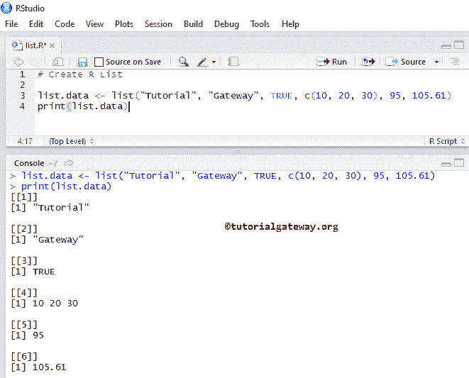

# R 列表

> 原文：<https://www.tutorialgateway.org/r-list/>

列表是最强大和最有用的实时数据结构之一。它允许我们存储不同类型的元素，如整数、字符串、向量、矩阵、列表(嵌套)、数据框等。正因为如此，大多数人把 list 称为高级向量。在这里，我们通过示例向您展示了如何在 R 语言中创建、访问元素、操作它们以及创建命名列表。

## 创建简历列表

在这个例子中，我们将创建一个不同元素的列表。最常见的创建方式。

```
list.data <- list("Tutorial", "Gateway", TRUE, c(10, 20, 30), 95, 105.61)
print(list.data)
```

这里，我们创建了一个包含两个字符串、一个布尔值、一个向量和数值的列表。



在这个例子中，我们将使用向量在 R 语言中创建一个列表。

```
# Creating three vectors
vect.a <- c(10.25, 20.45, 30.75, 40.85)
vect.b <- c(25, 50, 75, 100, 125)
vect.c <- c("India", "China", "Japan", "Russia", "USA") 

list.data <- list(vect.a, vect.b, vect.c )
print(list.data)
```


### 使用矩阵、向量创建列表

在这个例子中，我们将使用[矩阵](https://www.tutorialgateway.org/r-matrix/)和[向量](https://www.tutorialgateway.org/r-vector/)创建一个列表

在这个 [R 语言](https://www.tutorialgateway.org/r-programming/)的例子中，首先，我们创建了两个向量 vect.a 和 vect.b，并分配了一些随机值。在第 6 行，我们从上面指定的向量创建一个列表。

接下来，我们声明了一个 3 * 4 矩阵和一个随机值向量。在第 12 行，它创建了一个包含矩阵、向量和列表(嵌套)的列表

```
vect.a <- c(10.25, 30.75, 20.45, 40.85)
vect.b <- c("India", "Japan", "Russia", "China", "USA") 

list.data <- list(vect.a, vect.b )
print(list.data)

A <- matrix(c(1:12), nrow = 3)
vect.c <- c(50, 75, 25, 100, 125)

list.mixed <- list(A, list.data, vect.c )
print(list.mixed)

```


### 在 R 中创建命名列表

它显示了在 R 语言中创建命名列表所涉及的步骤，语法为:list _ Name

```
list.data <- list("Company" = "Tutorial Gateway", "Flag" = TRUE, "prod" = c(10, 20, 30), "val" = 95, "sale" = 105.61)
print(list.data)
```

如您所见，我们正在为列表元素分配名称。这对于使用字符向量索引值访问元素非常有帮助。例如，打印


### 使用名称函数在 R 中创建命名列表

命名函数对于分配名称非常有用。让我们看看如何在 R 语言中为已经创建的列表分配名称。这背后的语法是:name(<list name="">)</list>

```
vect.x <- c(10, 30, 50, 70)
vect.y <- c("India", "Japan", "UK", "Russia", "China", "USA") 

list.a <- list(vect.x, vect.y )
# Assigning Names
names(list.a) <- c("Num_Vector", "Country") 
print(list.a)

matrix.A <- matrix(c(1:12), 3, 4)
vect.z <- c(55, 75, 25, 105, 125)

list.mixed <- list(matrix.A, list.a, vect.z, "Tutorial Gateway")
names(list.mixed) <- c("Num_Matrix", "Inner_List", "Rand_vector", "Company")
print(list.mixed)
```


## 访问列表元素

在 R 语言中，我们可以使用索引位置访问列表中的元素。索引值从 1 开始，到 n 结束，其中 n 是元素的数量。

例如，如果我们声明一个存储 10 个元素(不同类型或相同类型)的索引，那么索引从 1 开始，到 10 结束。要访问或更改第一个值，请使用列表名称[1]，要更改或访问第十个值，请使用列表名称[10]。让我们看看这个例子，以便更好地理解:

```
vect.a <- c(10.25, 30.75, 20.45, 40.85)
vect.b <- c("India", "Japan", "Russia", "China", "USA") 
vect.c <- c(50, 75, 25, 100, 125)

A <- matrix(c(1:12), 3, 4)

list.data <- list(A, vect.a, "Tutorial Gateway", vect.b, 95, vect.c )
print(list.data)

# Accessing First Element
print(list.data[1])

# Accessing Fourth Element
print(list.data[4])
```


### 使用名称访问列表项

如果我们用名称声明了列表项，或者我们给项分配了名称，那么我们可以使用这些名称来访问元素。让我们使用索引名称访问下面的项目。这背后的语法是: <listname>$Index_Name</listname>

```
vect.x <- c(10, 30, 50, 70)
vect.y <- c("India", "Russia", "Japan", "UK", "China", "USA") 

list.data <- list(vect.x, vect.y )
names(list.data) <- c("Numeric_Vector", "Country") 

matrix.A <- matrix(c(1:12), 3, 4)
vect.z <- c(55, 75, 25, 105, 125)

list.mixed <- list(matrix.A, list.data, vect.z, "Tutorial Gateway")
names(list.mixed) <- c("Numeric_Matrix", "Nested_List", "Random_vector", "Company")
print(list.mixed)

# Accessing Vector.z Elements
print(list.mixed$Random_vector)

# Accessing Vector.z Elements
print(list.mixed$Numeric_Matrix)

# Accessing Nested Elements
print(list.mixed$Nested_List)
```


负索引位置用于在 R 语言中省略列表中的那些值。本示例使用布尔向量访问项目。

```
vect.a <- c(10.25, 30.75, 20.45, 40.85)
vect.b <- c("India", "Japan", "Russia", "China", "USA") 
vect.c <- c(50, 75, 25, 100, 125)

A <- matrix(c(1:12), 3, 4)

list.data <- list(A, vect.a, "Tutorial Gateway", vect.b, 95, vect.c )
print(list.data)

# Accessing Element using Boolean Vector
print(list.data[c(FALSE, FALSE, TRUE, FALSE, TRUE, TRUE)])

# Accessing All except 1
print(list.data[-1])

# Accessing All except 4
print(list.data[-4])

# Accessing All Element except 1 and 6th element
print(list.data[c(-1, -6)])
```


输出 2


## 操作列表元素

我们可以通过以下方式操作元素:

第 15 行访问名称公司的元素，并用 tutorialgateway.org 替换现有名称(即教程网关)。

在第 18 行，我们正在访问名称为 Random_Vector 的项目，并用新的向量值 c(22，44，66，88)替换现有的向量(即 vect.z)。

第 21 行删除了名为 Numeric_Matrix 的项目

```
vect.x <- c(10, 30, 50, 70)
vect.y <- c("India", "Russia", "Japan", "UK", "China", "USA") 

list.data <- list(vect.x, vect.y )
names(list.data) <- c("Numeric_Vector", "Country") 

matrix.A <- matrix(c(1:12), 3, 4)
vect.z <- c(55, 75, 25, 105, 125)

list.mixed <- list(matrix.A, list.data, 95, vect.z, "Tutorial Gateway")
names(list.mixed) <- c("Numeric_Matrix", "Nested_List", "favNum", "Random_vector", "Company")
print(list.mixed)

list.mixed$Company <- "Tutortialgateway.org"
print(list.mixed$Company)

list.mixed$Random_vector <- c(22, 44, 66, 88)
print(list.mixed$Random_vector)

list.mixed$Numeric_Matrix <- NULL
print(list.mixed)
```


我们可以将两个合并成一个大列表。

```
#Declared Two vector
vect.a <- c(10.25, 30.75, 20.45, 40.85)
vect.b <- c("India", "Japan", "Russia", "China", "USA") 

# Create from those two Vectors Vect.a, Vect.b
list.x <- list(vect.a, 95, vect.b )
print(list.x)

# Declared One 4 * 3 matrix
A <- matrix(c(1:12), 4, 3)

# Creating second with one String, Matrix, and a vector
list.y <- list("Tutorial Gateway", A, c(5, 10, 15) )
print(list.y)

# Combining or Merging
list.z <- c(list.x, list.y)
print(list.z)
```


我们可以把列表转换成向量。这种转换可以帮助我们至少在一个级别上执行操作。

```
list.x <- list(1:15)
list.y <- list(25:40)
print(list.x)
print(list.y)
typeof(list.x)

vect.a <- unlist(list.x)
print(vect.a)

vect.b <- unlist(list.y)
print(vect.b)
```

