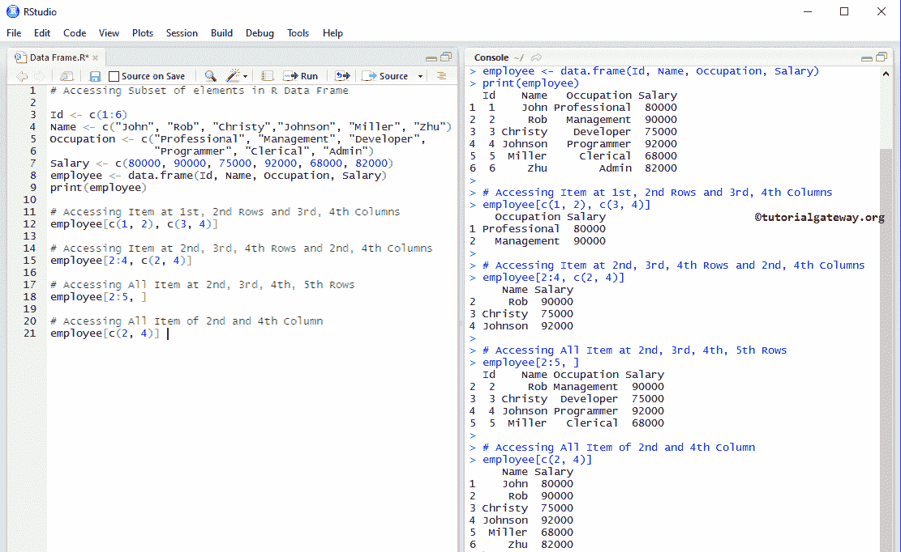
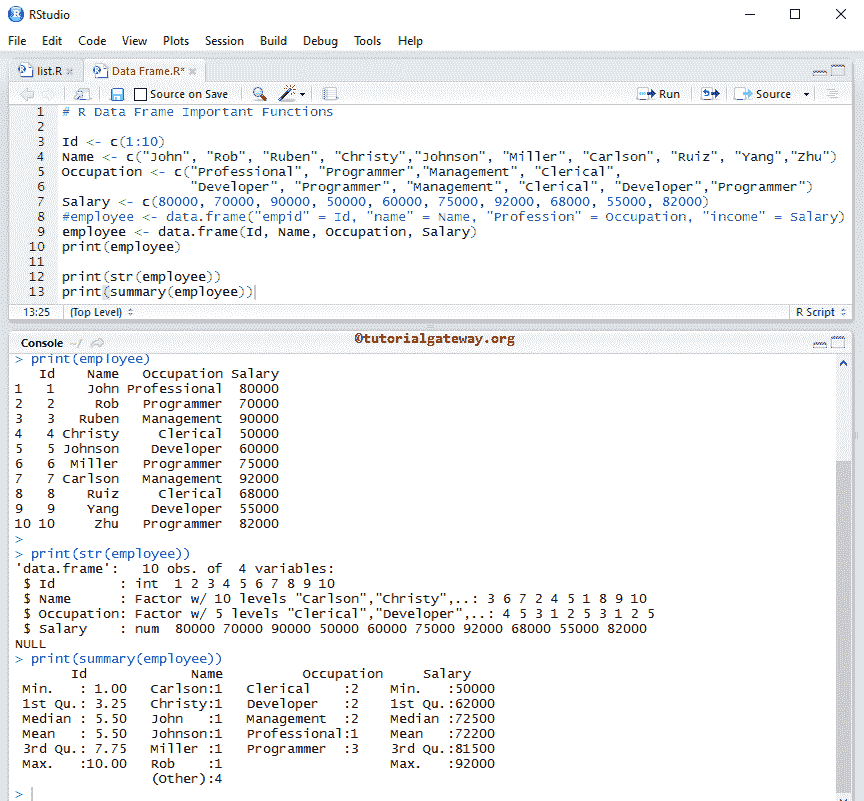

# R 中的数据帧

> 原文：<https://www.tutorialgateway.org/data-frame-in-r/>

R 中的数据框是一个表格或二维数据结构。在 R 数据框中，记录存储在行和列中，我们可以使用行索引和列索引来访问数据框元素。以下是右数据框的一些特征:

*   R 中的数据框是变量列表，它必须包含相同数量的具有唯一行名的行。
*   列名不应为空
*   尽管 r 数据框通过使用 check.names = FALSE 支持重复的列名，但始终最好使用唯一的列名。
*   存储在其中的数据可以是字符类型、数字类型或因子。

在本文中，我们将向您展示如何创建数据框，如何访问列和行。和操作单个或行级或列级元素，创建命名数据框。还解释了 R 编程中数据框支持的一些重要功能。

## 如何在 R 中创建数据框

本示例在 R 中创建了一个包含不同元素的数据框。在 R 编程中创建数据框最常见的方法是。

```
Id <- c(1:10)
Name <- c("John", "Rob", "Ruben", "Christy","Johnson", "Miller", "Carlson", "Ruiz", "Yang","Zhu")
Occupation <- c("Professional", "Programmer","Management", "Clerical", 
                "Developer", "Programmer", "Management", "Clerical", "Developer","Programmer")
Salary <- c(80000, 70000, 90000, 50000, 60000, 75000, 92000, 68000, 55000, 82000)

employee <- data.frame(Id, Name, Occupation, Salary)
print(employee)
```

首先，我们创建了四个不同类型的向量，然后我们使用这四个向量创建了数据帧。


### 创建命名数据框

它显示了在 R 编程中创建命名数据框所涉及的步骤，语法如下:

data frame _ Name

```
Id <- c(1:6)
Name <- c("John", "Rob", "Christy","Johnson", "Miller", "Zhu")
Occupation <- c("Professional", "Management", "Developer", "Programmer", "Clerical", "Admin")
Salary <- c(80000, 90000, 75000, 92000, 68000, 82000)

# We are assigning new names to the Columns
employee <- data.frame("Empid" = Id, "Full_Name" = Name, "Profession" = Occupation, "income" = Salary)

print(employee)

# Names function will display the Index Names of each Item 
print(names(employee))
```


## 访问数据帧元素

在 R 编程中，我们可以通过多种方式访问数据框项。在这里，我们向您展示如何使用索引位置访问项目。索引值从 1 开始，到 n 结束，其中 n 是项目数。

例如，如果我们声明一个存储 10 项(10 列)的数据框，那么索引从 1 开始，到 10 结束。要访问第一个值，请使用数据框名称[1]，要访问第十个值，请使用数据框名称[10]。

我们还可以使用[[双括号]来访问数据框元素。在本例中，我们向您展示了如何使用这个[]来访问项目。它将以带有级别信息的 [R 编程](https://www.tutorialgateway.org/r-programming/)向量的形式返回结果。

```
# Accessing Elements

Id <- c(1:6)
Name <- c("John", "Rob", "Christy","Johnson", "Miller", "Zhu")
Occupation <- c("Professional", "Management", "Developer", "Programmer", "Clerical", "Admin")
Salary <- c(80000, 90000, 75000, 92000, 68000, 82000)

employee <- data.frame(Id, Name, Occupation, Salary)
print(employee)

# Accessing all the Elements (Rows) Present in the Name Items (Column)
employee["Name"]

# Accessing all the Elements (Rows) Present in the 3rd Column (i.e., Occupation)
employee[3] # Index Values: 1 = Id, 2 = Name, 3 = Occupation, 4 = Salary
```


### 使用[[

我们还可以使用[[双括号]来访问数据框元素。在这个例子中，我们展示了如何使用这个【【。这将返回带有级别信息的矢量结果

```
# Accessing Elements

Id <- c(1:6)
Name <- c("John", "Rob", "Christy","Johnson", "Miller", "Zhu")
Occupation <- c("Professional", "Management", "Developer", "Programmer", "Clerical", "Admin")
Salary <- c(80000, 90000, 75000, 92000, 68000, 82000)

employee <- data.frame(Id, Name, Occupation, Salary)
print(employee)

employee[["Name"]]
employee[[3]]
```

它返回的结果与上面的示例相同。但是，它返回的是向量，而不是数据帧。


### 使用$

我们也可以使用美元符号来访问元素。在这个例子中，我们将展示如何使用这个$，访问 R 中数据帧的元素。它将以带有级别信息的[向量](https://www.tutorialgateway.org/r-vector/)的形式返回结果。这背后的语法是:<数据框> $Column_Name

```
Id <- c(1:6)
Name <- c("John", "Rob", "Christy","Johnson", "Miller", "Zhu")
Occupation <- c("Professional", "Management", "Developer", "Programmer", "Clerical", "Admin")
Salary <- c(80000, 90000, 75000, 92000, 68000, 82000)

employee <- data.frame(Id, Name, Occupation, Salary)
print(employee)

# Accessing all the Elements (Rows) Present in the Name Item (Column)
employee$Name

# Accessing all the Elements (Rows) Present in the Salary Item (Column)
employee$Salary
```


### 访问低级元素

在 R 编程中，我们可以使用索引位置访问数据框中项目(或单个单元格)的低级元素。使用这个索引值，我们可以访问每个单独的项目。索引值从 1 开始，到 n 结束，其中 n 是一行或一列中的元素数。这背后的语法是:<data frame="">【行号，列号】。</data>

例如，如果我们声明一个有六行元素和四列元素的数据帧。要访问或更改第一个值，请使用数据框名称[1，1]，要访问第二行第三列值，请使用数据框名称[2，3]，要访问第六行第四列，请使用数据框名称[6，4]。

```
# Accessing Low level elements

Id <- c(1:6)
Name <- c("John", "Rob", "Christy","Johnson", "Miller", "Zhu")
Occupation <- c("Professional", "Management", "Developer", "Programmer", "Clerical", "Admin")
Salary <- c(80000, 90000, 75000, 92000, 68000, 82000)
employee <- data.frame(Id, Name, Occupation, Salary)

print(employee)
# Accessing Element at 1st Row and 2nd Column 
employee[1, 2]

# Accessing Element at 4th Row and 3rd Column 
employee[4, 3] 

# Accessing All Elements at 5th Row 
employee[5, ] 

# Accessing All Item of the 4th Column 
employee[, 4]
```


### 访问多个值

它展示了如何访问多个项目。为了达到同样的目的，我们使用了 R 向量

```
# Accessing Subset of elements

Id <- c(1:6)
Name <- c("John", "Rob", "Christy","Johnson", "Miller", "Zhu")
Occupation <- c("Professional", "Management", "Developer", "Programmer", "Clerical", "Admin")
Salary <- c(80000, 90000, 75000, 92000, 68000, 82000)
employee <- data.frame(Id, Name, Occupation, Salary)
print(employee)

# Accessing Item at 1st, 2nd Rows and 3rd, 4th Columns 
employee[c(1, 2), c(3, 4)]

# Accessing Item at 2nd, 3rd, 4th Rows and 2nd, 4th Columns 
employee[2:4, c(2, 4)] 

# Accessing All Item at 2nd, 3rd, 4th, 5th Rows 
employee[2:5, ] 

# Accessing All Item of 2nd and 4th Column 
employee[c(2, 4)]
```



### 使用$

我们还可以使用美元符号访问较低级别(单个单元格)的 R 数据框元素。让我们看看如何使用这个$访问单个单元格。它将结果作为带有级别信息的[向量](https://www.tutorialgateway.org/r-vector/)返回。

```
# Accessing elements

Id <- c(1:6)
Name <- c("John", "Rob", "Christy","Johnson", "Miller", "Zhu")
Occupation <- c("Professional", "Management", "Developer", 
                "Programmer", "Clerical", "Admin")
Salary <- c(80000, 90000, 75000, 92000, 68000, 82000)
employee <- data.frame(Id, Name, Occupation, Salary)
print(employee)

# Accessing Item at 2nd, 4th Rows of Name Columns 
employee$Name[c(2, 4)] 

# Accessing Item at 2nd, 3rd, 4th, 5th Rows of Occupation Column 
employee$Occupation[2:5] 

```


## 修改数据框元素

我们可以使用索引位置访问元素并提取数据。使用这个索引值，我们可以改变或改变每个单独的元素。在这里，我们修改特定的单元格值和整个列项。

```
# Modifying elements

Id <- c(1:6)
Name <- c("John", "Rob", "Christy","Johnson", "Miller", "Zhu")
Salary <- c(80000, 90000, 75000, 92000, 68000, 82000)

employee <- data.frame(Id, Name, Salary)
print(employee)

# Modifying Item at 2nd Row and 3rd Column 
employee[2, 3] <- 100000
print(employee)

#  Modifying All Item of 1st Column 
employee[, 1] <- c(10:15)
print(employee)
```


## 添加元素

本示例在 R 编程中将新元素添加到现有的数据框中。

*   cbind(数据框，值):cbind 函数添加额外的带有值的列。一般来说，我们更喜欢向量作为参数值
*   rbind(数据框，值):rbind 函数添加带有值的额外行。

```
# Adding elements

Id <- c(1:6)
Name <- c("John", "Rob", "Christy","Johnson", "Miller", "Zhu")
Salary <- c(80000, 90000, 75000, 92000, 68000, 82000)

employee <- data.frame(Id, Name, Salary, stringsAsFactors=FALSE)
print(employee)

# Adding Extra Row 
rbind(employee, list(7, "Gateway", 105505))

# Adding Extra Column 
Occupation <- c("Management", "Developer", "User", "Programmer", "Clerical", "Admin")
cbind(employee, Occupation)
```


## 数据框的重要功能

以下数据框函数是一些最有用的函数。

*   类型(数据帧):返回数据类型。因为是一种[列表](https://www.tutorialgateway.org/r-list/)，所以返回一个列表
*   类(数据帧):它的类。
*   长度(数据帧):计算其中的项目(列)数
*   nrow(DataFrame):返回存在的总行数。
*   ncol(数据帧):列的总数。
*   dim(数据框):存在的行和列的总数。

```
# Important Functions

Id <- c(1:10)
Name <- c("John", "Rob", "Ruben", "Christy","Johnson", "Miller", "Carlson", "Ruiz", "Yang","Zhu")
Occupation <- c("Professional", "Programmer","Management", "Clerical", 
                "Developer", "Programmer", "Management", "Clerical", "Developer","Programmer")
Salary <- c(80000, 70000, 90000, 50000, 60000, 75000, 92000, 68000, 55000, 82000)

#employee <- data.frame("empid" = Id, "name" = Name, "Profession" = Occupation, "income" = Salary)
employee <- data.frame(Id, Name, Occupation, Salary)
print(employee)

typeof(employee)
class(employee)
names(employee)

# Number of Rows and Columns
length(employee)
ncol(employee)
nrow(employee)
dim(employee)
```


### R 数据帧中的头部和尾部函数

如果您的记录太大，并且您想要提取性能最好的记录，那么您可以使用这些数据框函数

*   head(数据框，限制):返回前六个元素(如果省略限制)。如果将限制指定为 2，则返回前 2 条记录。这就像选择前 10 张唱片一样。
*   tail(DataFrame，limit):返回最后六个元素(如果省略了 limit)。如果将限制指定为 4，它将返回最后四条记录。

```
# Head and Tail Function

Id <- c(1:10)
Name <- c("John", "Rob", "Ruben", "Christy", "Johnson", "Miller", "Carlson", "Ruiz", "Yang","Zhu")
Occupation <- c("Professional", "Programmer","Management", "Clerical", "Developer", "Programmer", 
                "Management", "Clerical", "Developer","Programmer")
Salary <- c(80000, 70000, 90000, 50000, 60000, 75000, 92000, 68000, 55000, 82000)

employee <- data.frame(Id, Name, Occupation, Salary)
print(employee)

# No limit - It means Displaying First Six Records 
head(employee)

# Limit is 4 - It means Displaying First Four Records 
head(employee, 4)

# No limit - It means Displaying Last Six Records 
tail(employee)

# Limit is 4 - It means Displaying Last Six Records 
tail(employee, 4)
```


### 数据帧特殊功能

以下两个是支持的非常有用的函数。在我们开始操作或插入新记录之前，检查结构总是好的。

*   str(DataFrame):返回它的结构。
*   汇总(DataFrame):返回数据的性质和统计汇总，如最小值、中值、平均值、中值等。

```
# Important Functions

Id <- c(1:10)
Name <- c("John", "Rob", "Ruben", "Christy","Johnson", "Miller", "Carlson", "Ruiz", "Yang","Zhu")
Occupation <- c("Professional", "Programmer","Management", "Clerical", 
                "Developer", "Programmer", "Management", "Clerical", "Developer","Programmer")
Salary <- c(80000, 70000, 90000, 50000, 60000, 75000, 92000, 68000, 55000, 82000)
#employee <- data.frame("empid" = Id, "name" = Name, "Profession" = Occupation, "income" = Salary)
employee <- data.frame(Id, Name, Occupation, Salary)
print(employee)

print(str(employee))
print(summary(employee))
```

