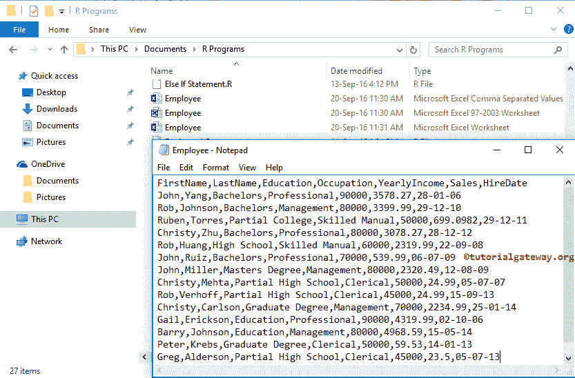
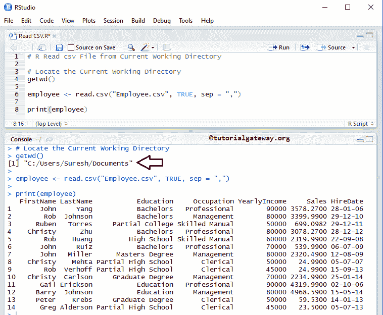
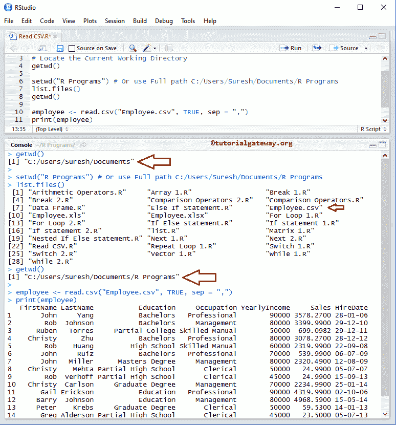
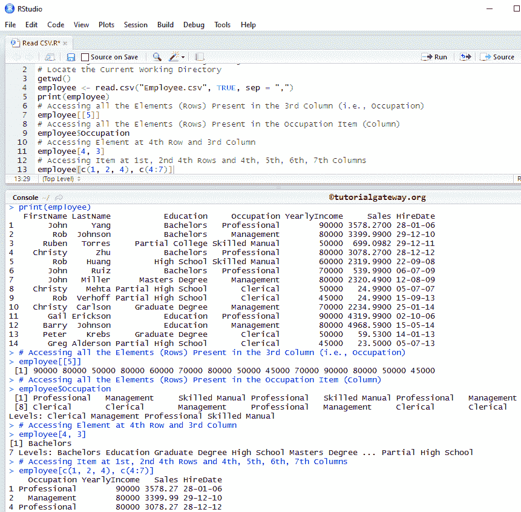
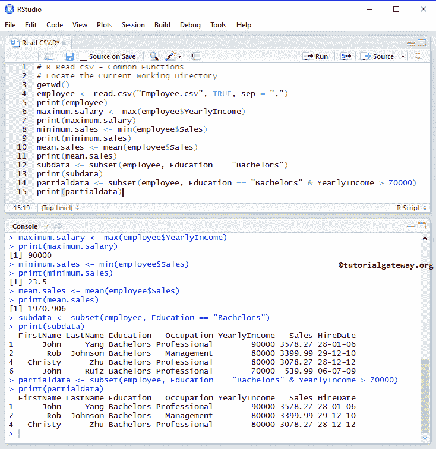
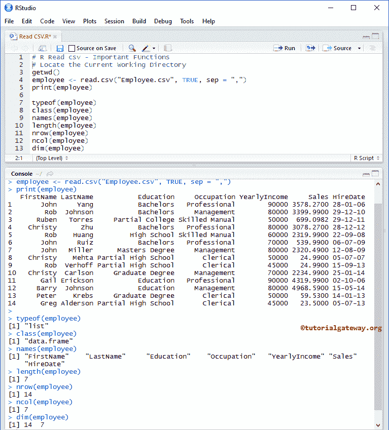
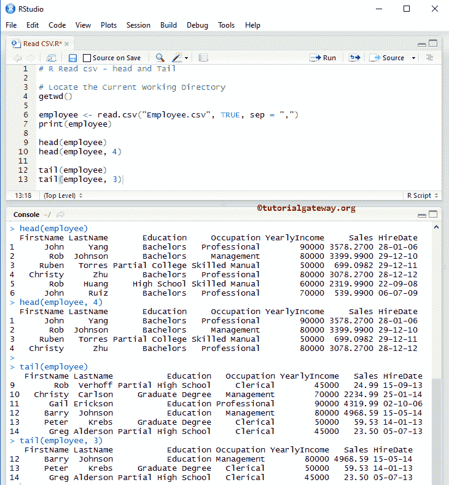
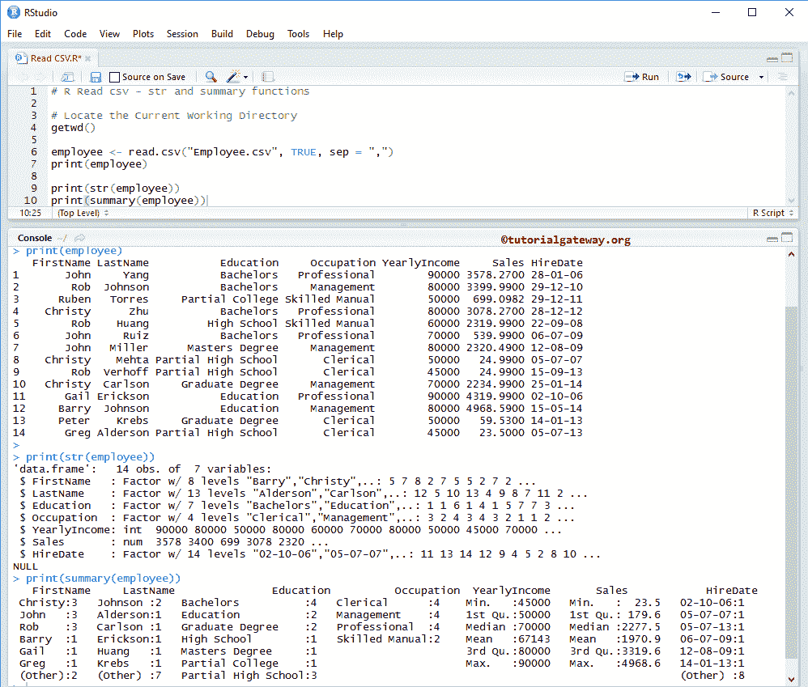
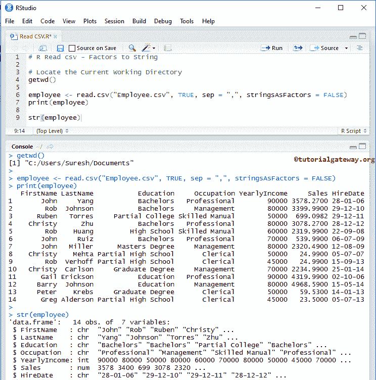

# R `read.csv`函数

> 原文：<https://www.tutorialgateway.org/r-read-csv-function/>

R `read.csv`函数对于从文件系统和 URL 导入 csv 文件，并将数据存储在 Data Frame 中非常有用。在本文中，我们将向您展示，如何使用这个 R `read.csv`函数，如何在 R 语言中操作 csv 数据，并举例说明。

## 读 CSV 语法

在 R 语言中从 csv 文件中读取数据的基本语法如下所示

```
read.csv(file, header = , sep = , quote = )
```

R 语言中的 read.csv 支持很多参数。以下是在 r 函数中实时使用 read csv 时最有用的一些参数:

*   文件:您必须指定文件名或完整路径以及名称。您也可以使用外部(在线)文件的网址。例如，sample.csv 或“C:/Users/Suresh/Documents/sample . CSV”
*   标题为真:如果文本文件包含列名作为第一行，请指定标题参数为真，否则为假
*   sep:它是分离器的简称。您必须指定分隔字段的字符。“，”表示数据用逗号分隔
*   报价:如果您的字符值(名字、教育列 tc)用引号括起来，那么您必须指定报价类型。对于双引号，我们在 r `read.csv`函数中使用:quote = "\ " "
*   原样:请指定与列数相同长度的布尔向量。此参数将根据布尔值将字符值转换为因子。例如，我们有两列(名字，销售)，然后我们可以使用 as.is = c(真，假)，这将保持字符名字作为字符(不是一个隐含的因素)
*   它是一个整数值。您可以使用此参数来限制要读取的行数。例如，如果您想要前 5 条记录，请使用 nrows = 5
*   跳过:在开始读取之前，请指定要从文件中跳过的行数。例如，如果要跳过前 2 条记录，请使用 skip = 2
*   strip.white:当 sep 参数不等于“”时，可以使用该布尔值来修剪字符字段中多余的前导空格和尾随空格。
*   如果你的文件中有任何注释行，那么你可以使用这个参数来忽略这些行。您已经描述了用于注释行的单个特殊字符。例如，如果您的数据包含以$开头的注释，则使用 comment.char = "$ "跳过此注释行。
*   stringsAsFactors:布尔值，指示 csv 文件中的文本字段是否应转换为因子。

下面的截图将向您展示我们员工内部的数据，我们将使用此文本来演示 R `read.csv`函数。可以看到，它有列名，14 行，7 列



如果您想使用相同的数据，请复制以下数据并粘贴到记事本中，并将其保存为员工

```
FirstName,LastName,Education,Occupation,YearlyIncome,Sales,HireDate
John,Yang,Bachelors,Professional,90000,3578.27,28-01-06
Rob,Johnson,Bachelors,Management,80000,3399.99,29-12-10
Ruben,Torres,Partial College,Skilled Manual,50000,699.0982,29-12-11
Christy,Zhu,Bachelors,Professional,80000,3078.27,28-12-12
Rob,Huang,High School,Skilled Manual,60000,2319.99,22-09-08
John,Ruiz,Bachelors,Professional,70000,539.99,06-07-09
John,Miller,Masters Degree,Management,80000,2320.49,12-08-09
Christy,Mehta,Partial High School,Clerical,50000,24.99,05-07-07
Rob,Verhoff,Partial High School,Clerical,45000,24.99,15-09-13
Christy,Carlson,Graduate Degree,Management,70000,2234.99,25-01-14
Gail,Erickson,Education,Professional,90000,4319.99,02-10-06
Barry,Johnson,Education,Management,80000,4968.59,15-05-14
Peter,Krebs,Graduate Degree,Clerical,50000,59.53,14-01-13
Greg,Alderson,Partial High School,Clerical,45000,23.5,05-07-13
```

## 从当前工作目录读取 csv 文件

在本例中，我们将向您展示如何从 [R 语言](https://www.tutorialgateway.org/r-programming/)中当前工作目录中的 csv(逗号分隔值)文件中读取数据。

```
# From Current Working Directory

# Locate the Current Working Directory
getwd()

employee <- read.csv("Employee.csv", TRUE, sep = ",")

print(employee)
```



## 从自定义目录读取 csv 文件

在这个 r read.csv 示例中，我们将向您展示如何从自定义目录中的文件中读取数据。

*   getwd():此方法将返回当前工作目录。通常，它是您的文档文件夹
*   setwd(“系统地址”):setwd 功能可以帮助我们根据您的要求更改当前目录
*   list.files():它显示该目录中存在的文件列表

```
# From Optional Working Directory

# Locate the Current Working Directory
getwd()

setwd("R Programs") # Or use Full path C:/Users/Suresh/Documents 
list.files()
getwd()

employee <- read.csv("Employee.csv", TRUE, sep = ",")
print(employee)
```



## 访问 csv 文件数据

在 R 语言中，`read.csv`函数会自动将数据转换成 Data Frame。因此，数据框支持的所有功能都可以用于 csv 数据。功能描述请参考[数据框](https://www.tutorialgateway.org/data-frame-in-r/)文章了解。

```
# Accessing Data

# Locate the Current Working Directory
getwd()
employee <- read.csv("Employee.csv", TRUE, sep = ",")
print(employee)

# Accessing all the Elements (Rows) Present in the 3rd Column (i.e., Occupation)
Index Values: 1 = FirstNmae, 2 = LastName, 3 = Education, 4 = Occupation, 4 = Yearly Income 5 = Salary, and 6 = HireDate
employee[[5]] 

# Accessing all the Elements (Rows) Present in the Occupation Item (Column)
employee$Occupation

# Accessing Element at 4th Row and 3rd Column 
employee[4, 3] 

# Accessing Item at 1st, 2nd 4th Rows and 4th, 5th, 6th, 7th Columns 
employee[c(1, 2, 4), c(4:7)]
```



## R read.csv 中的常用函数

当我们在 R 语言中从 csv 文件中工作或读取数据时，以下函数是常见的函数。

*   max 方法将返回列中的最大值
*   min 方法将返回列内的最小值
*   子集(数据，条件):这个方法将返回数据的子集，数据取决于条件

```
# Common Functions 
# Locate the Current Working Directory
getwd()
employee <- read.csv("Employee.csv", TRUE, sep = ",")
print(employee)

# It returns the Maximum Value within the Yearly Income Column
maximum.salary <- max(employee$YearlyIncome)
print(maximum.salary)

# It returns the Minimum Value within the Sales Column
minimum.sales <- min(employee$Sales)
print(minimum.sales)

# It will calculate and returns the Sales Column Mean Value
mean.sales <- mean(employee$Sales)
print(mean.sales)

# It returns all the records, whose Education is equal to Bachelors
subdata <- subset(employee, Education == "Bachelors")
print(subdata)

# It returns all the records, whose Education is equal to Bachelors and Yearly Income > 70000
partialdata <- subset(employee, Education == "Bachelors" & YearlyIncome > 70000)
print(partialdata)
```



## 阅读 CSV 重要功能

在 R 语言中读取 csv 文件时，以下函数是一些最有用的函数。

*   typeof 方法将告诉您变量的类型。因为数据框是一种列表，这个函数将返回一个列表
*   方法将告诉您 CSV 文件中数据的类别
*   length 方法将计算项目数(列)
*   nrow 方法将返回存在的总行数。
*   ncol 方法将返回可用列的总数。
*   dim 方法将返回行和列的总数。

```
# Important Functions

# Locate the Current Working Directory
getwd()

employee <- read.csv("Employee.csv", TRUE, sep = ",")
print(employee)

typeof(employee)
class(employee)
names(employee)

length(employee)
nrow(employee)
ncol(employee)
dim(employee)
```



### 读 csv 中的头尾函数

在 R 语言中，以下函数是处理外部数据(读取 csv 文件)非常有用的函数。如果您的 csv 文件太大，并且您想要提取性能最好的记录(前 20 条记录)，那么您可以使用这些功能

*   head(数据，限制):该方法将返回前六个元素(如果省略限制)。如果您将限制指定为 3，那么它将返回前三条记录。这就像选择前 20 张唱片。
*   tail(Data，limit):这个方法将返回最后六个元素(如果省略 limit)。如果将限制指定为 4，它将返回最后四条记录。这就像选择最差的 10 条记录。

```
# head and Tail

# Locate the Current Working Directory
getwd()

employee <- read.csv("Employee.csv", TRUE, sep = ",")
print(employee)

# No limit - It will Display Top Six Records 
head(employee)

# Limit is 4 - It will Display Top Four Records
head(employee, 4)

# No limit - It will Display Bottom Six Records 
tail(employee)

# Limit is 3 - It will Display Bottom Three Records
tail(employee, 3)
```



### 阅读 CSV 特殊功能

下面是 R 语言在读取 csv 文件时支持的两个非常有用的函数。在我们开始操作或插入新记录之前，检查外部数据的结构总是好的

*   str(Data):该方法将返回 csv 文件中存在的记录的结构。
*   汇总(数据框):该方法将返回外部数据源的性质，以及统计汇总如:最小值、中值、平均值、中值等。

```
# str and summary functions

# Locate the Current Working Directory
getwd()

employee <- read.csv("Employee.csv", TRUE, sep = ",")
print(employee)

print(str(employee))
print(summary(employee))
```



## `read.csv`函数中的字符串

如果 csv 文件包含字符和数字变量，那么字符变量会自动转换为因子类型。为了防止这种自动转换，我们必须显式地指定 stringsAsFactors = FALSE。

```
# Factors to String

# Locate the Current Working Directory
getwd()

employee <- read.csv("Employee.csv", TRUE, sep = ",", stringsAsFactors = FALSE)
print(employee)

str(employee)
```

如果您观察下面的截图，它会以字符形式返回名字，而不是因子类型。

