# R `read.table`函数

> 原文：<https://www.tutorialgateway.org/r-read-table-function/>

`read.table`函数对于从文件系统& URLs 导入文本文件中的数据并将数据存储在数据框中非常有用。让我们看看如何使用这个 R `read.table`函数，如何在 R 语言中操作数据，并举例说明。

## 读表语法

从文本文件中读取数据的`read.table`函数背后的语法是

```
read.table(file, header = FALSE, sep = "", quote = "\"'", dec = ".", 
         row.names, col.names, na.strings = "NA", nrows = -1, skip = 0,
         numerals = c("allow.loss", "warn.loss", "no.loss"), colClasses = NA,
         as.is = !stringsFactors, check.names = TRUE, strip.white = FALSE,
         fill = !blank.lines.skip, blank.lines.skip = TRUE, comment.char = "#",
         allowEscapes = FALSE, flush = FALSE, fileEncoding = "", text,
         stringsAsFactors = default.stringsAsFactors(), encoding = "unknown",
         skipNul = FALSE)
```

R 语言中的 read.table 支持的参数列表为

*   dec:指定小数点使用的字符
*   检查名称:请指定是否要检查列名在 R 语言中是否有效。
*   行名:包含返回的数据框的行名的字符向量
*   它是一个整数值。您可以使用此参数来限制要读取的行数。例如，如果您想要前 5 条记录，请在 r 中的 read table 函数中使用 nrows = 5。
*   列类名:分配给每一列的类名的字符向量。
*   填充:有时，我们可能会得到一个包含不等长行的文件，我们不得不在缺少的值上添加空格。
*   刷新:从一行读取所有请求的字段后，如果希望 read.table 跳过下一行，则可以使用此布尔值参数。
*   编码:如果有任何编码方案，则指定用于源文件的方案。默认值为“未知”。

下面的截图显示了我们的 EmployeeSales.txt 文件中的数据，我们将使用这个文件来演示 R read.table 函数。可以看到，它有列名，14 行，7 列

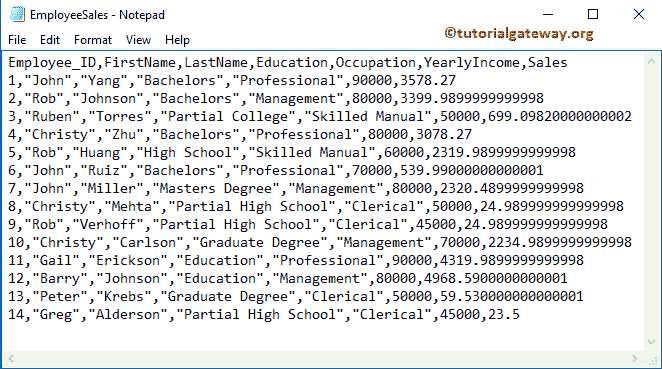

如果您想使用相同的数据，请复制以下数据并粘贴到记事本中，并将其保存为 EmployeeSales.txt

```
Employee_ID,FirstName,LastName,Education,Occupation,YearlyIncome,Sales
1,"John","Yang","Bachelors","Professional",90000,3578.27
2,"Rob","Johnson","Bachelors","Management",80000,3399.9899999999998
3,"Ruben","Torres","Partial College","Skilled Manual",50000,699.09820000000002
4,"Christy","Zhu","Bachelors","Professional",80000,3078.27
5,"Rob","Huang","High School","Skilled Manual",60000,2319.9899999999998
6,"John","Ruiz","Bachelors","Professional",70000,539.99000000000001
7,"John","Miller","Masters Degree","Management",80000,2320.4899999999998
8,"Christy","Mehta","Partial High School","Clerical",50000,24.989999999999998
9,"Rob","Verhoff","Partial High School","Clerical",45000,24.989999999999998
10,"Christy","Carlson","Graduate Degree","Management",70000,2234.9899999999998
11,"Gail","Erickson","Education","Professional",90000,4319.9899999999998
12,"Barry","Johnson","Education","Management",80000,4968.5900000000001
13,"Peter","Krebs","Graduate Degree","Clerical",50000,59.530000000000001
14,"Greg","Alderson","Partial High School","Clerical",45000,23.5
```

## r 读取表以从当前目录读取文本文件

在这个例子中，我们展示了如何使用 R read.table 函数从文本文件()中读取数据。txt 文件),它存在于当前工作目录中。

*   文件:您必须指定文件名或完整路径以及文件名。您也可以使用外部(在线)txt 文件的网址。比如 samplefile . txt“C:/Users/Suresh/Documents/R Programs/samplefile . txt”。
*   标题:如果文本文件包含列名作为第一行，请指定真，否则指定假。
*   sep:它是分隔符的简称。您必须指定分隔字段的字符。“，”表示用逗号分隔的数据。
*   引号:如果您的字符值(姓氏、职业、教育程度等)用引号括起来，那么您必须指定引号的类型。对于双引号，我们使用:quote = "\ "。

```
# R Read table function to read Text File from Current Working Directory

# To Locate the Current Working Directory
getwd()

Company.employees <- read.table("EmployeeSales.txt", TRUE, sep = ",", quote="\"")

print(Company.employees)
```

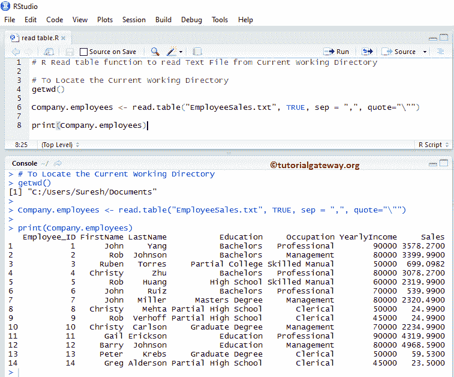

## r 读取表以从自定义目录读取文本文件

在本例中，我们使用 R read.table 函数从自定义目录中的文本文件中读取数据。

*   getwd():此 [R 语言](https://www.tutorialgateway.org/r-programming/)方法返回当前工作目录。通常，它是您的文档文件夹。
*   setwd(“系统地址”):这种方法可以帮助我们根据您的要求更改当前目录。
*   list.files():此方法显示该目录中存在的文件列表。

```
# R Read table function to read Text File from Custom Working Directory

# To Locate the Current Working Directory
getwd()

setwd("R Programs") # Or use Full path C:/Users/Suresh/Documents/R Programs 
list.files()
getwd()

Company.employees <- read.table("EmployeeSales.txt", TRUE, sep = ",", quote="\"")

print(Company.employees)
```

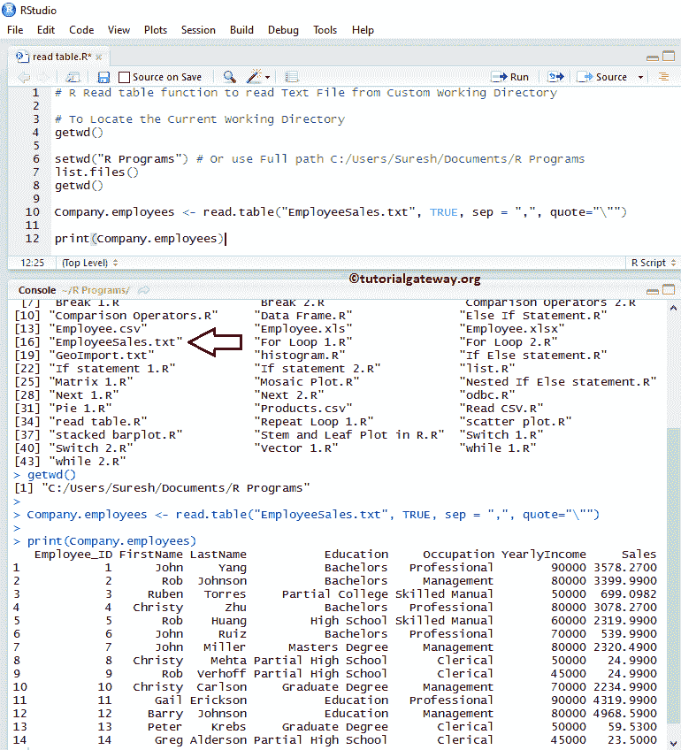

## 读取表函数参数

下面的截图显示了我们修改后的 EmployeeSales.txt 文件中的数据。在这里，我们将使用这个文件来演示 R read.table 函数中的参数。如您所见，它有一些空行、空记录和注释行

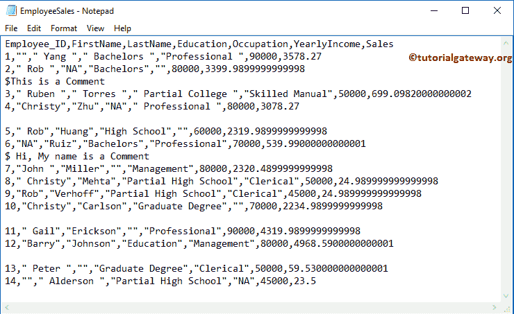

### 读取表函数测试参数

在这个 R read 表示例中，我们展示了如何在从文本文件中读取数据时读取 NA 记录、转义空行和注释行。

*   允许转义符:一个布尔值，指示是否允许转义符(如新行的转义符)。
*   strip.white:如果 sep 参数不等于""，那么您可以使用这个布尔值来修剪字符字段中多余的前导和尾随空格。
*   如果你的文本文件中有任何注释行，那么你可以使用这个参数来忽略这些行。在这里，你必须描述一下你用来评论这条线的单个特殊字符。例如，如果您的文本文件包含以$开头的注释，则使用 comment.char = "$ "跳过此注释行。
*   空行。跳过:一个布尔值，指定是否要跳过/忽略空行。
*   字符串:一个字符向量，指定读取为字符串的值。

```
# R Read table function - Testing argument
# To Locate the Current Working Directory
getwd()

employees <- read.table("EmployeeSales.txt", TRUE, sep = ",", quote="\"", 
                        na.strings = TRUE, strip.white = TRUE,
                        comment.char = "$",blank.lines.skip = TRUE)
print(employees)
```

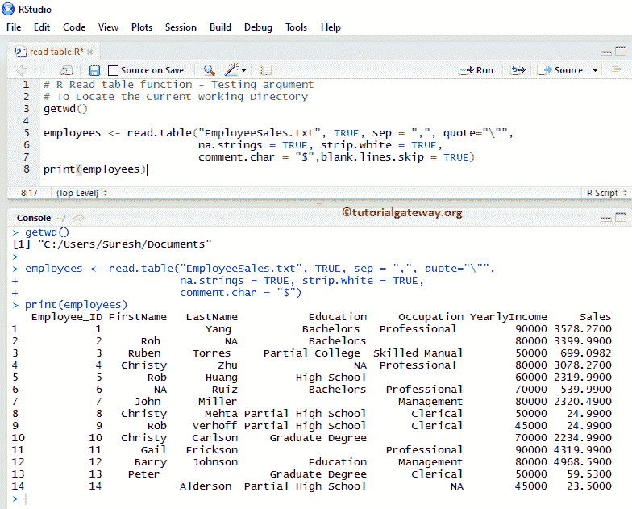

### 测试读表参数

在本例中，我们展示了如何重命名列名，跳过行数，更改默认因子。

*   列名:包含返回数据框的列名的字符向量
*   原样:请指定与列号长度相同的布尔向量。此参数将字符值转换为基于布尔值的因子。例如，我们有两列(名字，职业)，我们使用它们作为. is = c(真，假)。它保留名字作为一个字符(不是一个隐含的因素)，职业作为因素。
*   跳过:在开始读取数据之前，请指定要从文本文件中跳过的行数。例如，如果您想跳过前 3 条记录，请使用 skip = 3。

```
# R Read table function - Testing argument
# To Locate the Current Working Directory
getwd()
employeeNames <- c("Employee_ID", "First Name", "Last Name", "Education", "Profession","Salary","Sales")
employees <- read.table("EmployeeSales.txt", TRUE, sep = ",", quote="\"", 
                        na.strings = TRUE, strip.white = TRUE, skip = 3,
                        as.is = c(TRUE, TRUE, FALSE, FALSE, TRUE),
                        col.names = employeeNames, 
                        comment.char = "$", blank.lines.skip = TRUE)
print(employees)
print(str(employees))
```

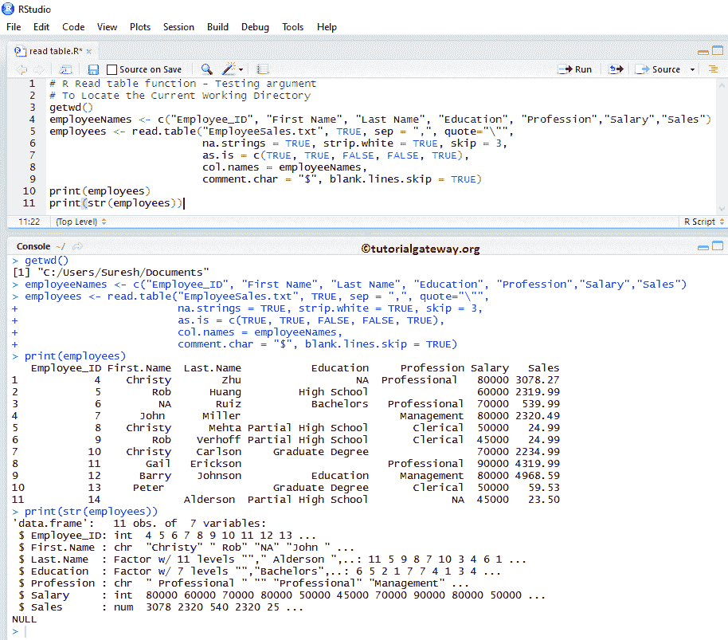

### 读取表函数中的字符串

如果您的文本文件包含字符和数字变量，那么字符变量会自动转换为因子类型。为了防止这种自动转换，我们必须显式地指定 stringsAsFactors = FALSE。

*   stringsAsFactors:布尔值，指示. txt 文件中的文本字段是否转换为因子。默认值为 default.stringsAsFactors()。

```
# R Read table function - stringsAsFactors argument
# To Locate the Current Working Directory
getwd()

# It will keep the Character Columns as it is 
Company.employees <- read.table("EmployeeSales.txt", TRUE, sep = ",", quote="\"", 
                        stringsAsFactors = FALSE)

# It will Implicitly convert all the Character Columns to factors
employees <- read.table("EmployeeSales.txt", TRUE, sep = ",", quote="\"")

print(str(Company.employees))
print(str(employees))
```

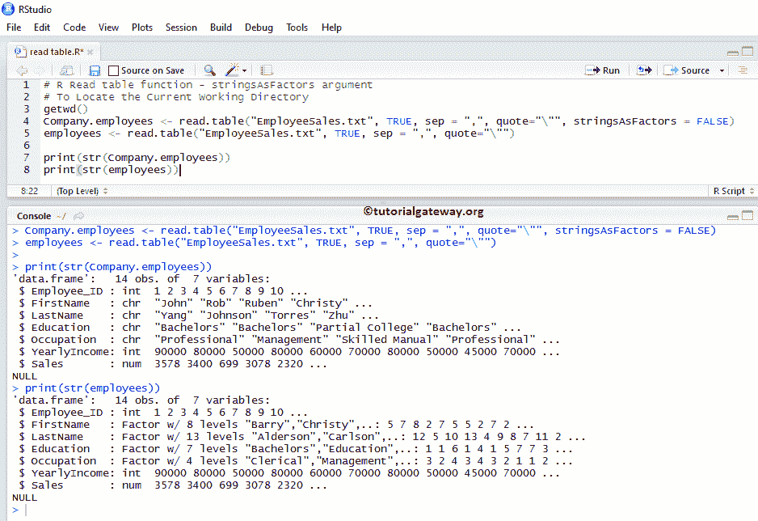

## 访问文本文件数据

R 语言中的 read.table 自动将数据转换为 Data Frame。因此，数据框支持的所有函数都用于文本数据。请参考 R 文章中的[数据框，了解函数的描述。](https://www.tutorialgateway.org/data-frame-in-r/)

```
# R Read table function - Access Data

# To Locate the Current Working Directory
getwd()

Company.employees <- read.table("EmployeeSales.txt", TRUE, sep = ",", quote="\"")
print(Company.employees)

# Accessing all the Rows (Elements) Present in the 4th Column (i.e., Education)
#Index Values: 1 = Employee_ID, 2 = FirstNmae, 3 = LastName, 4 = Education, 5 = Occupation, 6 = Yearly Income, and 7 = Salary
Company.employees[[4]] 

# Accessing all the Elements (Rows) Present in the YearlyIncome Item (Column)
Company.employees$YearlyIncome

# Accessing Element at 9th Row and 7th Column 
Company.employees[9, 7] 

# Accessing Item at 3rd, 5th, 7th, 13th Rows and 3rd, 4th, 5th, 6th, 7th Columns 
Company.employees[c(3, 5, 7, 13), c(3:7)]
```

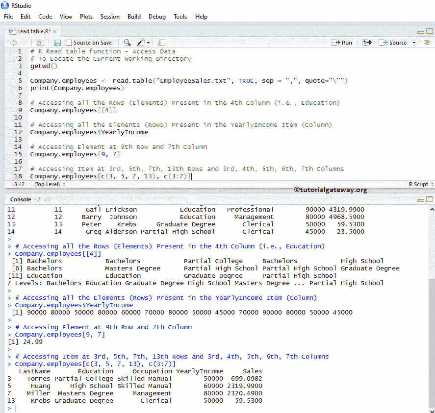

## 读表中的常用函数

当我们在 R 语言中处理文本文件时，以下函数是最常用的函数。

*   max:此方法返回列内的最大值。
*   min:该方法返回列内的最小值。
*   平均值:它计算平均值。
*   中值:计算指定列的中值。
*   子集(数据，条件):这个方法返回数据的子集，数据依赖于条件。

```
# R Read table function - Common Methods
# To Locate the Current Working Directory
getwd()

Company.employees <- read.table("EmployeeSales.txt", TRUE, sep = ",", quote="\"")
summary(Company.employees)

# It returns the Maximum Value present in the Yearly Income Column
max.salary <- max(Company.employees$YearlyIncome)
print(max.salary)

# It returns the Minimum Value present in the Sales Column
min.sales <- min(Company.employees$Sales)
print(min.sales)

# It will calculate and returns the Median of Sales Column
median.sales <- median(Company.employees$Sales)
print(median.sales)

# It will calculate and returns the Mean value of Sales Column
mean.sales <- mean(Company.employees$Sales)
print(mean.sales)

# It will returns all the records, whose Education is equal to Bachelors
data1 <- subset(Company.employees, Education == "Bachelors")
print(data1)

# It will return all the records, whose Education is equal to Bachelors and Yearly Income > 70000
data <- subset(Company.employees, Education == "Bachelors" & YearlyIncome > 70000)
print(data)
```

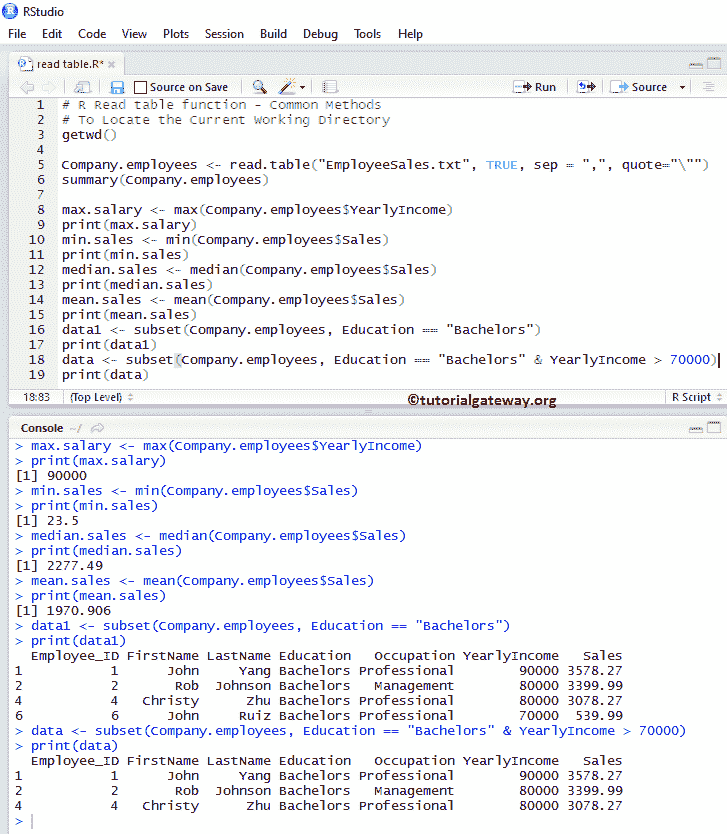

### 读文本文件中的头尾函数

R 语言中的下表函数是处理外部数据(文本文件)的非常有用的函数。如果您的文本文件有数百万条记录，并且您想要提取性能最好和最差的记录(前 10 条、后 10 条记录)，请使用这些函数。

*   head(数据框，限制):该方法返回前六个元素(如果省略限制)。如果将限制指定为 3，它将返回前三条记录。这就像选择前 20 张唱片一样。
*   尾部(数据框，限制):它返回最后六个元素(如果省略限制)。如果将限制指定为 4，则它会返回最后四条记录。这就像选择最差的 10 条记录。

```
# R Read table function - Head and Tail Functions
# To Locate the Current Working Directory
getwd()

Company.employees <- read.table("EmployeeSales.txt", TRUE, sep = ",", quote="\"")
print(Company.employees)

# No limit - It will Display Top Six Records 
head(Company.employees)

# Limit = 5 - It will Display Top Five Records
head(Company.employees, 4)

# No limit - It will Display Bottom Six Records 
tail(Company.employees)

# Limit = 4 - It will Display Bottom Four Records
tail(Company.employees)
```

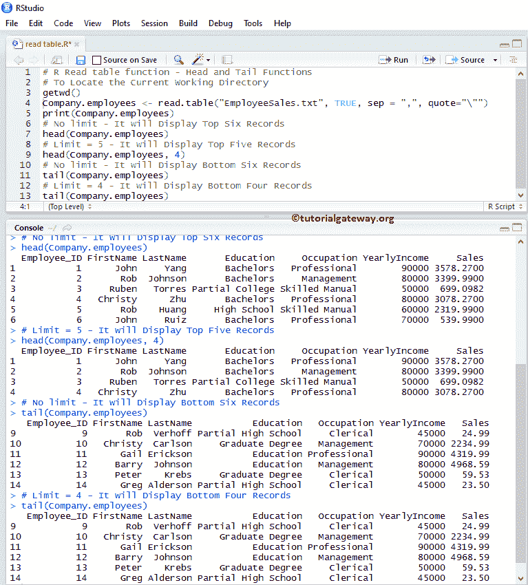

## r 读取文本文件重要函数

以下函数是在 R 语言中使用或读取文本文件时最有用的一些函数。

*   typeof:这个方法告诉你变量的类型。因为数据框是一种列表，所以这个函数返回一个列表。
*   类:这个方法告诉你文本文件中存在的数据的类。
*   名称:它返回列名。
*   length:此方法计算文本文件中的项目(列)数。
*   dim:它返回文本文件中存在的行和列的总数。
*   nrow:这个方法返回文本文件中的行数。
*   ncol:返回文本文件中的总列数。

```
# R Read table function - Important Functions
# To Locate the Current Working Directory
getwd()
Company.employees <- read.table("EmployeeSales.txt", TRUE, sep = ",", quote="\"")
print(Company.employees)

class(Company.employees)
typeof(Company.employees)
names(Company.employees)

length(Company.employees)
dim(Company.employees)
nrow(Company.employees)
ncol(Company.employees)
```

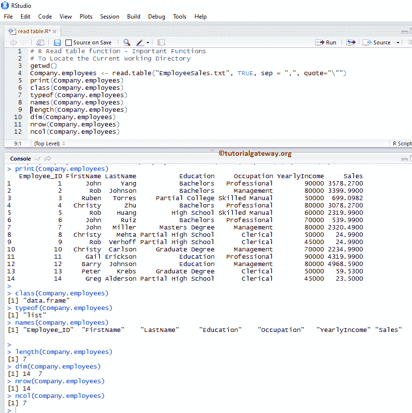

## 读表特殊函数

下面两个是 R 语言中`read.table`函数支持的非常有用的函数。在我们开始操作或插入新记录之前，检查外部数据的结构总是好的

*   汇总(数据框):返回外部数据的性质和统计汇总，如最小值、中值、平均值、中值等。
*   str(数据框):这个`read.table`函数返回文本文件中数据的结构。

```
# R Read table function - Important Functions
# To Locate the Current Working Directory
getwd()
Company.employees <- read.table("EmployeeSales.txt", TRUE, sep = ",", quote="\"")
print(Company.employees)

print(str(Company.employees))
print(summary(Company.employees))
```

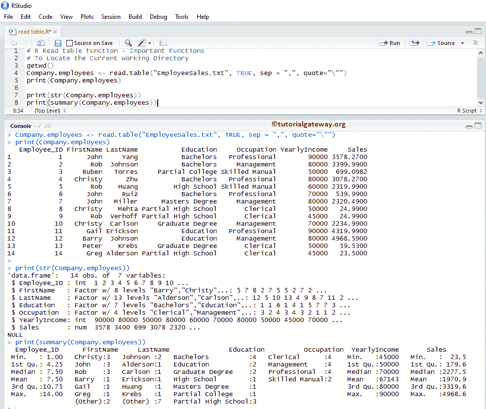