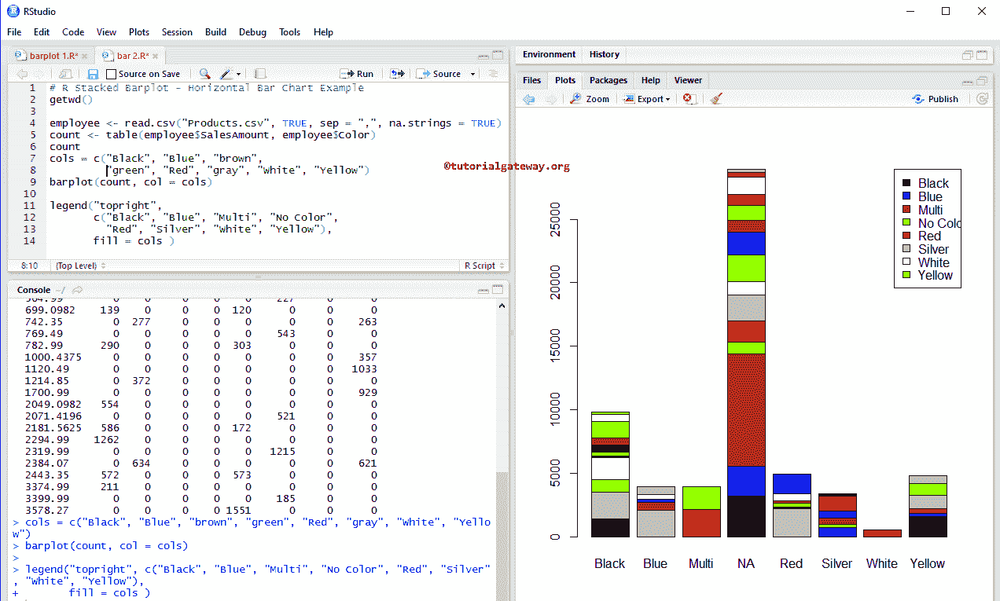

# R 语言中的条形图

> 原文：<https://www.tutorialgateway.org/barplot-in-r-programming/>

R 语言中的柱状图或条形图便于直观地比较数据。通过看这个条形图，人们可以理解，哪种产品比其他产品表现更好。例如，如果我们想比较不同产品类别、产品颜色之间的销售额，我们可以使用这个 R 条形图。

让我们通过一个例子来看看如何用 R 语言创建一个 R 条形图，格式化它的颜色，边框，添加军团，创建堆叠条形图和并列条形图。

## R Barplot 语法

在 R 语言中绘制条形图或柱状图的语法是

```
barplot(height, name.args = NULL, col = NULL, main = NULL)
```

这个条形图背后的复杂语法是:

```
barplot(height, width = 1, space = NULL, name.args = NULL, 
        legend.text = NULL, beside = FALSE, horiz = FALSE, 
        density = NULL, angle = 45, col = NULL, border = par("fg"), 
        main = NULL, sub = NULL, xlab = NULL, ylab = NULL, 
        xlim = NULL, ylim = NULL, xpd = TRUE, log = "", 
        axes = TRUE, axisnames = TRUE, cex.axis = par("cex.axis"), 
        cex.names = par("cex.axis"), inside = TRUE, plot = TRUE, 
        axis.lty = 0, offset = 0, add = FALSE, args.legend = NULL,…)
```

R 语言中的 barplot 支持很多论点。以下是实时 R 条形图中最常用的参数:

*   高度:可以指定向量或矩阵值。如果它是一个向量，则 R 条形图由一系列矩形条创建，每个条的高度取决于向量值。如果高度是一个值矩阵，并且旁边是 FALSE，则每个矩阵列代表一个条，行值创建堆叠的子条。如果旁边是真，高度是一个矩阵值，那么每个矩阵列代表并列条。
*   宽度:它是可选的，但是你可以用它来指定条形图的宽度
*   空间:请在 R 条形图的每个条之前指定您想要的左边空间量。如果高度是值的矩阵，并且旁边是 TRUE，则必须将两个值传递给 space 参数，其中第一个值提供相同组条之间的空间，第二个值是不同列(组)之间的空间
*   名称。参数:请指定要在 R 条形图中的每一个或每组条形图下方绘制的名称向量。如果我们省略这个参数，那么如果它是一个矩阵，它将从列名中获取名称，如果它是一个向量，它将获取高度的 name 属性。
*   文本:请指定用于构建条形图图例的文本向量，或指示是否要包含图例的布尔值。
*   此外:这是一个布尔参数。如果为假，则高度列被描绘为 R 中的堆叠条，如果为真，则高度列被描绘为并列条。
*   这是一个布尔参数。如果为假，则垂直绘制。如果为真，则水平绘制条形。
*   密度:请指定阴影线密度(以每英寸行数为单位)。默认情况下，它为空，这意味着没有阴影线。
*   角度:可以使用此参数指定阴影线的斜率。
*   col:请在 r 中指定要用于条形图的颜色向量。默认情况下，它使用一组 6-pascal 颜色。
*   边框:请指定要添加到边框的颜色。如果使用 border = NA，则省略边框。
*   主要:你可以为你的 R 条形图提供标题。
*   sub:你可以提供副标题(如果有的话)。
*   请指定 R 条形图 X 轴的标签
*   伊拉布:请指定 Y 轴的标签
*   这个参数可以帮助你指定 X 轴的极限
*   叶立德:这个参数可以帮助你指定条形图的 Y 轴限制
*   xpad:这是一个布尔参数。是否允许区域外的酒吧？
*   日志:您必须指定一个包含三个选项的字符串。如果 X 轴是对数的，则指定“X”，如果 Y 轴是对数的，则指定“Y”，如果 X 轴和 Y 轴都是对数的，则指定“xy”或“yx”
*   轴:这是一个布尔参数。如果为真，则绘制垂直(或水平，如果水平=真)轴。
*   axisnames:这是一个布尔参数。如果为真，并且有参数，则绘制另一个轴(ty = 0)，并在 R 条形图中标记。
*   轴:数值轴标签的扩展因子。
*   名称:标签的展开系数。
*   内部:这是一个布尔参数。如果为真，则画出分隔相邻条的线。当空间= 0 时，我们必须使用这个参数
*   情节:这是一个布尔参数。如果为假，则没有绘制任何内容
*   ty:这是一个图形参数，应用于分类轴的轴和刻度线。
*   偏移量:请指定一个向量，表示条相对于 X 轴应该移动多少
*   添加:它是一个布尔参数，默认情况下，它是 FALSE。如果为真，则向已存在的图中添加条。
*   图例:要添加到 legend()函数的参数列表。

## 在 R 中创建基本条形图

在这个例子中，我们展示了如何在 R 语言中使用[向量](https://www.tutorialgateway.org/r-vector/)创建条形图。

首先，我们声明了一个随机数向量。接下来，我们使用 R 条形图函数绘制条形图。从下面的代码片段中，您可以观察到高度取决于值。

```
values <-  c(906, 264, 689, 739, 938)

barplot(values)
```


## 使用 CSV 在 R 中创建条形图

在本例中，我们使用外部数据或 CSV 在 R 中创建了一个条形图。为此，我们使用 read.csv 函数从 CSV 文件导入数据。建议大家参考[阅读 CSV](https://www.tutorialgateway.org/r-read-csv-function/) 文章，了解 [R 语言](https://www.tutorialgateway.org/r-programming/)中 CSV 文件导入涉及的步骤。

```
getwd()

employee <- read.csv("Products.csv", TRUE, sep = ",", 
                     na.strings = TRUE)
data <- aggregate(employee$SalesAmount, 
                  by=list(employee$Color), 
                  FUN=sum)
print(data)

barplot(data$x, main = "Sales By Product Color")
```


以下语句从 CSV 文件导入数据

```
employee <- read.csv("Products.csv", TRUE, sep = ",", 
                     na.strings = TRUE)
```

从下面的代码片段中，可以看到我们使用了聚合函数来查找每种颜色的总销售额。或者我们可以说按产品颜色分组的销售金额总和。

```
data <- aggregate(employee$SalesAmount, 
                  by=list(employee$Color), 
                  FUN=sum)
```

上面的语句将输出作为列表返回。因此，我们使用$从[列表](https://www.tutorialgateway.org/r-list/)中提取汇总数据(销售金额的总和)。

```
barplot(data$x, main = "Sales By Product Color")
```

### 在 R 语言中给条形图命名

在本例中，我们使用 main、xlab、ylab 和 name 为 R 条形图、X 轴、Y 轴和单个条形图指定名称

```
# Assign Names to X, Y Axis Example
getwd()

employee <- read.csv("Products.csv", TRUE, sep = ",", 
                     na.strings = TRUE)
output <- aggregate(employee$SalesAmount, 
                  by=list(employee$Color), 
                  FUN=sum)
print(output)

barplot(output$x, 
        main = "Sales By Product Color",
        xlab = "Product Colors",
        ylab = "Sales",
        names = output$Group.1)
```


### 改变条形图的颜色

在本例中，我们使用 col 参数更改 R 条形图颜色，并使用 R 中的边框参数更改边框颜色

```
# Changing Colors of lines and Borders Example
getwd()

employee <- read.csv("Products.csv", TRUE, sep = ",", 
                     na.strings = TRUE)
output <- aggregate(employee$SalesAmount, 
                  by=list(employee$Color), 
                  FUN=sum)
print(output)

barplot(output$x, 
        main = "Sales By Product Color",
        xlab = "Product Colors",
        ylab = "Sales",
        names = output$Group.1,
        col = "chocolate",
        border = "red")
```


提示:指定不同的边框颜色来使用颜色矢量。例如，border = c(“红色”、“黑色”、“绿色”、…)

### R 语言中的水平条形图

在本例中，我们使用 R 语言中的 horiz 参数将默认的竖线更改为横条图。我们还使用 R 条形图中的密度参数来更改条形密度。

```
getwd()

employee <- read.csv("Products.csv", TRUE, sep = ",", 
                     na.strings = TRUE)
output <- aggregate(employee$SalesAmount, 
                  by=list(employee$Color), 
                  FUN=sum)
print(output)

barplot(output$x, 
        main = "Sales By Product Color",
        xlab = "Product Colors",
        ylab = "Sales",
        names = output$Group.1,
        col = "chocolate",
        horiz = TRUE,
        density = 80,
        border = "red")
```


## 在 R 语言中创建堆叠条形图

让我们看看如何在 R 中创建堆叠条形图，以及如何使用图例功能将图例添加到条形图中

下面的 count 语句创建一个记录了销售额和颜色的表。这里，列值是唯一的颜色，行值是唯一的销售额。

接下来，我们使用上面指定的表在 R 中创建一个堆叠条形图。

```
getwd()

employee <- read.csv("Products.csv", TRUE, sep = ",", na.strings = TRUE)
count <- table(employee$SalesAmount, employee$Color)
count
cols = c("Black", "Blue", "brown", 
         "green", "Red", "gray", "White", "Yellow")
barplot(count, col = cols)

legend("topright", 
       c("Black", "Blue", "Multi", "No Color", 
         "Red", "Silver", "White", "Yellow"), 
       fill = cols )
```



## 在 R 语言中创建并列条形图

在这个例子中，我们使用旁参数用 R 语言创建了一个并列条形图

```
# Juxtaposed Example
getwd()

employee <- read.csv("Products.csv", TRUE, sep = ","
                     , na.strings = TRUE)
count <- table(employee$SalesAmount, employee$Color)
count
cols = c("Black", "Blue", "brown", 
         "green", "Red", "gray", "White", "Yellow")
barplot(count, col = cols, beside = TRUE)

legend("topright", 
       c("Black", "Blue", "Multi", "No Color", 
         "Red", "Silver", "White", "Yellow"), 
       fill = cols )
```


## 在 R 语言中使用矩阵创建条形图

在本例中，我们使用[矩阵](https://www.tutorialgateway.org/r-matrix/)值创建一个 R 条形图。

```
# Create using Matrix Example

vec <- c(4, 9, 11, 12, 17, 6, 9, 23, 2, 15, 1, 8 ) 
values <-  matrix(vec, nrow = 3, ncol = 4)
values
barplot(values, col = c("brown", "chocolate", "yellow"))
```

