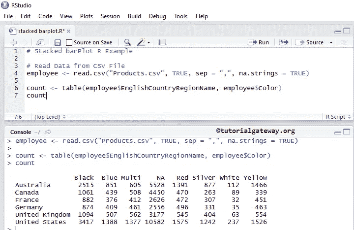
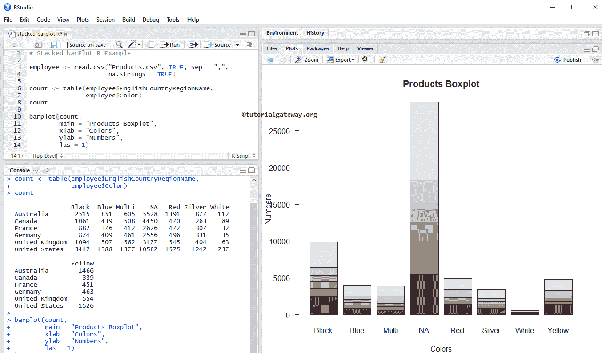
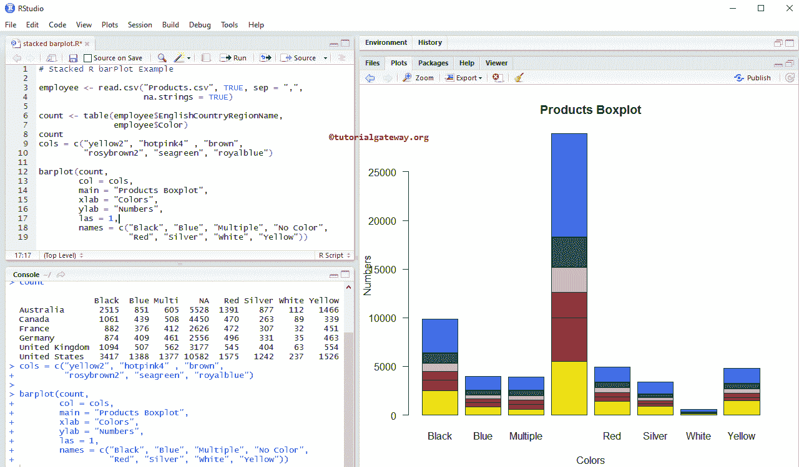
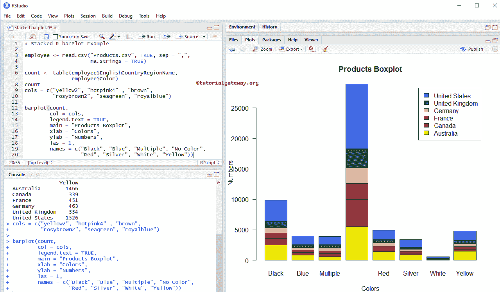
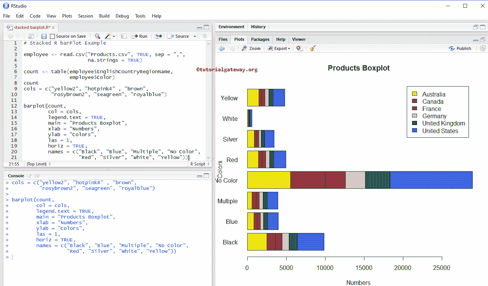
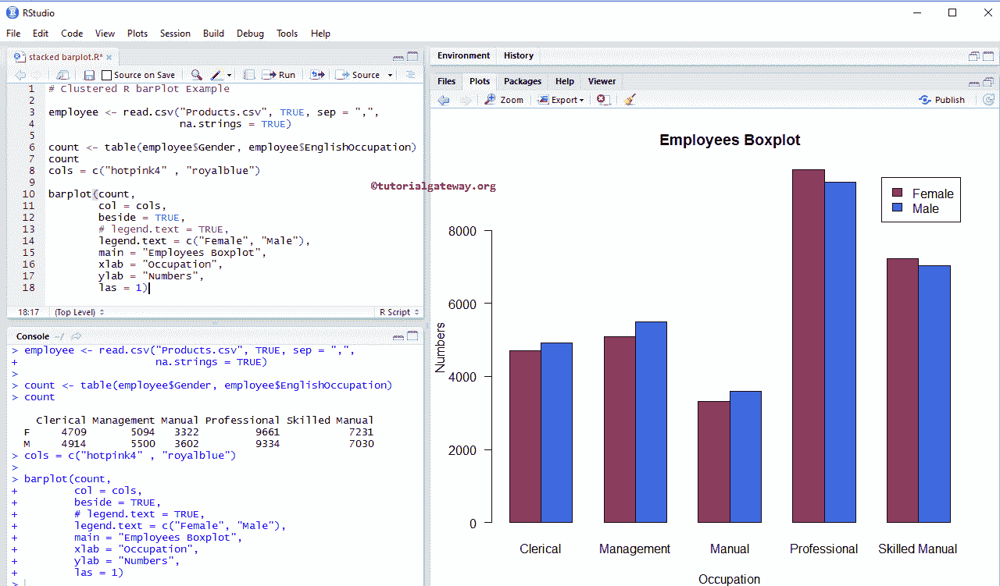

# R 中的堆叠条形图

> 原文：<https://www.tutorialgateway.org/stacked-barplot-in-r/>

R 编程中的堆叠条形图在直观地比较数据方面非常有用。让我们通过一个例子来看看如何在 R 中创建一个堆叠条形图，格式化它的颜色，添加图例，添加名称，在 R 编程语言中创建集群条形图。

在我们进入 R 堆叠条形图示例之前，让我们看看我们将用于此条形图示例的数据。员工是我们在之前文章中使用的日期设置。



## 在 R 编程中创建堆叠条形图

在本例中，我们展示了如何使用外部数据在 R 中创建堆叠条形图。对于本例，我们使用 read.csv 函数从 CSV 文件导入数据。建议大家参考 [R Read CSV](https://www.tutorialgateway.org/r-read-csv-function/) 文章，了解 CSV 文件导入涉及的步骤。也可以参考 R 编程中的[条形图一文。](https://www.tutorialgateway.org/barplot-in-r-programming/)

```
# Stacked barPlot R Example 

# Read Data from CSV File
employee <- read.csv("Products.csv", TRUE, sep = ",", na.strings = TRUE)

count <- table(employee$EnglishCountryRegionName, employee$Color)
count

barplot(count)
```


下面的 [R Programming](https://www.tutorialgateway.org/r-programming/) 语句创建了一个包含国家和颜色记录的表。这里，列值是唯一的颜色，行值是唯一的国家名称。

```
count <- table(employee$EnglishCountryRegionName, employee$Color)
```

接下来，我们使用上面指定的表创建一个条形图。

```
barplot(count)
```

### 在 R 程序设计中给堆叠条形图命名

在本例中，我们使用 main、xlab 和 ylab 为 R 轴、X 轴和 Y 轴中的堆叠条形图指定名称

*   主要:你可以改变，或者为你的堆叠条形图提供标题。
*   请指定 X 轴的标签
*   伊拉布:请指定 Y 轴的标签
*   las:用于更改 Y 轴值的方向

```
# Stacked R barPlot Example 

employee <- read.csv("Products.csv", TRUE, sep = ",", 
                     na.strings = TRUE)

count <- table(employee$EnglishCountryRegionName, 
               employee$Color)
count

barplot(count,
        main = "Products Boxplot",
        xlab = "Colors",
        ylab = "Numbers",
        las = 1)
```



在本例中，我们使用 col 参数更改堆叠条形图的颜色

*   上校:请指定你想在条形图中使用的颜色。这里，颜色由国家名称区分。在控制台中键入 colors()以获取 R 编程中可用的颜色列表。
*   名称:请指定堆叠的名称。在这里，我们正在改变名字。

```
# Stacked R barPlot Example 

employee <- read.csv("Products.csv", TRUE, sep = ",", 
                     na.strings = TRUE)

count <- table(employee$EnglishCountryRegionName, employee$Color)
count
cols = c("yellow2", "hotpink4" , "brown", 
         "rosybrown2", "seagreen", "royalblue")

barplot(count,
        col = cols,
        main = "Products Boxplot",
        xlab = "Colors",
        ylab = "Numbers",
        las = 1,
        names = c("Black", "Blue", "Multiple", "No Color", 
                  "Red", "Silver", "White", "Yellow"))
```



### 将图例添加到 R 中的堆叠条形图

在本例中，我们使用 legend.text 参数将图例添加到 R 编程中的堆叠条形图中。

*   如果指定图例。文本=真，则自动分配图例值，或者
*   您可以使用字符向量作为图例值。例如，legend.text = c(“黑色”、“蓝色”、“绿色”，..)

```
# Stacked R barPlot Example 

employee <- read.csv("Products.csv", TRUE, sep = ",", 
                     na.strings = TRUE)

count <- table(employee$EnglishCountryRegionName, employee$Color)
count
cols = c("yellow2", "hotpink4" , "brown", 
         "rosybrown2", "seagreen", "royalblue")

barplot(count,
        col = cols,
        legend.text = TRUE,
        main = "Products Boxplot",
        xlab = "Colors",
        ylab = "Numbers",
        las = 1,
        names = c("Black", "Blue", "Multiple", "No Color", 
                  "Red", "Silver", "White", "Yellow"))
```



### R 程序设计中的水平堆积条形图

在本例中，我们使用 horiz 参数将 R 中默认的垂直堆叠条形图转换为水平条形图

```
# Stacked R barPlot Example 

employee <- read.csv("Products.csv", TRUE, sep = ",", 
                     na.strings = TRUE)

count <- table(employee$EnglishCountryRegionName, 
               employee$Color)
count
cols = c("yellow2", "hotpink4" , "brown", 
         "rosybrown2", "seagreen", "royalblue")

barplot(count,
        col = cols,
        legend.text = TRUE,
        main = "Products Boxplot",
        xlab = "Numbers",
        ylab = "Colors",
        las = 1,
        horiz = TRUE,
        names = c("Black", "Blue", "Multiple", "No Color", 
                  "Red", "Silver", "White", "Yellow"))
```



## 在 R 编程中创建聚集条形图

在这个例子中，我们使用旁参数用 R 编程语言创建了一个聚集条形图

```
# Clustered R barPlot Example 

employee <- read.csv("Products.csv", TRUE, sep = ",", 
                     na.strings = TRUE)

count <- table(employee$Gender, employee$EnglishOccupation)
count
cols = c("hotpink4" , "royalblue")

barplot(count,
        col = cols,
        beside = TRUE,
        # legend.text = TRUE,
        legend.text = c("Female", "Male"),
        main = "Employees Boxplot",
        xlab = "Occupation",
        ylab = "Numbers",
        las = 1)
```

