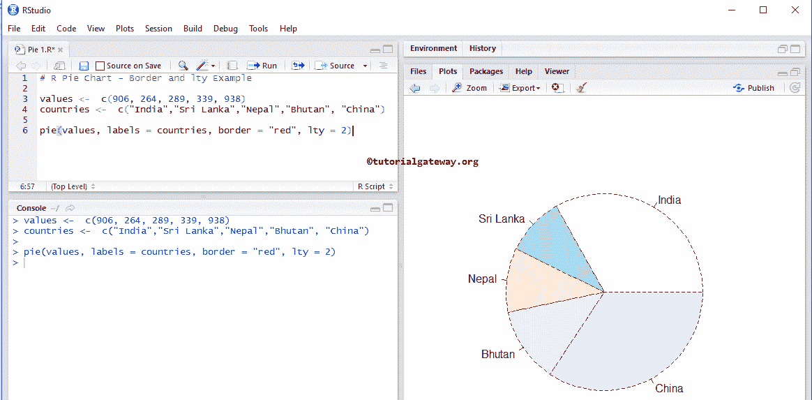

# R 程序设计中的饼图

> 原文：<https://www.tutorialgateway.org/pie-chart-in-r-programming/>

R 中的饼图对于显示地区销售、全国客户、按国家销售等非常有用。让我用例子展示如何用 R 编程语言创建一个饼图，格式化它的颜色，边框，添加军团，以及创建一个三维饼图。

## 饼图语法

R 编程中绘制饼图的语法是

```
pie(x, labels = names(x), col = NULL, main = NULL)
```

这背后的复杂语法是:

```
pie(x, labels = names(x), edges = 200, radius = 0.8, clockwise = FALSE, 
     init.angle = if(clockwise) 90 else 0, density = NULL, angle = 45, 
     col = NULL, border = NULL, lty = NULL, main = NULL, ..)
```

R 编程语言中的饼图支持许多参数，以下是实时中最常用的参数:

*   x:请指定一个非负数值的向量。它决定每个切片的大小。
*   标签:这个参数帮助我们将名称传递给每个切片。
*   边:此参数接受的数值改变了饼图的外圈。我们强烈建议将该值保留为默认值 200。
*   半径:这是圆的半径，其值在-1 和 1 之间
*   顺时针:它是一个布尔值，指示切片是顺时针方向绘制还是逆时针方向绘制。默认情况下，它是逆时针的
*   init.angle:这个参数可以帮助您指定切片的起始角度(以度为单位)。默认情况下，它为 0。如果顺时针方向为真。那么初始角度变成 90 度。
*   密度:请指定阴影线密度(以每英寸行数为单位)。默认情况下，它为空，这意味着没有阴影线。
*   角度:可以使用此参数指定阴影线的斜率。
*   请指定你想要使用的颜色矢量。默认情况下，它使用一组 6 种帕斯卡颜色。
*   border，ty:这个参数(可能是向量)被传递给多边形，它绘制多边形的每个切片。
*   主要:你可以提供标题。

## 创建基本的饼图

在这个例子中，我们展示了如何使用[向量](https://www.tutorialgateway.org/r-vector/)来创建它

首先，我们声明了一个随机数向量和另一个随机国家向量。

接下来，我们使用饼图绘制图表。从下面的代码片段中，您可以观察到切片大小取决于值。

```
values <-  c(906, 264, 289, 339, 938)
countries <-  c("India","Sri Lanka","Nepal","Bhutan", "China")

pie(values, labels = countries)
```


### 在 R 程序设计中改变饼图的边框和宽度

在这个例子中，我们展示了如何使用边框和长度参数来改变边框颜色和线条样式。

```
#  Border and lty Example

values <-  c(906, 264, 289, 339, 938)
countries <-  c("India","Sri Lanka","Nepal","Bhutan", "China")

pie(values, labels = countries, border = "red", lty = 2)
```



提示:要分配不同的边框颜色，我们使用颜色向量。例如，border = c(“红色”、“绿色”、“黑色”…)

## 在 R 程序设计中创建饼图

我们使用外部数据创建一个饼图。为此，我们使用 read.csv 函数从 CSV 文件中导入数据。建议大家参考 [R Read CSV](https://www.tutorialgateway.org/r-read-csv-function/) 文章，了解 [R 编程](https://www.tutorialgateway.org/r-programming/)中 CSV 文件导入涉及的步骤。

从下面的代码片段中，您可以看到我们使用了聚合函数来查找每个国家的总销售额。或者我们可以说按国家分组的销售金额总和。该语句以列表形式返回输出。

因此，我们使用$从[列表](https://www.tutorialgateway.org/r-list/)中提取数据

```
getwd()

employee <- read.csv("Products.csv", TRUE, sep = ",")
data <- aggregate(employee$SalesAmount, 
                  by=list(employee$EnglishCountryRegionName), FUN=sum)
print(data)

pie(data$x, data$Group.1)
```


### 更改 R 中饼图的颜色

在本例中，我们使用 col 参数更改切片颜色

```
# Changing Colors Example
getwd()

employee <- read.csv("Products.csv", TRUE, sep = ",")
data <- aggregate(employee$SalesAmount, 
                  by=list(employee$EnglishCountryRegionName), FUN=sum)
print(data)

pie(data$x, data$Group.1, col = rainbow(length(data$x)))
```


### 更改饼图的切片方向和名称

我们使用顺时针参数更改 R 饼图切片方向，并使用主参数分配标题/名称。

```
# Changing Slic Direction & Assigning Name
getwd()

employee <- read.csv("Products.csv", TRUE, sep = ",")
data <- aggregate(employee$SalesAmount, 
                  by=list(employee$EnglishCountryRegionName), FUN=sum)
print(data)

pie(data$x, data$Group.1, col = rainbow(length(data$x)),
    clockwise = TRUE, main = "Sales By COuntry")
```


### 添加图例

这里，我们使用图例功能向 R 饼图添加图例

```
# Adding Legend & Custom Colors
getwd()

employee <- read.csv("Products.csv", TRUE, sep = ",")
data <- aggregate(employee$SalesAmount, 
                  by=list(employee$EnglishCountryRegionName), FUN=sum)
print(data)
cols = c("red", "orange", "grey", "white", "black", "yellow")

pie(data$x, data$Group.1, col = cols,  main = "Sales By COuntry")

legend("topright", c("Australia","Canada","France",
                     "Germany", "United Kingdom", "United States"), 
       cex = 0.8, fill = cols)

```


### 更改饼图切片的密度

我们使用 R 饼图的密度参数来改变切片密度。

```
# Changing the Density
getwd()

employee <- read.csv("Products.csv", TRUE, sep = ",")
data <- aggregate(employee$SalesAmount, 
                  by=list(employee$EnglishCountryRegionName), FUN=sum)
print(data)
cols = c("red", "orange", "grey", "blue", "black", "yellow")

pie(data$x, data$Group.1, col = cols,  density = 50, 
    main = "Sales By Country")

legend("topright", c("Australia","Canada","France",
                     "Germany", "United Kingdom", "United States"), 
       cex = 0.7, fill = cols)
```


## R 编程中的三维饼图

让我们看看如何在 R 编程中创建一个三维饼图。要绘制三维饼图，我们需要一个 pie3D 函数，要使用这个函数，我们必须给我们的 [R Studio](https://www.tutorialgateway.org/download-r-studio-and-install/) 添加一个 plotrix 库(包)。

```
# 3D Example

employee <- read.csv("Products.csv", TRUE, sep = ",")
data <- aggregate(employee$SalesAmount, 
                  by=list(employee$EnglishCountryRegionName), FUN=sum)
print(data)

pie3D(data$x,labels = data$Group.1, explode = 0.1, 
      main = "3D Pie Chart in R ")
```

