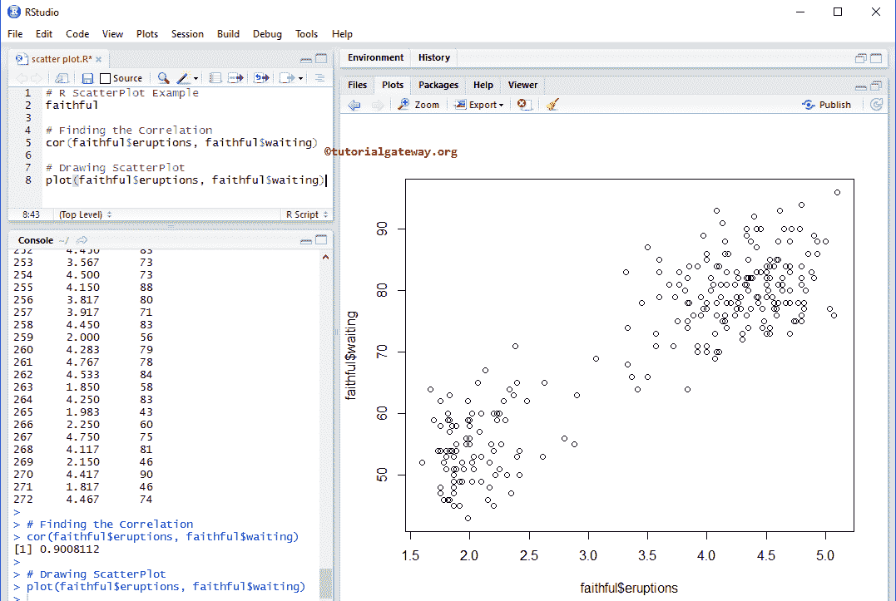
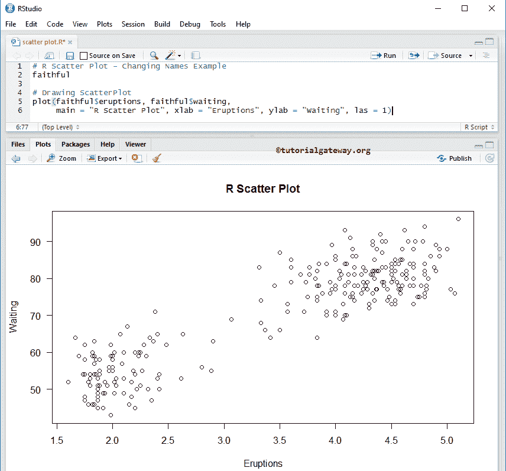
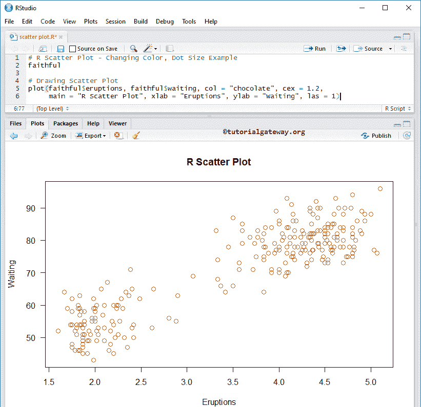
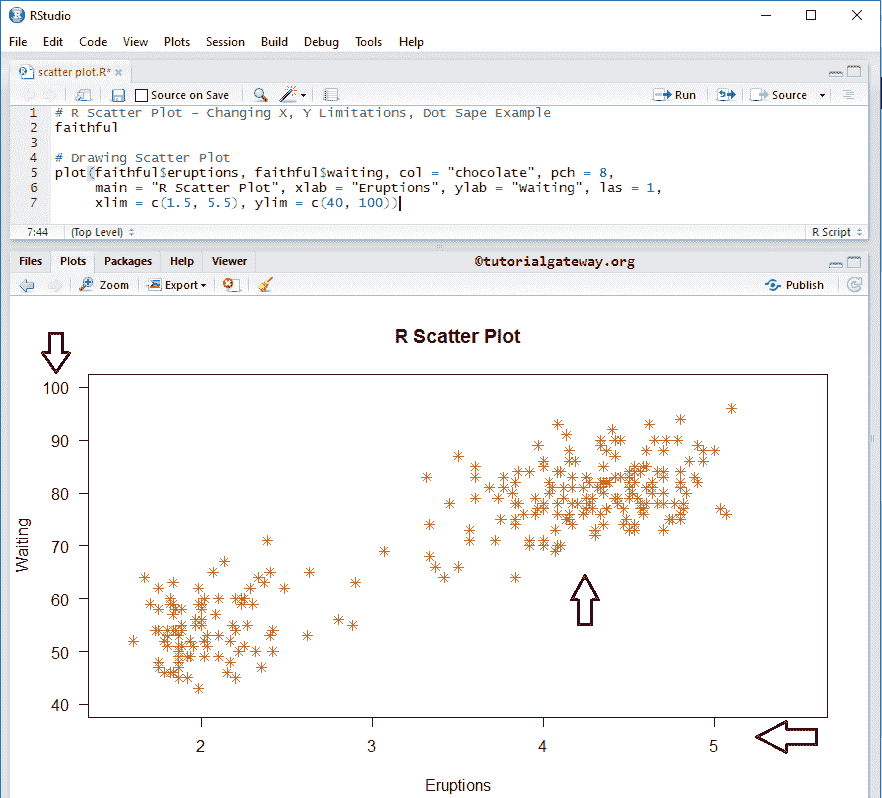
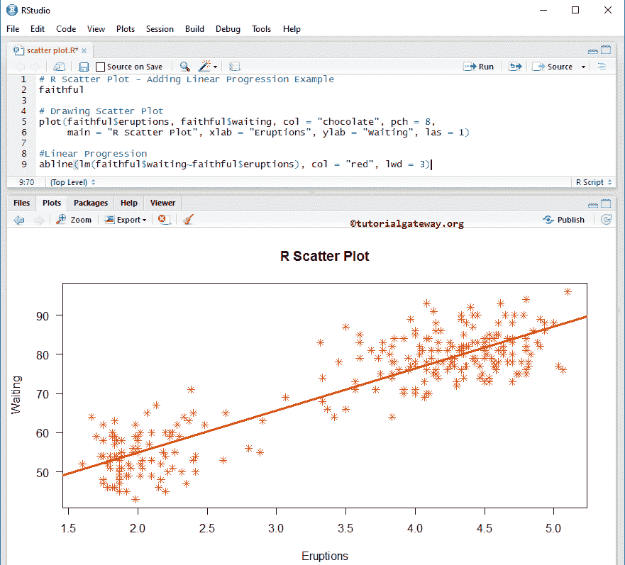

# R 程序设计中的散点图

> 原文：<https://www.tutorialgateway.org/scatter-plot-in-r-programming/>

R 编程中的散点图对于可视化两组数据之间的关系非常有用。R 散点图将数据显示为点的集合，显示了这两个数据集之间的线性关系。

R 中的散点图也称为散点图、曲线图、图表或克。例如，如果我们想要可视化年龄与体重的关系，那么我们可以使用散点图。让我们看看如何在 R 中创建散点图，格式化它的颜色，形状。接下来，用 R 编程语言添加线性级数到散点图，并举例说明。

## R 语法中的散点图

R 编程中绘制散点图的语法如下所示

```
plot(x, y = NULL, xlim = NULL, ylim = NULL, main = NULL)
```

这张散点图背后的复杂语法是:

```
plot(x, y = NULL, type = "p", xlim = NULL, ylim = NULL, log = "", 
     main = NULL, sub = NULL, xlab = NULL, ylab = NULL, 
     ann = par("ann"), axes = TRUE, frame.plot = axes, 
     panel.first = NULL, panel.last = NULL, asp = NA,..)
```

R 编程语言中的散点图支持许多参数，以下是一些实时参数:

*   x，y:请指定要比较的数据集。在这里，您可以使用两个单独的向量或矩阵与列或列表。
*   类型:请指定要绘制的类型。
    *   要绘制点，请使用 type = "p "。
    *   要绘制线条，请使用 type = "l "。
    *   直方图使用 type = "h "
    *   楼梯台阶使用 type = "s "
    *   要绘制过度绘图，请使用 type = "o "
*   sub:您可以为散点图提供副标题(如果有)。
*   日志:您必须指定一个包含三个选项的字符串。如果 X 轴是对数的，则指定“X”，如果 Y 轴是对数的，则指定“Y”，如果 X 轴和 Y 轴都是对数的，则指定“xy”或“yx”
*   轴:这是一个布尔参数。如果为真，则为散点图绘制的轴为 r
*   frame.plot:这是一个布尔参数，用于指定是否应该围绕绘图绘制一个框。
*   panel.first:请指定在绘制轴之后但在绘制点之前评估的表达式。
*   panel.last:请指定在绘制点后计算的表达式。
*   asp:请指定图的长宽比(如 y/x)。

## 如何在 R 程序设计中创建散点图

在本例中，我们展示了如何使用忠实数据集在 R 中创建散点图，该数据集由 [R Studio](https://www.tutorialgateway.org/download-r-studio-and-install/) 提供。如果您需要从外部文件导入数据，请参考 [R Read CSV](https://www.tutorialgateway.org/r-read-csv-function/) 一文，了解 [R Programming](https://www.tutorialgateway.org/r-programming/) 中 CSV 文件导入的相关步骤。

下面的 for 语句找到了爆发和等待之间的关联。从这段代码中，可靠的数据集将以列表的形式返回输出。

因此，我们使用$从[列表](https://www.tutorialgateway.org/r-list/)中提取数据。

```
# Example
faithful

# Finding the Correlation
cor(faithful$eruptions, faithful$waiting)

# Drawing
plot(faithful$eruptions, faithful$waiting)
```



### 为散点图指定名称

在本例中，我们使用 main、xlab 和 ylab 为散点图 X 轴、Y 轴和单个条分配名称。

*   主要:您可以为创建的散点图提供标题。
*   请指定 X 轴的标签
*   伊拉布:请指定 Y 轴的标签
*   las:用于更改 Y 轴值方向。

```
# Changing Names Example
faithful

# Drawing 
plot(faithful$eruptions, faithful$waiting,
     main = "R Scatter Plot",
     xlab = "Eruptions",
     ylab = "Waiting",
     las = 1)
```



### 改变 r 中散点图的颜色

在这个 R 散点图示例中，我们使用 col 参数更改散点图颜色，使用 cex 参数更改代表点的字符大小。

*   col:请指定您想要使用的颜色。
*   请指定点的大小。

```
# Changing Color, Dot Size Example
faithful

plot(faithful$eruptions, faithful$waiting, 
     col = "chocolate", 
     cex = 1.2, 
     main = "R Scatter Plot", 
     xlab = "Eruptions", 
     ylab = "Waiting", 
     las = 1)
```



### 更改散点图的形状和轴限制

在本例中，我们使用 pch 参数更改形状。

*   这个参数可以帮助你指定 X 轴的极限
*   叶立德:这个参数可以帮助你指定 Y 轴的限制

```
# Changing X, Y Limitations, Dot Shape Example
faithful

plot(faithful$eruptions, faithful$waiting, 
     col = "chocolate", 
     pch = 8, 
     main = "R Scatter Plot", 
     xlab = "Eruptions", 
     ylab = "Waiting", 
     las = 1,
     xlim = c(1.5, 5.5), 
     ylim = c(40, 100))
```



## 向 R 中的散点图添加线性级数

在本例中，我们找到了两个数据集的线性级数，并使用 abline 函数将它们添加到散点图中。

```
# Adding Linear Progression Example
faithful

plot(faithful$eruptions, faithful$waiting, col = "chocolate", pch = 8, 
     main = "R Scatter Plot", xlab = "Eruptions", ylab = "Waiting", las = 1)

#Linear Progression
abline(lm(faithful$waiting~faithful$eruptions), col = "red", lwd = 3)
```



下面的语句创建了一个记录了销售额和颜色的表。这里，列值是唯一的颜色，行值是唯一的销售额。

```
count <- table(employee$SalesAmount, employee$Color)
```

接下来，我们添加一条线，这条线代表线性级数。

```
abline(lm(faithful$waiting~faithful$eruptions), col = "red", lwd = 3)
```

提示:lwd 参数改变线条的宽度