# R 语言中的直方图

> 原文：<https://www.tutorialgateway.org/histogram-in-r-programming/>

R 语言中的直方图对于可视化组织在用户指定的箱(范围或断点)中的统计信息非常有用。虽然看起来像条形图，但 R 中的直方图以相等的间隔显示数据。

让我们看看如何在 R 中创建直方图，删除它的轴，格式化它的颜色，添加标签，添加密度曲线，并通过例子在 R 语言中制作多个直方图。

## 用 R 语法创建直方图

在 R 语言中创建直方图的语法是

```
hist(x, col = NULL, main = NULL, xlab = xname, ylab)
```

用 r 制作直方图背后的复杂语法是:

```
hist(x, breaks = "Sturges", freq = NULL, probability = !freq,
     xlim = range(breaks), ylim = NULL, col = NULL, angle = 45,
     include.lowest = TRUE, right = TRUE, density = NULL, 
     main = NULL, xlab = xname, ylab, border = NULL,  
     axes = TRUE, plot = TRUE, labels = FALSE, 
     nclass = NULL, warn.unused = TRUE,..)
```

在我们进入示例之前，让我们看一下我们将用于直方图示例的数据。空气质量是由 R


提供的日期设置

## R 语言中直方图的返回值

一般来说，在我们开始创建它之前，让我们看看数据是如何被历史分割的。

R 中的直方图返回频率(计数)、密度、仓宽(断点)值和图形类型。在这个例子中，我们展示了如何获取相同的信息

```
airquality

return_Value <- hist(airquality$Temp)
return_Value
```

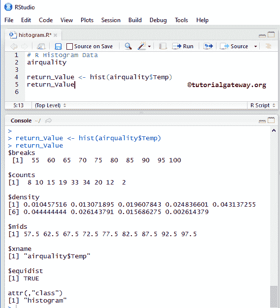

## 在 R 语言中创建直方图

在本例中，我们使用空气质量数据集在 R 中创建直方图，该数据集由 [RStudio](https://www.tutorialgateway.org/download-r-studio-and-install/) 提供。如果您需要从外部文件导入数据，那么我建议您参考 [R Read CSV](https://www.tutorialgateway.org/r-read-csv-function/) 文章了解 CSV 文件导入。并参考 [R 语言](https://www.tutorialgateway.org/r-programming/)中的[条形图](https://www.tutorialgateway.org/barplot-in-r-programming/)文章。

```
airquality

hist(airquality$Temp)
```

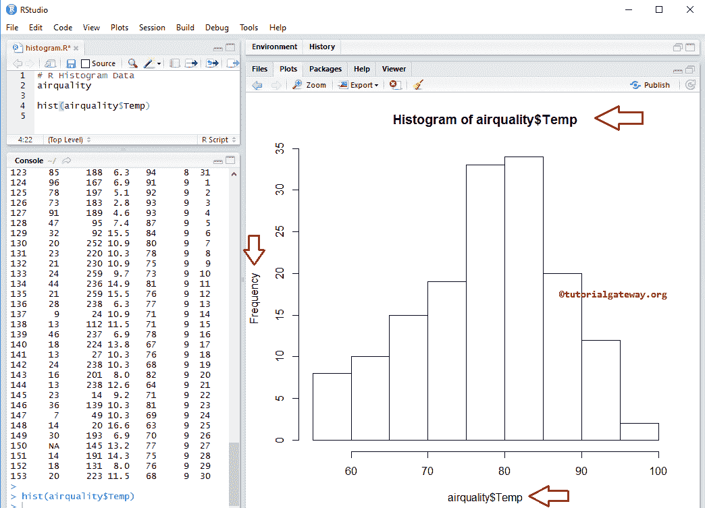

空气质量数据集以列表形式返回输出。因此，我们使用$从[列表](https://www.tutorialgateway.org/r-list/)中提取数据。

```
hist(airquality$Temp)
```

### 在 R 语言中给直方图命名

在本例中，我们使用 main、xlab 和 ylab 来分配名称、X 轴和 Y 轴

*   主要:您可以更改或提供标题。
*   请指定 X 轴的标签
*   伊拉布:请指定 Y 轴的标签
*   las:用于更改 Y 轴值的方向

```
# Changing Axis Names
airquality

hist(airquality$Temp,
     main = "Temperature Histogram",
     xlab = "Temperature",
     ylab = "Temperature Frequency",
     las = 1
     )
```

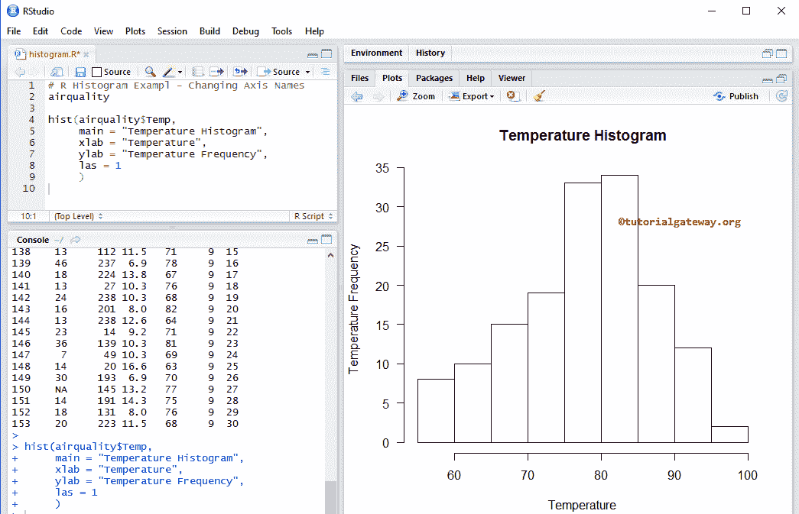

### 改变直方图的颜色

在本例中，我们使用 col 参数更改颜色

*   col:请指定您想要用于历史图表的颜色。在控制台中键入 colors()以获取 R 语言中可用的颜色列表

```
# Changing Colors
airquality

hist(airquality$Temp,
     main = "Temperature Histogram",
     xlab = "Temperature",
     ylab = "Temperature Frequency",
     las = 1,
     col = c("skyblue", "chocolate2")
     )
```

从上面的代码片段中，您可以看到我们为 col 参数使用了两种颜色。这意味着这两种颜色一直重复到小节结束。

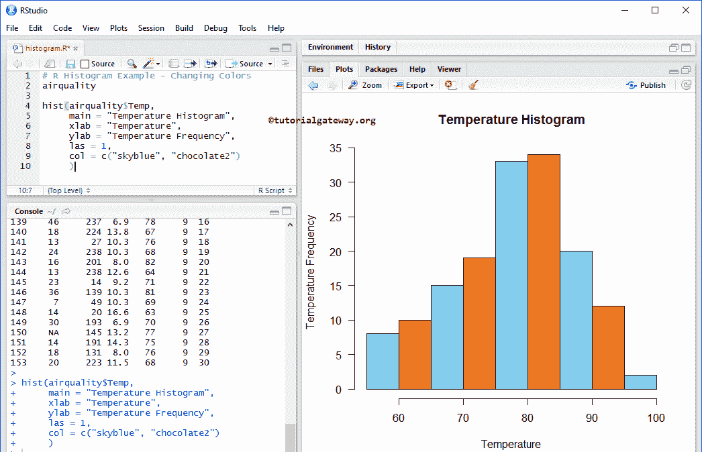

### 在 Rstudio 中移除轴并向直方图添加标签

在本例中，我们删除了 X 轴、Y 轴，以及如何使用轴、人工神经网络和标签参数为 rstudio 直方图中的每个条分配标签。

*   轴:这是一个布尔参数。如果为真，则绘制轴。
*   标签:这是一个布尔参数。如果为真，则返回每个条形顶部的值。
*   安:这是布尔论证。如果为假，则从绘图区域中移除注释，包括名称“轴名称”。

```
# Removing Axis Labels
airquality

return_Value <- hist(airquality$Temp)
return_Value

hist(airquality$Temp,
     axes = FALSE,
     ann = FALSE,
     labels = TRUE,
     ylim = c(0, 35),
     col = c("skyblue", "chocolate2")
     )
```

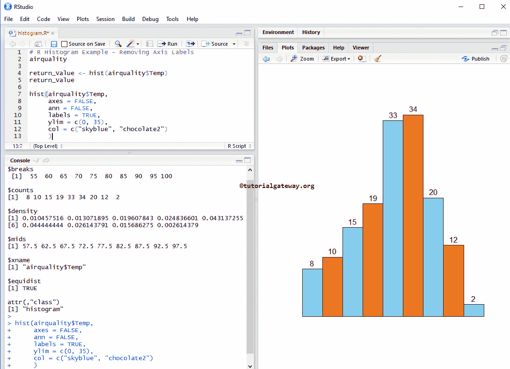

### 在 Rstudio 中更改直方图的轴限制

让我们更改默认轴值，并使用密度参数更改条形密度。他们。是密度、xlim 和 ylim。

*   这个参数可以帮助你指定 X 轴的极限
*   叶立德:这个参数可以帮助你指定 Y 轴的限制。在本例中，我们将默认 y 轴值(0，35)更改为(0，40)
*   密度:请指定阴影线密度(以每英寸行数为单位)。默认情况下，它为空，表示没有阴影线。

```
# Changing Axis Values
airquality

return_Value <- hist(airquality$Temp)
return_Value

hist(airquality$Temp,
     main = "Temperature Histogram",
     xlab = "Temperature",
     ylab = "Temperature Frequency",
     las = 1,
     col = c("skyblue", "chocolate2"),
     xlim = c(55, 100),
     ylim = c(0, 40), 
     density = 80
     )
```

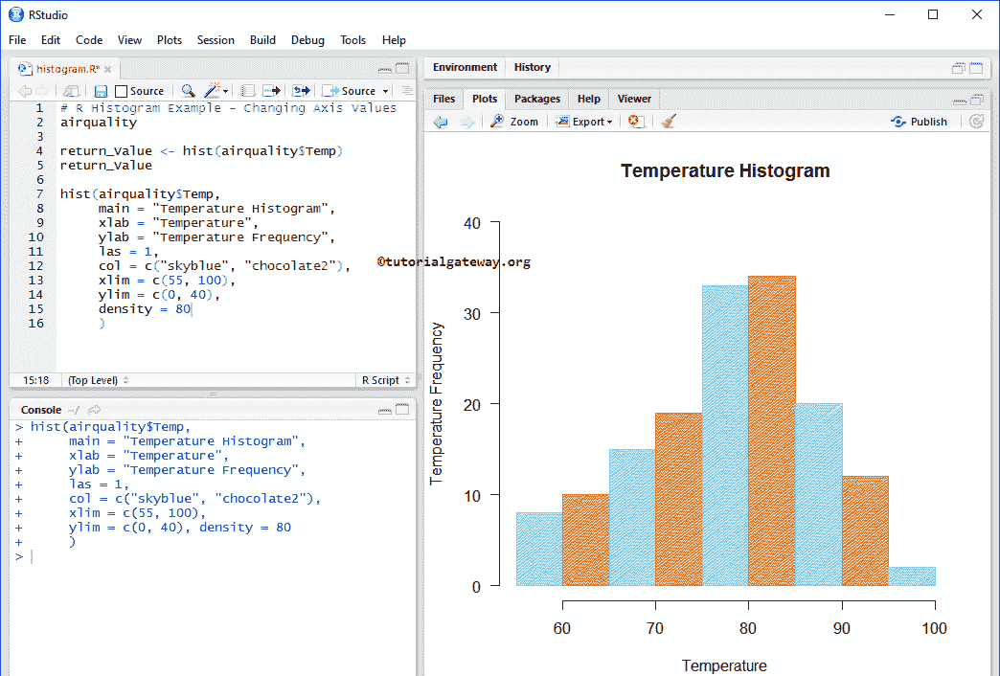

### 更改直方图的箱

让我们看看如何使用 breaks 参数改变 R 直方图的 Bin 大小。

*   您可以使用值向量来指定单元格之间的断点。
*   您可以使用一个数字来指定它必须返回的单元格数。例如，breaks = 20 表示返回 20 个小节。
*   您可以使用返回断点向量的函数。

```
# Changing Bin width
airquality

return_Value <- hist(airquality$Temp)
return_Value

hist(airquality$Temp,
     breaks = 20,
     main = "Temperature Histogram",
     xlab = "Temperature",
     ylab = "Temperature Frequency",
     las = 1,
     col = c("skyblue", "chocolate2"),
     labels = TRUE,
     ylim = c(0, 25)
     )
```

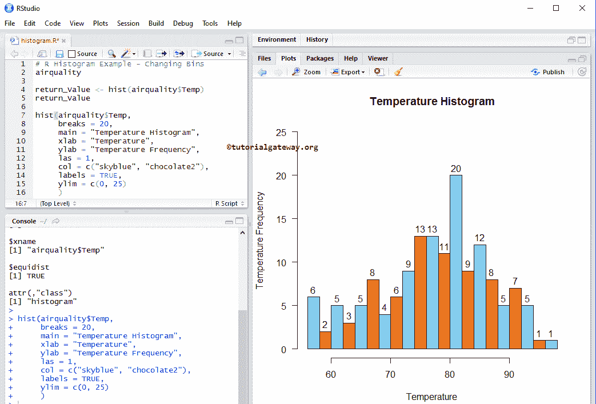

## 创建具有密度的直方图

频率计数并给出每个仓的数据点数量。在实时中，我们对密度比对基于频率的密度更感兴趣，因为密度可以给出概率密度。

在这个例子中，我们针对密度创建了一个 this，为了达到同样的效果，我们将 freq 参数设置为 FALSE。

```
# Density Values
airquality

return_Value <- hist(airquality$Temp)
return_Value

hist(airquality$Temp,
     freq = FALSE,
     main = "Temperature Histogram",
     xlab = "Temperature",
     ylab = "Temperature Density",
     las = 1,
     col = c("skyblue", "chocolate2")
     )
```

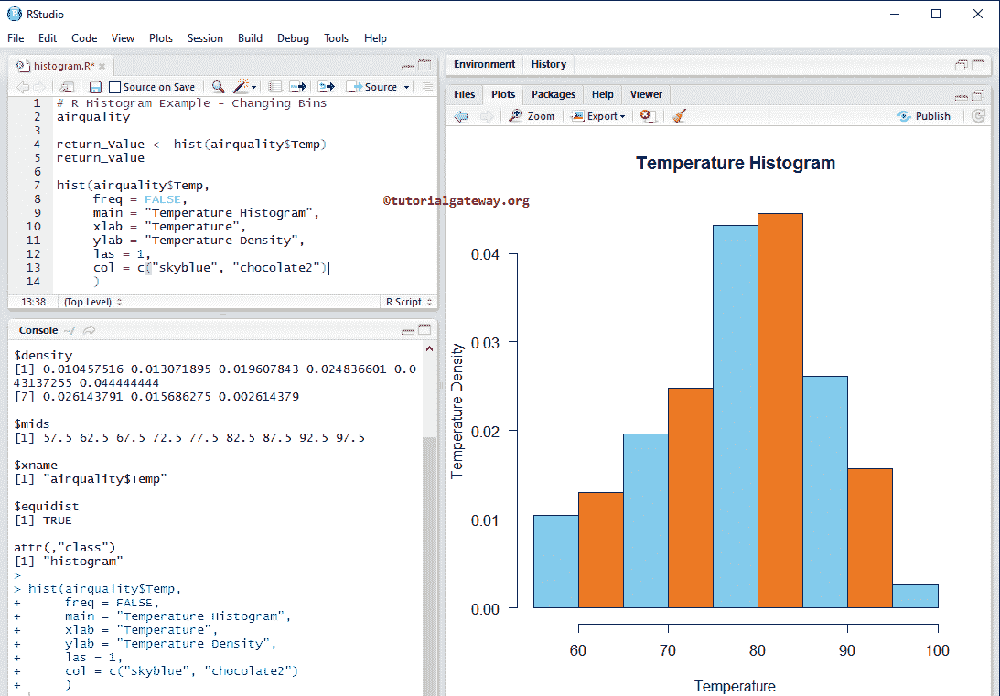

### 添加密度曲线

在本例中，我们使用直线函数将密度图或曲线添加到 Rstudio 的直方图中。

```
#  Add Density Curve
airquality

hist(airquality$Temp,
     freq = FALSE,
     main = "Temperature Histogram",
     xlab = "Temperature",
     ylab = "Temperature Density",
     las = 1,
     col = c("skyblue", "chocolate2")
     )

lines(density(airquality$Temp), lwd = 4, col = "red")
```

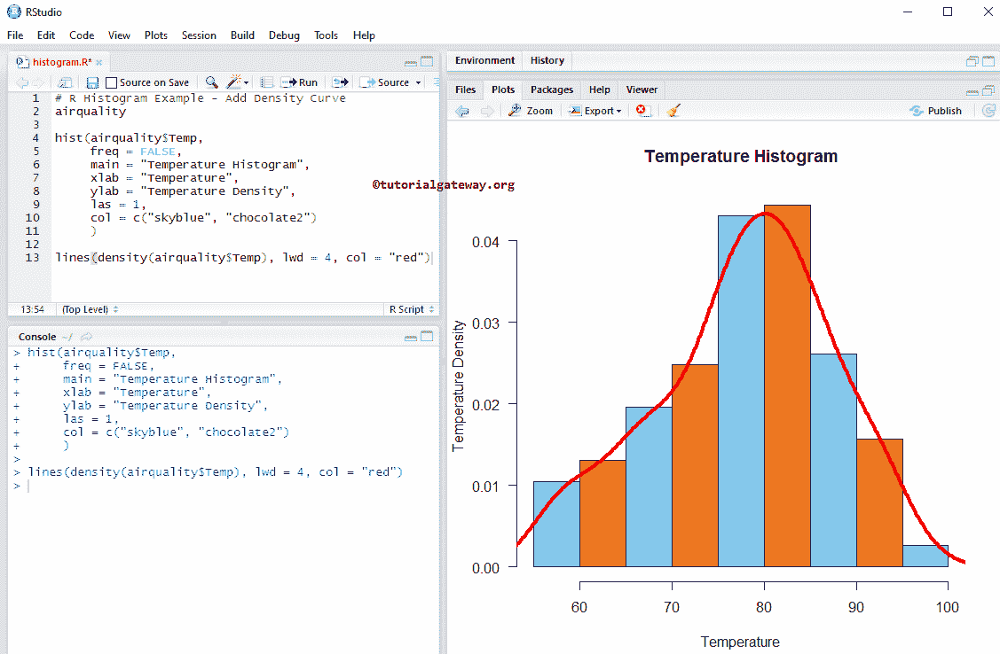

以下语句绘制了密度曲线

```
lines(density(airquality$Temp), lwd = 4, col = "red")
```

提示:lwd 参数改变线条的宽度

## 添加多个历史记录

在这个例子中，我们在 r 中添加多个直方图来绘制区域。

```
airquality

# Drawing for all the temperature values, where Month Number  = 7
hist(airquality$Temp[airquality$Month == 7],
     main = "MultipleHistograms",
     xlab = "Temperature",
     ylab = "Temperature Frequency",
     las = 1,
     breaks = 20,
     col = "skyblue",
     labels = T
     )

# Drawing for all the temperatures, where Month Number  = 8
hist(airquality$Temp[airquality$Month == 8],
     add = TRUE,
     col = "chocolate2",
     breaks = 20,
     labels = T
     )
```

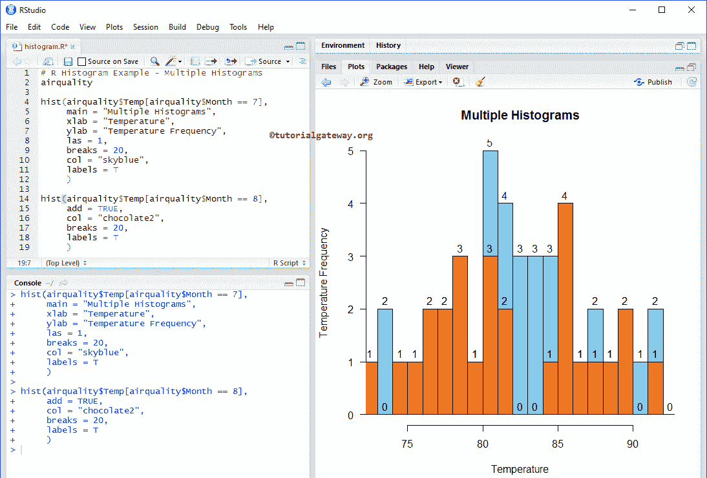

## 使用 CSV 文件创建直方图

让我们看看如何使用外部数据在 rstudio 中创建直方图。为此，我们使用 `read.csv`函数从 CSV 文件中导入数据。请参考 [R 阅读 CSV](https://www.tutorialgateway.org/r-read-csv-function/) 文章。

```
# CSV File

employee <- read.csv("Products.csv", TRUE, sep = ",", 
                     na.strings = TRUE)

employee$SalesAmount

hist(employee$SalesAmount,
     main = "SalesHistogram",
     xlab = "Sale Amount",
     ylab = "Sales Frequency",
     las = 1,
     col = "skyblue"
     )
```

上面的代码片段为销售额计算 CSV 文件中给定数据的历史。

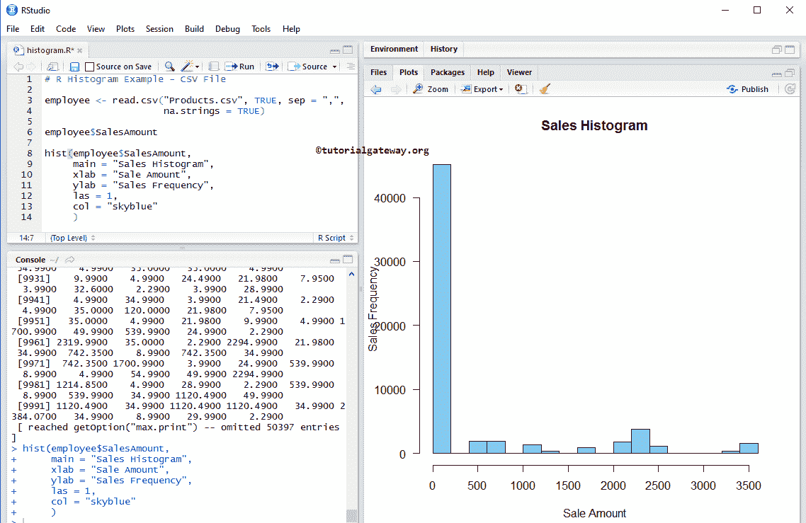