# R 语言中的箱线图

> 原文：<https://www.tutorialgateway.org/boxplot-in-r-programming/>

R 语言中的箱线图是一种通过特定数据以图形方式可视化数值数据组的方便方法。让我们看看如何用 R 语言创建一个箱线图，去掉轮廓，格式化它的颜色，增加名字，增加平均值，画出水平箱线图。

## R 中箱线图的语法

在 R 语言中绘制箱线图的语法是

```
boxplot(formula, data = NULL,.., subset, na.action = NULL)
```

这个 R Boxplot 函数背后的复杂语法是:

```
boxplot(x, ....., range = 1.5, width = NULL, varwidth = FALSE,
     notch = FALSE, outline = TRUE, col = NULL, log = "",
     border = par("fg"), names, plot = TRUE, 
     pars = list(boxwex = 0.8, staplewex = 0.5, outwex = 0.5), 
     horizontal = FALSE, add = FALSE, at = TRUE)
```

R 语言中的 Boxplot 支持许多参数，以下是其中一些参数:

*   数据:请指定包含要绘制箱线图的数据的[数据框](https://www.tutorialgateway.org/data-frame-in-r/)或[列表](https://www.tutorialgateway.org/r-list/)。在这个例子中，是空气质量
*   子集:您可以通过指定值的向量来限制 R 条形图。在本例中，您可以限制八月份的条形图框。
*   x:请指定要从中绘制 R 框图的数据。这里，可以使用数值[向量](https://www.tutorialgateway.org/r-vector/)，或者包含数值向量的列表。
*   范围:这个 [R 语言](https://www.tutorialgateway.org/r-programming/)参数决定了触须伸出盒子的距离。
*   宽度:它是可选的，使用它来指定包含每个框的宽度的向量。
*   varwidth:这是一个布尔参数。如果为真，则框的宽度与组中观察数的平方根成比例。
*   边框:这是一个可选参数。请指定要添加到方框图边框轮廓的颜色矢量。
*   情节:这是一个布尔参数。如果为假，则返回 R 框所基于的摘要。
*   日志:您必须指定一个包含三个选项的字符串。如果 X 轴是对数的，则指定“X”，如果 Y 轴是对数的，则指定“Y”，如果 X 轴和 Y 轴都是对数的，则指定“xy”或“yx”
*   添加:它是一个布尔参数，默认情况下，它是 FALSE。如果为真，该图应添加到已存在的图中。
*   水平:这是一个布尔参数。如果为假，则垂直绘制 R 盒图。如果是真的，它是水平画的。
*   at:它是一个数值向量，给出了箱线图绘制的位置。当我们在现有的地块区域中添加一个新的盒子时，这非常有帮助。

在我们进入这个例子之前，让我们看看我们将用于这个 R 盒图例子的数据。空气质量是由 R

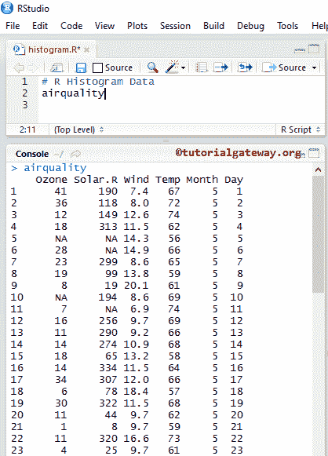

提供的日期设置

## R 语言中箱线图的返回值

一般来说，在我们开始创建 R 箱线图之前，让我们看看数据是如何除以箱线图的。它返回统计数据、大纲、组和名称。

```
airquality

return.value <- boxplot(airquality$Wind)
return.value
```

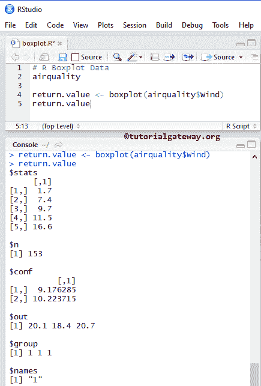

## 在 R 语言中创建方框图

在本例中，我们使用由[工作室](https://www.tutorialgateway.org/download-r-studio-and-install/)提供的空气质量数据集创建了一个箱线图。如果需要从外部文件导入数据，请参考 [R Read CSV](https://www.tutorialgateway.org/r-read-csv-function/) 一文了解 CSV 文件的导入。

```
airquality

boxplot(airquality$Wind)
```

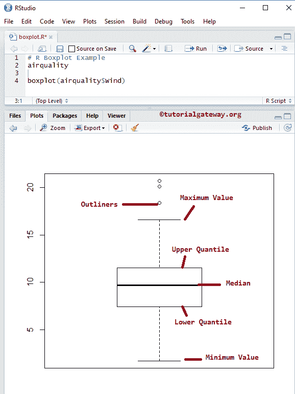

空气质量数据集以列表形式返回输出。因此，我们使用$从[列表](https://www.tutorialgateway.org/r-list/)中提取数据。

```
boxplot(airquality$Wind)
```

## 使用公式在 R 中创建箱线图

在本例中，我们使用公式参数创建了一个 Boxplot。

*   公式:应该是类似 value~group 这样的东西，其中 value 是数值的向量，group 是您想要用作分组依据的列。例如，您想要绘制全国销售的样本大小框，那么 value =销售额，group =国家。

```
airquality

boxplot(airquality$Wind~airquality$Month)
```

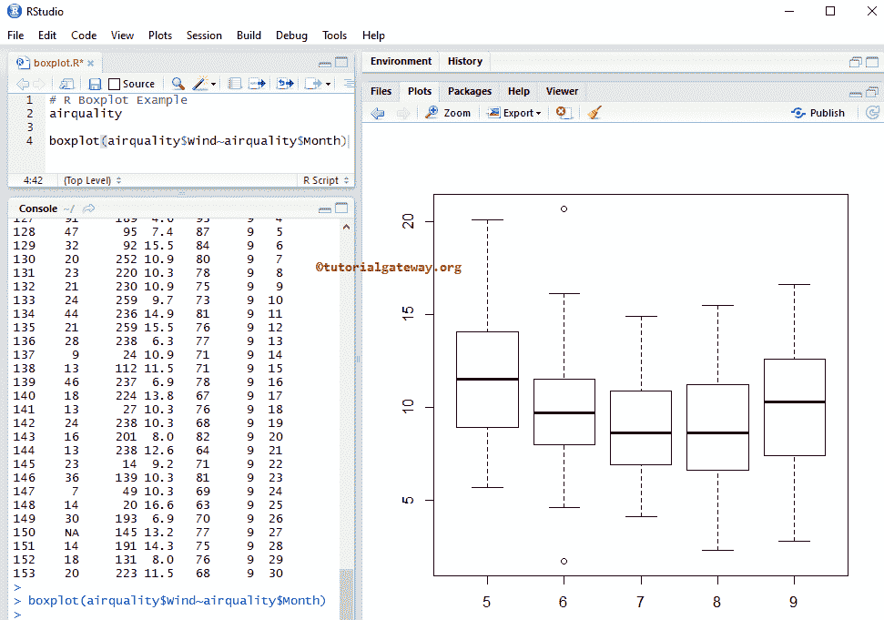

### 在 R 语言中给箱线图命名

在本例中，我们使用 main、xlab 和 ylab 为 R 盒图、X 轴和 Y 轴指定名称

*   主要:您可以更改或提供标题。
*   请指定 X 轴的标签
*   伊拉布:请指定 Y 轴的标签
*   las:用于更改 Y 轴值方向。

```
airquality

boxplot(airquality$Wind~airquality$Month,
        main = "Airquality Boxplot",
        xlab = "Months",
        ylab = "Wind",
        las = 1
        )
```

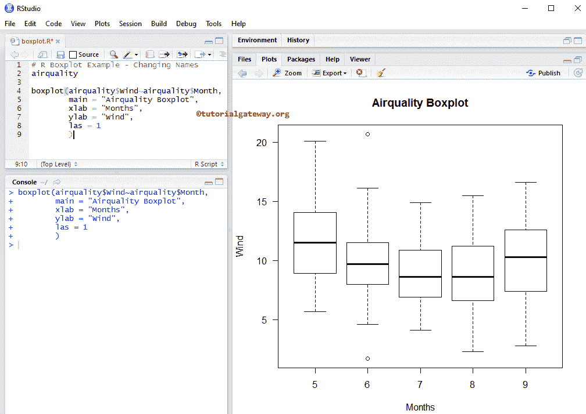

### 改变箱线图的颜色

在本例中，我们使用 col 参数更改了 R Boxplot 框的颜色

*   col:请指定您想要使用的颜色。在控制台中键入 colors()以获取 R 语言中可用的颜色列表
*   名称:请指定盒子的名称。这里，我们将月号改为月名

```
# Boxplot Example - Changing Colors, Assigning new Names
airquality

boxplot(airquality$Wind~airquality$Month,
        main = "AirqualityBoxplot",
        xlab = "Months",
        ylab = "Wind",
        las = 1,
        col = c("violetred", "steelblue1", "salmon1", 
                "palegoldenrod", "olivedrab"),
        names = c("May", "June", "July", "August", "September")
        )
```

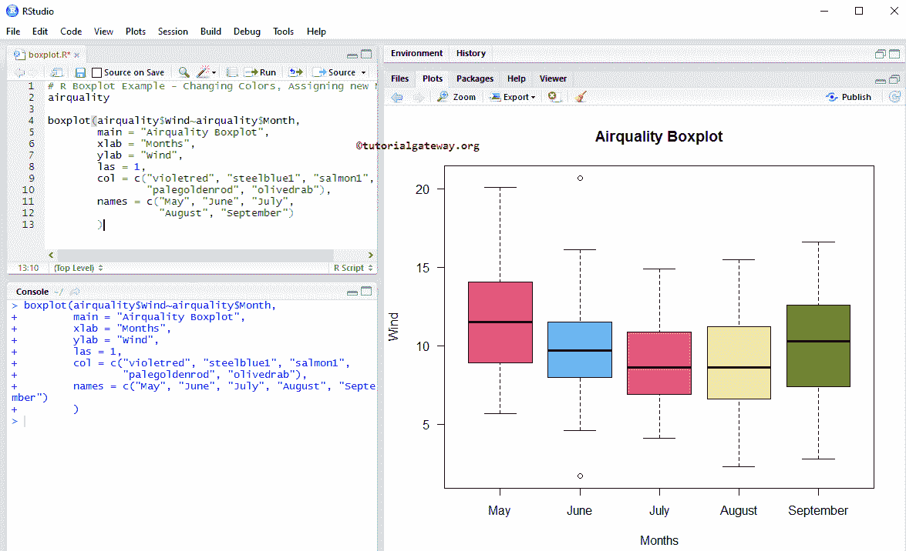

### 移除 R 中方框图的轮廓

在这个 R 盒图示例中，我们使用一个大纲参数删除了大纲。

*   大纲:这是一个布尔参数。如果为真，则绘制轮廓(框外的额外点)，如果为假，则删除方框图中的所有轮廓。

```
airquality

boxplot(airquality$Wind~airquality$Month,
        outline = FALSE,
        main = "AirqualityBoxplot",
        xlab = "Months",
        ylab = "Wind",
        las = 1,
        col = c("violetred", "steelblue1", "salmon1",
                "palegoldenrod", "olivedrab"),
        names = c("May", "June", "July", 
                  "August", "September")
        )

```

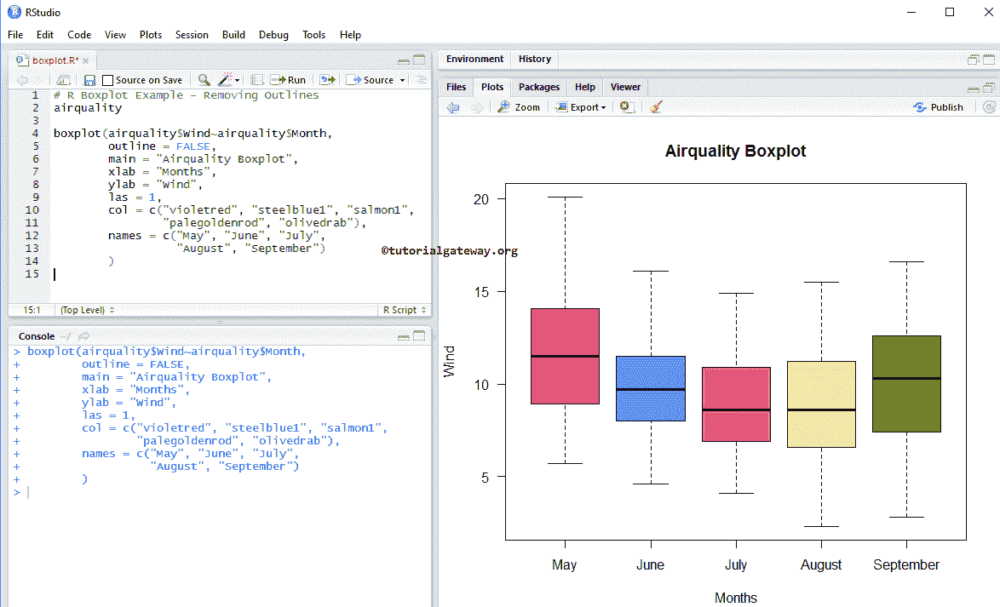

### R 中箱线图的均值计算和添加

在这个 R 箱线图示例中，我们计算了每个方框的平均值，以及如何使用点函数将这些平均值添加到现有的箱线图中。

```
airquality

boxplot(airquality$Wind~airquality$Month,
        main = "AirqualityBoxplot",
        xlab = "Months",
        ylab = "Wind",
        las = 1,
        col = c("violetred", "steelblue1", "salmon1",
                "palegoldenrod", "olivedrab"),
        names = c("May", "June", "July", 
                  "August", "September")
        )

meanval <- by(airquality$Wind, airquality$Month, mean)
points(meanval, col = "white", pch = 8, cex = 1.5)

```

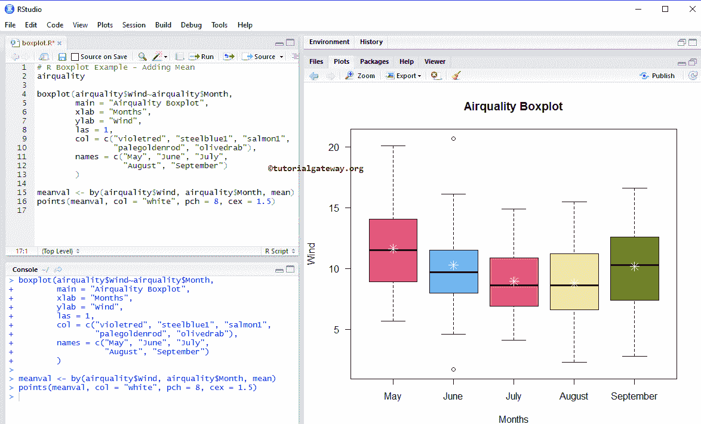

以下语句按月数分组，找出风的平均值。

```
meanval <- by(airquality$Wind, airquality$Month, mean)
```

以下语句将意味着值添加到框中。pch = 8 表示星形字符，cex 表示字符的大小，col 表示颜色。

```
points(meanval, col = "white", pch = 8, cex = 1.5)
```

### R 盒图中的凹口参数

在本例中，我们使用 notch 参数在方框的每一侧画一条线。

*   notch:这是一个布尔参数。如果为真，则在方框的每一侧画一个缺口。如果两个图的凹口重叠，那么我们可以说它们的中值是相同的。否则，它们是不同的。

```
# Notch
airquality

boxplot(airquality$Wind~airquality$Month,
        notch = TRUE,
        main = "Airquality Boxplot",
        xlab = "Months",
        ylab = "Wind",
        las = 1,
        col = c("violetred", "steelblue1", "salmon1",
                "palegoldenrod", "olivedrab"),
        names = c("May", "June", "July", 
                  "August", "September")
        )

meanval <- by(airquality$Wind, airquality$Month, mean)
points(meanval, col = "white", pch = 8, cex = 1.5)
```

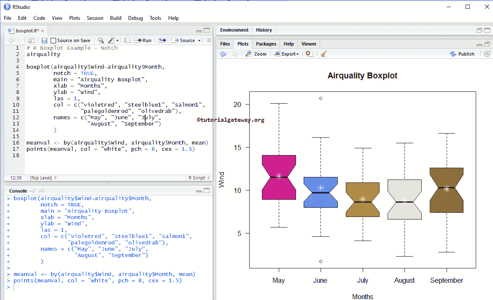

## R 语言中的水平箱线图

在这个 R 示例中，我们使用水平参数将默认的垂直方框图更改为水平方框图。

```
airquality

boxplot(airquality$Wind~airquality$Month,
        notch = TRUE,
        horizontal = TRUE,
        main = "AirqualityBoxplot",
        xlab = "Months",
        ylab = "Wind",
        las = 1,
        col = c("violetred", "steelblue1", "salmon1",
                "palegoldenrod", "olivedrab"),
        names = c("May", "June", "July", 
                  "August", "September")
        )

```

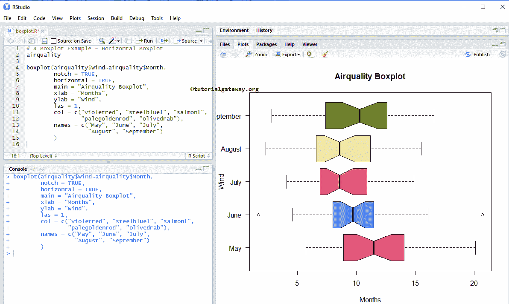

## 使用 CSV 文件创建箱线图

让我们来看看如何使用外部数据创建一个 R 盒图。为此，我们使用 read.csv 函数从 CSV 文件中导入数据。参考[阅读 CSV](https://www.tutorialgateway.org/r-read-csv-function/) 文章导入 CSV 文件。

```
employee <- read.csv("Products.csv", TRUE, sep = ",", 
                     na.strings = TRUE)

boxplot(employee$SalesAmount~employee$EnglishCountryRegionName,
        main = "ProductsBoxplot",
        col = c("steelblue", "tomato3", "yellow2", 
                "orange4", "lawngreen", "skyblue4")
        )
```

上面的代码片段将绘制销售金额的箱线图，按国家分组。

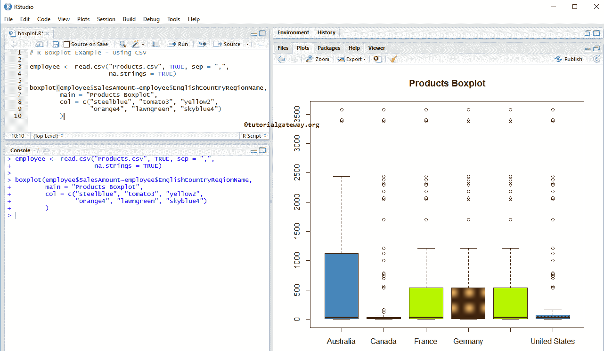