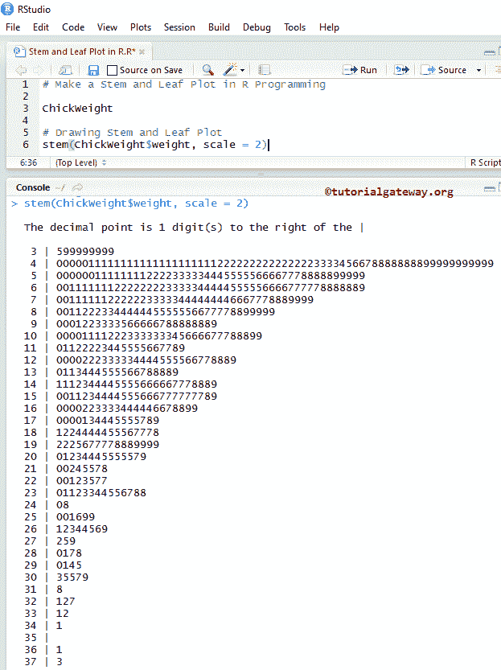

# 西藏的茎叶图

> 原文：<https://www.tutorialgateway.org/stem-and-leaf-plot-in-r/>

茎叶图，在 R 中也称为茎叶图，是一个特殊的表，其中每个数值分为茎(第一个数字)和叶(最后一个数字)。例如，57 分裂成 5 个茎和 7 个叶。在本文中，我们将通过示例向您展示如何用 R 编程语言制作茎叶图。

## R 句法中的茎叶图

在 R 编程中绘制茎叶图的基本语法如下所示

```
stem(x, scale = 1, width = 80, atom = 1e-08)
```

以下是 R 编程语言中的茎叶图支持的参数列表:

*   x:请指定要绘制茎叶图的数据。在这里，您必须使用数值向量，或者包含数值向量的列表。
*   比例:请指定您要用于绘图的比例。
*   宽度:它是可选的，但是您可以使用它来指定所需的绘图宽度。默认为 80。
*   原子:这是宽容。

在进入示例之前，让我们看看 r 中的 Stem 和 Leaf 图的图示。从下面的截图中，您可以看到，首先，我们声明了一个变量 10、15、22、25、28、23、29、31、36、45、48。根据这些值，分配给茎的第一个数字和最后一个数字是叶。


## 在 R 程序设计中创建茎叶图

在本例中，我们展示了如何使用由 [R Studio](https://www.tutorialgateway.org/download-r-studio-and-install/) 提供的 chick w8 数据集在 R 中制作茎叶图。如果您需要从外部文件导入数据，我建议您参考 [R Read CSV](https://www.tutorialgateway.org/r-read-csv-function/) 文章，了解 [R 编程](https://www.tutorialgateway.org/r-programming/)中 CSV 文件的导入。

```
# Make a Stem and Leaf Plot in R Programming

ChickWeight

# Drawing Stem and Leaf Plot
stem(ChickWeight$weight)
```


chick w8 数据集以列表形式返回输出。因此，我们使用$从[列表](https://www.tutorialgateway.org/r-list/)中提取数据。

```
stem(ChickWeight$weight)
```

从上面的截图中，可以看到 chick w8 数据集有 25，29，29，…这样的数字。, 341, 361, 363.

### 茎叶图使用比例尺

在这个茎叶图的例子中，我们展示了如何在茎函数中使用比例参数。

```
# Make a Stem and Leaf Plot in R Programming

ChickWeight

# Drawing Stem and Leaf Plot
stem(ChickWeight$weight, scale = 2)
```



### 更改茎叶图的宽度

在这个例子中，我们在 R 编程中改变了一个茎叶图的宽度。

```
# Make a Stem and Leaf Plot in R Programming

ChickWeight

# Drawing Stem and Leaf Plot
stem(ChickWeight$weight)
stem(ChickWeight$weight, width = 100)
```

