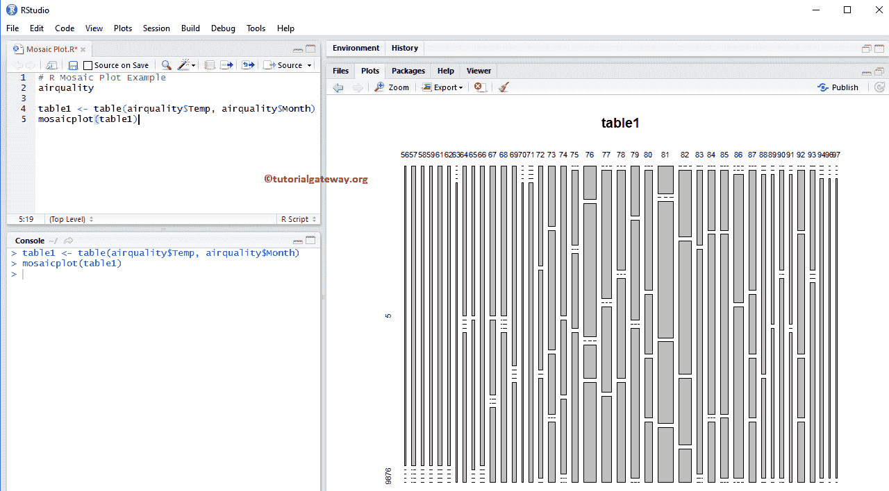

# R 中的马赛克图

> 原文：<https://www.tutorialgateway.org/mosaic-plot-in-r/>

R 程序设计中的镶嵌图对于将列联表或双向频率表中的数据可视化非常有用。R 镶嵌图绘制一个矩形，其高度代表比例值。从第二个例子中，你可以看到白色产品是所有国家中销量最少的。

让我们看看如何用 R 语言创建马赛克图，用 R 编程语言格式化它的颜色、边框、阴影和改变马赛克图的方向。

## r 镶嵌图语法

绘制镶嵌图的语法如下所示

```
mosaicplot(x, color = NULL, main = "Title")
```

这个马赛克图背后的复杂语法是:

```
mosaicplot(x, sort = NULL, color = NULL, border = NULL, 
        main = deparse(substitute(x), sub = NULL, xlab = NULL, ylab = NULL, 
        off = NULL, dir = NULL, cex.axis = 0.66, shade = FALSE, margin = NULL,
        las = par("las"), type = c("Pearson", "deviance", "FT",…)
```

这个镶嵌图背后基于公式的语法是:

```
mosaicplot(formula, data = NULL, main = deparse(substitute(x), 
           subset, na.action = stats::na.omit)
```

以下是 R 编程语言中马赛克图支持的参数列表:

*   数据:请指定包含数据的[数据框](https://www.tutorialgateway.org/data-frame-in-r/)或[列表](https://www.tutorialgateway.org/r-list/)绘制马赛克图。在这个例子中，它是空气质量&产品
*   子集:通过指定值的向量，可以限制镶嵌图绘制一些数据。例如，您可以仅限制女性人口的镶嵌图。
*   x:请指定要从中绘制镶嵌图的数据。这里，您必须使用数组形式的应急表。您可以使用 table()函数从您的[数据框](https://www.tutorialgateway.org/data-frame-in-r/)创建一个表格。
*   排序:排序[向量](https://www.tutorialgateway.org/r-vector/)变量。
*   边距:请指定一个带有边距总数的向量列表。
*   行动:在这里，你必须指定你对包含 NAs 的变量的立场。默认情况下，镶嵌图省略了带 NA 的情况，但您可以使用此参数用更有意义的值替换那些 NA 值。
*   轴:用于轴注释
*   类型:请指定一个字符串来指示要表示的剩余类型。

## 在 R 中创建基本镶嵌图

在本例中，我们向您展示了如何使用空气质量数据集在 R 中创建镶嵌图，该数据集由 [R Studio](https://www.tutorialgateway.org/download-r-studio-and-install/) 提供。

```
# R Mosaic Plot Example
airquality

table1 <- table(airquality$Temp, airquality$Month)
mosaicplot(table1)
```



首先，我们创建了一个空气质量温度和月份的表格

```
table1 <- table(airquality$Temp, airquality$Month)
```

接下来，我们使用马赛克图功能绘制马赛克图。从下面的代码片段中，您可以观察到我们已经使用表格绘制了镶嵌图。

```
mosaicplot(table1)
```

## 在 R 编程中创建镶嵌图

在本例中，我们展示了如何使用外部数据创建 R 镶嵌图。为此，我们使用 read.csv 函数从 csv 文件导入数据。建议大家参考 [R Read CSV](https://www.tutorialgateway.org/r-read-csv-function/) 文章导入 [R 编程](https://www.tutorialgateway.org/r-programming/)中的 CSV 文件。

```
# R Mosaic Plot Example
getwd()

employee <- read.csv("Products.csv", TRUE, sep = ",",
                     na.strings = TRUE)

count <- table(employee$EnglishCountryRegionName, 
               employee$Color)
count
mosaicplot(count)
```


在此镶嵌图示例中，以下语句从 CSV 文件导入数据

```
employee <- read.csv("Products.csv", TRUE, sep = ",",
                     na.strings = TRUE)
```

从下面的代码片段中，可以看到我们使用 table()函数为产品颜色和国家/地区名称创建了一个表格。

```
count <- table(employee$EnglishCountryRegionName, 
               employee$Color)
```

上面的语句以表的形式返回输出。所以，我们用那个表格来画马赛克图。

```
mosaicplot(count)
```

### 在 R 编程中为镶嵌图指定名称

在这个 R 镶嵌图示例中，我们使用主轴、xlab 轴、ylab 轴和子轴为镶嵌图标题、X 轴和 Y 轴指定名称。

*   主要:您可以更改或提供镶嵌图标题的字符串。
*   sub:你可以为你的马赛克图提供副标题(如果有的话)。
*   请指定 X 轴的标签
*   伊拉布:请指定 Y 轴的标签
*   las:用于更改 Y 轴值方向。

```
# R Mosaic Plot Example - Adding Names
getwd()

employee <- read.csv("Products.csv", TRUE, sep = ",",
                     na.strings = TRUE)

count <- table(employee$EnglishCountryRegionName, 
               employee$Color)
count
mosaicplot(count, main = "Countries Mosaic Plot",
           sub = "Product Colors by Country",
           xlab = "Countries",
           ylab = "Colors",
           las = 1)
```


### 更改 R 中镶嵌图的颜色

在本例中，我们使用颜色参数更改马赛克颜色，使用边框参数更改边框颜色。

*   颜色:请指定要用于镶嵌图着色的逻辑颜色或矢量颜色。当色调参数设置为假或空(默认值)时，使用此参数。在控制台中键入 colors()以获取 R 编程中可用的颜色列表。
*   边框:请指定要为边框添加的颜色。

```
# R Mosaic Plot Example - Adding Names
getwd()

employee <- read.csv("Products.csv", TRUE, sep = ",",
                     na.strings = TRUE)

count <- table(employee$EnglishCountryRegionName, 
               employee$Color)
count
mosaicplot(count, main = "Countries Mosaic Plot",
           sub = "Product Colors by Country",
           xlab = "Countries",
           ylab = "Colors",
           las = 1,
           color = "skyblue2",
           border = "chocolate")
```


提示:要为马赛克指定不同的颜色，您必须使用颜色向量。例如，color = c(“红色”、“黑色”、“绿色”、…)

### R 程序设计中的水平拼接图

在这个 R 马赛克图示例中，我们展示了如何使用 dir 参数更改马赛克的方向。

*   方向:请为每一级镶嵌指定一个分割方向向量。这里，“v”代表垂直，“h”代表水平。

```
# R Mosaic Plot Example - Changing Direction
getwd()

employee <- read.csv("Products.csv", TRUE, sep = ",",
                     na.strings = TRUE)

count <- table(employee$EnglishCountryRegionName, 
               employee$Color)
count
mosaicplot(count, main = "Countries Mosaic Plot",
           sub = "Product Colors by Country",
           xlab = "Colors",
           ylab = "Countries",
           las = 1,
           dir = c("h", "v"),
           color = "skyblue2",
           border = "chocolate")
```


从上面的截图中，您可以观察到我们将横轴更改为纵轴，反之亦然。

### 更改镶嵌图的阴影

在这个马赛克图的例子中，我们展示了如何使用阴影参数

*   明暗度:一个逻辑值，指示是否产生扩展镶嵌图。您也可以使用最多 5 个正数的数值向量。

```
# R Mosaic Plot Example - Changing Direction
getwd()

employee <- read.csv("Products.csv", TRUE, sep = ",",
                     na.strings = TRUE)

count <- table(employee$EnglishCountryRegionName, 
               employee$Color)
count
mosaicplot(count, main = "Countries Mosaic Plot",
           sub = "Product Colors by Country",
           xlab = "Colors",
           ylab = "Countries",
           las = 1,
           border = "chocolate",
           shade = TRUE)
```


### 增加镶嵌图之间的间距

在这个 R 马赛克图示例中，我们使用 off 参数增加了每个马赛克之间的空间。

*   关闭:请指定偏移值向量，以确定镶嵌图每一层的百分比间距。默认值为 20，近似值介于 0 和 20 之间。

```
# R Mosaic Plot Example - Changing Offset
getwd()

employee <- read.csv("Products.csv", TRUE, sep = ",",
                     na.strings = TRUE)

count <- table(employee$EnglishCountryRegionName, 
               employee$Color)
count
mosaicplot(count, main = "Countries Mosaic Plot",
           sub = "Product Colors by Country",
           xlab = "Colors",
           ylab = "Countries",
           las = 1,
           border = "chocolate",
           off = 30,
           shade = TRUE)
```


## 使用公式创建镶嵌图

在本例中，我们使用公式参数创建了一个镶嵌图。

*   公式:应该是 y~x 这样的东西

```
# R Mosaic Plot Example - Changing Offset
getwd()

employee <- read.csv("Products.csv", TRUE, sep = ",",
                     na.strings = TRUE)

mosaicplot(employee$EnglishCountryRegionName~employee$Color, 
           main = "Countries Mosaic Plot",
           sub = "Product Colors by Country",
           xlab = "Countries",
           ylab = "Colors",
           las = 1,
           border = "chocolate",
           shade = TRUE)
```

