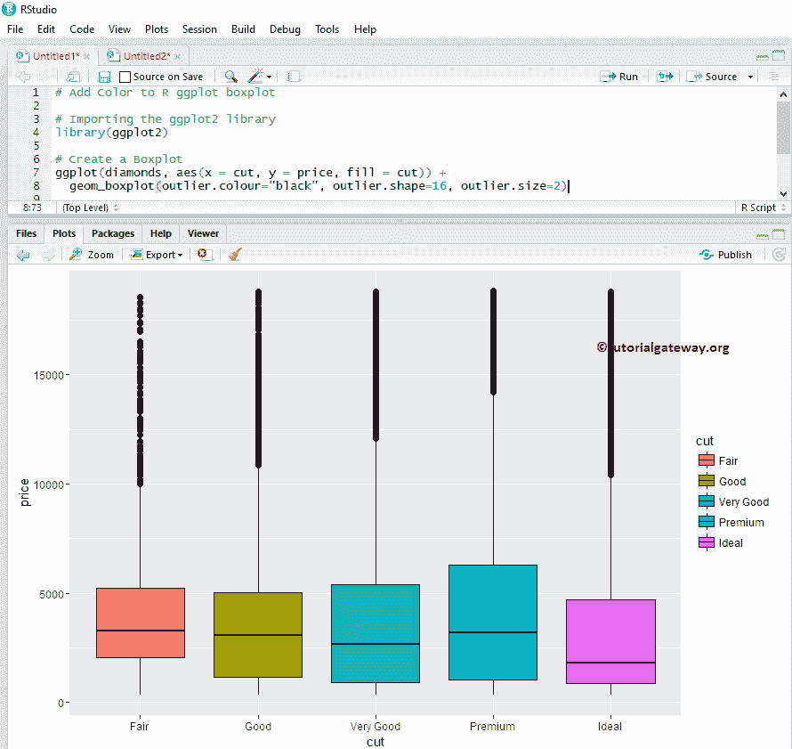
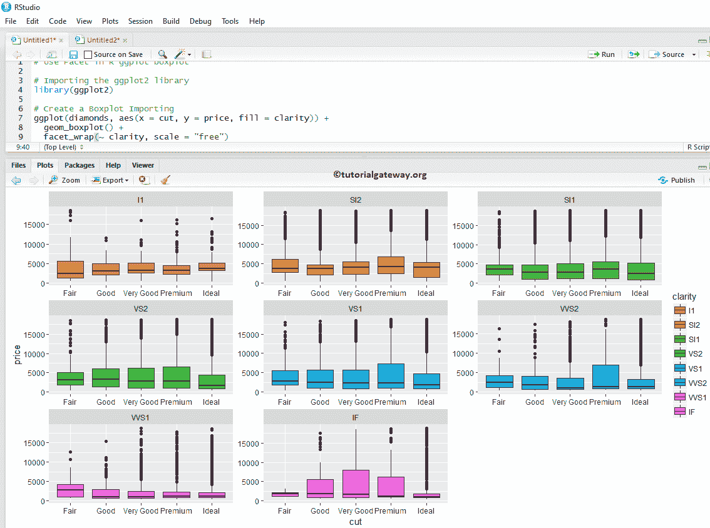

# R ggplot2 Boxplot

> 原文：<https://www.tutorialgateway.org/r-ggplot2-boxplot/>

R ggplot2 箱线图对于通过特定数据以图形方式可视化数值数据组非常有用。让我们看看如何创建一个 R ggplot2 箱线图。并以 R ggplot2 为例，设置颜色格式、更改标签、绘制水平和多个方框图。

在这个 r ggplot2 Boxplot 演示中，我们使用了 R Programming 提供的两个数据集，它们是:chick w8 和 diamonds 数据集

## 创建 R ggplot2 箱线图

在这个例子中，我们展示了如何使用 r .中的 ggplot2 包创建一个 Boxplot。

```
library(ggplot2)

ggplot(ChickWeight, aes(x = Diet, y = weight)) + 
  geom_boxplot()
```


### 更改图形 2 的颜色

在本例中，我们展示了如何使用填充参数更改 R ggplot Boxplot 框的颜色

*   填充:请指定您想要使用的颜色。在控制台中键入 colors()以获取 R 编程中可用的颜色列表。

提示: [R 编程](https://www.tutorialgateway.org/r-programming/)默认不安装 ggplot2 包。请参考[安装 R 包](https://www.tutorialgateway.org/install-r-packages/)文章，了解如何安装该包。

```
library(ggplot2)

ggplot(diamonds, aes(x = cut, y = price)) + 
  geom_boxplot(fill = "midnightblue")
```


### 更改颜色示例 2

在本例中，我们使用列数据更改了 R ggplot Boxplot 框的颜色。这里，我们使用剪切列数据来区分颜色

注意:如果需要从外部文件导入数据，那么请参考[阅读 CSV](https://www.tutorialgateway.org/r-read-csv-function/) 了解 CSV 文件导入涉及的步骤

```
library(ggplot2)

ggplot(diamonds, aes(x = cut, y = price, fill = cut)) + 
  geom_boxplot(outlier.colour="black", outlier.shape=16, outlier.size=2)
```



### 更改 R ggplot2 箱线图的大纲视图

在本例中，我们展示了如何使用以下参数更改 R ggplot boxplot 大纲视图的颜色

*   异常值。颜色:请指定要用于异常值的颜色。在控制台中键入 colors()以获取 R 编程中可用的颜色列表
*   异常值。形状:请指定要用于异常值的形状。
*   离群值大小:指定大纲视图的大小。

```
library(ggplot2)

ggplot(diamonds, aes(x = cut, y = price, fill = cut)) + 
  geom_boxplot(outlier.color = "seagreen", outlier.shape = 8, outlier.size = 2)
```


### 将平均值添加到 R ggplot2 箱线图

在本例中，我们使用 stat_summary 参数将平均值添加到 R ggplot 箱线图中

```
library(ggplot2)

ggplot(diamonds, aes(x = cut, y = price, fill = cut)) + 
  geom_boxplot() +
  stat_summary(fun.y = "mean", geom = "point", shape = 8, size = 2, color = "white")
```


### 更改图形 2 方框图的图例位置

默认情况下，ggplot 将图例放置在右侧。在本例中，我们将图例位置从右侧更改为顶部。注意，您可以使用 legend.position = "none "来完全删除图例。

```
library(ggplot2)

ggplot(diamonds, aes(x = cut, y = price, fill = cut)) + 
  geom_boxplot() +
  theme(legend.position = "top")
```


### R 盒图中的凹口参数

这里，我们使用 R ggplot boxplot 中的 notch 参数在方框的每一侧画一条线

*   notch:这是一个布尔参数。如果为真，则在方框的每一侧画一个缺口。

提示:如果两个图的凹口重叠，那么可以说它们的中值是一样的。否则，它们是不同的。

```
library(ggplot2)

ggplot(ChickWeight, aes(x = Diet, y = weight)) + 
  geom_boxplot(fill = "chocolate", notch = TRUE)
```


## R 中的水平 ggplot 箱线图

在本例中，我们使用 coord_flip()函数将默认的竖排改为横排

```
library(ggplot2)

ggplot(ChickWeight, aes(x = Diet, y = weight)) + 
  geom_boxplot() +
  coord_flip()
```


## R 中的多重 gplot 箱线图

在这个例子中，我们展示了如何在 R 编程中对多个 ggplot boxplots 进行分组

```
library(ggplot2)

ggplot(diamonds, aes(x = cut, y = price, fill = clarity)) + 
  geom_boxplot()
```


## 如何在 R ggplot2 Boxplot 中使用刻面

在这个 R ggplot 示例中，我们通过基于列值划分数据来绘制多个箱线图。在这里，我们使用清晰度列数据来划分它们。

```
library(ggplot2)

ggplot(diamonds, aes(x = cut, y = price, fill = clarity)) + 
  geom_boxplot() +
  facet_wrap(~ clarity)
```


### 如何使用刻面示例 2

默认情况下，facet_wrap()将相同的 y 轴分配给所有。但是，您可以通过添加一个名为“比例”的属性来更改每个 R ggplot boxplot 的值(给出独立的轴)。

```
library(ggplot2)

ggplot(diamonds, aes(x = cut, y = price, fill = clarity)) + 
  geom_boxplot() +
  facet_wrap(~ clarity, scale = "free")
```



## 指定名称

在本例中，我们使用 labs 函数为图表、X 轴和 Y 轴指定名称

```
library(ggplot2)

ggplot(diamonds, aes(x = cut, y = price, fill = cut)) + 
  geom_boxplot() +
  labs(title="GGPLOT BOXPLOT", x="Price in Dollars", y="Cut")
```


## 更改 R ggplot2 框绘图主题

在本例中，我们更改了 R ggplot2 方框图的默认主题

*   theme_dark():我们正在使用这个函数将默认主题更改为 dark。键入主题 _，然后 [R Studio](https://www.tutorialgateway.org/download-r-studio-and-install/) 智能显示可用选项列表。例如，theme_grey()。

```
library(ggplot2)

ggplot(diamonds, aes(x = cut, y = price, fill = cut)) + 
  geom_boxplot() +
  labs(title="GGPLOT BOXPLOT", x="Price in Dollars", y="Cut") +
  theme_dark()
```

