# R ggplot2 抖动

> 原文：<https://www.tutorialgateway.org/r-ggplot2-jitter/>

R ggplot2 抖动对于处理由较小数据集离散性引起的过度绘制非常有用。让我们看看如何使用 R ggplot2 绘制抖动图、格式化其颜色、更改标签、添加 boxplot、小提琴图以及更改图例位置。

在 R 编程中绘制抖动曲线图的语法是

```
geom_jitter(data = NULL, width = NULL, height = NULL)
```

这种抖动背后的复杂语法是:

```
geom_jitter(mapping = NULL, data = NULL, stat = "identity",
            width = NULL, height = NULL, position = "jitter", ...,
            na.rm = FALSE, show.legend = NA, inherit.aes = TRUE)
```

## 创建图形 2 抖动

让我们看看如何使用 ggplot2 包绘制抖动，我们将使用工作室提供的 chick w8 数据集。

提示:默认情况下不安装 ggplot2 包。请参考[安装 R 包](https://www.tutorialgateway.org/install-r-packages/)一文在 [R 编程](https://www.tutorialgateway.org/r-programming/)中安装该包。

```
# Create R ggplot Jittering

# Importing the ggplot2 library
library(ggplot2)

# Creating basic Jitter
ggplot(ChickWeight, aes(x = Diet, y = weight)) + 
  geom_jitter()
```

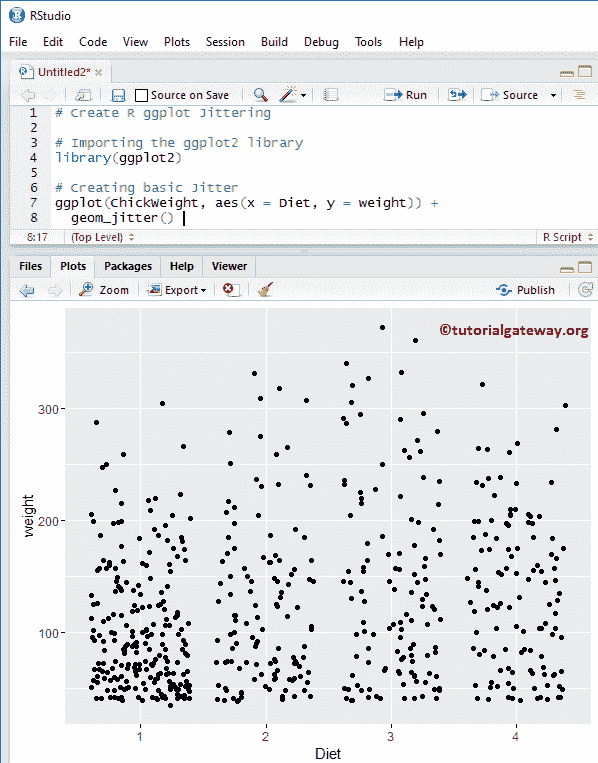

注:如果需要从外部文件导入数据，请参考 [R Read CSV](https://www.tutorialgateway.org/r-read-csv-function/) 文章导入 CSV 文件。

### 在 R 中改变一个 Jiiter 的颜色

让我们看看如何使用颜色参数来更改 R 抖动图点的颜色

```
# Change Color of a R ggplot Jitter

# Importing the ggplot2 library
library(ggplot2)

# Creating basic Jitter
ggplot(ChickWeight, aes(x = Diet, y = weight)) + 
  geom_jitter(aes(colour = Diet))
```

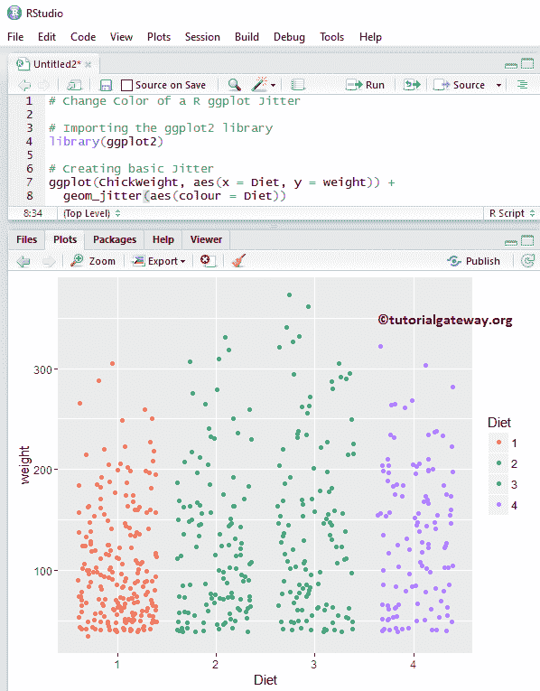

### 图形中的位置调整 2 抖动

这里，我们展示了如何使用位置参数来调整点的位置

```
# Position adjustment of a R ggplot Jitter

# Importing the ggplot2 library
library(ggplot2)

# Creating basic Jitter
ggplot(ChickWeight, aes(x = Diet, y = weight)) + 
  geom_jitter(position = position_jitter(0.5), 
              aes(colour = Diet))
```

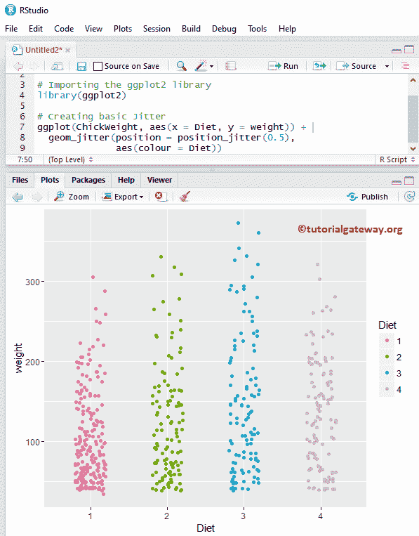

### 更改图形中点的大小和形状 2 抖动

如何使用 cex 参数更改代表点的字符的大小，以及使用 shape 参数更改字符的形状。

*   请指定点的大小

```
# Change Shape & Size of a Point in a R ggplot Jitter

# Importing the ggplot2 library
library(ggplot2)

# Creating basic Jitter
ggplot(ChickWeight, aes(x = Diet, y = weight)) + 
  geom_jitter(position = position_jitter(0.5), 
              aes(colour = Diet),
              cex = 1.8, shape = 8)
```

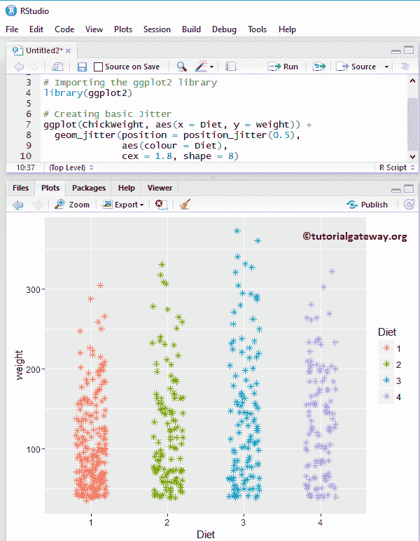

### 更改图形 2 抖动的宽度和高度

在本例中，我们展示了如何更改抖动图的宽度和高度

```
# Change Width & Height of a R ggplot Jitter

# Importing the ggplot2 library
library(ggplot2)

# Creating basic Jitter
ggplot(ChickWeight, aes(x = Diet, y = weight)) + 
  geom_jitter(aes(colour = Diet),
              width = 1.4, height = 500)
```

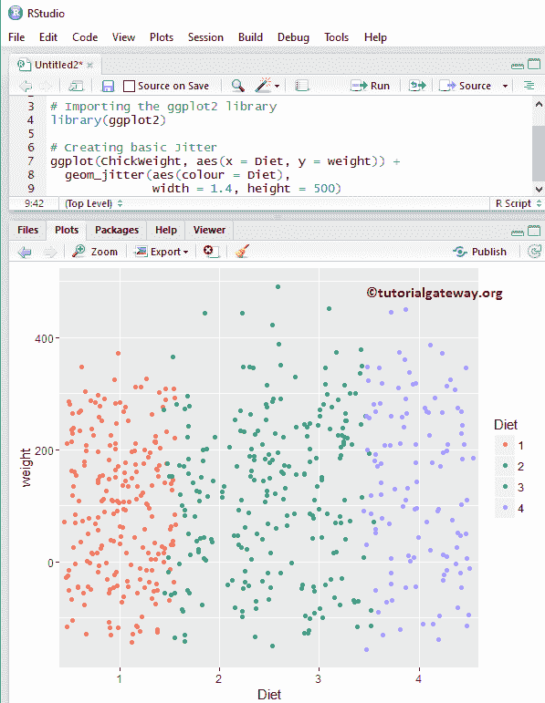

### 将平均值和中值添加到图形 2 抖动中

让我们看看如何使用 stat_summary 函数将平均值和中值添加到图 2 抖动图中。

```
# Add Mean & Median to R ggplot Jitter

# Importing the ggplot2 library
library(ggplot2)

# Creating basic Jitter
ggplot(ChickWeight, aes(x = Diet, y = weight)) + 
  geom_jitter(position = position_jitter(0.5), aes(colour = Diet)) +
  stat_summary(fun.y = "mean", geom = "point", 
               shape = 8, size = 3, color = "darkorchid4" ) +
  stat_summary(fun.y = "median", geom = "point", 
               shape = 2, size = 3, color = "mediumvioletred")
```

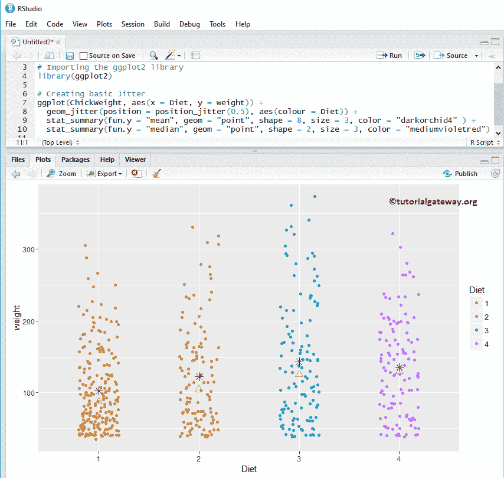

### 将方框图添加到图形 2 抖动中

在本例中，我们使用 geom_boxplot 函数将 boxplot 添加到 R 抖动中。它帮助我们看到中位数，以及我们小提琴情节的四分位数。

提示:请参考[R ggplot 2 Boxsplot](https://www.tutorialgateway.org/r-ggplot2-boxplot/)文章了解 Boxsplot 论点。

```
# Add Boxplot to R ggplot Jitter

# Importing the ggplot2 library
library(ggplot2)

# Creating basic Jitter
ggplot(ChickWeight, aes(x = Diet, y = weight)) + 
  geom_boxplot() +
  geom_jitter(position = position_jitter(0.5), aes(colour = Diet))
```

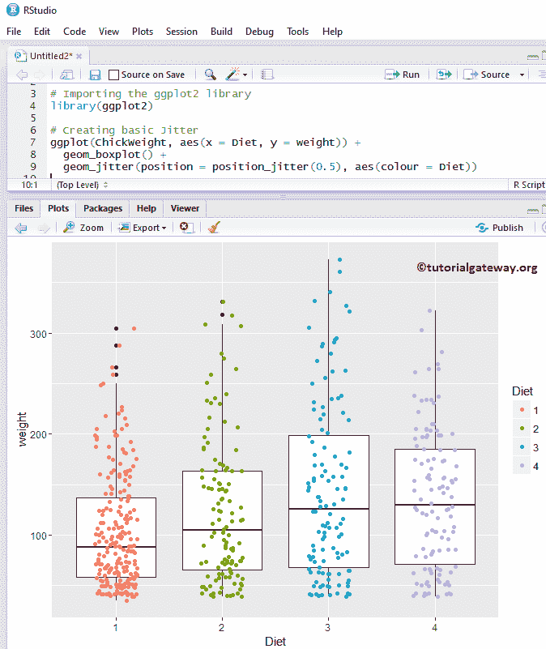

#### 将 Boxplot 添加到 R ggplot2 抖动 2

在本例中，我们使用 notch 参数在方框的每一侧画一条线

```
# Add Boxplot to R ggplot Jitter

# Importing the ggplot2 library
library(ggplot2)

# Creating basic Jitter
ggplot(ChickWeight, aes(x = Diet, y = weight)) + 
  geom_boxplot(notch = TRUE) +
  geom_jitter(position = position_jitter(0.5), aes(colour = Diet))
```

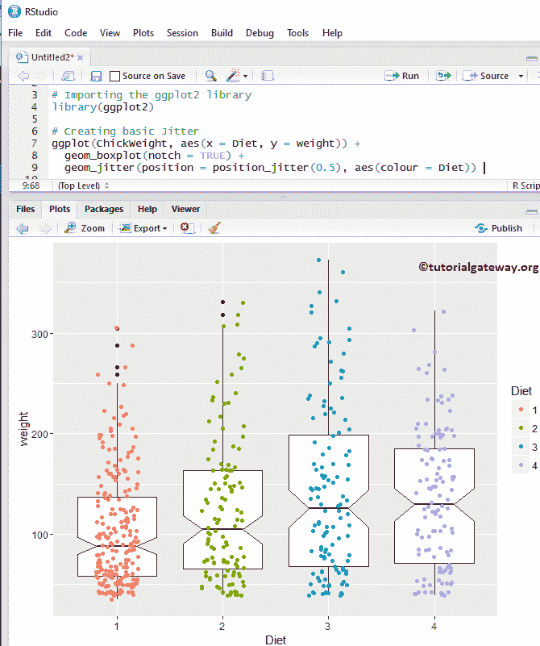

### 将小提琴绘图添加到 R ggplot2 抖动

在这个例子中，我们展示了如何使用 geom_violin 函数将 Violin Plot 添加到抖动中。

提示:请参考 [R ggplot2 小提琴剧情](https://www.tutorialgateway.org/r-ggplot2-violin-plot/)文章了解小提琴剧情论点。

```
# Add Violin Plot to R ggplot Jitter

# Importing the ggplot2 library
library(ggplot2)

# Creating basic Jitter
ggplot(ChickWeight, aes(x = Diet, y = weight, color = Diet)) + 
  geom_violin(fill = "midnightblue") +
  geom_jitter(position = position_jitter(0.2)) 
```

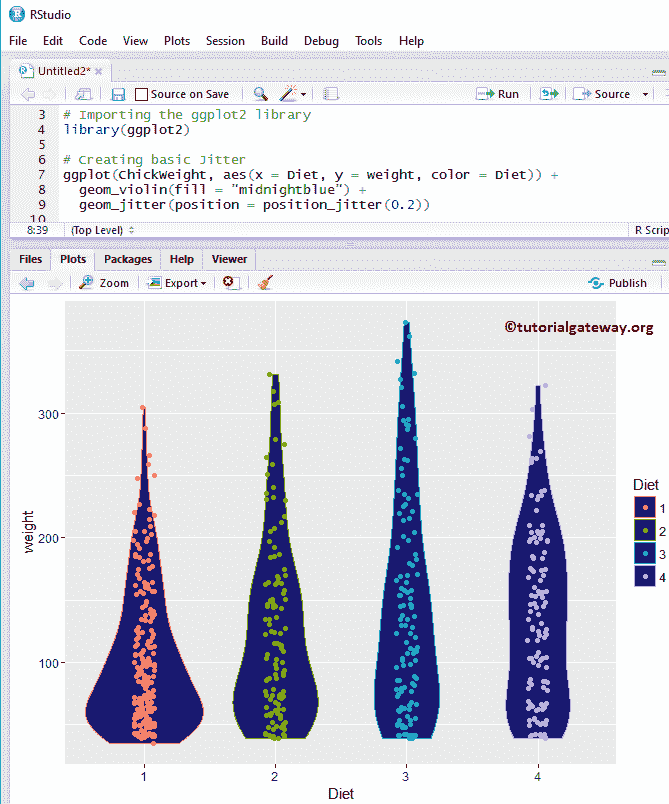

### 更改图形 2 抖动的图例位置

默认情况下，ggplot 将图例放置在抖动的右侧。让我们看看如何从右到上改变图例位置。注意，您可以使用 legend.position = "none "来完全删除图例。

```
# Alter Legend Position in R ggplot Jitter

# Importing the ggplot2 library
library(ggplot2)

# Creating basic Jitter
ggplot(ChickWeight, aes(x = Diet, y = weight, color = Diet)) + 
  geom_violin(fill = "midnightblue") +
  geom_jitter(position = position_jitter(0.2)) +
  theme(legend.position = "top")

```

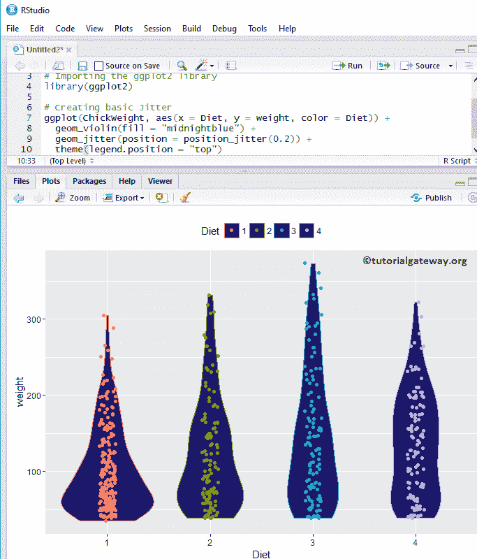

### 为 ggplot2 抖动指定名称

如何使用 labs 函数为 gplot 抖动图、X 轴和 Y 轴分配名称？

```
# Alter Legend Position in R ggplot Jitter

# Importing the ggplot2 library
library(ggplot2)

# Creating basic Jitter
ggplot(ChickWeight, aes(x = Diet, y = weight, color = Diet)) + 
  geom_violin(fill = "midnightblue") +
  geom_jitter(position = position_jitter(0.2)) +
  theme(legend.position = "top")
```

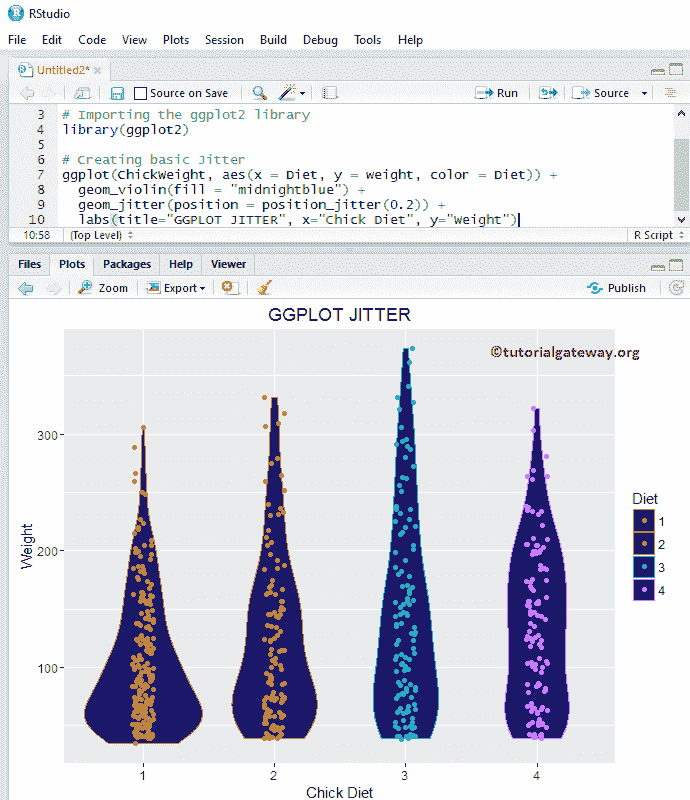

## 更改 R ggplot2 抖动主题

在本例中，我们展示了如何更改 ggplot 抖动的默认主题

*   theme_dark():我们使用这个函数将抖动默认主题更改为 dark。如果你输入主题，那么 [R Studio](https://www.tutorialgateway.org/download-r-studio-and-install/) 智能将显示可用选项的列表。例如，主题 _ 灰色()

```
# Change the Theme of a R ggplot Jitter

# Importing the ggplot2 library
library(ggplot2)

# Creating basic Jitter
ggplot(ChickWeight, aes(x = Diet, y = weight, color = Diet)) + 
  geom_violin(fill = "midnightblue") +
  geom_jitter(position = position_jitter(0.2)) +
  labs(title="GGPLOT JITTER", x="Chick Diet", y="Weight") +
  theme_dark()
```

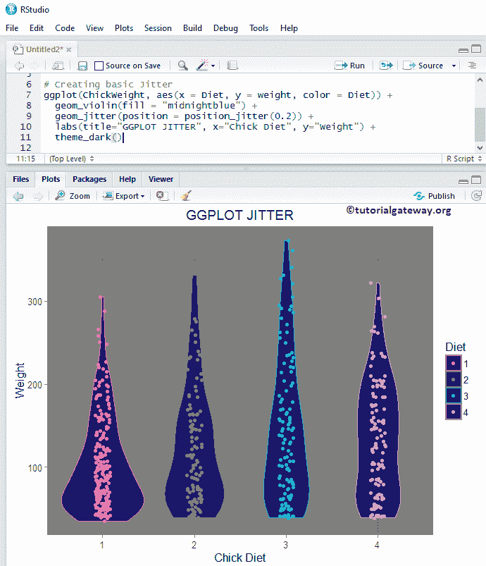