# R ggplot2 散点图

> 原文：<https://www.tutorialgateway.org/r-ggplot2-scatter-plot/>

R ggplot2 散点图对于可视化任意两组数据之间的关系非常有用。让我们看看如何创建散点图，格式化它的大小，形状，颜色，添加线性级数，改变散点图的主题，用 R 编程语言中的 ggplot2 举例说明。

对于这个 r ggplot 散点图演示，我们将使用 R Programming 提供的钻石数据集，该数据集内的数据为:


## 使用 R 中的 gplot2 创建散点图

在本例中，我们向您展示了使用 R ggplot2 包创建散点图的不同方法。我们使用上面显示的钻石数据集，它是由 RStudio 提供的。

提示:默认情况下没有安装 R ggplot2 包来绘制这个。请参考[安装包](https://www.tutorialgateway.org/install-r-packages/)文章安装 [R 编程](https://www.tutorialgateway.org/r-programming/)包。

```
# Create Scatter Plot using ggplot2
# Importing the ggplot2 library
library(ggplot2)

# Default way 
ggplot(data = diamonds, aes(x = carat, y = price)) + geom_point()

# Approach 2 
ggplot(diamonds, aes(x = carat, y = price)) + geom_point()

# Approach 3
ggplot(diamonds) + geom_point(aes(x = carat, y = price))

# Fourth Approach
ggplot() + geom_point(data = diamonds, aes(x = carat, y = price))
```

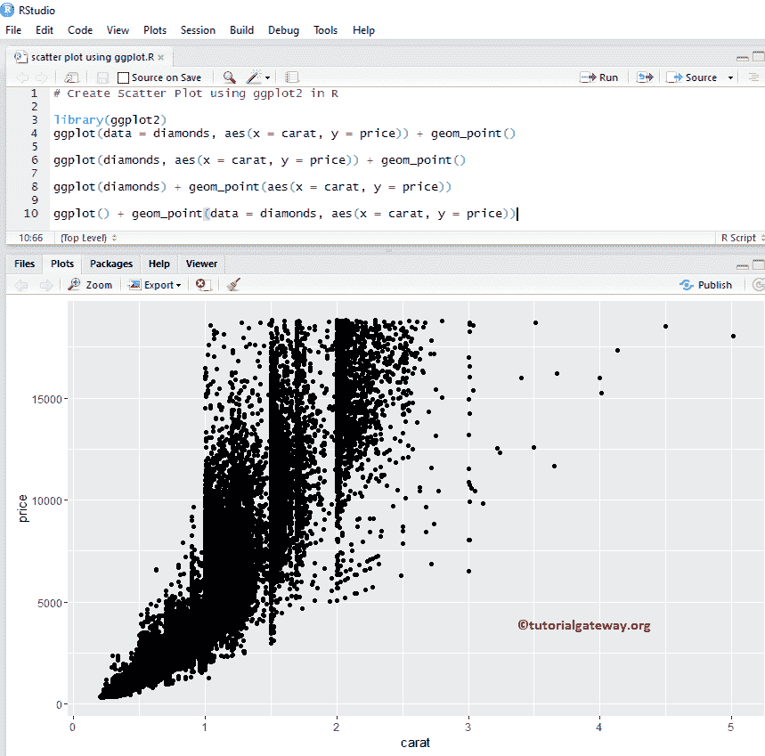

### 在 R 中使用 ggplot2 更改散点图的颜色

在这个例子中，我们改变了散点图的颜色

*   颜色:请指定您想要使用的颜色。例如“红色”、“蓝色”、“绿色”等。在本例中，我们使用剪切列中的值作为颜色。您可以尝试将其更改为任何其他列。
*   scale_color_manual:默认情况下，color 参数会分配一些默认颜色，要改变这一点，我们可以使用这个函数。从下面的代码片段中，您可以观察到我们为每个钻石切割分配了一些随机的颜色。

注意:如果需要从外部文件导入数据，那么请参考 [R Read CSV](https://www.tutorialgateway.org/r-read-csv-function/) 一文了解导入 CSV 文件。

```
# Changing Colors
library(ggplot2)
ggplot() + 
        geom_point(data = diamonds, 
                   aes(x = carat, 
                       y = price, 
                       color = cut)) +
        scale_color_manual(values = c("orchid", "chocolate4", 
                                      "goldenrod2", "tomato2", "midnightblue"))
```

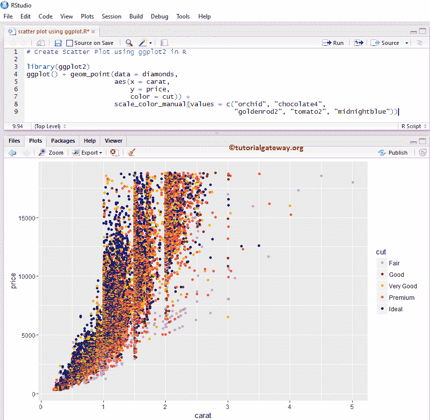

### 在 R 中使用 ggplot2 更改散点图的形状和大小

在这个例子中，我们改变了散点图中一个点的大小和形状。

*   形状:此参数可以帮助您将默认点更改为任何其他形状。或者也给它分配任何列值，就像我们在这个例子中所做的那样。
*   大小:它有助于改变每个点的大小。

```
# Changing Shapes
library(ggplot2)
ggplot(diamonds)  + 
  geom_point(aes(x = carat, 
                 y = price, 
                 color = clarity, 
                 shape = cut)) + 
  scale_shape_manual(values = c(1, 4, 9, 7, 5)) +
  scale_color_manual(values = c("orchid", "chocolate4", "goldenrod2", 
                                "pink3", "tomato2", "midnightblue",
                                "khaki4" ,"seagreen"))
```

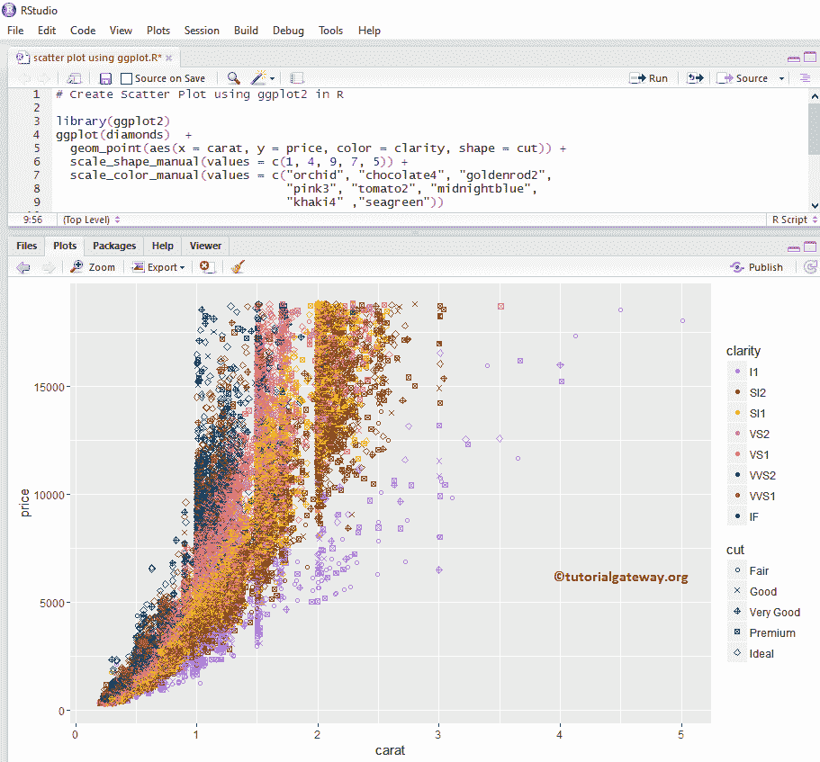

### 在 R 中使用 gplot2 更改散点图的轴

在这个 R 示例中，我们展示了如何更改由 ggplot 散点图绘制的默认轴限制。

*   scale_x_continuous:这个函数可以帮助指定 X 轴的限制
*   连续缩放:它有助于指定 Y 轴的限制

```
library(ggplot2)
ggplot(diamonds)  + 
  geom_point(aes(x = carat, y = price, color = clarity, shape = cut)) + 
  scale_x_continuous(limits = c(0, 7)) +
  scale_y_continuous(limits = c(0, 25000)) +  
  scale_color_manual(values = c("orchid", "chocolate4", "goldenrod2", 
                                "pink3", "tomato2", "midnightblue",
                                "khaki4" ,"seagreen"))
```

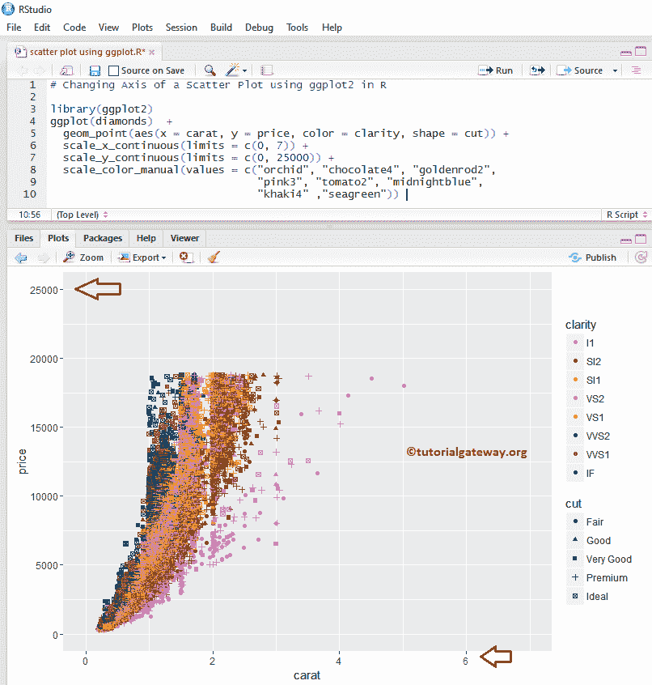

### 使用 R 中的 gplot2 向散点图添加标签

在这个例子中，我们为散点图中的每个点添加标签。

```
library(ggplot2)
ggplot(diamonds)  + 
  geom_point(aes(x = carat, 
                 y = price, 
                 color = clarity, 
                 shape = cut)
             ) + 
  geom_text(diamonds, 
            mapping = aes(x = carat, y = price), 
            label = rownames(diamonds))
```

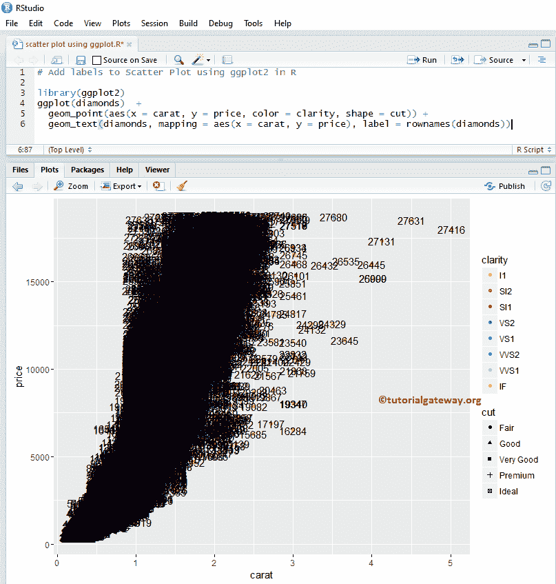

### 使用 R 中的 gplot2 更改散点图的图例位置

默认情况下，ggplot 将图例放置在右侧。在这里，我们将图例位置从右更改为顶部。请记住，您可以使用图例。position = "none "完全删除图例。

```
library(ggplot2)
ggplot(diamonds)  + 
  geom_point(aes(x = carat, y = price, color = cut)) + 
  theme(legend.position = "top") +
  scale_color_manual(values = c("midnightblue", "chocolat4", "goldenrod2",
                                "orchid", "tomato2"))
```

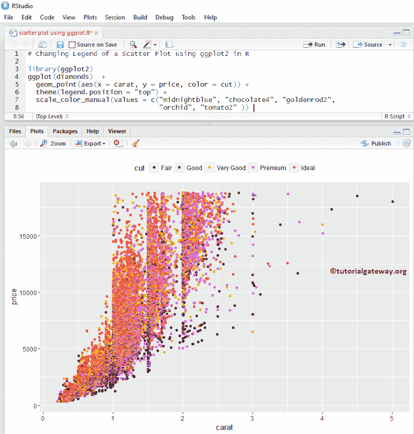

## 添加回归线

以下示例显示了如何向区域添加一个名为回归线的新图层。

### 使用 R 中的 gplot2 向散点图添加平滑曲线

在本例中，我们展示了如何使用 geom_smooth()函数将平滑曲线添加到 R 中的散点图中。

```
library(ggplot2)
ggplot(diamonds, aes(x = carat, y = price))  + 
  geom_point(color = "midnightblue") + 
  geom_smooth()
```

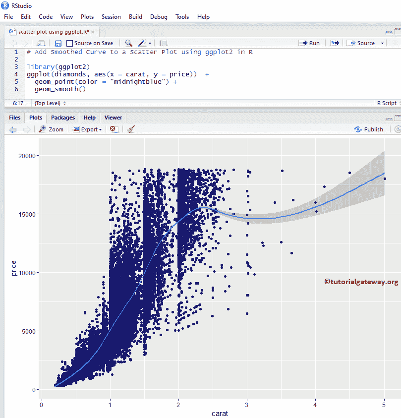

### 使用 R 中的 ggplot 从散点图中移除标准误差

默认情况下，geom_smooth()函数将标准误差添加到平滑曲线中。让我们从散点图中去掉平滑曲线。

```
library(ggplot2)
ggplot(diamonds, aes(x = carat, y = price))  + 
  geom_point(color = "midnightblue") + 
  geom_smooth(se = FALSE, color = "goldenrod2")
```

从上面的代码片段中，可以看到我们更改了点和平滑曲线的默认颜色。


### 使用 R 中的 gplot2 向散点图添加多条回归线

在本例中，我们使用方法参数将多条回归线添加到散点图中。在这里，我们没做多少；我们刚刚添加了颜色参数。这意味着 geom_smooth()函数正在为所有不同的钻石切割绘制回归线。

```
library(ggplot2)
ggplot(diamonds, aes(x = carat, y = price, color = cut))  + 
  geom_point() + 
  geom_smooth(method = "auto", se = FALSE) +
  scale_color_manual(values = c("orchid", "chocolate4", 
                                "goldenrod2", "tomato2", "midnightblue"))
```


### 使用 R 中的 ggplot2 将线性模型添加到散点图中

这里，我们将线性级数添加到散点图中，将方法参数默认值更改为 lm(线性模型)。

```
library(ggplot2)
ggplot(diamonds, aes(x = carat, y = price, color = cut))  + 
  geom_point() + 
  geom_smooth(method = "lm", se = FALSE) +
  scale_color_manual(values = c("orchid", "chocolate4", 
                                "goldenrod2", "tomato2", "midnightblue"))
```

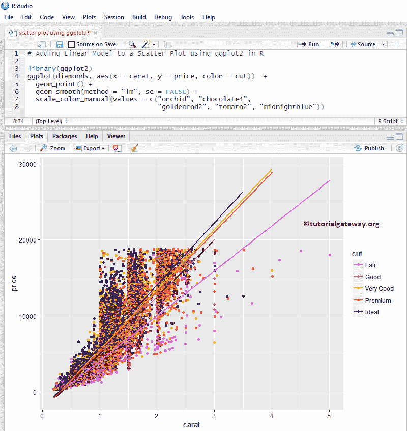

## 在 R 中使用 ggplot2 更改散点图的主题

让我们为散点图指定一个名称，并使用 labs 函数更改 X 轴和 Y 轴的默认名称。

*   theme_dark():使用此功能将默认主题更改为深色。键入 theme_ 然后 R Studio 智能显示可用选项。例如，theme_grey()。
*   标题:提供标题。
*   X:请指定 X 轴的标签。
*   Y:指定 Y 轴的标签。

```
# Changing Theme 

library(ggplot2)
ggplot(diamonds, aes(x = carat, y = price, color = cut))  + 
  geom_point() + 
  geom_smooth(method = "auto", se = FALSE) +
  scale_color_manual(values = c("orchid", "chocolate4", 
                                "goldenrod2", "tomato2", "midnightblue")) +
  labs(title = "Customized Scatter Plot for Diamonds", 
       x = "Diamond Weight", y = "Price in US Dollar") +
  theme_dark()

```

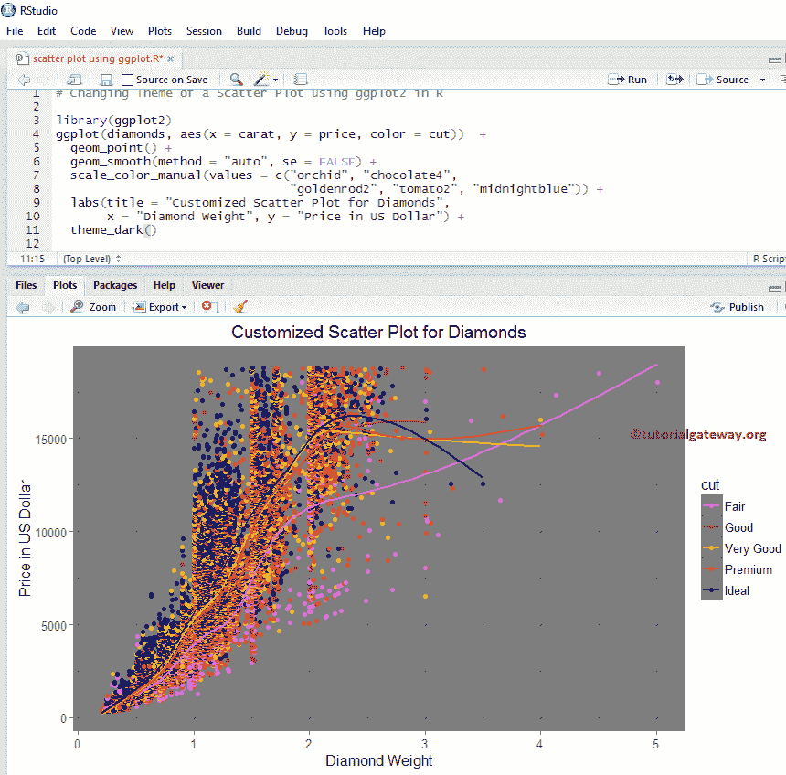

## 添加 2D 密度

以下示例显示了如何将 2D 密度图层添加到散点图区域。

### 使用 R 中的 ggplot2 将 2D 密度添加到散点图中

ggplot2 允许我们在图表中添加多个图层。在本例中，我们使用 geom_density_2d()函数将 2D 密度图层添加到散点图中。

```
# Adding Linear Model 

library(ggplot2)
ggplot(diamonds, aes(x = carat, y = price))  + 
  geom_point() + 
  geom_density_2d()
```

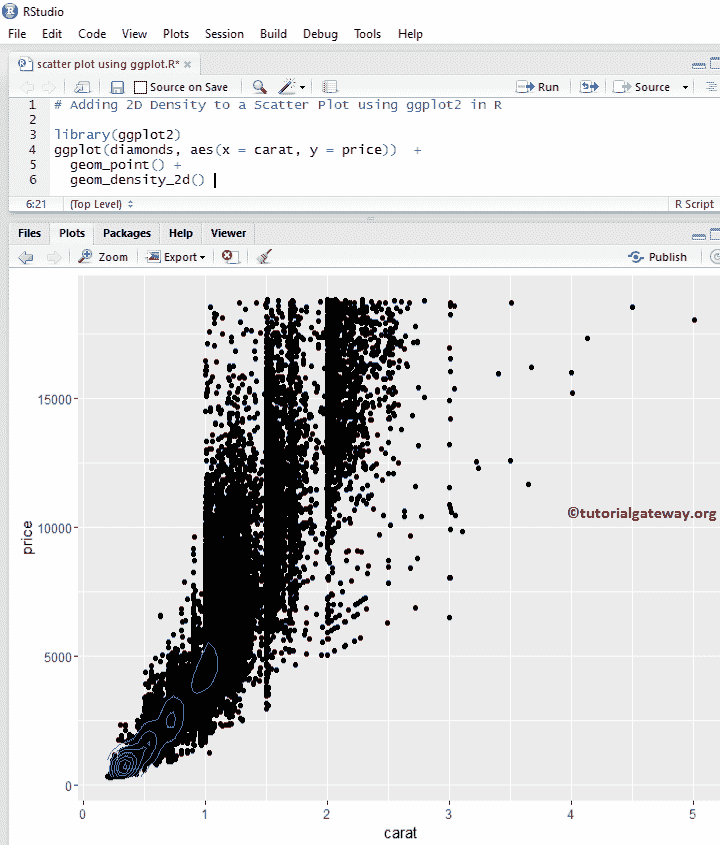

我认为钻石数据集太大，无法显示 2D 密度。让我将数据集更改为忠实的

```
# Adding 2D Density

library(ggplot2)
ggplot(faithful, aes(x = eruptions, y = waiting))  + 
  geom_point() + 
  geom_density_2d()
```

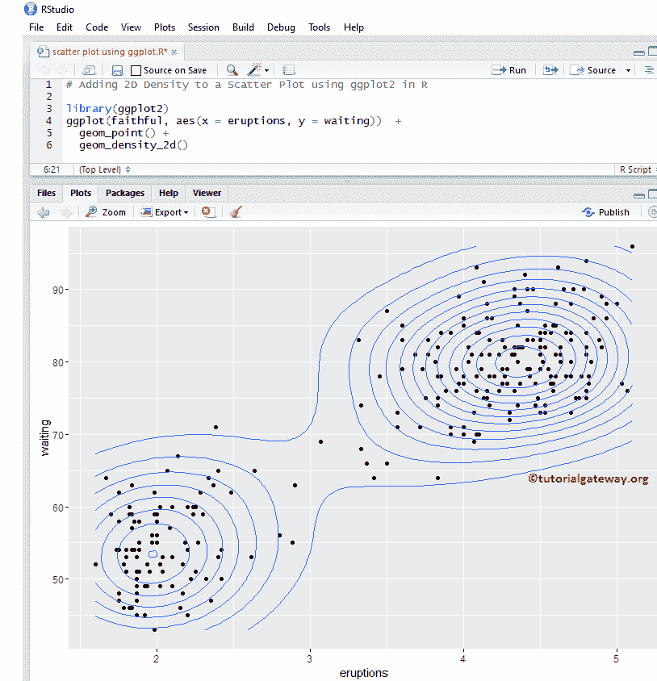

### 使用 R 中的 ggplot 改变 2D 密度散点图的颜色

让我们使用颜色参数更改 R ggplot 包中散点图和 geom_density_2d()函数绘制的默认颜色。

```
# Change Colors - 2D Density

library(ggplot2)
ggplot(faithful, aes(x = eruptions, y = waiting))  + 
  geom_point(color = "midnightblue") + 
  geom_density_2d(colour = "chocolate")
```

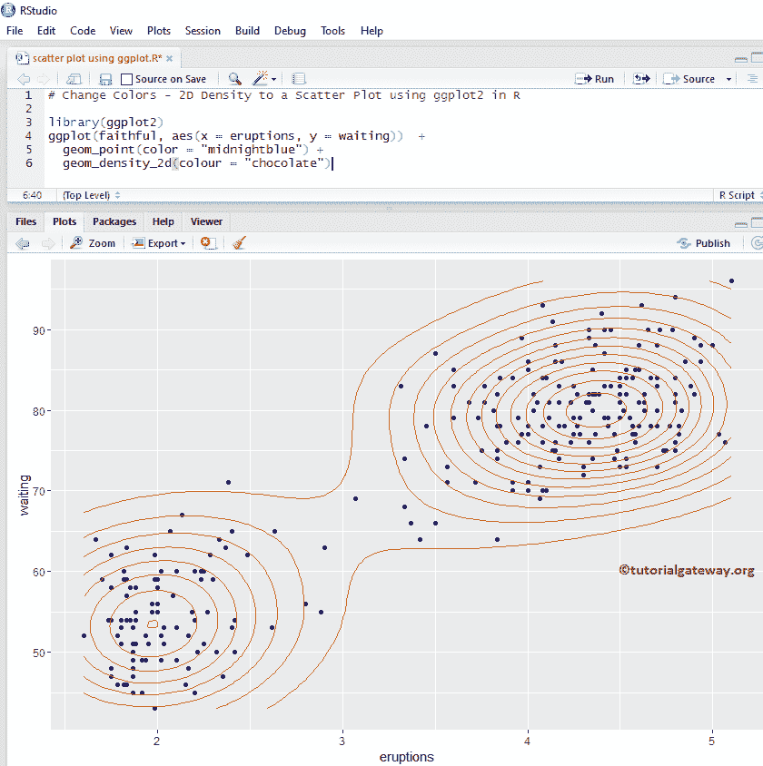

### 使用 R 中的 ggplot2 将 2D 统计密度添加到散点图中

此示例显示如何使用 stat_density_2d()函数将 geom 绘制的 R ggplot 散点图默认线更改为点。

```
# Changing Geom - 2D Density

library(ggplot2)
ggplot(faithful, aes(x = eruptions, y = waiting))  + 
  geom_point(color = "midnightblue") + 
  stat_density_2d(geom = "point")
```

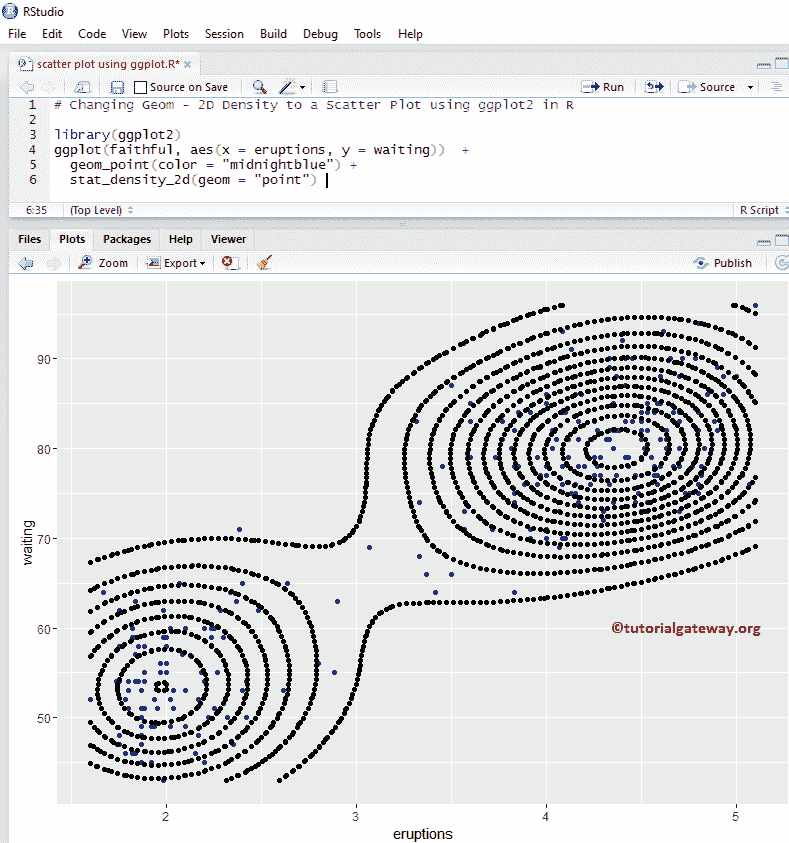

### 使用 R 中的 ggplot 更改 2D 统计密度散点图的颜色

让我们使用 R ggplot2 中的 scale_fill_gradient()函数来更改默认的 2D 统计密度。有很多功能，如 scale_fill_gradient2 等。，所以试着改变它们的外观和感觉。

```
# Changing Geom - 2D Density

library(ggplot2)
ggplot(faithful, aes(x = eruptions, y = waiting))  + 
  geom_point(color = "midnightblue") + 
  stat_density_2d(geom = "polygon",  aes(fill = ..level..)) + 
  scale_fill_gradient(low =  "midnightblue", high = "chocolate")
```

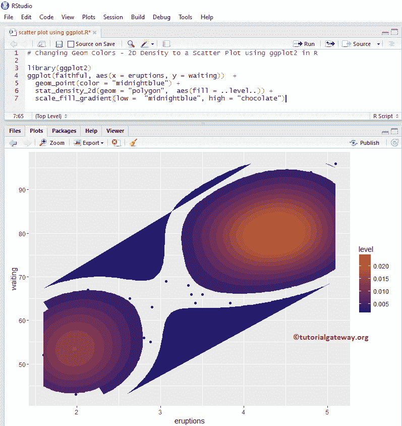