# R ggplot2 小提琴剧情

> 原文：<https://www.tutorialgateway.org/r-ggplot2-violin-plot/>

R ggplot2 小提琴图有助于通过特定数据以图形方式可视化数字数据组。让我们看看如何在 R 中创建一个 gplot2 小提琴绘图，格式化它的颜色。和水平绘制，用 R ggplot2 绘制多个小提琴图，并举例说明。在这个 R ggplot 小提琴绘图演示中，我们使用了 R 提供的钻石数据集。

## R ggplot2 小提琴剧情语法

在 R 编程中绘制小提琴图的语法是

```
geom_violin(mapping = NULL, data = NULL, stat = "ydensity",
  position = "dodge", ..., draw_quantiles = NULL, trim = TRUE,
  scale = "area", na.rm = FALSE, show.legend = NA, inherit.aes = TRUE)
```

## 创建一个基本的 R ggplot2 小提琴情节

在本例中，我们展示了如何使用 ggplot2 包创建一个基本的小提琴绘图。对于这个例子，我们将使用 R Studio 提供的钻石数据集。

提示:默认情况下不安装 ggplot2 包。请参考[安装 R 包](https://www.tutorialgateway.org/install-r-packages/)文章了解安装包。

```
library(ggplot2)

ggplot(diamonds, aes(x = cut, y = price)) + 
  geom_violin()
```

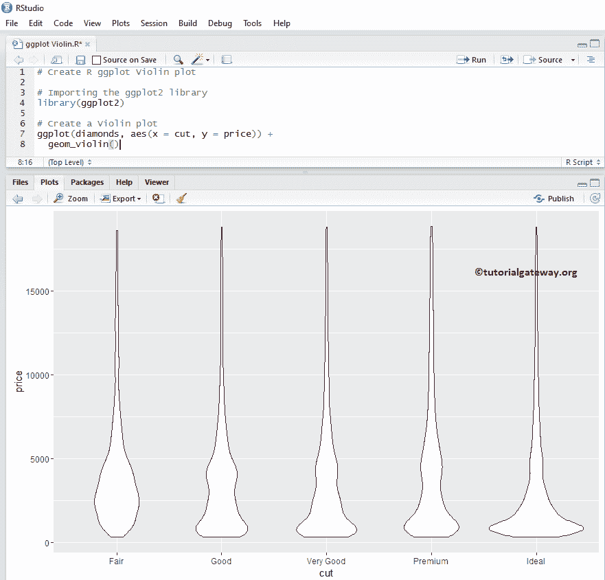

## 创作 R ggplot2 小提琴剧情

在我们之前的 R ggplot 示例中，数据非常庞大，因此没有适当小提琴情节的可见性。在本例中，我们用 log10 缩放 y 值，并使用缩放后的 y 值创建此图表。

注意:如果需要从外部文件导入数据，那么请参考[读取 CSV](https://www.tutorialgateway.org/r-read-csv-function/) 了解在 [R 编程](https://www.tutorialgateway.org/r-programming/)中导入 CSV 文件。

```
library(ggplot2)

ggplot(diamonds, aes(x = cut, y = price)) + 
  geom_violin() + scale_y_log10()
```

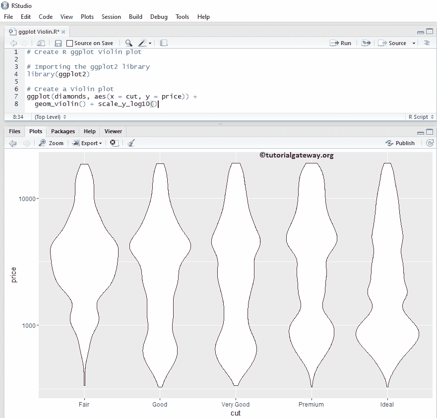

### 在 R 中改变小提琴曲的颜色

在本例中，我们展示了如何使用 fill 参数更改颜色

*   填充:请指定您想要使用的颜色。在控制台中键入 colors()以获取 R 编程中可用的颜色列表

```
# Change Colors

library(ggplot2)

ggplot(diamonds, aes(x = cut, y = price)) + 
  geom_violin(fill = "seagreen") + scale_y_log10()
```

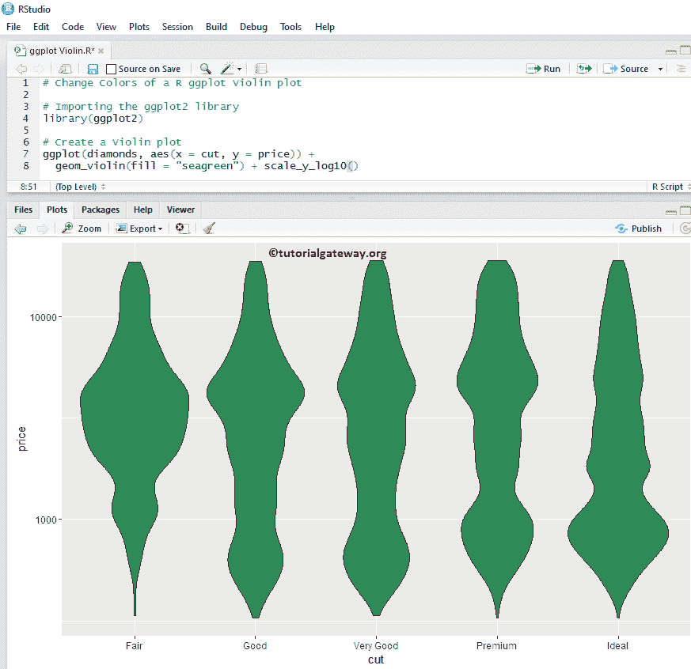

#### 使用列更改颜色

在这个 R ggplot 示例中，我们展示了如何使用列数据更改小提琴的绘图颜色。这里，我们使用剪切列数据来区分颜色。

```
library(ggplot2)

ggplot(diamonds, aes(x = cut, y = price, fill = cut)) + 
  geom_violin() + scale_y_log10()
```

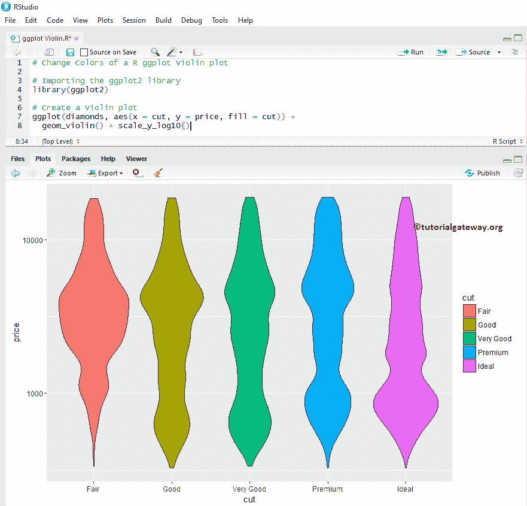

### 使用列修剪 R 小提琴图

让我们看看如何修剪，而不是使用修剪参数修剪数据

```
# Trimming 
library(ggplot2)

ggplot(diamonds, aes(x = clarity, y = price, fill = clarity)) + 
  geom_violin(trim = FALSE) + scale_y_log10())
```

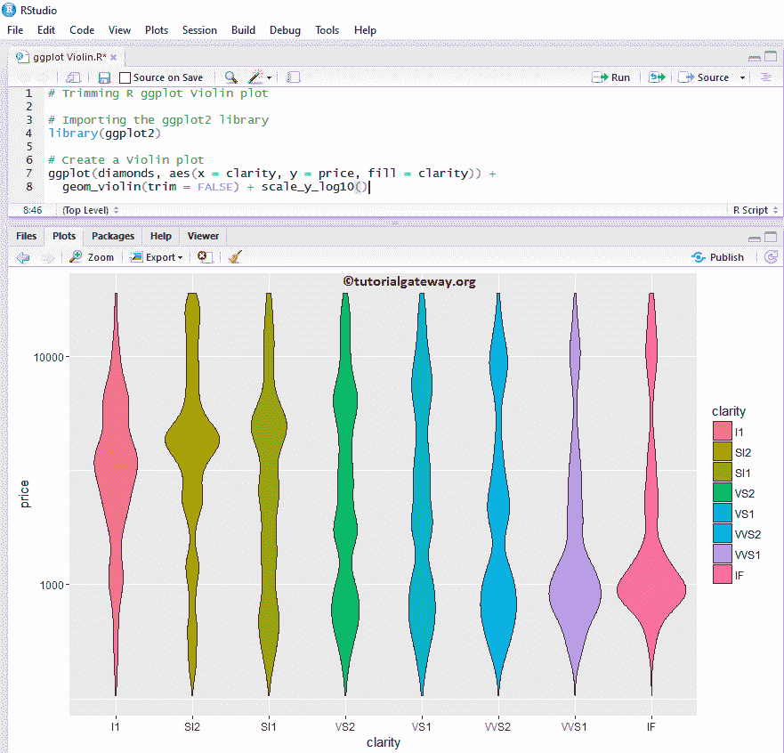

### 添加平均值和中位数

让我们看看如何使用 stat_summary 函数将平均值和中值添加到 R ggplot2 小提琴图中。

```
# Adding Mean & Median 

library(ggplot2)

ggplot(diamonds, aes(x = cut, y = price, fill = cut)) + 
  geom_violin() + scale_y_log10() +
  stat_summary(fun.y = "mean", geom = "point", shape = 8, size = 3, color = "midnightblue") +
  stat_summary(fun.y = "median", geom = "point", shape = 2, size = 3, color = "red")
```

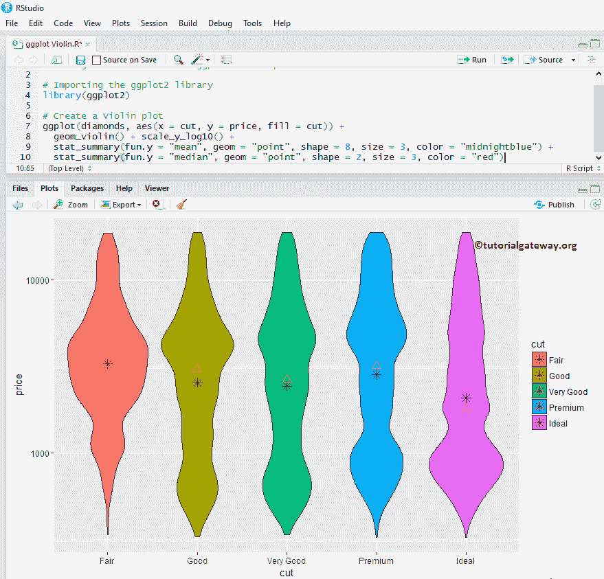

### 将方框图添加到 R ggplot2 小提琴图中

在本例中，我们展示了如何使用 geom_boxplot 函数将 boxplot 添加到 R Violin Plot。它可以帮助我们看到中位数，以及图表的四分位数。

提示:请参考[R ggplot 2 Boxsplot](https://www.tutorialgateway.org/r-ggplot2-boxplot/)文章了解 Boxsplot 论点。

```
library(ggplot2)

ggplot(diamonds, aes(x = cut, y = price, fill = cut)) + 
  geom_violin() + scale_y_log10() +
  geom_boxplot(width = 0.2)
```

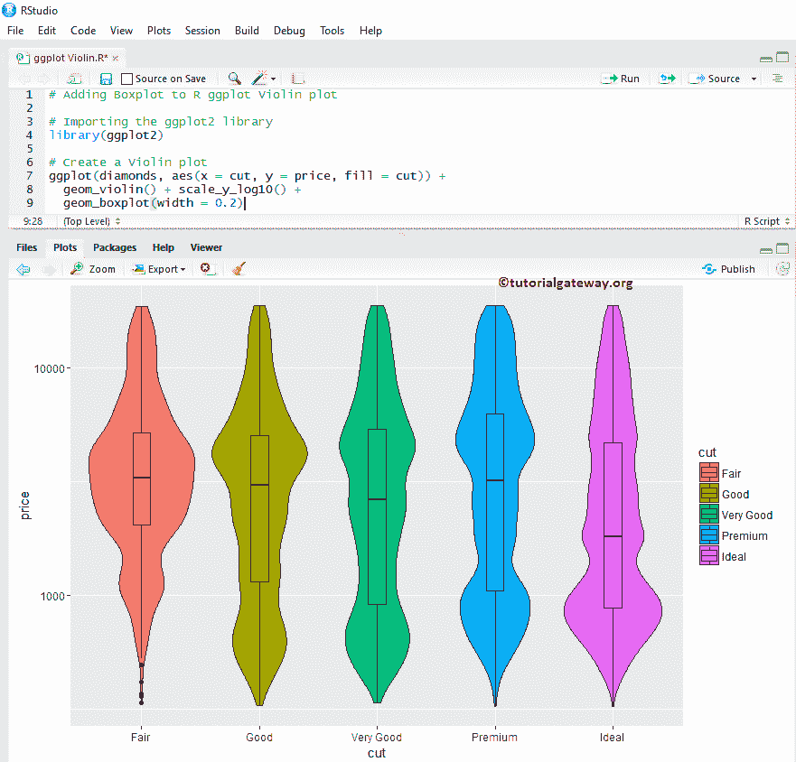

### 改变 R ggplot2 小提琴剧情的图例位置

默认情况下，ggplot 将图例放置在右侧。

在本例中，我们将 R ggplot 小提琴图的图例位置从右更改为顶部。注意，您可以使用图例。position = "none "完全删除图例。

```
library(ggplot2)

ggplot(diamonds, aes(x = cut, y = price, fill = cut)) + 
  geom_violin() + scale_y_log10() +
  geom_boxplot(width = 0.2) +
  theme(legend.position = "top")
```

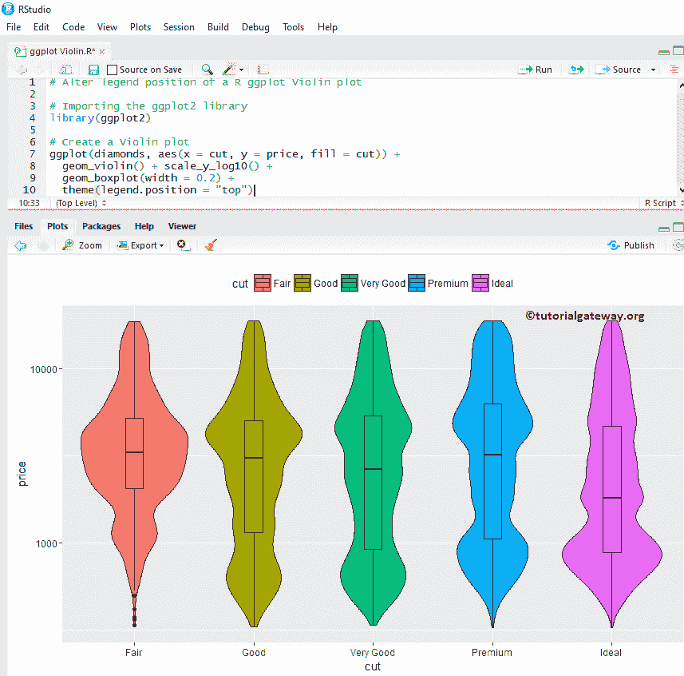

## R 中的水平 gplot 小提琴图

在这个 R ggplot 示例中，我们使用 coord_flip()函数将默认的垂直更改为水平

```
library(ggplot2)

ggplot(diamonds, aes(x = cut, y = price, fill = cut)) + 
  geom_violin() + scale_y_log10() +
  geom_boxplot(width = 0.2) +
  coord_flip()
```

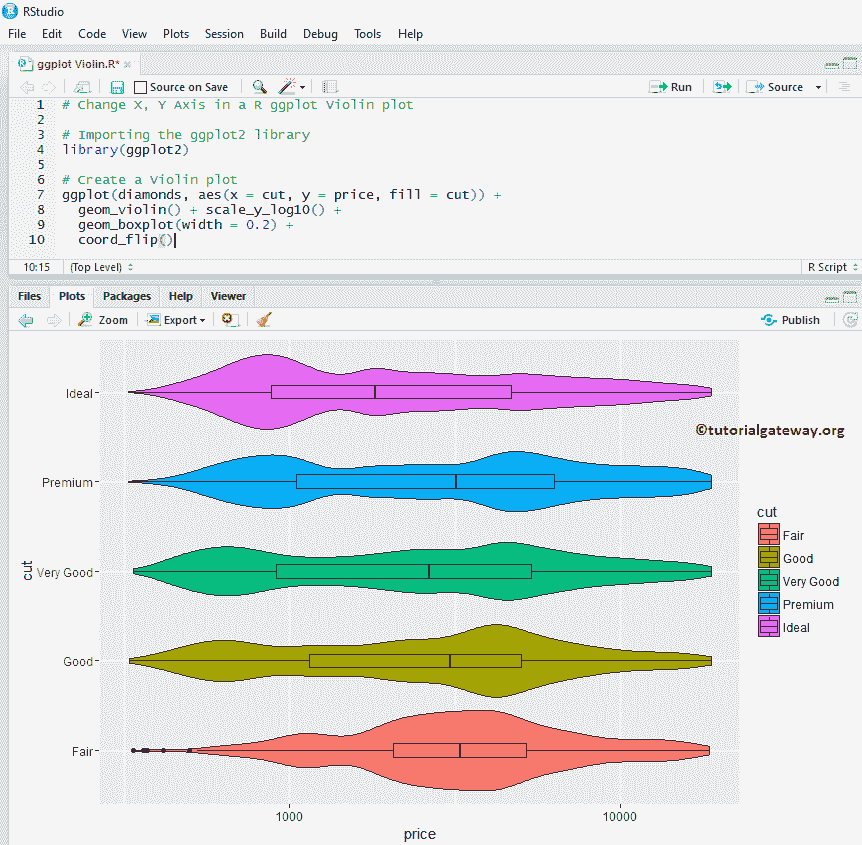

## 多幅 gplot 小提琴图

在这个 R ggplot 示例中，我们展示了如何对多个小提琴情节进行分组

```
library(ggplot2)

ggplot(diamonds, aes(x = cut, y = price, fill = clarity)) + 
  geom_violin() + scale_y_log10()
```

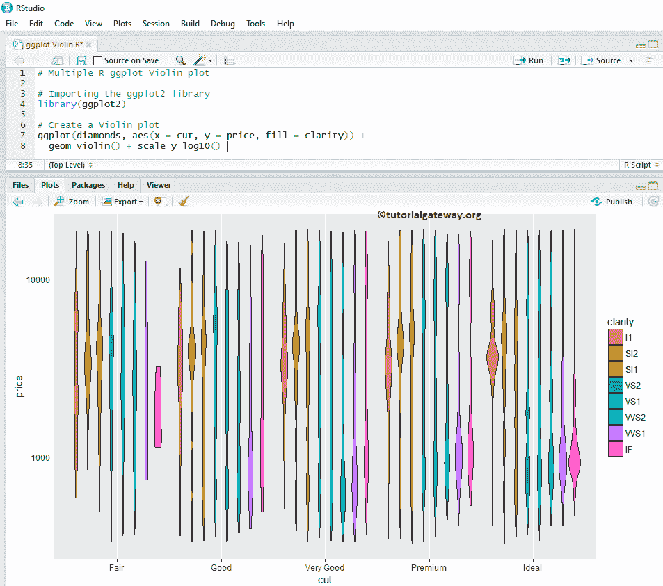

### 如何在 R ggplot2 小提琴剧情中使用刻面

这个 R ggplot 例子，我们绘制多个小提琴图，通过根据列值划分数据。在这里，我们使用清晰度列数据来划分它们。

```
library(ggplot2)

ggplot(diamonds, aes(x = cut, y = price, fill = clarity)) + 
  geom_violin(trim= FALSE) + scale_y_log10() +
  facet_wrap(~ clarity)
```

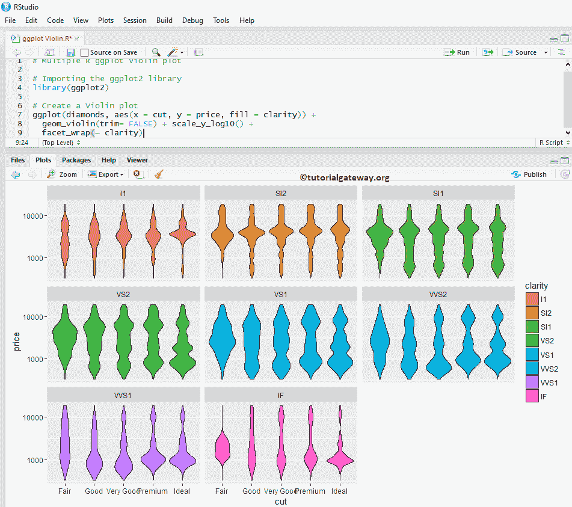

默认情况下，facet_wrap()为 alt 指定相同的 y 轴。但是，您可以通过添加一个名为“比例”的属性来更改每个属性(给出独立的轴)。facet_wrap(~清晰度，scale = "free ")。

## 指定名称

在本例中，我们向您展示了如何使用 labs 函数为图表、X 轴和 Y 轴分配名称

```
library(ggplot2)

ggplot(diamonds, aes(x = cut, y = price, fill = clarity)) + 
  geom_violin(trim= FALSE) + scale_y_log10() +
  facet_wrap(~ clarity) +
  labs(title="GGPLOT VIOLIN PLOT", x="Price in Dollars", y="Cut")
```

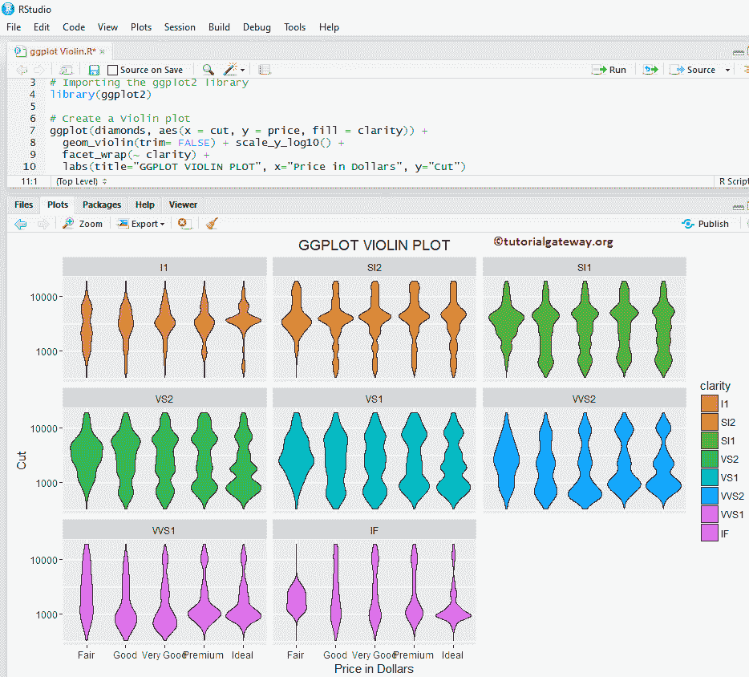

## 更改主题

在这个例子中，我们展示了如何改变 R ggplot 小提琴剧情的默认主题。

*   theme_dark():我们使用这个函数将默认主题更改为 dark。如果输入主题 _，则 [R Studio](https://www.tutorialgateway.org/download-r-studio-and-install/) 智能显示可用选项列表。例如，theme_grey()。

```
library(ggplot2)

ggplot(diamonds, aes(x = cut, y = price, fill = cut)) + 
  geom_violin(trim = FALSE) + scale_y_log10() +
  geom_boxplot(width = 0.2) +
  labs(title="GGPLOT VIOLIN PLOT", x="Price in Dollars", y="Cut") +
  theme_dark()
```

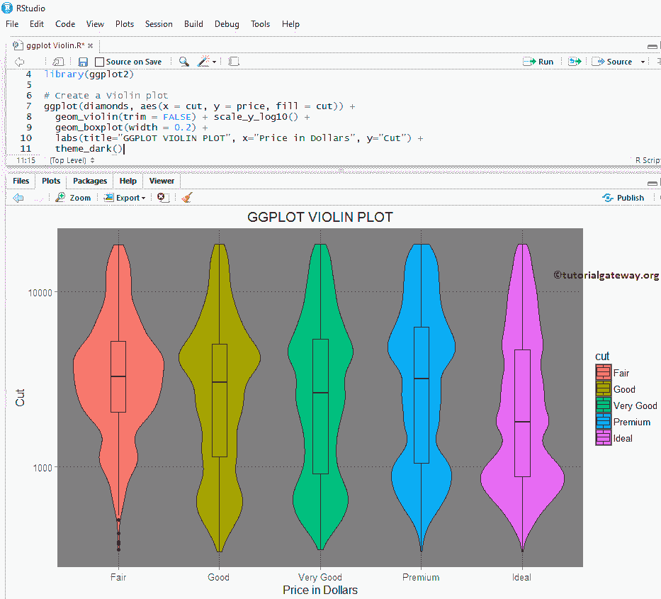