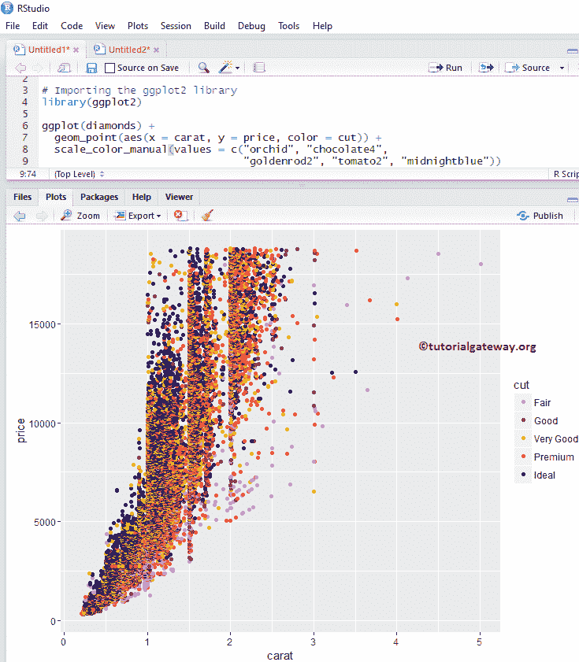

# 使用 ggsave 保存 R ggplot

> 原文：<https://www.tutorialgateway.org/save-r-ggplot-using-ggsave/>

R ggplot2 包对于绘制不同类型的图表和图形很有用，但是保存这些图表也很重要。为了保存图形，我们可以使用传统的方法(使用导出选项)，或者使用 ggplot2 包提供的 ggsave 函数。让我们看看如何使用 R ggsave 函数保存 R ggplot 绘制的图，并通过示例导出选项。

在 R 编程中保存 ggsave 的语法是

```
ggsave(filename)
```

这个 R ggsave 背后的复杂语法是:

```
ggsave(filename, plot = last_plot(), device = NULL, path = NULL,
       scale = 1, width = NA, height = NA, dpi = 300, limitsize = TRUE, ..,
       units = c("in", "cm", "mm"))
```

## 创建散点图

在这个例子中，我们绘制了一个散点图，我们将保存这个散点图。建议大家参考 [R ggplot2 散点图](https://www.tutorialgateway.org/r-ggplot2-scatter-plot/)一文了解绘制散点图。

提示:默认情况下不安装 ggplot2 包。请参考[安装 R 包](https://www.tutorialgateway.org/install-r-packages/)一文安装 [R 编程](https://www.tutorialgateway.org/r-programming/)包。

```
# Importing the ggplot2 library
library(ggplot2)

ggplot(diamonds) + 
  geom_point(aes(x = carat, y = price, color = cut)) +
  scale_color_manual(values = c("orchid", "chocolate4", 
                                "goldenrod2", "tomato2", "midnightblue"))
```



## 使用 ggsave 将 R ggplot 另存为 PNG

让我们看看如何使用 R ggplot2 ggsave 函数将 ggplot 保存为 png 图像

```
# Saving R ggplot with R ggsave Function

# Importing the ggplot2 library
library(ggplot2)

ggplot(diamonds) + 
  geom_point(aes(x = carat, y = price, color = cut)) +
  scale_color_manual(values = c("orchid", "chocolate4", 
                                "goldenrod2", "tomato2", "midnightblue"))
# To save the ggplot as png
ggsave("diamonds.png")
```


让我们打开 diamonds.png 文件，看看


## 使用 ggsave 将 R ggplot 另存为 JPEG

在本例中，我们展示了如何使用 R ggplot2 ggsave 函数将 ggplot 保存为 jpeg 图像

```
# Saving R ggplot with R ggsave Function

# Importing the ggplot2 library
library(ggplot2)

ggplot(diamonds) + 
  geom_point(aes(x = carat, y = price, color = cut)) +
  scale_color_manual(values = c("orchid", "chocolate4", 
                                "goldenrod2", "tomato2", "midnightblue"))
# saving the scatterplot as jpeg
ggsave("diamonds2.jpeg")
```


让我们打开 diamonds2.jpeg 文件，看看


## 使用 ggsave 将 R ggplot 保存为 PDF

此示例显示了如何使用 R ggplot2 ggsave 函数将 ggplot 保存为 pdf 文件

```
# Saving R ggplot with R ggsave Function

# Importing the ggplot2 library
library(ggplot2)

ggplot(diamonds) + 
  geom_point(aes(x = carat, y = price, color = cut)) +
  scale_color_manual(values = c("orchid", "chocolate4", 
                                "goldenrod2", "tomato2", "midnightblue"))
# Saving R ggplot as pdf
ggsave("diamonds3.pdf")
```


让我们打开 diamonds.pdf 文件，看看


## 使用图形保存功能保存带有宽度和高度的图形

ggsave 功能还允许我们使用宽度和高度参数指定图像的宽度和高度

```
# Saving R ggplot with R ggsave Function

# Importing the ggplot2 library
library(ggplot2)

ggplot(diamonds) + 
  geom_point(aes(x = carat, y = price, color = cut)) +
  scale_color_manual(values = c("orchid", "chocolate4", 
                                "goldenrod2", "tomato2",
                                "midnightblue"))
ggsave("diamonds4.png", 
       width = 30, height = 20, units = "cm")

```


让我们打开 diamonds4.png 文件，看看


## 使用导出将图形另存为图像

让我们看看如何使用传统方法保存 ggplot。首先，转到绘图选项卡下的导出选项，并选择另存为图像..选项


选择“另存为图像”后..选项，将打开一个名为“将绘图另存为图像”的新窗口，请选择要保存的图像格式。


接下来，单击“目录”按钮选择文件目录，或者您想要保存图像的位置。从下面的截图中，可以观察到我们选择的是


R Programs 文件夹

接下来，您可以更改图像的宽度和高度。


完成设置后，单击保存按钮以相应的格式保存图像。

## 使用导出将图形保存为 PDF

在本例中，我们展示了如何使用传统方法将 ggplot 保存为 pdf。为此，请转到绘图选项卡下的导出选项，并选择另存为 PDF..选项。


选择“另存为 PDF”后..选项，将打开一个名为“将绘图另存为 PDF”的新窗口。请选择目录并更改 pdf 文件名。


从下面的截图，看到新保存的 png 和 pdf 文件。

