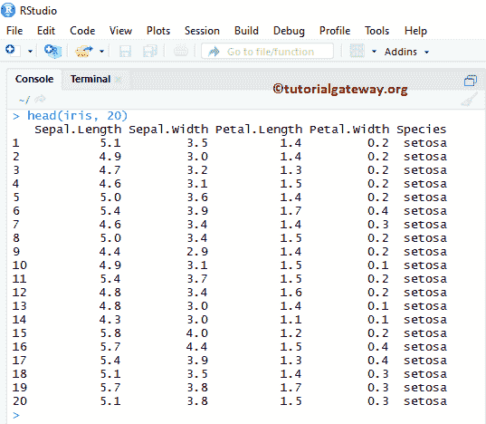
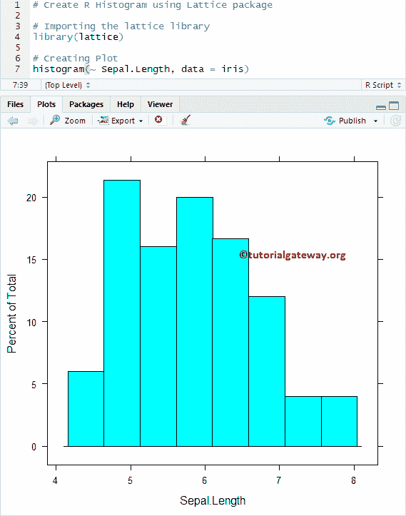
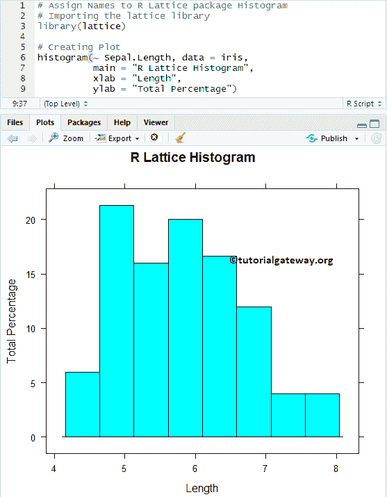
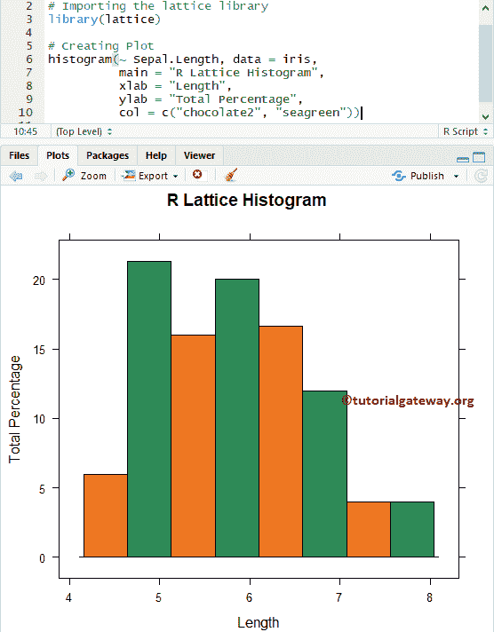
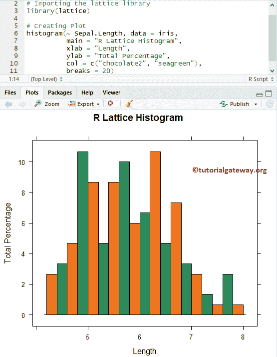
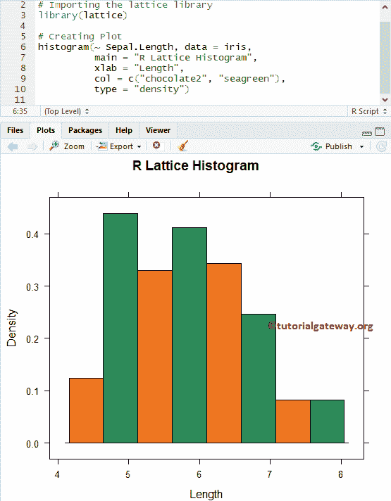
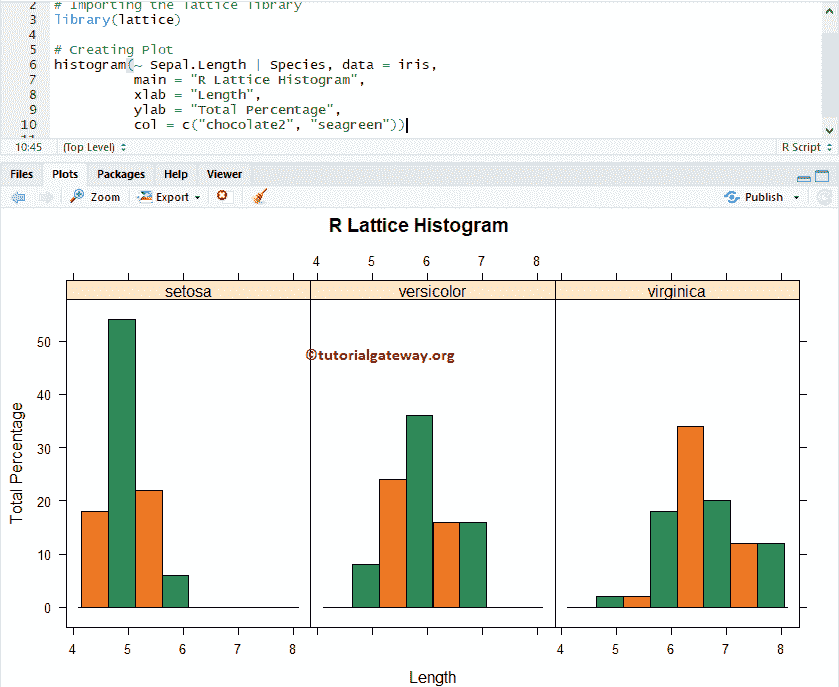

# R 中的点阵直方图

> 原文：<https://www.tutorialgateway.org/lattice-histogram-in-r/>

R 中的点阵直方图有助于统计信息的可视化。虽然看起来像条形图，但直方图以相等的间隔显示数据。让我们看看如何使用点阵库创建点阵直方图，格式化其颜色，添加标签，并绘制多个直方图。

## R 语法中的格直方图

R 编程中绘制点阵直方图的基本语法是

```
histogram(x,
          data,
          allow.multiple, outer = TRUE,
          auto.key = FALSE,
          aspect = "fill",
          panel = lattice.getOption("panel.histogram"),
          prepanel, scales, strip, groups,
          xlab, xlim, ylab, ylim,
          type = c("percent", "count", "density"),
          nint = if (is.factor(x)) nlevels(x)
          else round(log2(length(x)) + 1),
          endpoints = extend.limits(range(as.numeric(x), finite = TRUE), prop = 0.04),
          breaks,
          equal.widths = TRUE,
          drop.unused.levels = lattice.getOption("drop.unused.levels"),
          ...,
          lattice.options = NULL,
          default.scales = list(),
          default.prepanel = lattice.getOption("prepanel.default.histogram"),
          subscripts,
          subset).)
```

在我们进入这个例子之前，让我们看看这个点阵直方图例子将要使用的数据。虹膜是由



提供的日期设置

## 在 R 中创建点阵直方图

在本例中，我们向您展示了如何使用虹膜数据集创建点阵直方图，该数据集由 R Studio 提供。

```
# Create R Histogram using Lattice package

# Importing the lattice library
library(lattice)

# Creating Plot
histogram(~ Sepal.Length, data = iris)
```



### 给 R 中的点阵直方图命名

如果需要从外部文件导入 [R 编程](https://www.tutorialgateway.org/r-programming/)数据，请参考 [R Read CSV](https://www.tutorialgateway.org/r-read-csv-function/) 文章。在本例中，我们展示了如何使用 main、xlab 和 ylab 为点阵直方图、X 轴和 Y 轴分配名称。

*   main:您可以更改或提供直方图的标题。
*   请指定 X 轴的标签
*   伊拉布:请指定 Y 轴的标签

```
# Assign Names to R Lattice package Histogram

# Importing the lattice library
library(lattice)

# Creating Plot
histogram(~ Sepal.Length, data = iris,
          main = "R Lattice Histogram",
          xlab = "Length",
          ylab = "Total Percentage")
```



### 改变点阵直方图的颜色

在本例中，我们向您展示了如何使用 col 参数更改点阵直方图的颜色。在控制台中键入 colors()以获取 R 编程中可用的颜色列表。

```
# Change Colors of a R Lattice package Histogram
# Importing the lattice library
library(lattice)

# Creating Plot
histogram(~ Sepal.Length, data = iris,
          main = "R Lattice Histogram",
          xlab = "Length",
          ylab = "Total Percentage",
          col = c("chocolate2", "seagreen"))
```

从上面的代码中，您可以看到我们为 col 参数使用了两种颜色。这意味着这两种颜色一直重复到小节结束。



### 改变直方图的仓

在本例中，我们展示了如何使用 breaks 参数更改 Bin 大小。您可以使用值向量来指定直方图单元格之间的断点。使用数字指定直方图必须返回的单元格数。例如，breaks = 10 表示返回 10 个小节。

```
# R Lattice Histogram Example - Changing Bins
# Importing the lattice library
library(lattice)

# Creating Plot
histogram(~ Sepal.Length, data = iris,
          main = "R Lattice Histogram",
          xlab = "Length",
          ylab = "Total Percentage",
          col = c("chocolate2", "seagreen"),
          breaks = 20)
```



## 创建具有密度的点阵直方图

在这个例子中，我们展示了如何根据密度创建点阵直方图。为了达到同样的效果，我们将 type 参数设置为 density。

```
# Create R Lattice Histogram - Density
# Importing the lattice library
library(lattice)

# Creating Plot
histogram(~ Sepal.Length, data = iris,
          main = "R Lattice Histogram",
          xlab = "Length",
          col = c("chocolate2", "seagreen"),
          type = "density")
```



## R 中的多格直方图

在本例中，我们向您展示了如何向绘图区域添加多个直方图。

```
# Create Multiple R Lattice Histogram 
# Importing the lattice library
library(lattice)

# Creating Plot
histogram(~ Sepal.Length | Species, data = iris,
          main = "R Lattice Histogram",
          xlab = "Length",
          ylab = "Total Percentage",
          col = c("chocolate2", "seagreen"))
```

