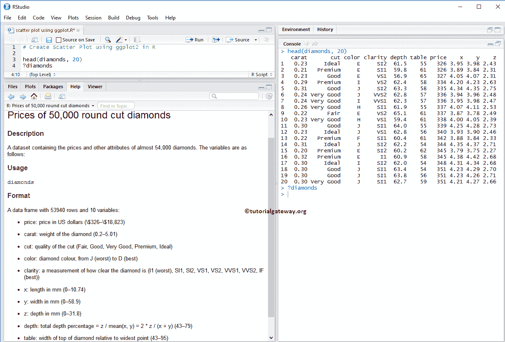
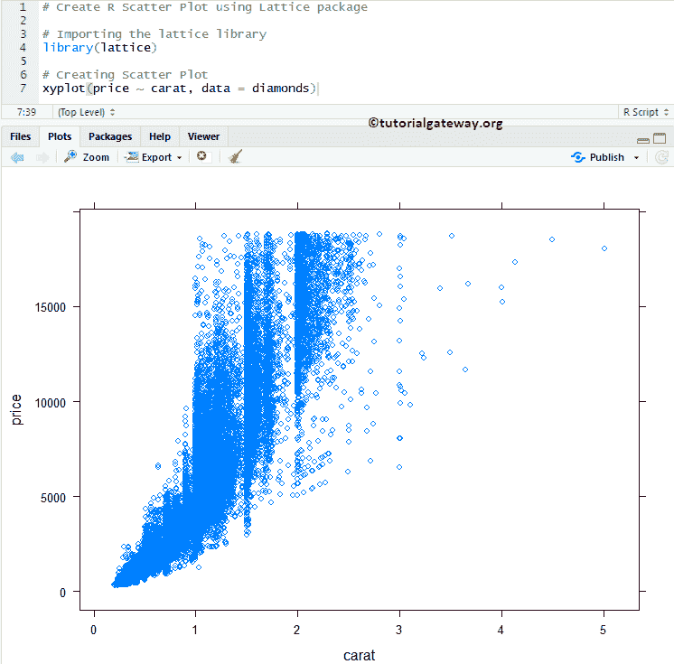
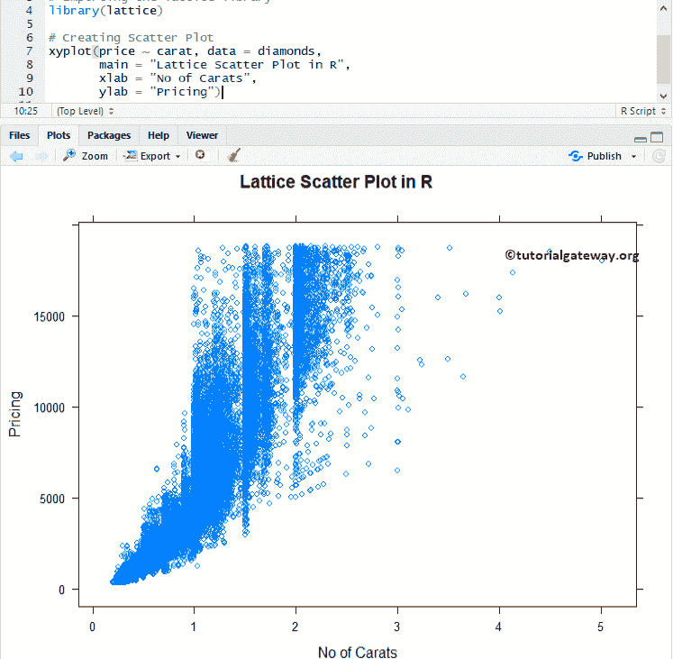
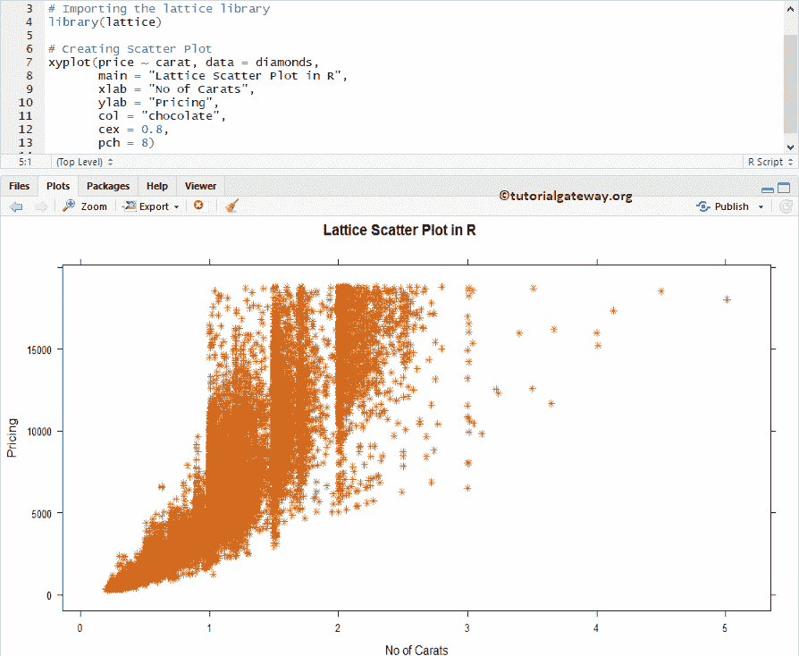
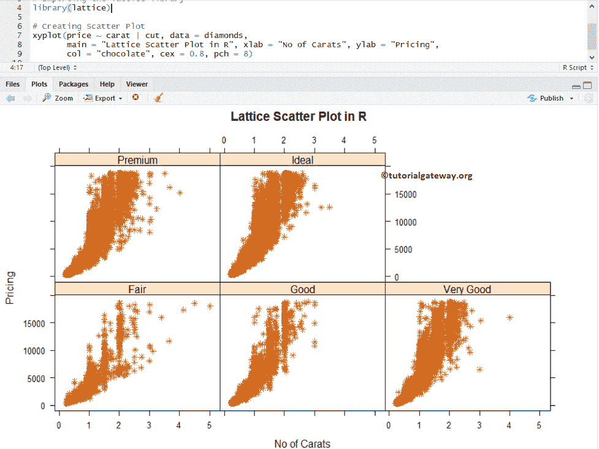

# R 中的点阵散点图

> 原文：<https://www.tutorialgateway.org/lattice-scatter-plot-in-r/>

R 编程中的点阵包提供了绘制散点图的 xyplot。R 中的这个点阵散点图对于可视化两组数据之间的关系非常有用。您可以将此散点图称为散点图、散点图、散点图或散点图。

例如，要根据经验可视化薪资，请使用此散点图。让我们看看如何在 R 编程中创建点阵散点图，格式化其颜色、形状等。，并举例说明。绘制点阵散点图或点阵散点图的语法是

```
xyplot(x, data, ...)
```

点阵散点图的复杂语法是:

```
xyplot(x, data,
       allow.multiple = is.null(groups) || outer,
       outer = !is.null(groups),
       auto.key = FALSE,
       aspect = "fill",
       panel = lattice.getOption("panel.xyplot"),
       prepanel = NULL,
       scales = list(),
       strip = TRUE,
       groups = NULL,
       xlab, xlim, ylab, ylim,
       drop.unused.levels = lattice.getOption("drop.unused.levels"),
       ...,
       lattice.options = NULL,
       default.scales,
       default.prepanel = lattice.getOption("prepanel.default.xyplot"),
       subscripts = !is.null(groups),
       subset = TRUE)
```

为此，我们将使用 R 提供的钻石数据集，该数据集内的数据为:



## 在 R 中创建点阵散点图

在这个例子中，我们展示了如何在点阵包中使用这个 xyplot 函数来创建散点图。为此，我们使用了钻石数据集，该数据集由 [R Studio](https://www.tutorialgateway.org/download-r-studio-and-install/) 提供。如果要求是从外部文件导入 [R 编程](https://www.tutorialgateway.org/r-programming/)数据，建议大家参考 [R Read CSV](https://www.tutorialgateway.org/r-read-csv-function/) 文章了解 CSV 文件导入。

```
# Create R Scatter Plot using Lattice package

# Importing the lattice library
library(lattice)

# Creating Scatter Plot
xyplot(price ~ carat, data = diamonds)
```



### 为点阵中的散点图指定名称

此示例显示如何使用 main、xlab 和 ylab 为点阵散点图、X 轴、Y 轴和单个条分配名称

*   主:散点图的主标题。
*   xlab:X 轴标签
*   Y 轴标签

```
# Change Names of a Lattice Scatter Plot in R

# Importing the lattice library
library(lattice)

# Creating Scatter Plot
xyplot(price ~ carat, data = diamonds,
       main = "Lattice Scatter Plot in R", 
       xlab = "No of Carats", 
       ylab = "Pricing")
```



### 更改点阵散点图的形状和颜色

在本例中，我们向您展示了如何使用 col 和 cex 参数更改 R 中点阵散点图的形状和颜色。

*   请指定你想在散点图中使用的颜色。
*   指定点的大小
*   改变形状。

```
# Change Shapes, Colors of a Lattice Scatter Plot in R

# Importing the lattice library
library(lattice)

# Creating Scatter Plot
xyplot(price ~ carat, data = diamonds,
       main = "Lattice Scatter Plot in R", 
       xlab = "No of Carats", 
       ylab = "Pricing",
       col = "chocolate", 
       cex = 0.8,
       pch = 8)

```



## R 中的多重点阵散点图

在本例中，我们向您展示了如何使用组划分散点图。

```
# Linear Progression on a Lattice Scatter Plot in R

# Importing the lattice library
library(lattice)

# Creating Scatter Plot
xyplot(price ~ carat | cut, data = diamonds,
       main = "Lattice Scatter Plot in R", xlab = "No of Carats", ylab = "Pricing", 
       col = "chocolate", cex = 0.8, pch = 8)
```

这里，散点图是根据切割进行划分的。

