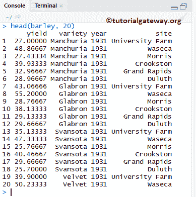
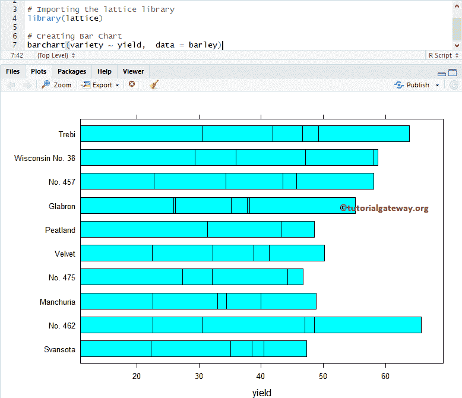
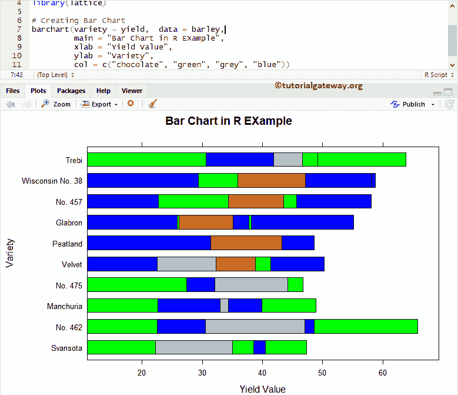
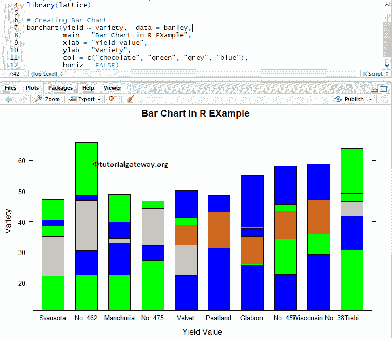
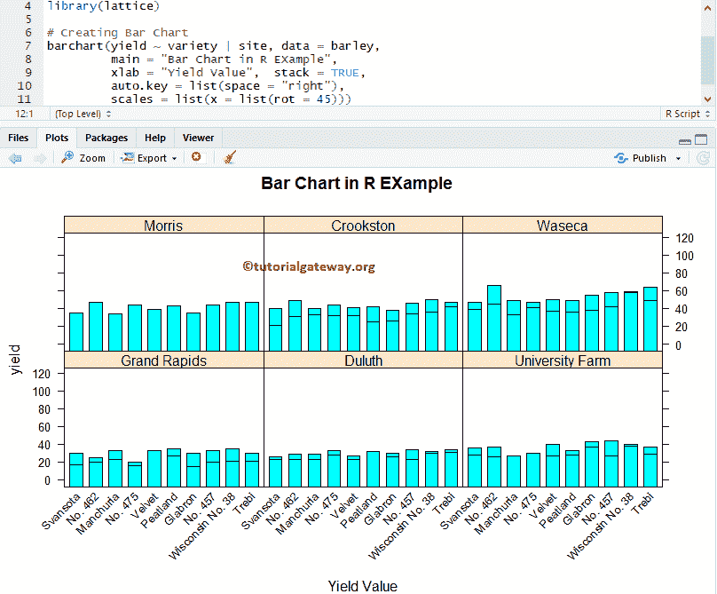
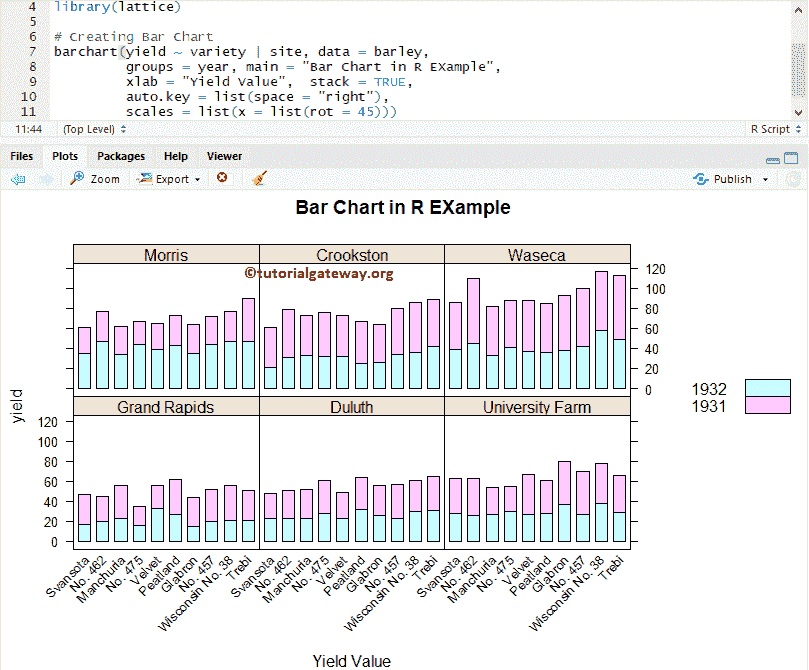
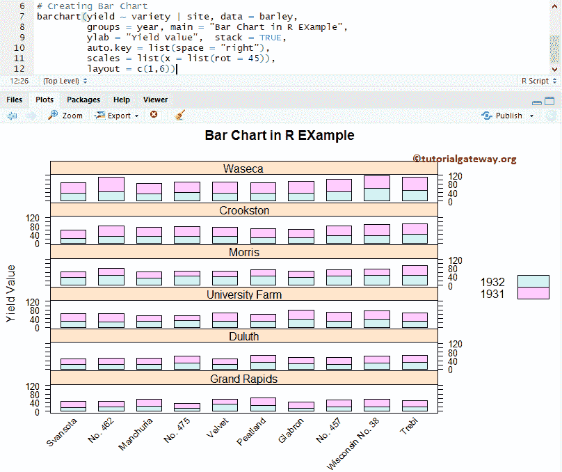

# R 中的点阵条形图

> 原文：<https://www.tutorialgateway.org/lattice-bar-chart-in-r/>

R 语言中的点阵包提供条形图来绘制条形图。实时情况下，R 中的格子条形图对于直观地比较数据非常有用。例如，如果我们想要将销售额与地区、类别或产品颜色进行比较，请使用此条形图。让我来告诉你如何创建格子条形图，格式化条形图颜色等。举个例子。

## R 语法中的格子条形图

绘制点阵条形图的语法

```
barchart(x, data,.............)
```

这个条形图背后的复杂语法是:

```
barchart(x, data,
         panel = lattice.getOption("panel.barchart"),
         default.prepanel = lattice.getOption("prepanel.default.barchart"),
         box.ratio = 2,
         ...)
```

为了演示这一点，我们将使用由 R 提供的大麦数据集，该数据集内的数据为:



## 在 R 中创建点阵条形图

在本例中，我们向您展示了如何创建点阵条形图。如果需要从外部文件导入数据，那么请参考 [R Read CSV](https://www.tutorialgateway.org/r-read-csv-function/) 一文，了解 CSV 文件导入涉及的步骤。

```
# Create Lattice Bar Chart in R Programming

# Importing the lattice library
library(lattice)

# Creating Bar Chart
barchart(variety ~ yield,  data = barley)
```



### 为点阵条形图指定名称

更改 [R 语言](https://www.tutorialgateway.org/r-programming/)条的颜色，使用 main、xlab 和 ylab 为条形图、X 轴和 Y 轴指定名称

```
# Chaging Colors, Names of a Lattice Bar Chart in R Programming

# Importing the lattice library
library(lattice)

# Creating Bar Chart
barchart(variety ~ yield,  data = barley,
         main = "Bar Chart in R EXample",
         xlab = "Yield Value",
         ylab = "Variety",
         col = c("chocolate", "green", "grey", "blue"))
```



### 点阵垂直条形图

此示例显示如何使用 horiz 参数将水平条形图更改为垂直条形图。

```
# Vertical Lattice Bar Chart in R Programming

# Importing the lattice library
library(lattice)

# Creating Bar Chart
barchart(yield ~ variety,  data = barley,
         main = "Bar Chart in R EXample",
         xlab = "Yield Value",
         ylab = "Variety",
         col = c("chocolate", "green", "grey", "blue"),
         horiz = FALSE)
```



## 多格条形图

在本例中，我们向您展示了如何根据组划分条形图。在这里，将 x 轴标签旋转到 45 度角是很有用的。

```
# Multiple Lattice Bar Chart in R Programming

# Importing the lattice library
library(lattice)

# Creating Bar Chart
barchart(yield ~ variety | site, data = barley,
         groups = year, main = "Bar Chart in R EXample",
         xlab = "Yield Value",  stack = TRUE,
         auto.key = list(space = "right"),
         scales = list(x = list(rot = 45)))

```



### 点阵条形图中的组

在这里，我们使用组对公共数据进行分组。group–变量或表达式在每个面板中充当分组变量

```
# Multiple Lattice Bar Chart in R Programming

# Importing the lattice library
library(lattice)

# Creating Bar Chart
barchart(yield ~ variety | site, data = barley,
         groups = year, main = "Bar Chart in R EXample",
         xlab = "Yield Value",  stack = TRUE,
         auto.key = list(space = "right"),
         scales = list(x = list(rot = 45)))
```



### R 中点阵条形图的一种布局

在本例中，我们向您展示了如何在点阵条形图中使用布局选项。

*   布局:一般来说，点阵条形图由排列成矩形阵列的几个面板组成。布局决定了这种安排。它是一个长度为 2(或 3)的数值向量。它表示列数、行数和页数的向量(可选)。

```
# Importing the lattice library
library(lattice)

# Creating Bar Chart
barchart(yield ~ variety | site, data = barley,
         groups = year, main = "Bar Chart in R EXample",
         ylab = "Yield Value",  stack = TRUE,
         auto.key = list(space = "right"),
         scales = list(x = list(rot = 45)),
         layout = c(1,6))
```

