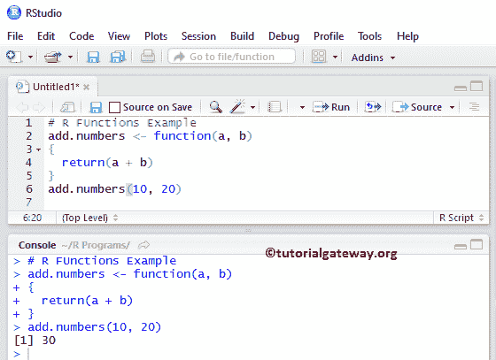
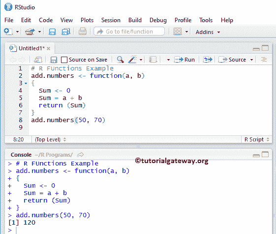
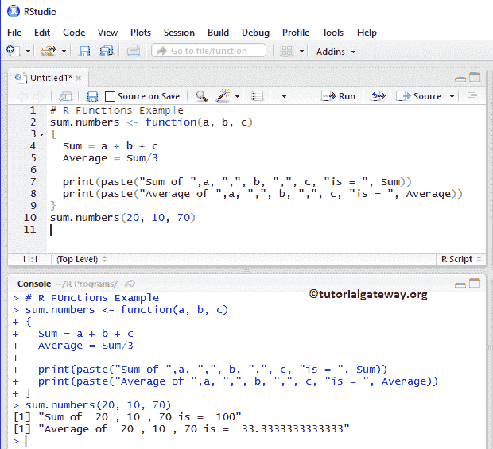
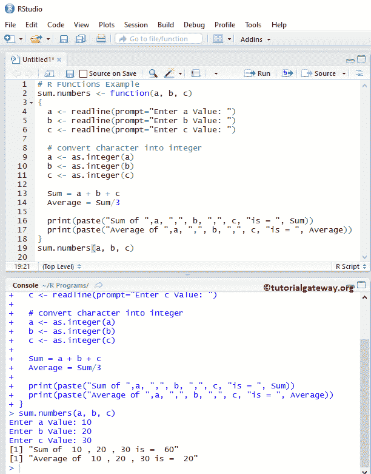

# R 程序设计中的函数

> 原文：<https://www.tutorialgateway.org/functions-in-r-programming/>

R Programming 中的函数是包含在花括号{ }中的一段代码或一些逻辑，它执行特定的操作。在这次 R 编程教程之旅中，我们已经看到了一些方法，您可能没有注意到它们。例如，打印、abs、sqrt 等。是 R 编程语言中的一些内置函数。

## 函数语法

R 编程语言中函数的语法是

```
Function_Name <- function(arguments)  {
  Local Variable Declaration;

  Logic;

  Executable Statement 1;

   ……
  Executable Statement n;
}
```

论据是:

*   函数名:可以是你想给的任何名字。避免使用系统保留的关键字。
*   参数:每个函数接受 0 个或更多的参数，这完全取决于用户需求。例如，添加(2，3)。
*   局部变量声明:有时，我们可能需要一些临时变量来操作特定的方法。然后我们可以声明其中的变量。请记住，这些变量仅适用于此；我们无法通过这种方法访问它们。
*   逻辑:你想实现的任何数学或任何计算。
*   可执行语句:从这个特定方法打印一些数据的任何打印语句。

### 函数类型

R 编程语言中有两种类型的函数:

*   所有由[语言](https://www.tutorialgateway.org/r-programming/)或[包](https://www.tutorialgateway.org/install-r-packages/)支持的内置函数称为库函数。如果您不担心库函数内部的逻辑，那将是最好的。在我们之前的文章中，我们使用了许多库方法，如 print()，sqrt()，等。
*   用户定义函数:R 编程允许我们创建自己的被称为用户定义函数的函数，而不仅仅依赖于内置函数。例如，如果我们想计算销售利润或任何数学计算。然后，我们可以将它们放在具有适当名称的单独函数中，稍后我们可以多次调用该函数。

### 函数在 R 程序设计中的优势

1.  r 函数帮助我们把大程序分成小组。因此，我们可以更快更好地调试程序。
2.  通过给每个人分配不同的方法，多人可以在同一个程序上工作。
3.  我们可以多次调用同一个方法。
4.  代码可重用性:防止我们多次编写相同的逻辑。

## 函数声明

为了实现这一点，我们遵循了一些规则，如声明、定义和调用。我们可以将函数声明为:

```
add <- function(x, y) {
}
```

### R 程序设计中的函数调用

它只不过是用有效数量的参数调用原始方法。例如，添加(2，3)

注意:用户定义的方法名应该与调用它的完全匹配。

### 函数定义

这是我们将放置所有逻辑、计算等的地方。我们可以将该定义放在 main()之前或 main()之后。

```
add.numbers <- function(a, b)
{
  return(a + b)
}
add.numbers(10, 2)
```



典型方式–详细

```
add.numbers <- function(a, b)
{
  Sum <- 0
  Sum = a + b
  return (Sum)
}
add.numbers(50, 70)
```



注意:如果您定义的函数不是 void 返回类型，请不要忘记 return 关键字。

## 用 R 函数求 3 个数的和与平均

在这个 [R 程序](https://www.tutorialgateway.org/r-programming/)中，我们计算三个数的和与平均。

```
sum.numbers <- function(a, b, c)
{
  Sum = a + b + c
  Average = Sum/3

  print(paste("Sum of ",a, ",", b, ",", c, "is = ", Sum))
  print(paste("Average of ",a, ",", b, ",", c, "is = ", Average))
}
sum.numbers(20, 10, 70)
```



或者我们可以允许用户输入 a、b 和 c 的值

```
sum.numbers <- function(a, b, c)
{
  a <- readline(prompt="Enter a Value: ")
  b <- readline(prompt="Enter b Value: ")
  c <- readline(prompt="Enter c Value: ")

  # convert character into integer
  a <- as.integer(a)
  b <- as.integer(b)
  c <- as.integer(c)

  Sum = a + b + c
  Average = Sum/3

  print(paste("Sum of ",a, ",", b, ",", c, "is = ", Sum))
  print(paste("Average of ",a, ",", b, ",", c, "is = ", Average))
}
sum.numbers(a, b, c)

```



首先，我们通过分配名称 sum.numbers 来声明这个方法。如果您忘记了这个声明，那么它会抛出一个错误。

```
sum.numbers <- function(a, b, c)
```

以下语句要求用户输入 a、b、c 的值

```
  a <- readline(prompt="Enter a Value: ")
  b <- readline(prompt="Enter b Value: ")
  c <- readline(prompt="Enter c Value: ")
```

在下一行中，我们将使用 as.integer 将用户输入的值转换为整数

```
  a <- as.integer(a)
  b <- as.integer(b)
  c <- as.integer(c)
```

接下来，我们计算用户输入值的总和和平均值。

```
  Sum = a + b + c
  Average = Sum/3
```

在这个例子中，我们把 a，b，c 的值指定为 10，20，30。意思是，

*   总和= a + b + c => 10 + 20 + 30
*   总和= 60
*   平均值=总和/ 3 => 60 / 3
*   平均值= 20

下面的 R 打印语句打印总和和平均值作为输出。

```
print(paste("Sum of ",a, ",", b, ",", c, "is = ", Sum))
print(paste("Average of ",a, ",", b, ",", c, "is = ", Average))
```