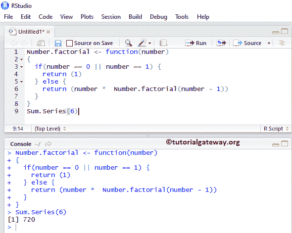
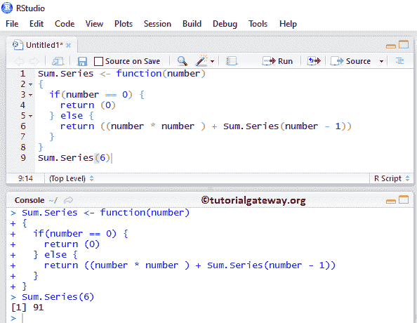

# R 语言中的递归函数

> 原文：<https://www.tutorialgateway.org/recursive-functions-in-r/>

R 语言引入了一种称为递归的新技术，用于优雅而直接的编码。R 中的递归函数指的是调用自身的函数。为了理解递归函数编程，让我们考虑一个众所周知的简单例子，叫做阶乘。

我们可以用下面的公式计算任意给定数的阶乘。

n！= (n) * (n-1) * (n-2) * …..* 1

意思是，6！= 6 * 5 * 4 * 3 * 2 * 1

在 R 语言中，我们可以使用 `for`循环、`while`循环等来实现同样的功能。但是如果你观察上面的模式，它的行为是重复的，这意味着递归。因此，我们可以编写递归函数 R Programming，而不是编写循环(代价高昂)。

```
# Recursive Functions Example
Number.factorial <- function(number)
{
  if(number == 0 || number == 1) {
    return (1)
  } else {
    return (number *  Number.factorial(number - 1))
  }
}
Sum.Series(6)
```



如果我们传递 0 或 1 作为 Number 参数值，那么函数返回 1，否则它将返回下面的语句

```
(number *  Number.factorial(number - 1))
```

让我们计算一下 6！

```
6! = number *  Number.factorial(number - 1)

   = 6 * Number.factorial (6 -1) 

   = 6 * Number.factorial (5) # Recursively calling the above function

   = 6 * 5 * Number.factorial (5 -1)

   = 6 * 5 * Number.factorial (4) # Recursively calling the above function

   = 6 * 5 * 4 * Number.factorial (4 -1)

   = 6 * 5 * 4 * Number.factorial (3) # Recursively calling the above function

   = 6 * 5 * 4 * 3 * Number.factorial (3 -1)

   = 6 * 5 * 4 * 3 * Number.factorial (2) # Recursively calling the above function

   = 6 * 5 * 4 * 3 * 2 * Number.factorial (2 -1)

   = 6 * 5 * 4 * 3 * 2 * Number.factorial (1) # Recursively calling the above function

   = 6 * 5 * 4 * 3 * 2 * 1

   = 720
```

在这篇文章中，我们通过一个实际的例子展示了如何在 R 语言中使用递归函数编写一个简单的程序。

## 用 R 中的递归函数求数列 1 +2 +3 +的和…..+n

在这个例子中，我们展示了如何编写一个 R 程序来求数列 1 +2 +3 +的和…..+n 使用 [R 语言](https://www.tutorialgateway.org/r-programming/)中的递归函数。循环和[请参考](https://www.tutorialgateway.org/while-loop-in-r/)[同时循环](https://www.tutorialgateway.org/r-for-loop/)文章。

```
# Recursive Functions Example
Sum.Series <- function(number)
{
  if(number == 0) {
    return (0)
  } else {
    return ((number * number ) + Sum.Series(number - 1))
  }
}
Sum.Series(5)
```



下面我给大家展示一下 R 递归函数的分步执行过程

函数定义:在和之内。系列(数字)功能，

如果用户输入的数字为 0，则函数返回 0，否则返回以下内容

```
(number * number ) + Sum.Series(number - 1)
```

为了更好地理解，让我们把上面的表达分开

*   (数字*数字)=乘以数字
*   总和。系列(数字–1)=用递减的值(1 个数字减)调用相同的函数

从上面的截图中，您可以看到用户输入的值是 6:

递归 1:数字= 6，大于 0，

*   (数*数)+和。系列(编号 1)
*   (6 * 6) +总和。系列(6–1)
*   36 +总和。系列(5)

递归 2:数字变成 5，大于 0，

*   (数*数)+和。系列(编号 1)
*   (5 * 5) +总和。系列(5–1)
*   25 +总和。系列(4)

总数将是 36 + 25 = 61

递归 3:数字变成 4，大于 0，

*   (4 * 4) +总和。系列(4–1)
*   16 +总和。系列(3)

总数是 36 + 25 + 16 = 77

递归 4:数字变成 3，大于 0，

*   (3 * 3) +总和。系列(3–1)
*   9 + Sum。系列(2)

总计= 36 + 25 + 16 + 9 = 86

递归 5

数字变成 2，大于 0，

*   (2 * 2) +总和。系列(2–1)
*   4 + Sum。系列(1)

总数将是 36 + 25 + 16 + 9 + 4 = 90

递归 6

数字变成 1，大于 0，

*   (1 * 1) +总和。系列(1–1)
*   1 +总和。系列(0)

总计= 36 + 25 + 16 + 9 + 4 + 1 = 91

递归 7:数字变成 0，这意味着如果条件为真，首先，所以它从函数中退出。

最终输出为 91

我们必须使用一些条件来退出 r 中的递归函数调用，如果忘记了条件，那么函数会执行无数次(类似于 Infinity Loop)。