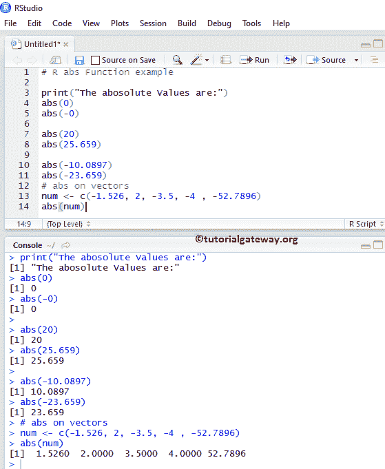
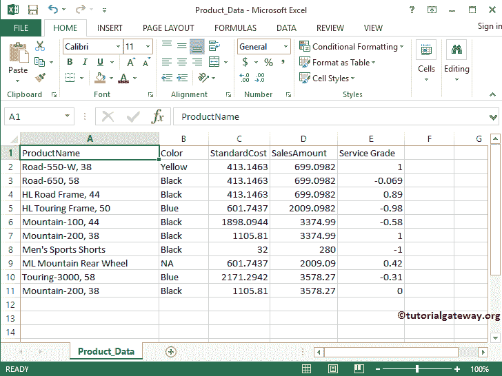
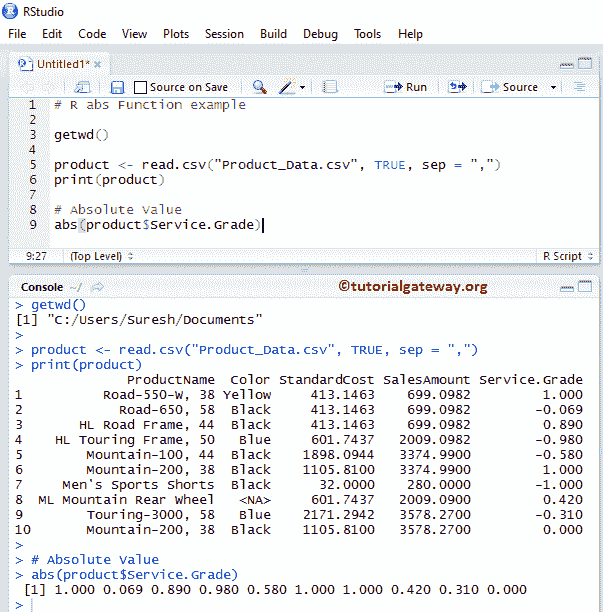

# R `abs`系统函数

> 原文：<https://www.tutorialgateway.org/r-abs-function/>

R abs 方法是 R Math 函数中的一种，它是返回特定数字或表达式的正绝对值。让我们通过一个例子来看看如何在 R 语言中使用 abs。

R 语言中 abs 的语法如下所示:

```
abs(number); //Return Type is Integer
```

数字:它可以是一个数字，也可以是一个有效的数值表达式，您需要为其找到绝对值。

*   如果数字参数为正或负零，abs 函数返回正零。
*   如果数字参数不是数字，abs 函数返回错误。

## R abs 示例

abs 功能允许您查找数值的绝对值。在这个程序中，我们将找到不同数据的绝对值并显示输出

```
# R abs Function example

print("The abosolute Values are:")
# Absolute Values of both Positive and negative zeros
abs(0)
abs(-0)

# Absolute values of Positive values
abs(20)
abs(25.659)

# Absolute Values of Negative values
abs(-10.0897)
abs(-23.659)

# abs on vectors
num <- c(-1.526, 2, -3.5, -4 , -52.7896)
abs(num)
```



## abs系统函数示例 2

R 中的绝对值函数还允许您查找列值的绝对值。在本例中，我们将使用 abs 函数查找[服务等级]列中所有记录的绝对值。

对于这个绝对正的演示，我们将使用下面显示的 CSV 数据。建议大家参考 [R 读取 CSV 函数](https://www.tutorialgateway.org/r-read-csv-function/)一文，了解 [R 语言](https://www.tutorialgateway.org/r-programming/)导入 CSV 文件涉及的步骤。



r 代码

```
# abs Function example

getwd()

product <- read.csv("Product_Data.csv", TRUE, sep = ",")
print(product)

# Absolute Value
abs(product$Service.Grade)
```

从下面的截图可以观察到，abs 函数正在返回



服务等级列的绝对值