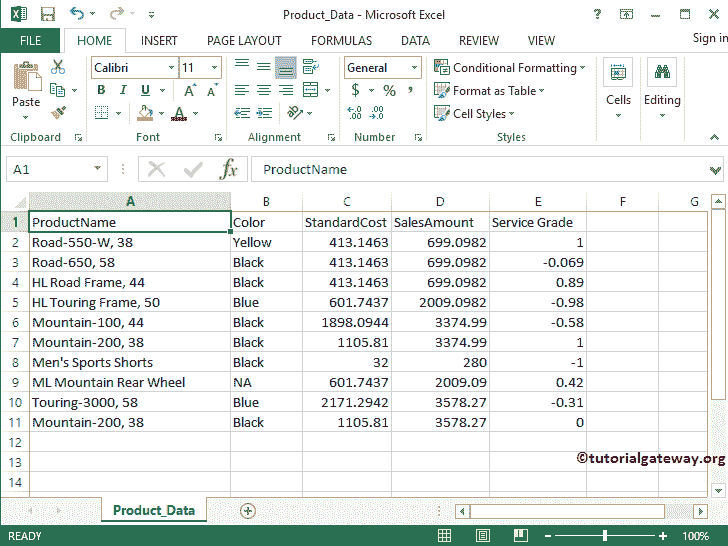

# R sqrt 函数

> 原文：<https://www.tutorialgateway.org/r-sqrt-function/>

R sqrt 方法是 R 数学函数中的一种，它对于找到单个数字或表达式的 R 的平方根很有用。让我们通过一个例子来看看如何在 R 编程语言中使用 sqrt。

## R sqrt 语法

R 编程语言中 sqrt 的语法如下所示:

```
sqrt(numeric_Expression); //Return Type is Integer
```

Numeric_Expression:它可以是一个数值，也可以是一个有效的数值表达式，您希望在 r 中找到它的平方根。例如，3 的平方根是 1.732

*   如果 numeric_Expression 为正值，sqrt 函数将返回给定值的平方根。
*   如果 numeric_Expression 为负值，sqrt 函数将返回 NaN。
*   numeric_Expression 不是数字(NaN)或负无穷大，则 R 中的 sqrt 返回 NaN。
*   如果 numeric_Expression 为正无穷大，sqrt 函数将结果返回为正无穷大。

## R sqrt 示例 1

在这个 R 平方根程序中，我们将找到正负零、正负无穷大、+ve 和-ve 非数值的平方根以及字符串数据

```
# SQRT in R example
# Square Root of both Positive and negative zeros
sqrt(0)
sqrt(-0)

# Square Root of Not a Number
sqrt(NaN)
sqrt(-NaN)

# Square Root of +ve and -ve Infinity
sqrt(Inf)
sqrt(-Inf)

# Square Root of Characters
sqrt("Tutorial Gateway")
```


## R sqrt 示例 2

R 中的 sqrt 可以让你找到数值的平方根。在这个 R 平方根程序中，我们将找到不同数据的平方根并显示输出

```
# SQRT in R example

# Square Root of Positive values
sqrt(64)
sqrt(25.659)

# Square Root of Negative values
sqrt(-10.0897)
# Absolute function will convert the Negative value to Positive
# Next, sqrt will find the square root of 35.659  
sqrt(abs(-35.659))

# Square Root on vectors
num <- c(-25.526, 256.32, -36.5, -81 , -525.796)
sqrt(num)
sqrt(abs(num))
```

提示:请参考 [R abs 功能](https://www.tutorialgateway.org/r-abs-function/)了解 [R 编程](https://www.tutorialgateway.org/r-programming/)中 abs 的功能。


## R sqrt 示例 3

在这个 R 平方根程序中，我们要找到[的绝对值，列出](https://www.tutorialgateway.org/r-list/)数据并显示输出。对于这个例子，我们使用的是 R

```
# SQRT in R example
ChickWeight

Total.weight <- aggregate(ChickWeight$weight, 
                by = list(ChickWeight$Diet), 
                FUN = sum)
Total.weight
sqrt(Total.weight$x)
```


## R sqrt 函数示例 4

sqrt 函数还允许您查找列值的平方根。在本例中，我们将使用 sqrt 函数找到[标准成本]和[销售额]列中所有记录的平方根。对于这个 R 平方根例子，我们使用下面显示的 CSV 数据。参考 [R 读取 CSV 函数](https://www.tutorialgateway.org/r-read-csv-function/)一文，了解导入 CSV 文件涉及的步骤。



此平方根函数代码将返回“标准成本”和“销售金额”列的平方根值

```
# SQRT in R example

getwd()

product <- read.csv("Product_Data.csv", TRUE, sep = ",")
print(product)

# Square Roots
sqrt(product$StandardCost)
sqrt(product$SalesAmount)
```

