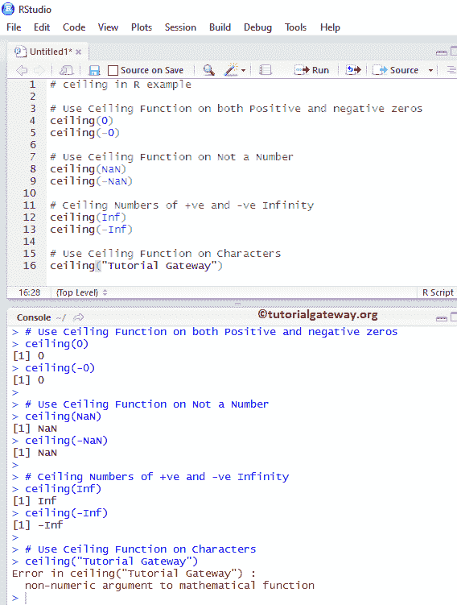
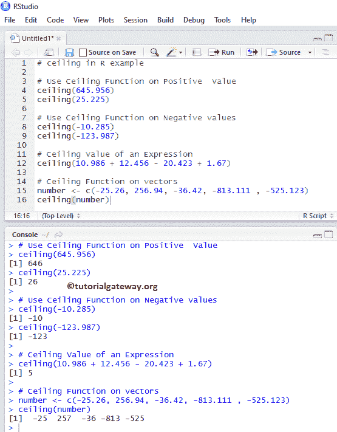
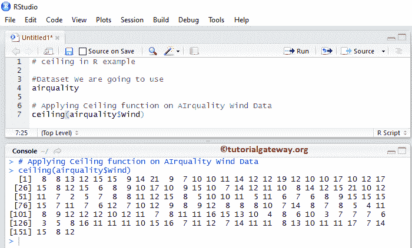
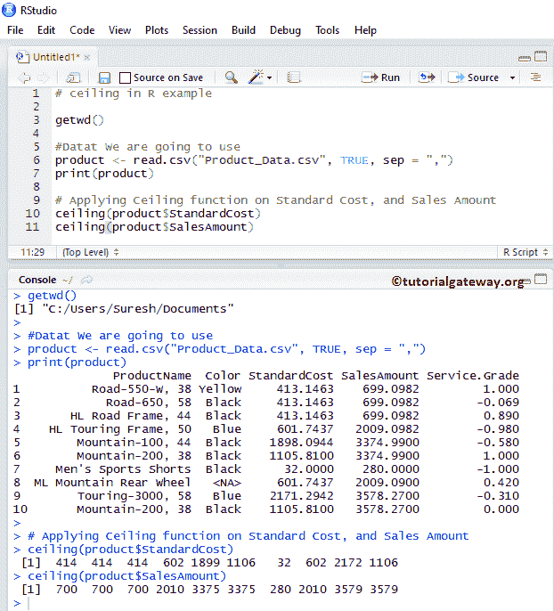

# `ceil`函数

> 原文：<https://www.tutorialgateway.org/r-ceiling-function/>

R 上限方法是返回大于或等于特定数字的最小整数值或表达式的 R 数学函数之一。让我们通过一个例子来看看如何使用 R 语言中的天花板。

## r 上限语法

R 语言中天花板的语法是

```
ceiling(numeric_Expression);
```

Numeric_Expression:它可以是数值，也可以是要求平方根的有效数值表达式。

*   如果数值表达式为正或负数值，上限函数将返回上限值。
*   如果它是正或负零，上限函数返回零
*   numeric_Expression 不是数字(NaN)，则上限返回 NaN。
*   如果 numeric_Expression 为正或负无穷大，则函数返回相同的值。

下面的天花板示例向您展示了同样的情况。

```
# ceiling in R example

# Use Ceiling Function on both Positive and negative zeros
ceiling(0)
ceiling(-0)

# Use Ceiling Function on Not a Number
ceiling(NaN)
ceiling(-NaN)

# Ceiling Numbers of +ve and -ve Infinity
ceiling(Inf)
ceiling(-Inf)

# Use Ceiling Function on Characters
ceiling("Tutorial Gateway")
```



## 天花板功能示例 1

在这个程序中，我们将找到不同数据的上限值并显示输出

```
# ceiling in R example

# Use Ceiling Function on Positive  Value
ceiling(645.956)
ceiling(25.225)

# Use Ceiling Function on Negative values
ceiling(-10.285)
ceiling(-123.987)

# Ceiling Value of an Expression
ceiling(10.986 + 12.456 - 20.423 + 1.67)

# Ceiling Function on vectors
number <- c(-25.26, 256.94, -36.42, -813.111 , -525.123)
ceiling(number)
```



## 天花板功能示例 2

在本程序中，我们将在[上应用上限功能，列出](https://www.tutorialgateway.org/r-list/)数据并显示输出。对于这个 [R 语言](https://www.tutorialgateway.org/r-programming/)的例子，我们使用的是 R 提供的空气质量数据集

```
# ceiling in R example

#Dataset We are going to use
airquality

# Applying Ceiling function on AIrquality Wind Data
ceiling(airquality$Wind)
```



## 天花板功能示例 3

R 语言中的上限函数还允许您对数据库或表列中的数值进行上限计算。在本例中，我们对[标准成本]和[销售金额]列中的所有记录设置上限。

为此，我们将使用下图所示的 CSV 数据，建议您参考 [R Read CSV 函数](https://www.tutorialgateway.org/r-read-csv-function/)一文导入 CSV 文件。


从下面的截图中，您可以观察到上限函数返回的是最小的整数值，它大于或等于标准成本和销售金额列中的值。

```
# ceiling in R example

getwd()

#Datat We are going to use
product <- read.csv("Product_Data.csv", TRUE, sep = ",")
print(product)

# Applying Ceiling function on Standard Cost, and Sales Amount
ceiling(product$StandardCost)
ceiling(product$SalesAmount)
```

