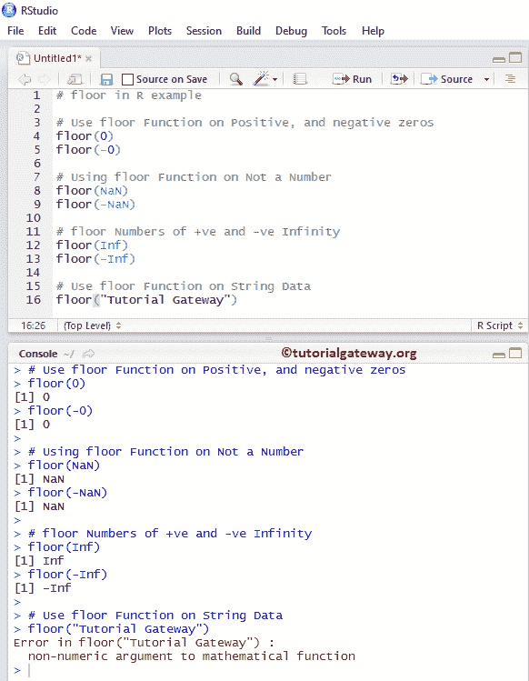
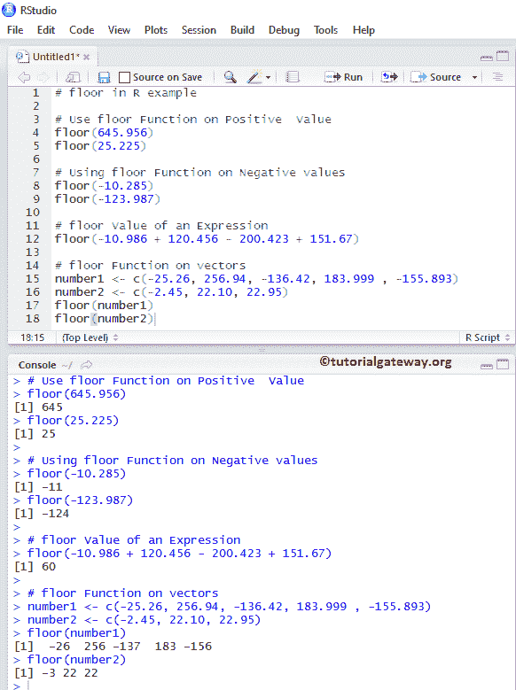
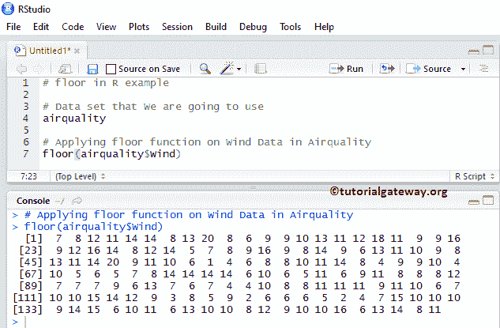
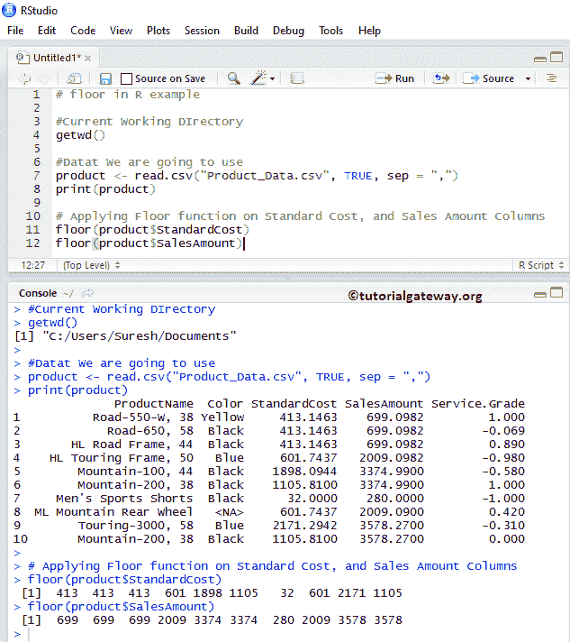

# R `floor`函数

> 原文：<https://www.tutorialgateway.org/r-floor-function/>

R floor 方法是 R Math 函数之一，它是返回最大的整数值。不大于(小于)或等于特定数字或表达式的。让我们通过一个例子来看看如何使用 R 语言中的 floor。

## 地板语法

R 语言中地板的语法是

```
floor(numeric_expression);
```

Numeric_Expression:它可以是数值，也可以是要求平方根的有效数值表达式。

*   如果 numeric_expression 为正数或负数，floor 函数将返回 floor 值。
*   如果数值表达式为正或负零，函数将返回零
*   numeric_expression 为 NaN(不是数字)，则 floor 函数将返回 NaN。
*   如果 numeric_expression 为正或负无穷大，则函数返回相同的值。

下面的地板示例向您展示了同样的情况

```
# floor in R example

# Use floor Function on Positive, and negative zeros
floor(0)
floor(-0)

# Using floor Function on Not a Number
floor(NaN)
floor(-NaN)

# floor Numbers of +ve and -ve Infinity
floor(Inf)
floor(-Inf)

# Use floor Function on String Data
floor("Tutorial Gateway")
```



## 右`floor`函数示例 1

在这个程序中，我们将找到不同数据的最低值并显示输出

```
# floor in R example

# Use floor Function on Positive  Value
floor(645.956)
floor(25.225)

# Using floor Function on Negative values
floor(-10.285)
floor(-123.987)

# floor Value of an Expression
floor(-10.986 + 120.456 - 200.423 + 151.67)

# floor Function on vectors
number1 <- c(-25.26, 256.94, -136.42, 183.999 , -155.893)
number2 <- c(-2.45, 22.10, 22.95)
floor(number1)
floor(number2)
```



## 楼层函数示例 2

在本程序中，我们将在[上应用楼层函数，列出](https://www.tutorialgateway.org/r-list/)数据并显示输出。在这个例子中，我们使用了 R

```
# floor in R example

# Data set that We are going to use
airquality

# Applying floor function on Wind Data in Airquality
floor(airquality$Wind)
```



## 右`floor`函数示例 3

R 语言中的 floor 函数还允许您对数据库或表列中的数值进行 floor 运算。在本例中，我们将查找[标准成本]和[销售额]列中所有记录的最低值。

为此，我们使用如下所示的 CSV 数据，建议您参考 [R 读取 CSV 函数](https://www.tutorialgateway.org/r-read-csv-function/)一文，了解在 [R 语言](https://www.tutorialgateway.org/r-programming/)中导入 CSV 文件。


从下面的代码和截图中，您可以观察到 R floor 函数正在返回最接近的整数值，该值小于或等于“标准成本”和“销售额”列中的值

```
# floor in R example

#Current Working DIrectory
getwd()

#Datat We are going to use
product <- read.csv("Product_Data.csv", TRUE, sep = ",")
print(product)

# Applying Floor function on Standard Cost, and Sales Amount Columns
floor(product$StandardCost)
floor(product$SalesAmount)
```

