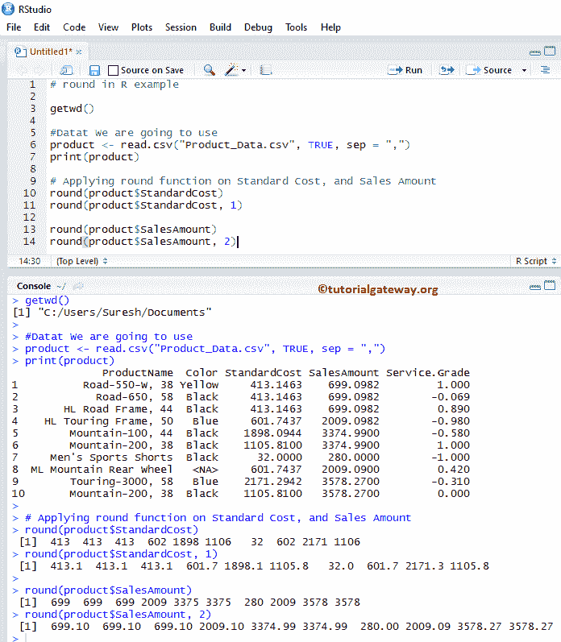

# r 圆函数

> 原文：<https://www.tutorialgateway.org/r-round-function/>

R round 方法是数学函数之一，它将特定的数字或表达式舍入到最接近的值。让我们通过一个例子来看看如何在 R 编程语言中使用 round。

## r 轮语法

R 编程语言中的循环语法是

```
# Round numeric_Expression to nearest value 
round(numeric_Expression)

# Round the decimal points to specified integer_value 
round(numeric_Expression, integer_value)
```

Numeric_Expression:它可以是数值或有效的数值表达式。

*   如果 numeric_Expression 是正数或负数，它将返回最近的上限值。
*   如果不是数字(NaN)，则返回 NaN。如果是正无穷大或负无穷大，函数返回相同的值。

## r 轮函数示例

在这个程序中，我们将返回不同数据的舍入值并显示输出

```
# Use on Positive  Value
round(45.56)
round(525.4999)

# Use on Negative values
round(-140.825)
round(-13.23)

# Expression
round(140.986 + 122.456 - 220.4233 + 12.67)

# on vectors
number <- c(-22.26, 456.94, 2.50, 2.51, -36.49, -813.111 , -525.123)
round(number)
```


## r 轮函数示例 2

在本[程序](https://www.tutorialgateway.org/r-programming/)中，我们将对不同数据的十进制值进行四舍五入&显示输出

```
# Use on Positive  Value
round(45.565, 0)

# decimal points to 1 
round(525.419299, 1)
round(525.419299, 2)

# Use on Negative values
round(-140.825, 2) 
round(-13.239, 2)

# Expression
round((140.986 + 122.4563256 - 220.4233 + 12.67), 2)

# vectors
number <- c(-22.26, 456.94, 2.50, 2.591, -36.49, -813.111 , -525.123)
round(number, 1)
```


## r 轮函数示例 3

在本程序中，我们将对[列表](https://www.tutorialgateway.org/r-list/)数据应用舍入功能，并显示输出。在这个例子中，我们使用了 R

```
#Dataset We are going to use
airquality

# Applying on Airquality Wind Data
round(airquality$Wind)

round(airquality$Wind, 1)
```


R 编程中的这个函数还允许您舍入数据库或表列中的数值。在本例中，我们将舍入[标准成本]和[销售金额]列中的所有记录。为此，我们将使用下面显示的 CSV 文件数据。

提示:请参考 [R Read CSV 函数](https://www.tutorialgateway.org/r-read-csv-function/)一文，了解导入 CSV 文件涉及的步骤。


r 代码

```
getwd()

#Datat We are going to use
product <- read.csv("Product_Data.csv", TRUE, sep = ",")
print(product)

# Applying on Standard Cost, and Sales Amount
round(product$StandardCost)
round(product$StandardCost, 1)

round(product$SalesAmount)
round(product$SalesAmount, 2)
```

