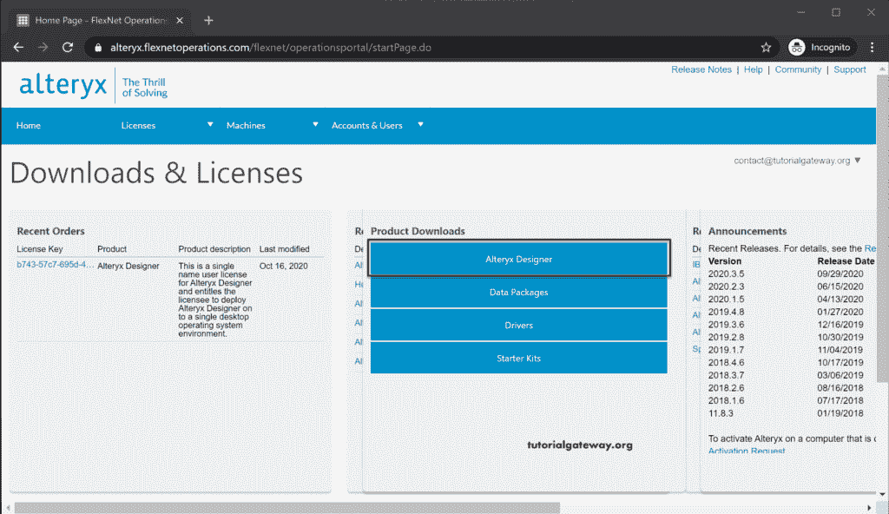
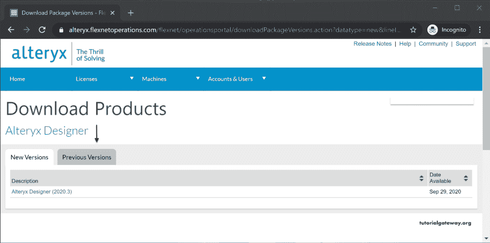
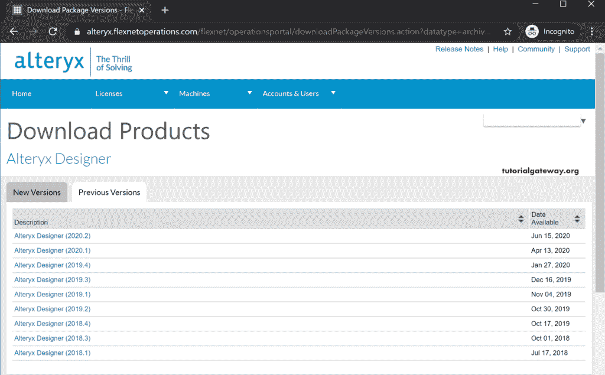
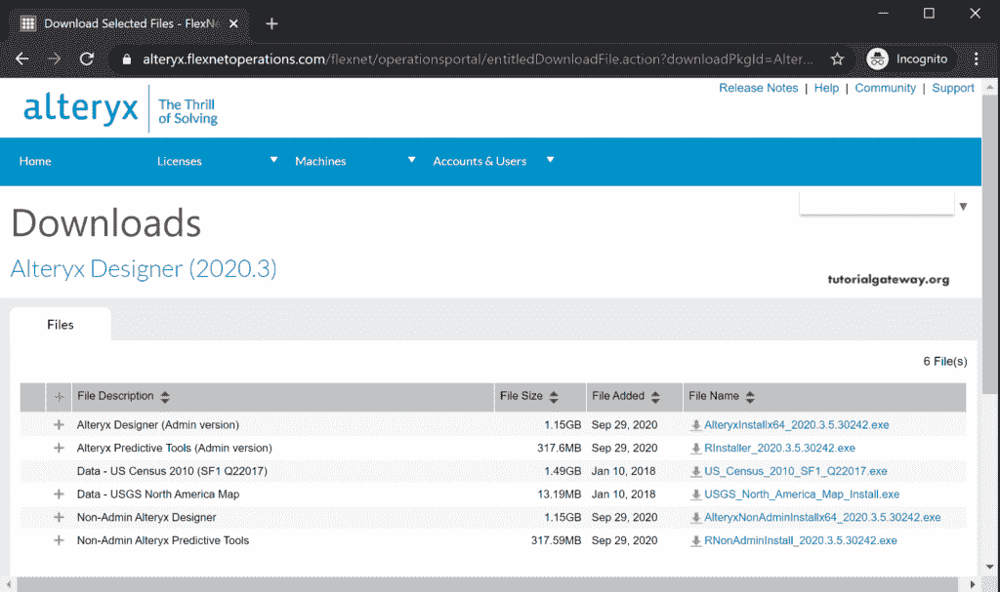
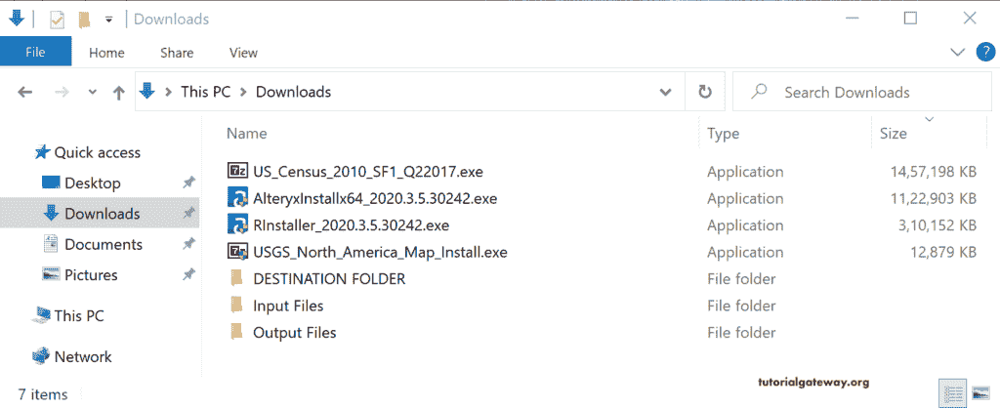
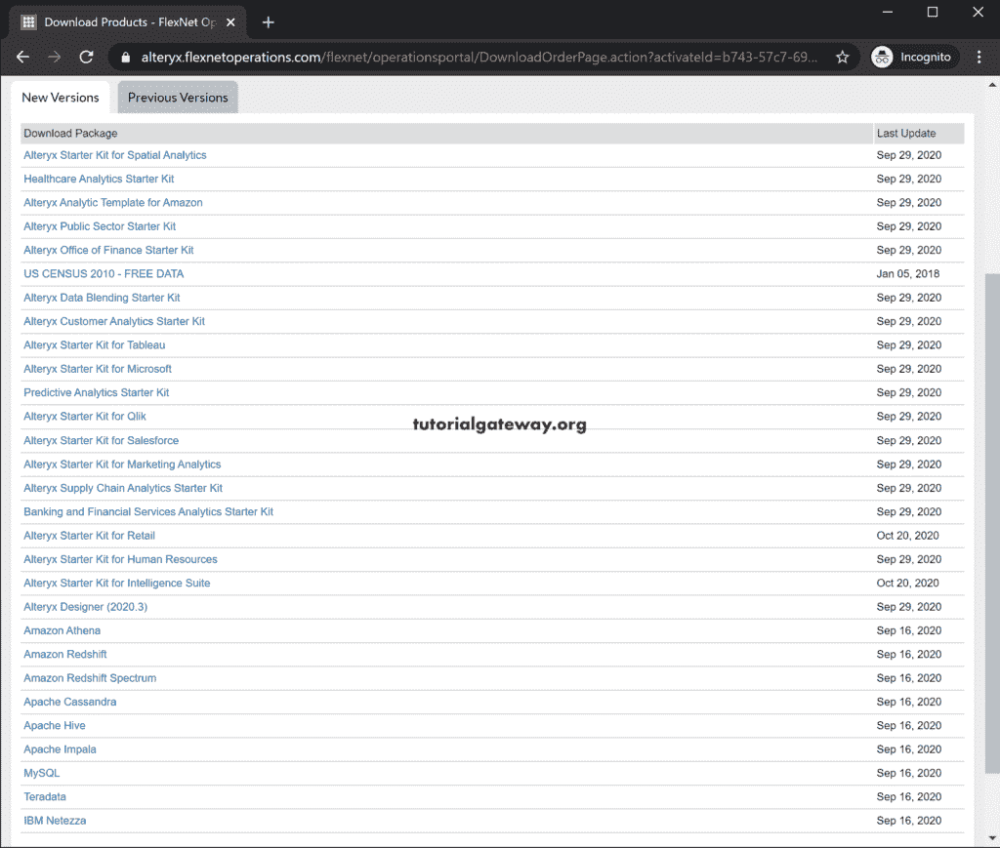

# 下载 Alteryx

> 原文：<https://www.tutorialgateway.org/download-alteryx/>

本文向您解释如何逐步下载 Alteryx Designer。首先，转到 Alteryx 下载门户，您必须使用凭据登录。

如果您没有 Alteryx 帐户，请使用注册按钮。

登录后，您可以看到以下页面。在产品下载选项卡下，请点击 Alteryx 设计器按钮。

默认情况下，它会显示要保存的设计器的最新版本。

但是，如果你想要旧的 Alteryx 版本，点击以前的版本标签会给你列表。

我们想使用最新版本，所以我们从“新版本”选项卡中选择了 Alteryx Designer (2020.3)。从下面的截图中，您可以看到文件列表。

如果您是非管理员，请选择最后两个；否则，请选择前两个。如果你想要美国的数据，也可以下载 3 和 4。出于演示目的，我们正在下载 [Alteryx](https://www.tutorialgateway.org/alteryx-tutorial/) 设计师管理版本和美国数据。

从下图中，您可以看到我们之前下载的那四个文件。

在“许可证”选项卡下，您可以看到您帐户下的可用软件包列表。您可以根据需要下载 Alteryx 软件包。

