# 安装 Alteryx

> 原文：<https://www.tutorialgateway.org/install-alteryx/>

本文解释了安装 Alteryx Designer 的分步方法以及截图。

## 安装 Alteryx 设计工具的步骤

要安装 Alteryx Designer，首先在文件系统中找到下载的文件。接下来，点击 Alteryx Install exe 文件。

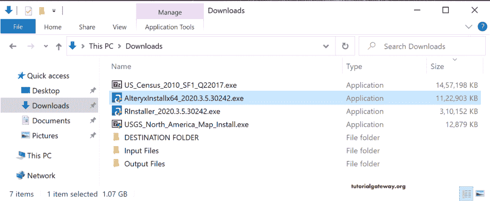

请等待，直到它验证包内容并开始安装过程。

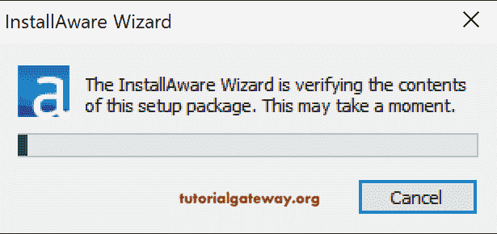

请选择设计器要使用的语言。

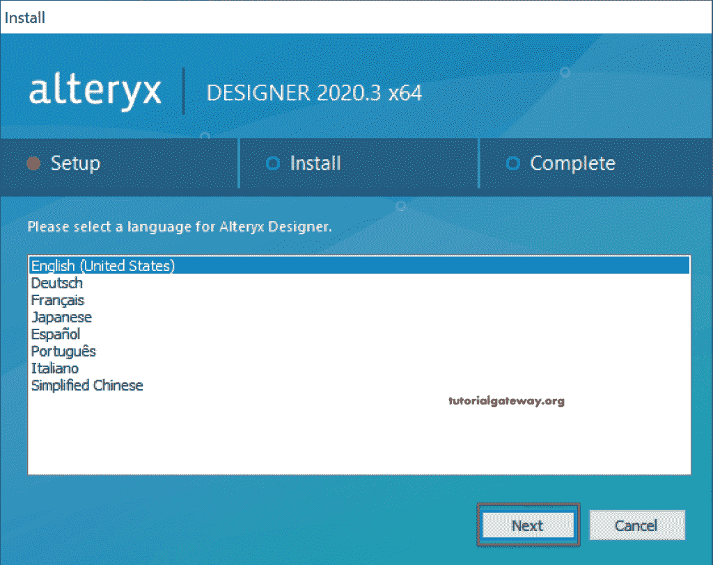

在这里，您可以更改安装 Alteryx 的名称和位置。

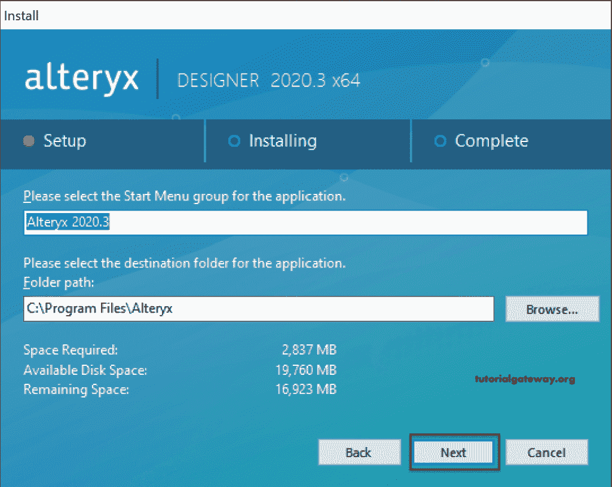

请勾选我接受许可协议。

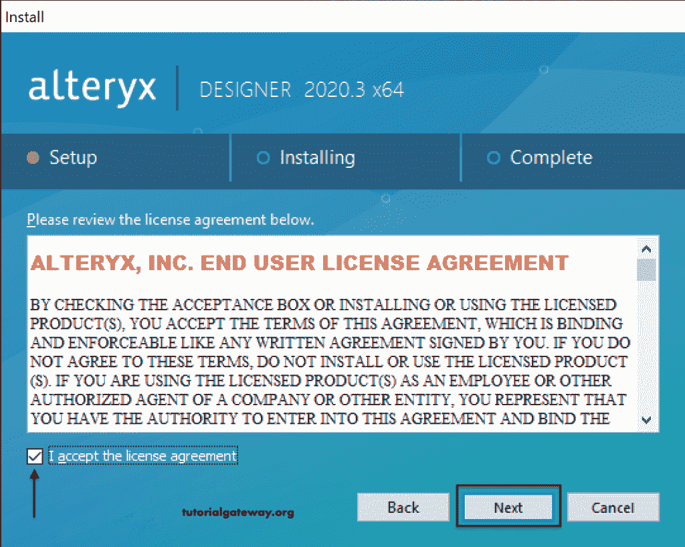

等到 Alteryx Designer 工具安装过程完成。

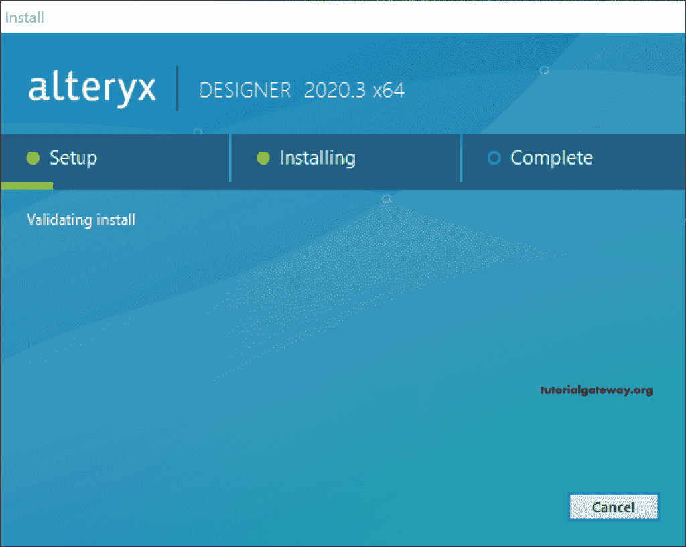

现在您可以看到成功的消息。您可以运行 Alteryx 或关闭安装过程。让我选择“立即运行”选项，然后单击“完成”按钮。

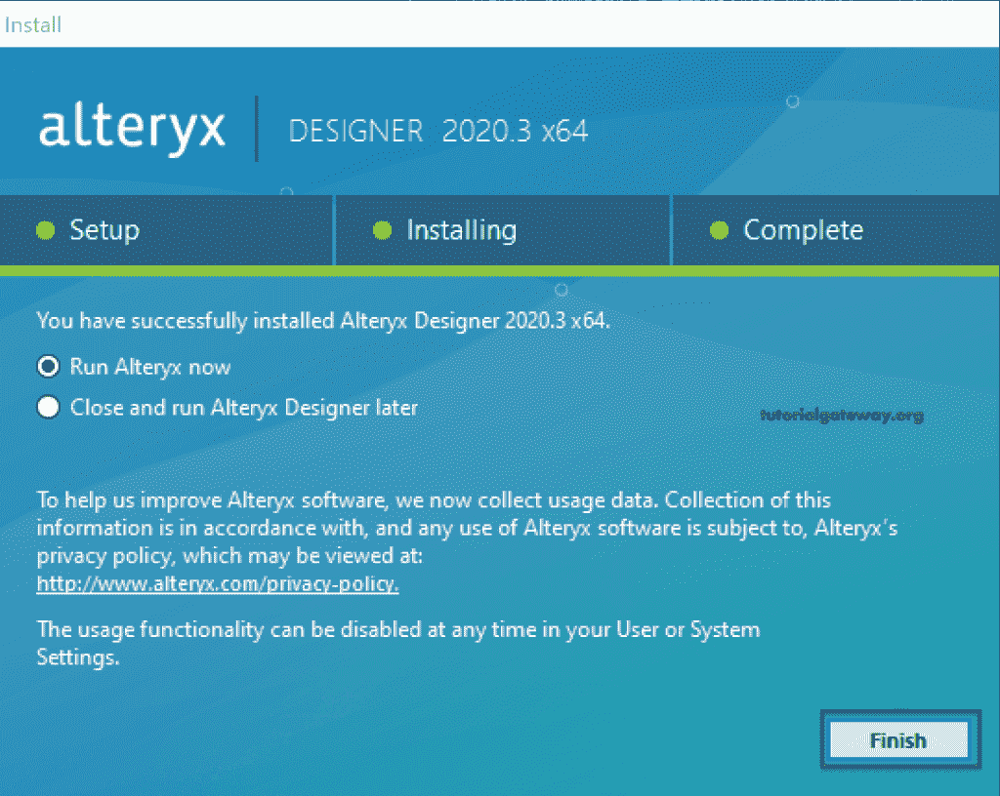

从下图中，您可以看到设计器窗口。

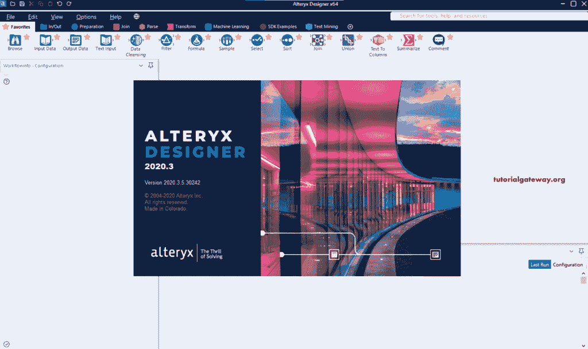

### 设计师激活

当你第一次打开 [Alteryx](https://www.tutorialgateway.org/alteryx-tutorial/) Designer 时，它会要求你输入许可证密钥来激活产品。如果您愿意，可以点击“开始免费试用”按钮享受免费试用。让我输入我的电子邮件和激活密钥。

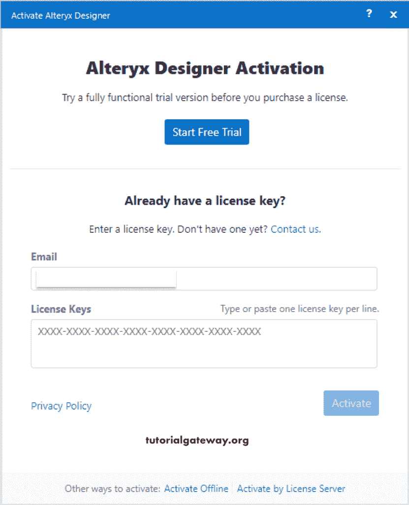

你可以看到成功的信息。请点击开始解决按钮。

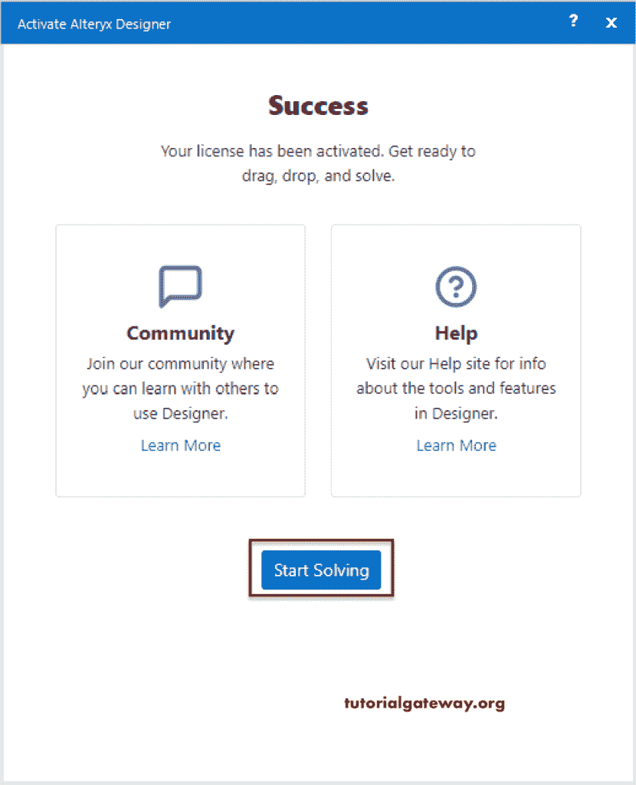

是 Start Here 文件，第一次打开应用就能看到这个！

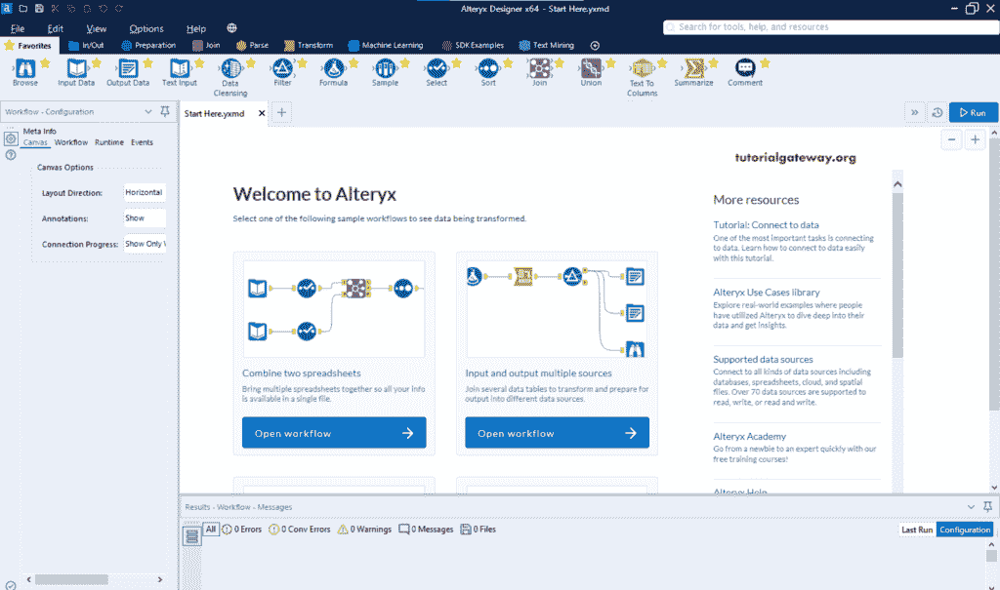