# 在 Alteryx 中创建第一个工作流

> 原文：<https://www.tutorialgateway.org/create-the-first-workflow-in-alteryx/>

本节展示了如何使用 Alteryx 设计器之旅在 Alteryx 设计器中创建我们的第一个工作流。当你第一次打开 Alteryx 时，它会显示如下窗口。你可以开始旅行，也可以关闭它，自己工作。目前，我们选择启动选项来创建 Alteryx 新工作流。

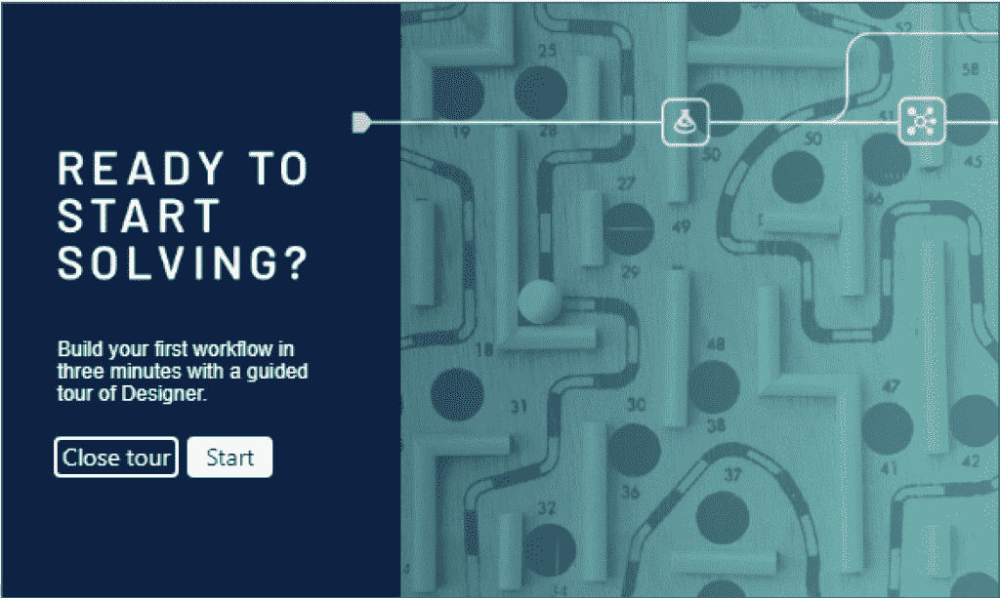

添加输入数据工具:将输入数据工具拖放到画布上。

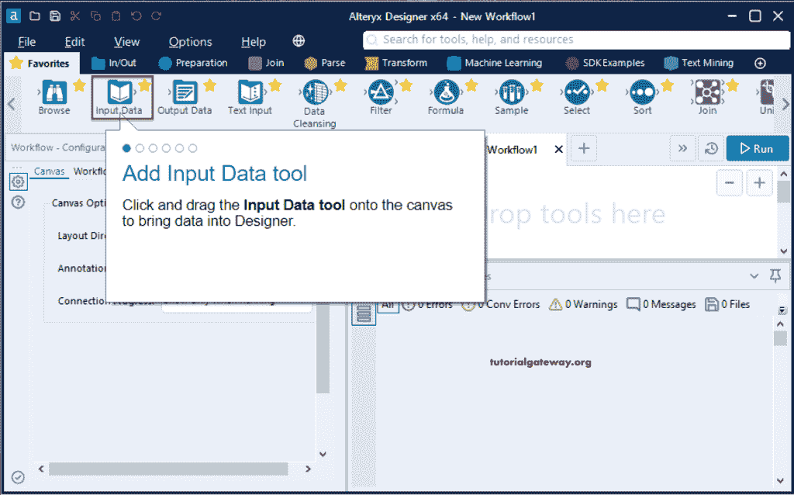

连接到数据:我们需要一些数据来执行一些操作。输入数据工具有助于选择所需数据或将所需数据带入 Altery 设计器。在这里，我们必须选择我们想要获取的数据类型。

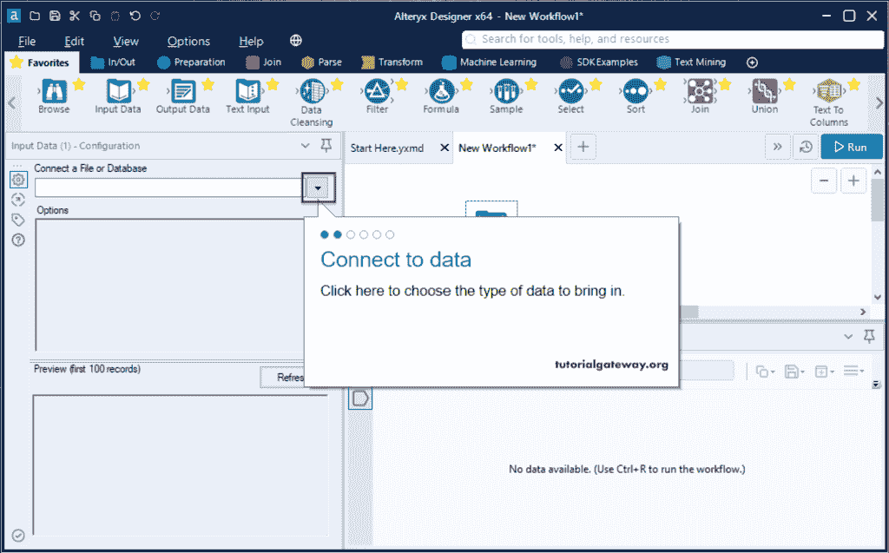

文件:单击文件选项卡选择文件。

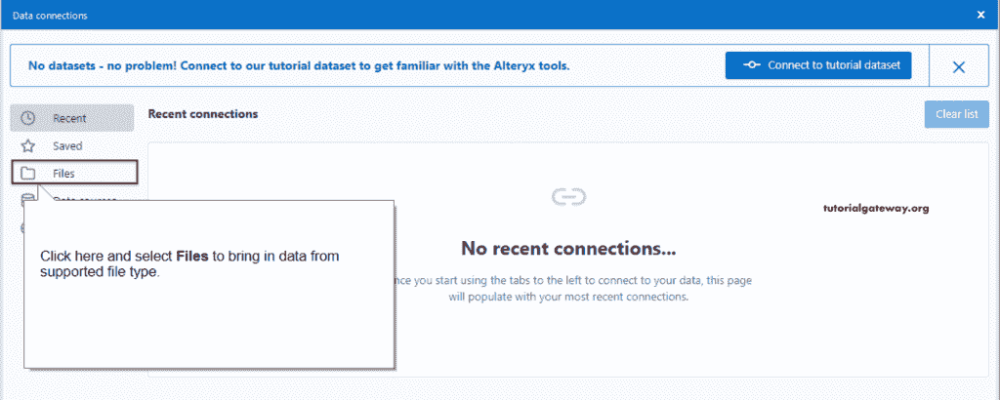

选择文件按钮:请点击此按钮选择所需的文件。在这里，我们跟随 Alteryx 设计器之旅，所以选择 TutorialData(如工具提示中所指定的)。

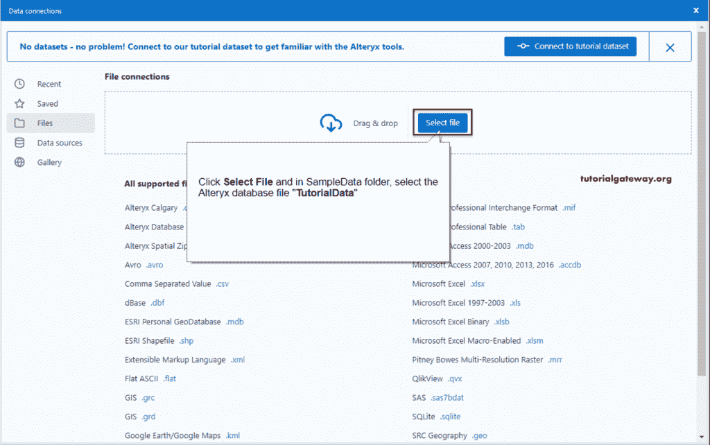

从下方 Alteryx 选择文件截图可以看到，我们已经选择了

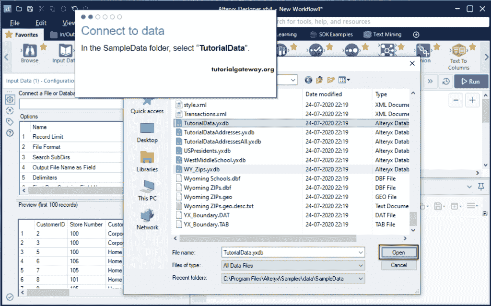

添加排序工具:我们从收藏夹中添加了 [Alteryx](https://www.tutorialgateway.org/alteryx-tutorial/) 排序工具。

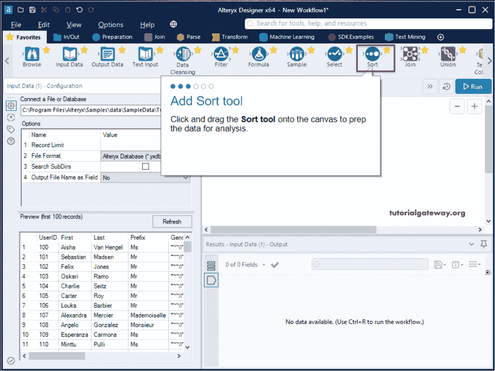

配置排序工具:我们必须指定名称和顺序。如上所述，我们选择用户标识和降序选项。

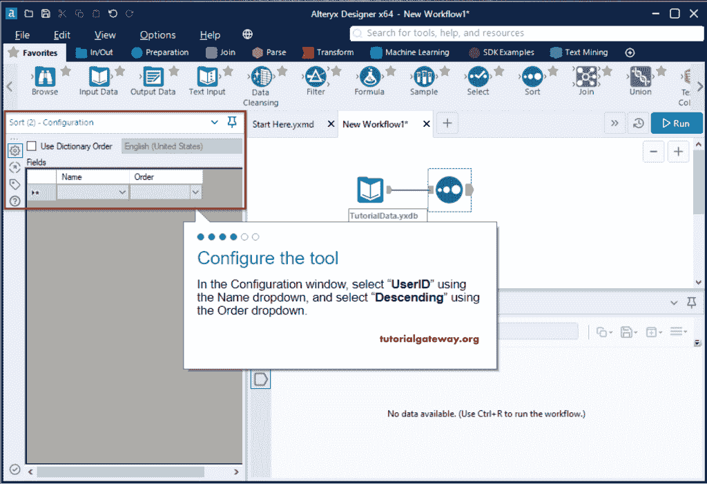

添加浏览工具:它有助于查看文件中的数据。

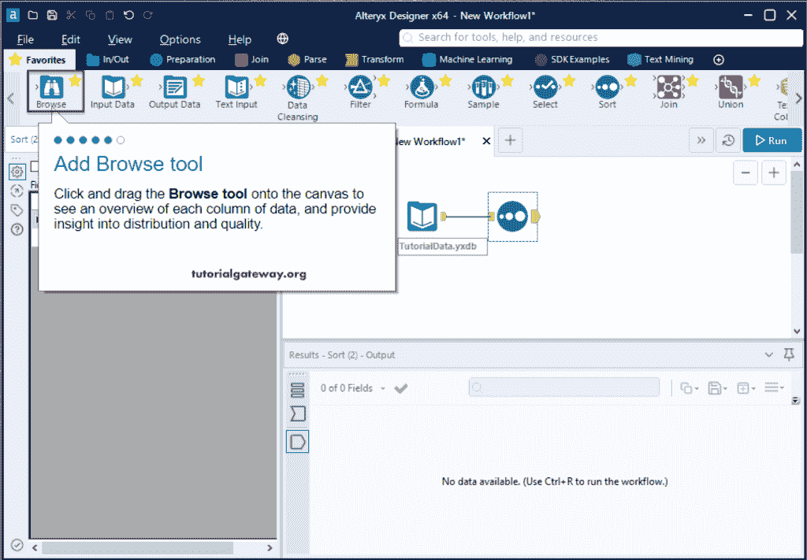

运行替代工作流:请单击运行按钮。

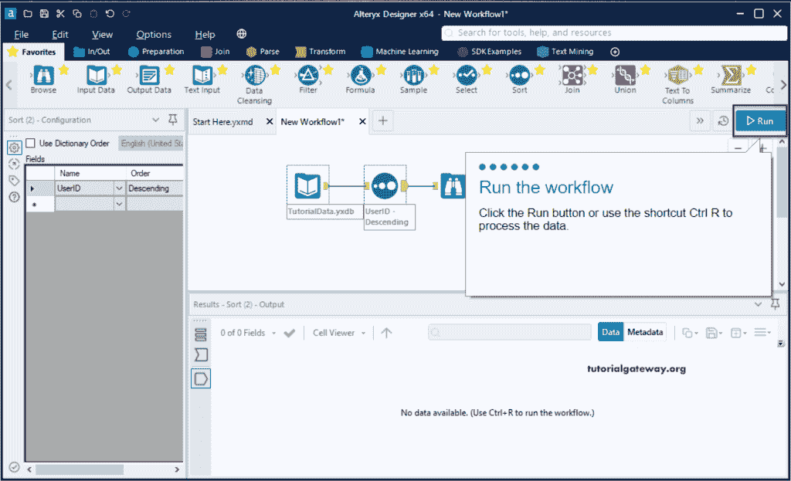

我们在 Alteryx Designer 工具中成功创建了第一个工作流。请单击“返回工作流”按钮。

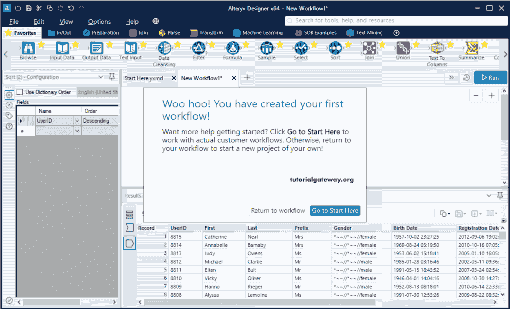

从下图中，您可以看到 Alteryx 工作流数据。

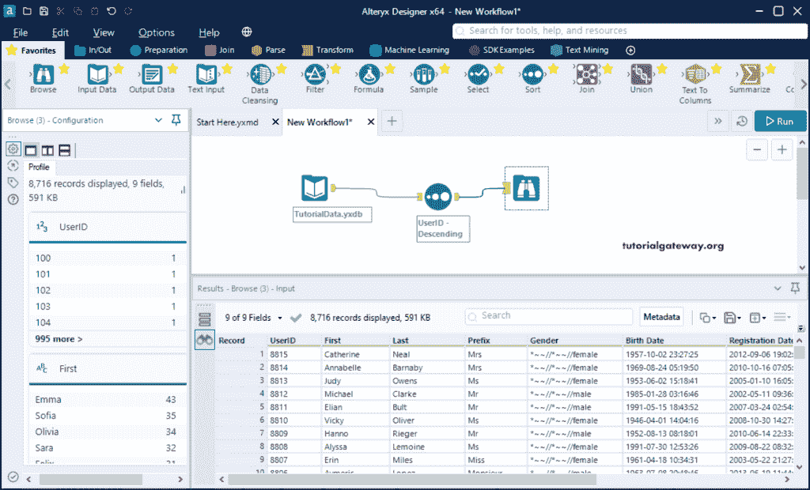