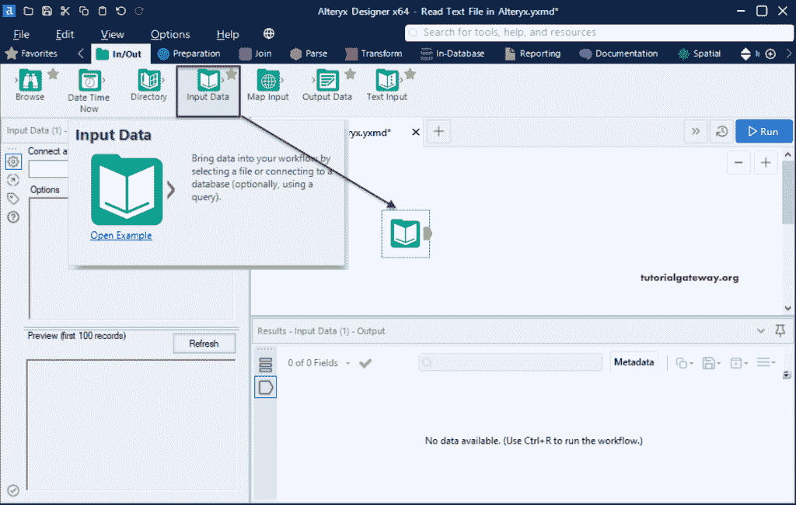
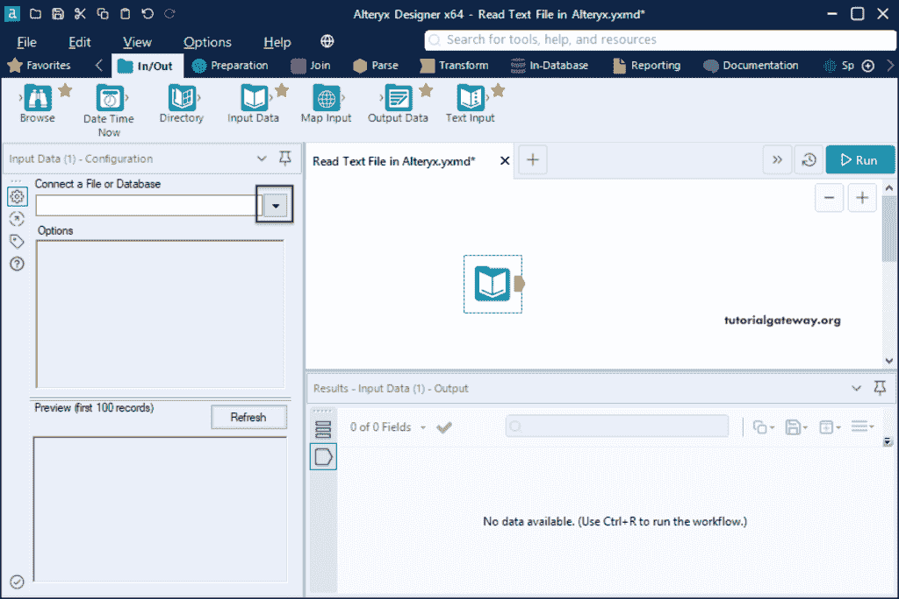
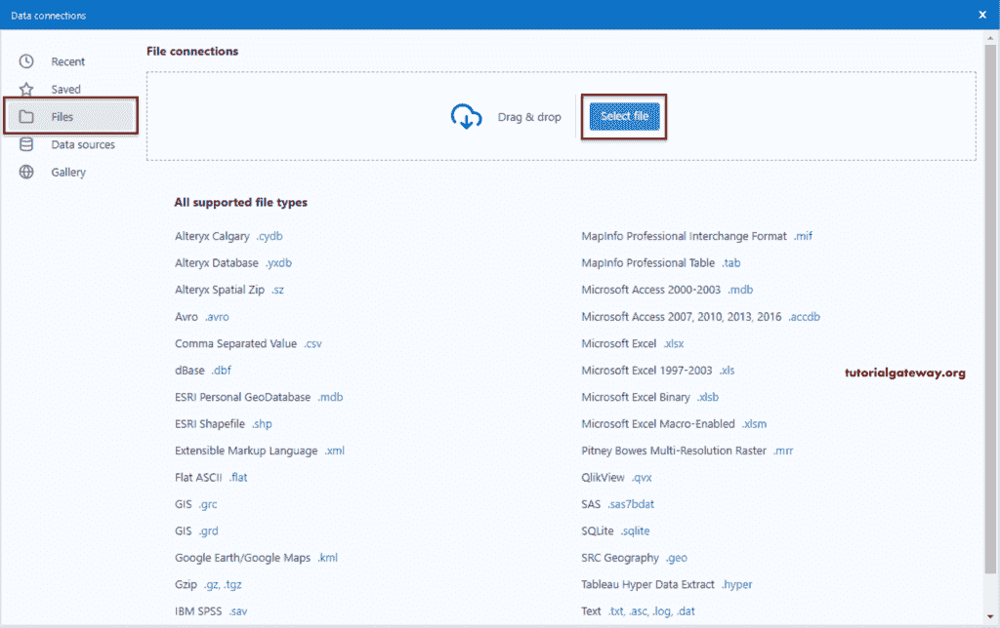
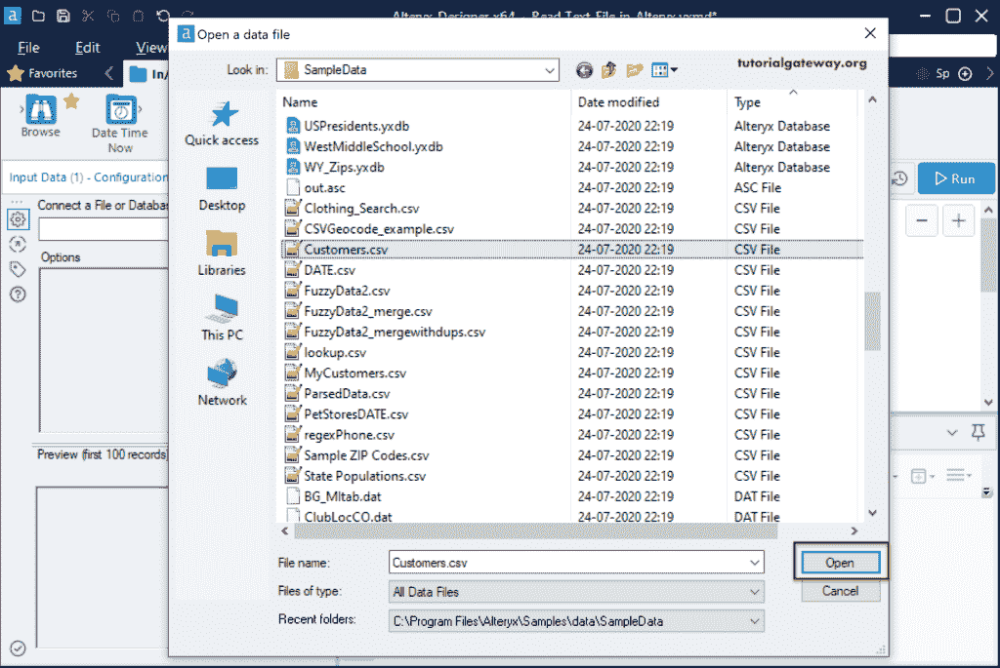
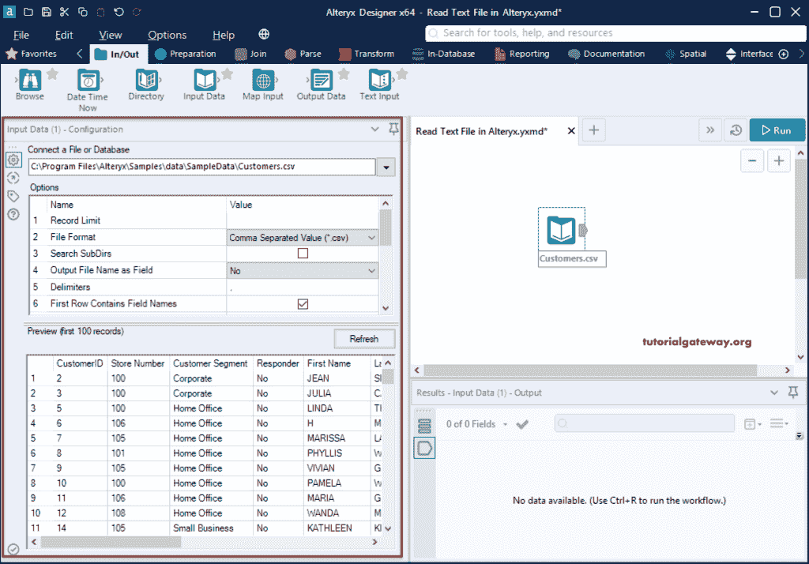
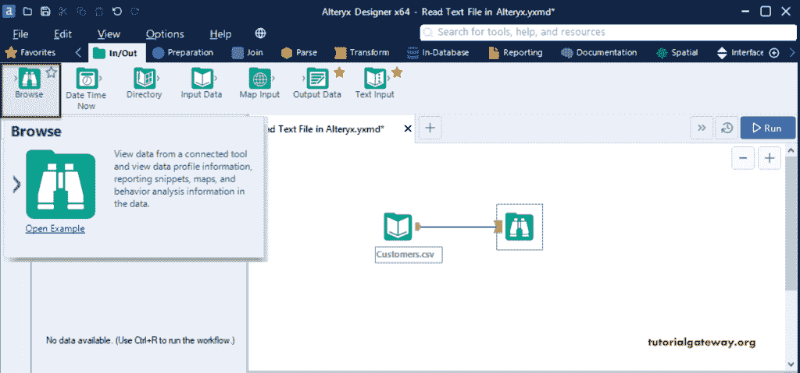
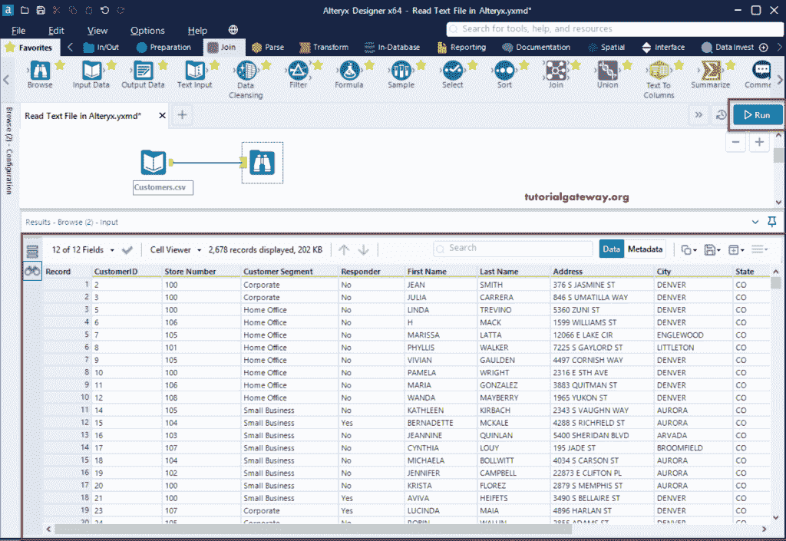
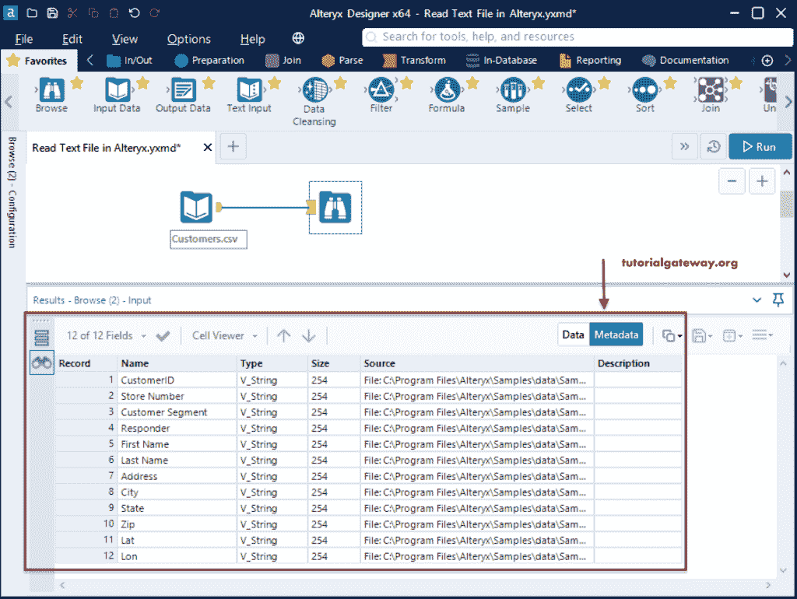

# 在 Alteryx 中读取 CSV 文件

> 原文：<https://www.tutorialgateway.org/read-csv-file-in-alteryx/>

本节通过一个示例说明如何将 CSV 文件中的数据加载或读取到 Alteryx 设计器中。首先，我们创建了一个新的工作流，并将输入数据工具拖放到 Alteryx 设计器窗口中。

在“配置”选项卡中，单击向下箭头按钮连接到文件或数据库。

它将打开以下数据连接窗口。请选择“文件”选项卡，查看 Alteryx 支持的文件类型列表。在这个 Alteryx 示例中，我们想要读取 CSV 文件数据。所以，请点击【选择文件】按钮

让我从 Alteryx 示例数据文件夹中选择客户 CSV 文件。

您可以在 Alteryx 左侧配置窗格中看到 CSV 文件信息和前 100 条记录的预览。

请使用浏览工具查看该 CSV 文件中的数据。因此，将浏览工具拖放到设计器中，并将 CSV 输入数据工具连接到浏览，然后单击运行按钮。

从下面的 [Alteryx](https://www.tutorialgateway.org/alteryx-tutorial/) 读取 CSV 文件工作流图像，可以看到所有 CSV 文件的记录。

如果单击元数据选项卡，您可以看到 CSV 文件列信息，如名称、类型、大小和源名称。

