# 在 Alteryx 中读取 Excel 文件

> 原文：<https://www.tutorialgateway.org/read-excel-file-in-alteryx/>

本节通过一个例子说明如何将 excel 文件中的数据读入 Alteryx 设计器。首先，我们创建了一个新的工作流，并将其重命名为在 Alteryx 中读取 Excel 数据。

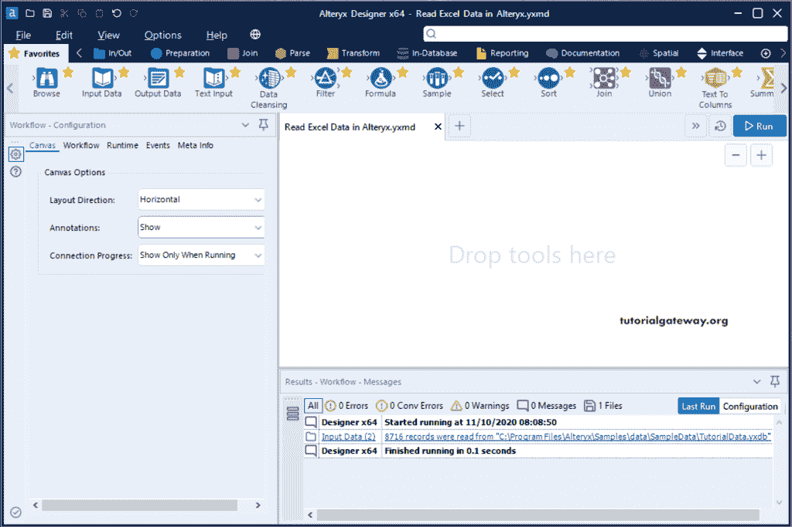

## 如何在 Alteryx 中读取 Excel 文件

将输入数据工具拖放到设计器窗口中。接下来，单击向下箭头按钮连接到 Excel 文件。

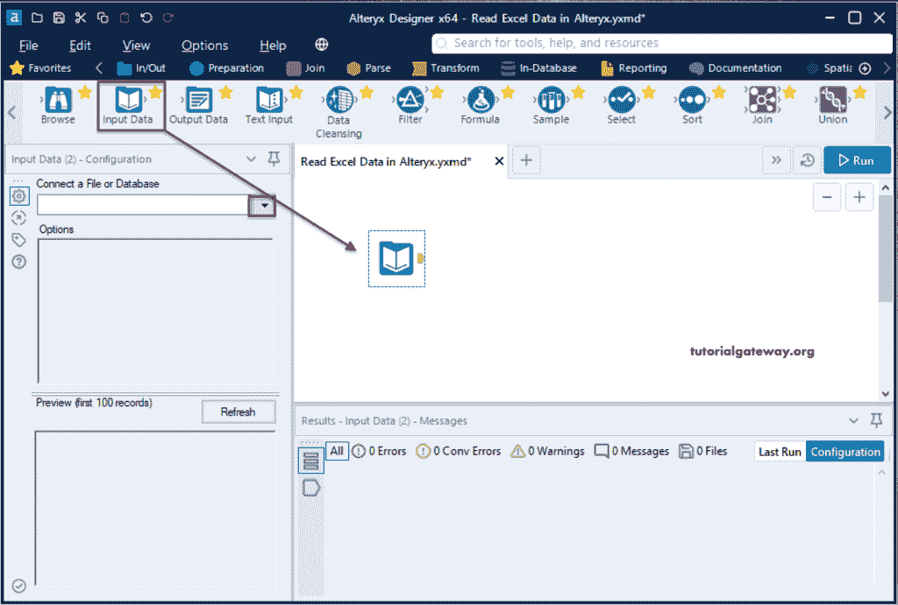

它会打开以下窗口，默认情况下，它会选择最近的选项卡。如果您最近有任何连接，它会显示它们。由于我们没有任何最近的连接，它显示为空。请选择文件选项卡。

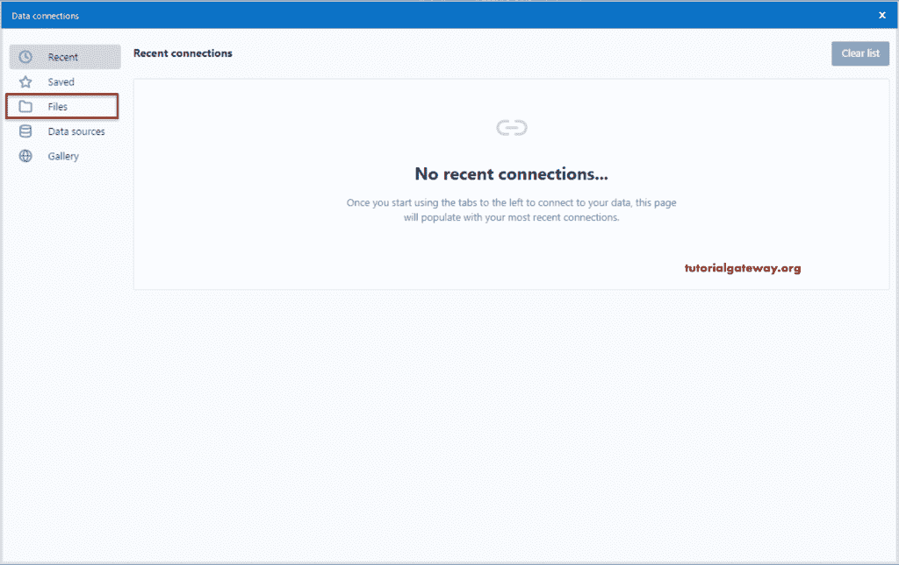

从下面的截图中，您可以看到所有支持的文件类型的列表。在这个 Alteryx 示例中，我们希望从 excel 文件中读取数据。所以，请点击选择文件按钮。

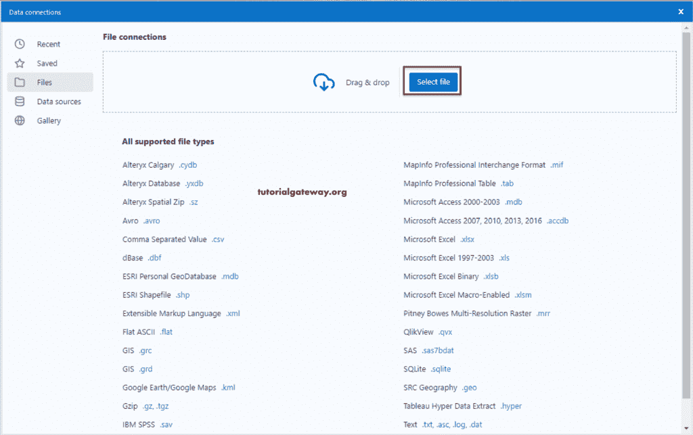

对于这个 Alteryx 演示，我们选择了 Cust _ wTransactions.xls Excel 文件。

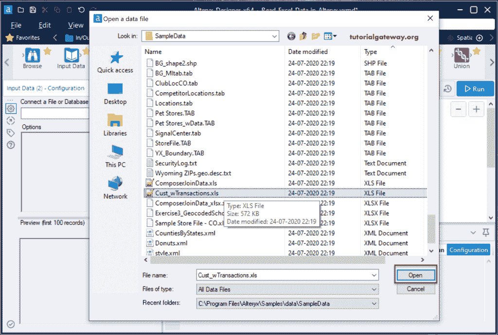

选择 Excel 输入:在这里，您可以选择 Excel 工作表、单元格、行和列。我们选择了唯一可用的纸张输出。

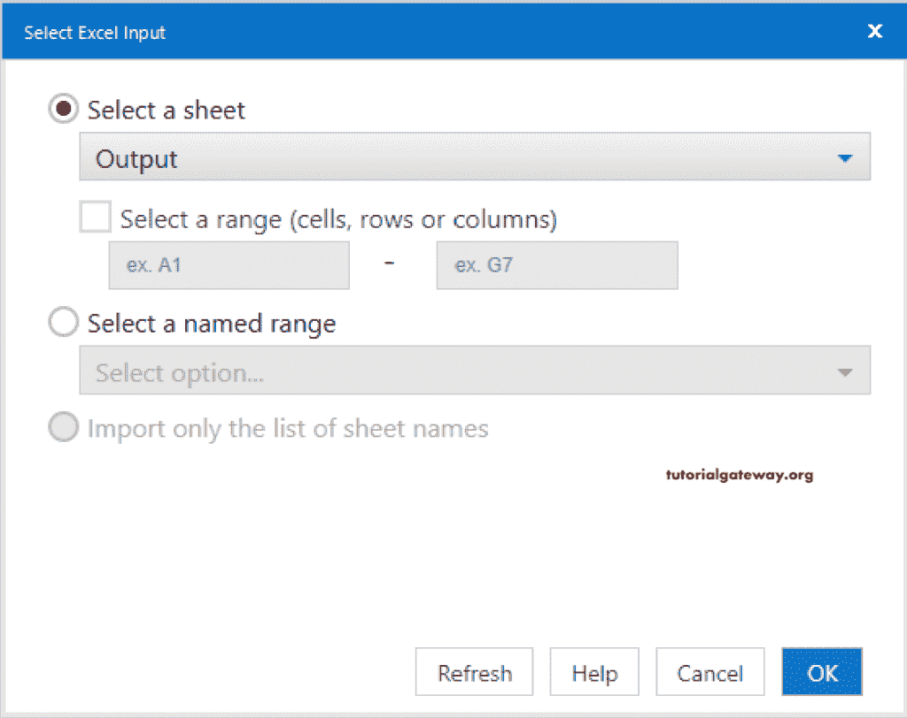

您可以在左侧配置窗格中看到 Excel 文件信息和前 100 条记录的预览。

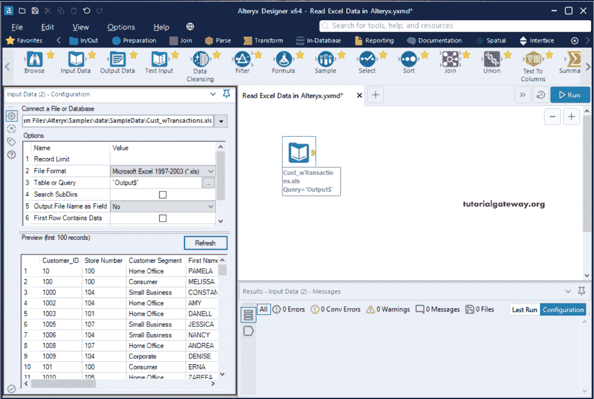

只需点击“运行”按钮，就会显示该 excel 文件中的数据。但是，我们使用了 [Alteryx](https://www.tutorialgateway.org/alteryx-tutorial/) 浏览工具(标准方式)。因此，将浏览工具拖放到设计器中。

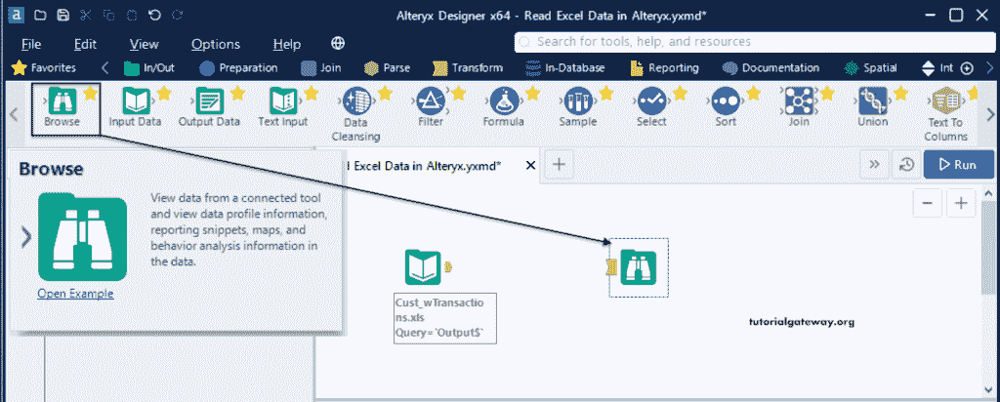

接下来，将 Excel 输入数据工具连接到“浏览”并单击“运行”按钮。

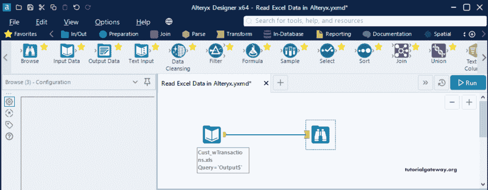

从下图中，您可以看到该 excel 文件中的所有记录。

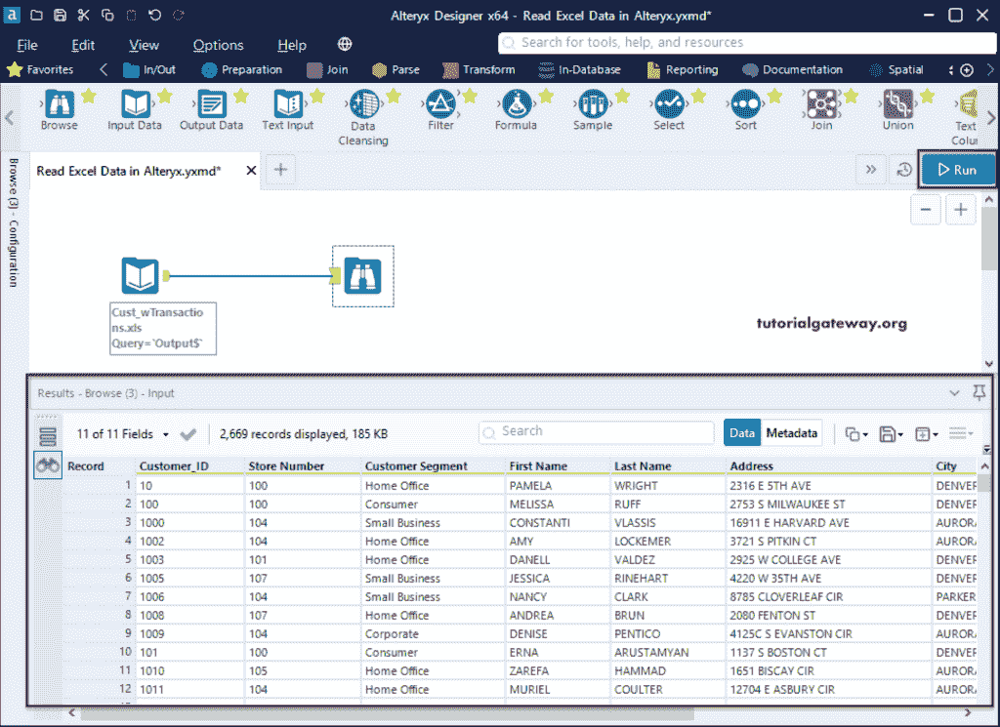

如果单击元数据选项卡，您可以看到列信息，如名称、数据类型、大小和源名称。

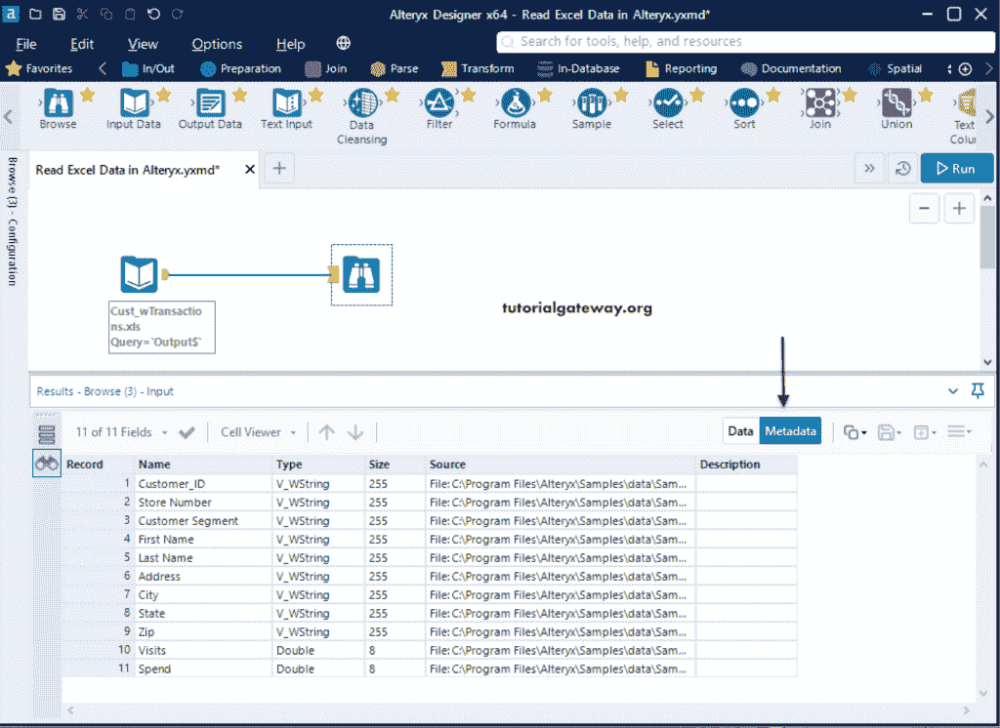