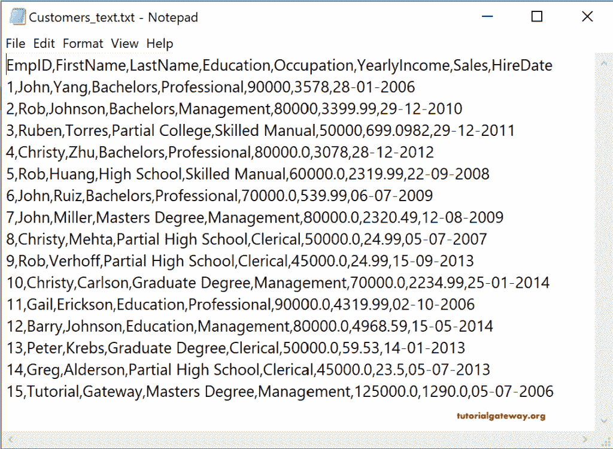
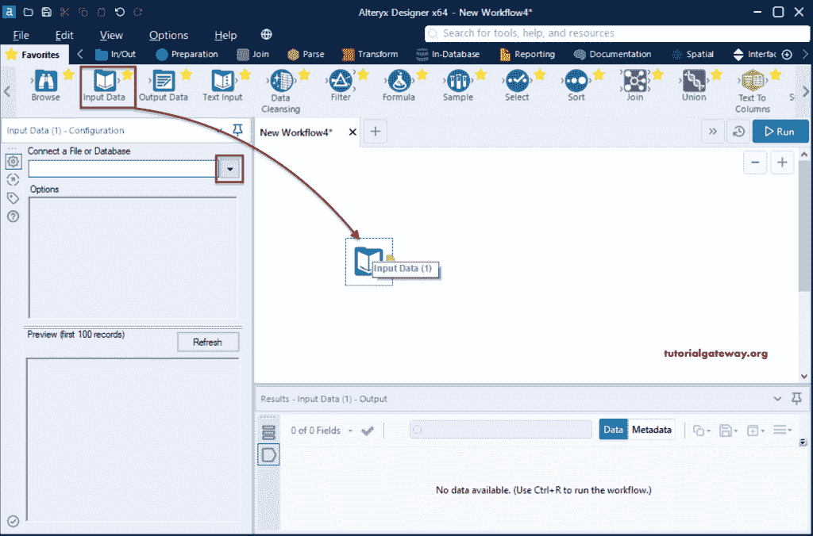
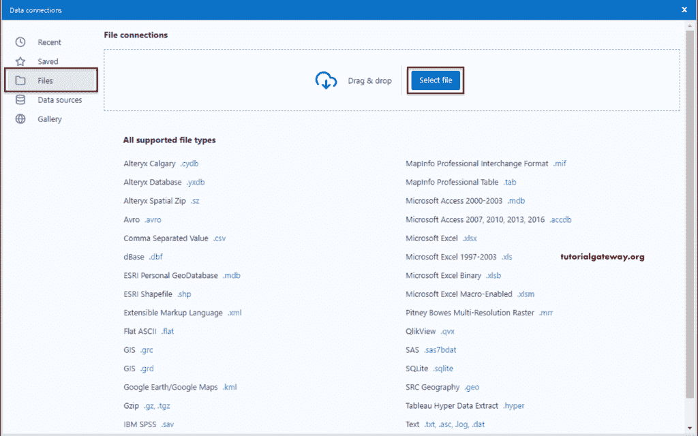
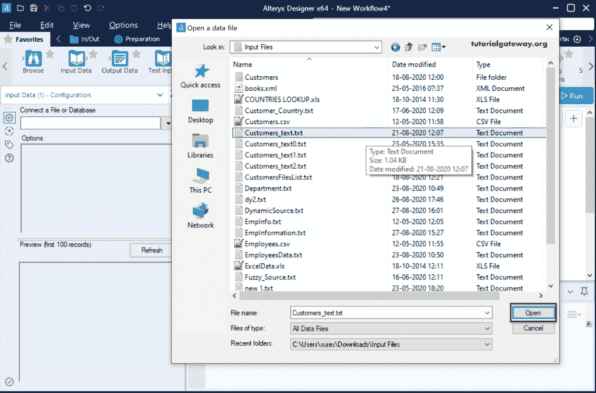
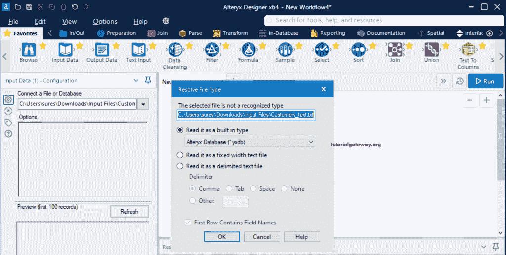
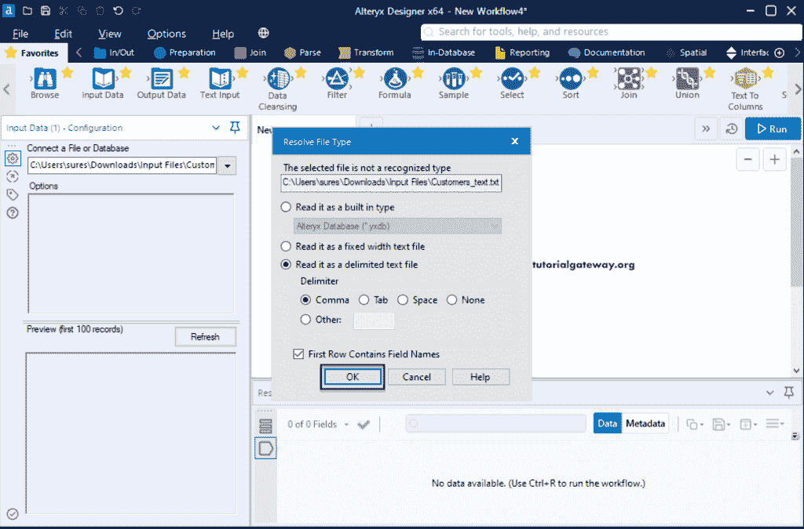
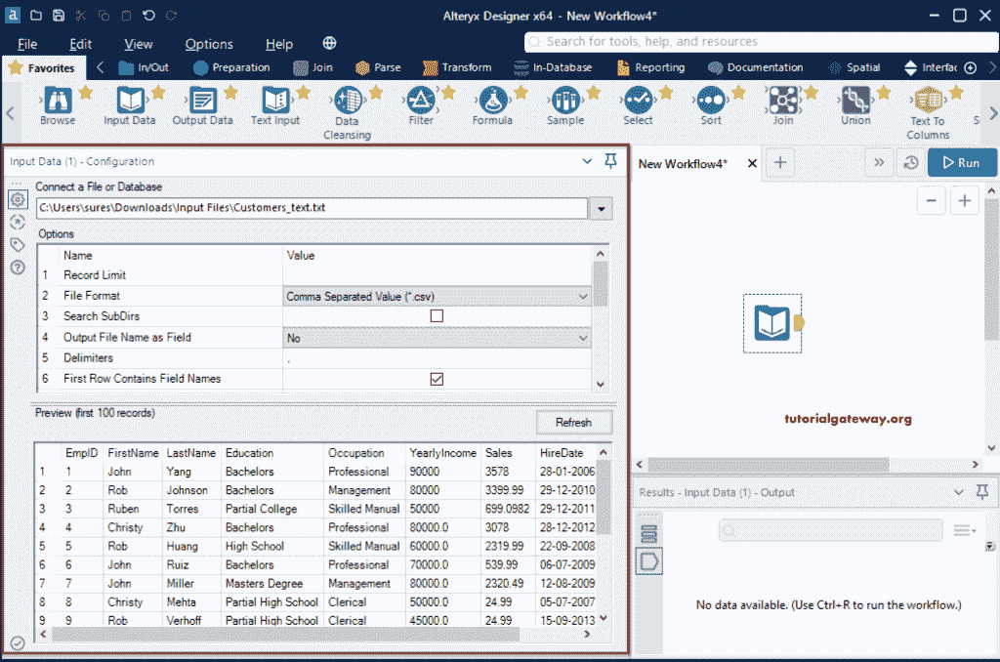
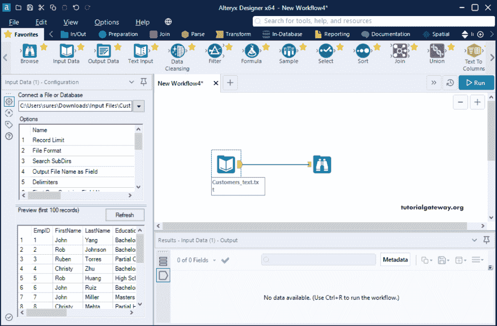
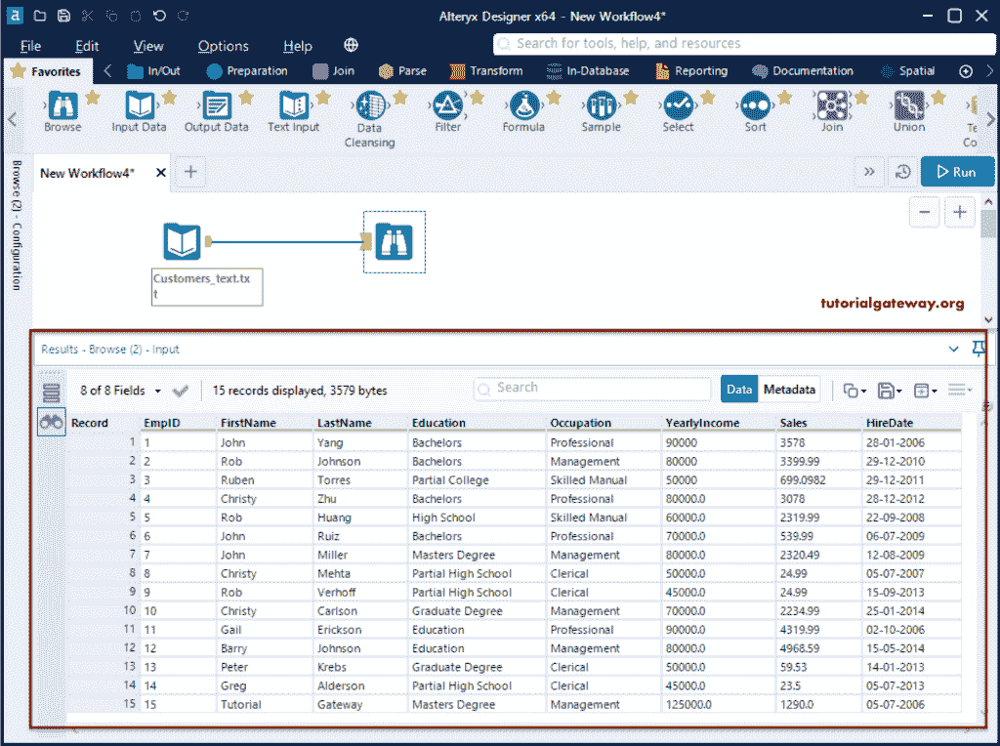

# 在 Alteryx 中读取文本文件

> 原文：<https://www.tutorialgateway.org/read-text-file-in-alteryx/>

本节通过一个示例展示了如何将文本文件数据读取或加载到 Alteryx 设计器中。为了演示 Alteryx 读取文本文件，我们使用了下面的 Customers_text 文件。

## 如何在 Alteryx 中读取文本文件

首先，将输入数据工具拖放到新创建的 Alteryx 工作流中。接下来，在“配置”选项卡中，单击向下箭头按钮连接到文本文件。

它将打开以下数据连接窗口。请选择文件选项卡，然后单击选择文件来选择文本文件。

让我从输入文件文件夹中选择客户文本文件。

单击“打开”文件夹后，将打开以下“解析文件类型”窗口。

*   将其作为内置类型读取:默认情况下，它选择 Alteryx 数据库类型。在这里，您必须更改文件类型。
*   以固定宽度文本文件的形式阅读:如果源文件的列以固定宽度分隔，请选择此选项。
*   将其作为分隔文本文件读取:为所有常规文本文件选择此选项。在这里，您有多个分隔符选项，如逗号、制表符、空格可供选择。或者选择“其他”选项并指定分隔符，例如分号。
*   第一行包含字段名:如果文本文件包含标题或其第一行包含列名，请选中此选项。

众所周知，文本文件中的列由逗号分隔符分隔。我们选择了“将其作为分隔文本文件读取”选项，并选择了逗号。

您可以在左侧配置窗格中看到 Customers_text 文本文件信息和前 100 条记录的预览。

拖放浏览工具，将文本文件输入数据工具连接到浏览，然后单击运行按钮。

从下面的 [Alteryx](https://www.tutorialgateway.org/alteryx-tutorial/) 读取文本文件图像，可以看到该文本文件中的所有记录。

