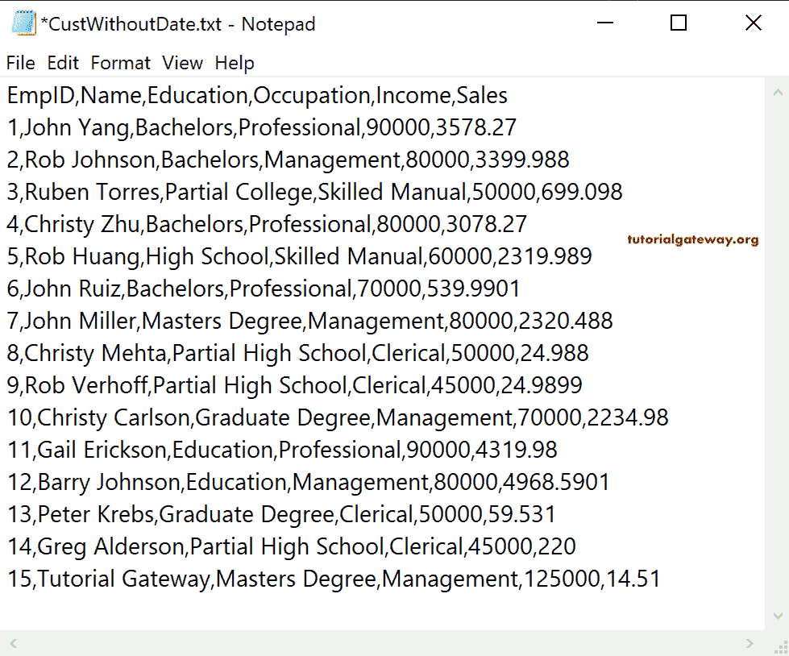
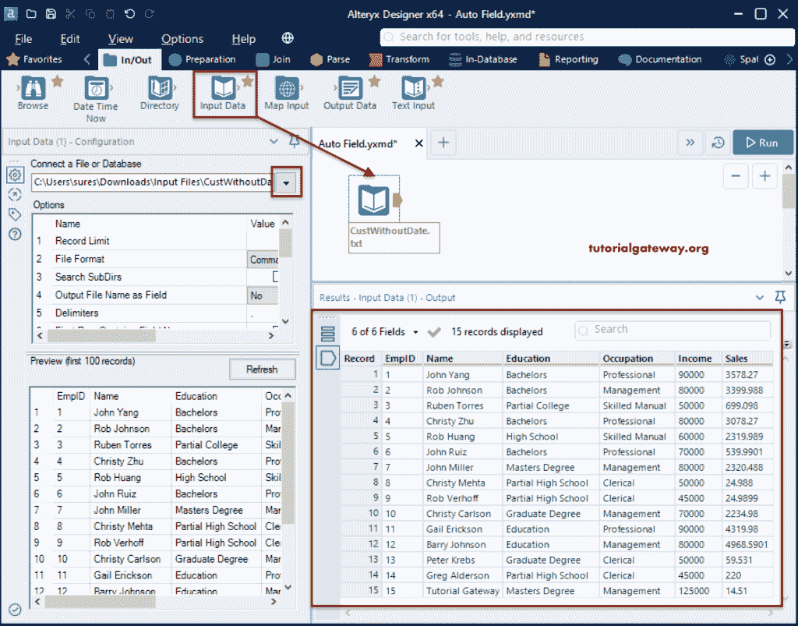
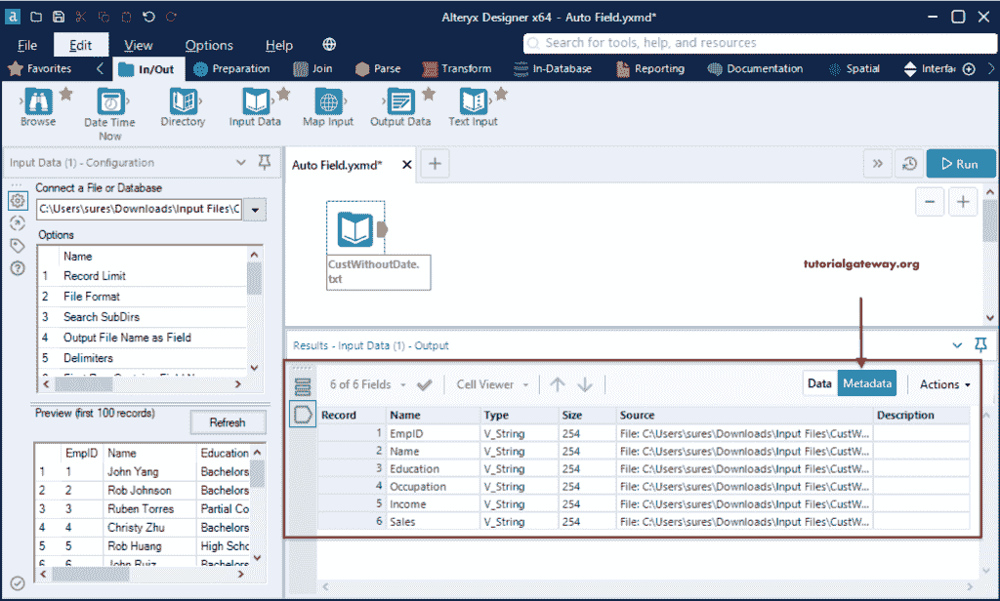
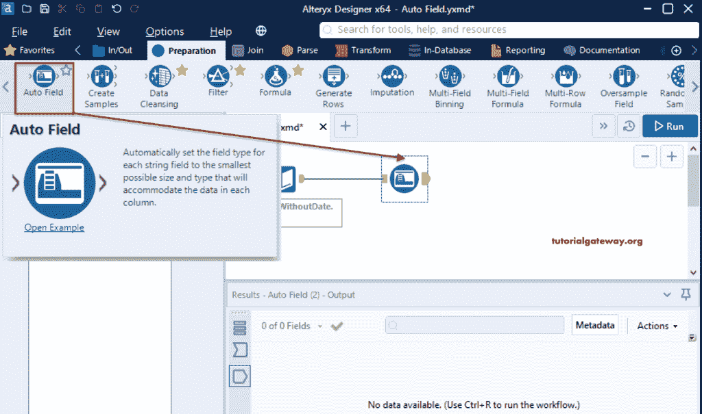
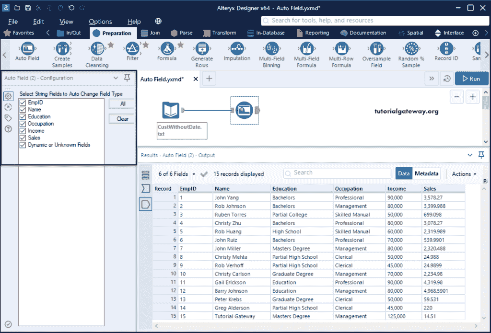
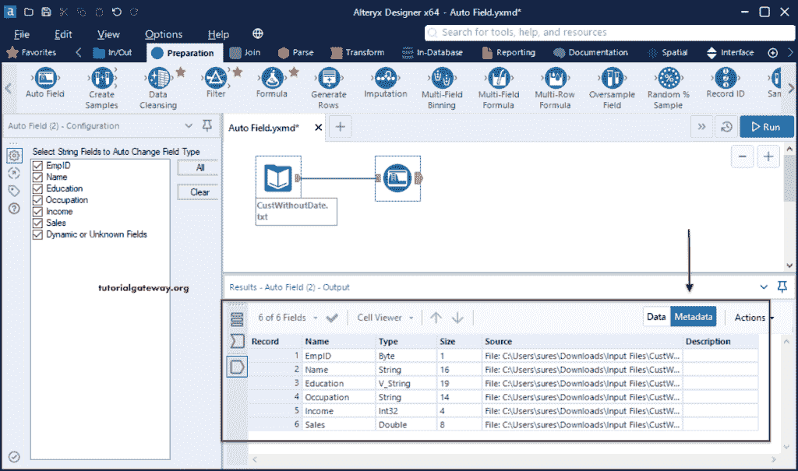
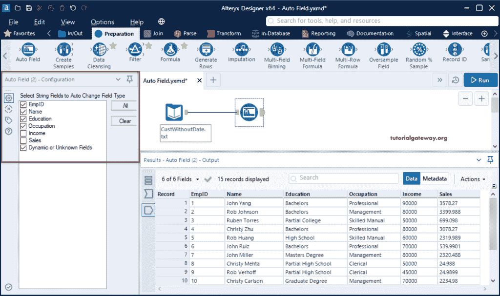
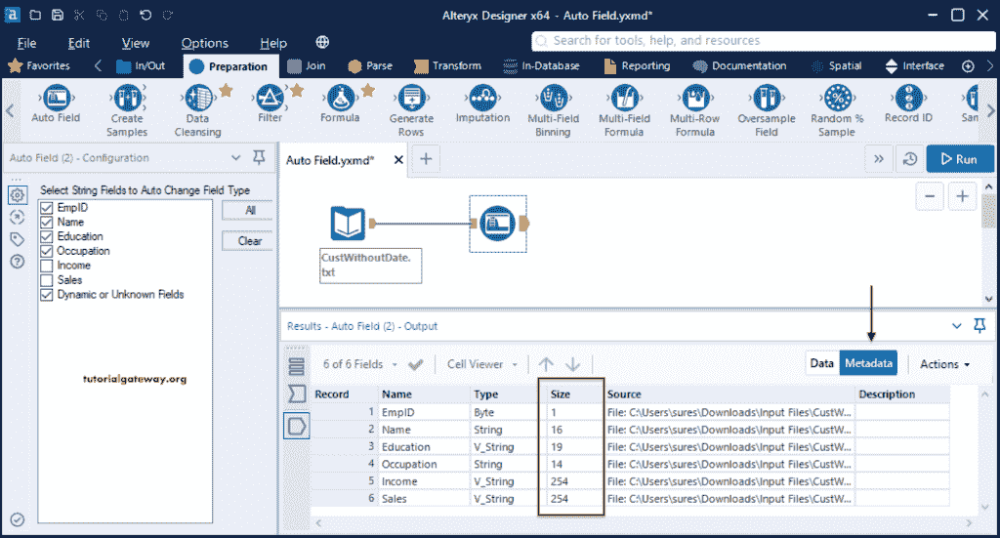

# Alteryx 自动场

> 原文：<https://www.tutorialgateway.org/alteryx-auto-field/>

Alteryx 自动字段工具对于更改所选列的数据类型和大小非常有用。Alteryx 自动字段会自动更改每个字符串列的数据类型，并根据列数据将大小设置为可能的最小大小。通常，我们使用选择工具手动更改列类型和大小。但是，我们可以使用该自动字段来自动化该过程。为了演示这个 Alteryx 自动字段，我们使用了

首先，拖放输入数据工具，并从配置选项卡中选择 CustWithoutDate 文本文件。

如果查看文本文件的元数据，所有的列都是字符串类型，大小为 254。

## Alteryx 自动现场工具示例

请转到准备选项卡，将自动场工具拖到画布上。然后将输入工具连接到该自动字段。

在自动字段配置选项卡中，您可以看到所有输入列。请选择字符串列以自动更改字段类型。在这里，我们选择了所有的列，并点击运行按钮。

如果您查看元数据，EmpID 转换为字节，收入转换为整数，销售额转换为双倍。甚至每列的大小都会减小到可以容纳数据的适当大小。

为了进一步验证，我们未选中收入和销售列。

如您所见， [Alteryx](https://www.tutorialgateway.org/alteryx-tutorial/) Auto Field 更改了除这两列(销售和收入)之外的所有列的数据类型和大小。

