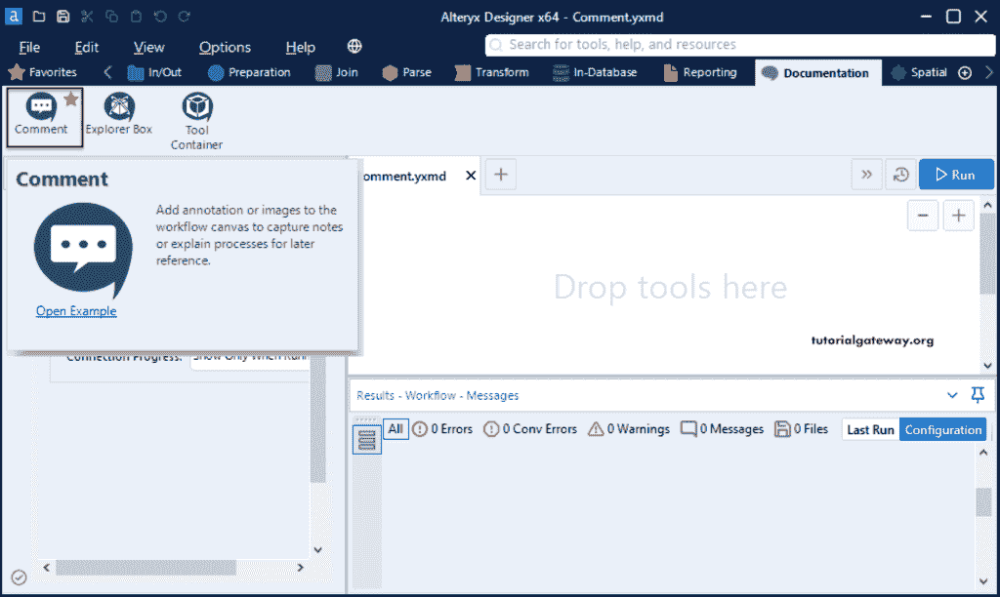
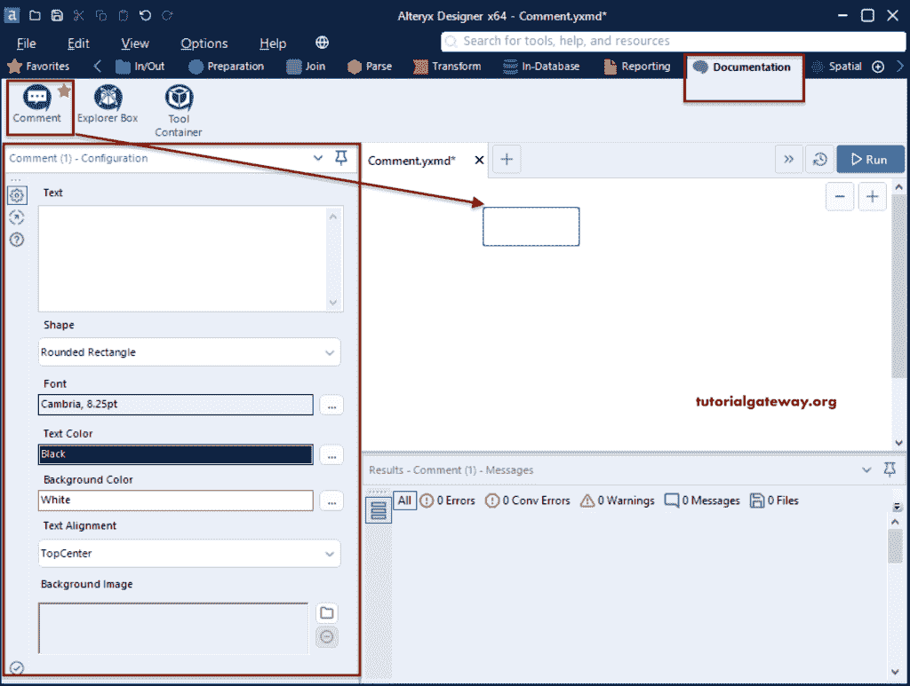
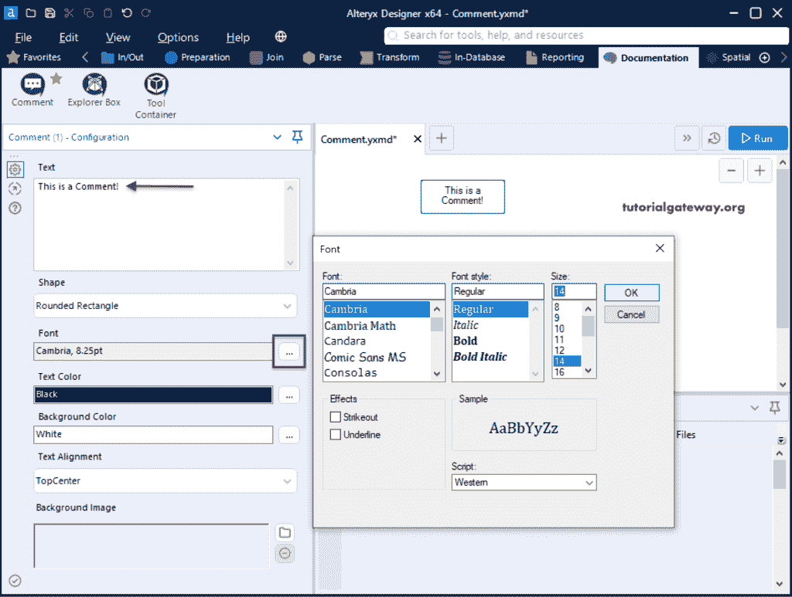
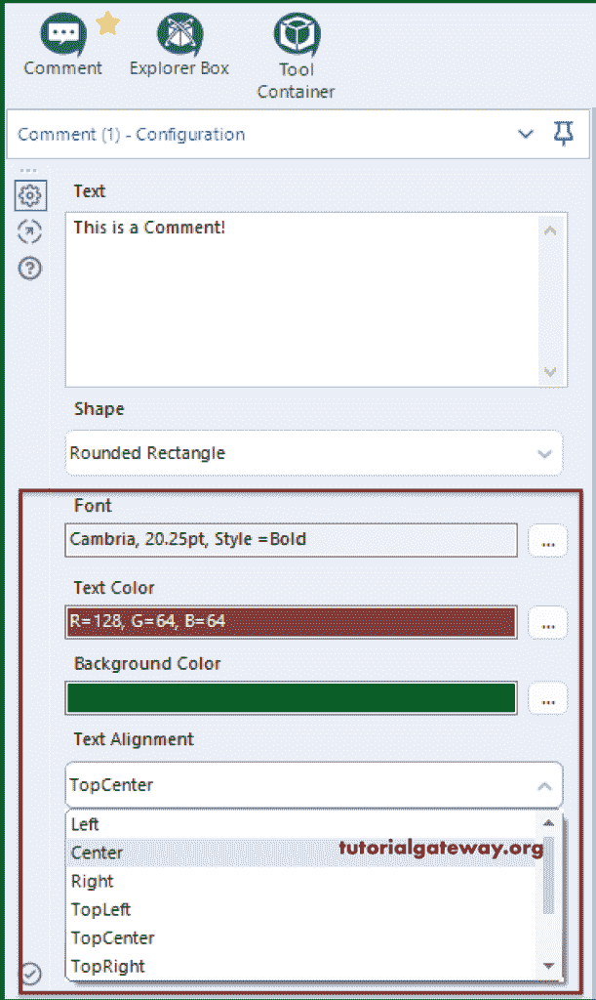
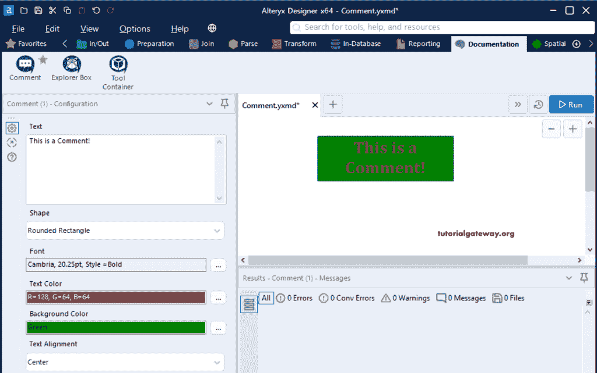
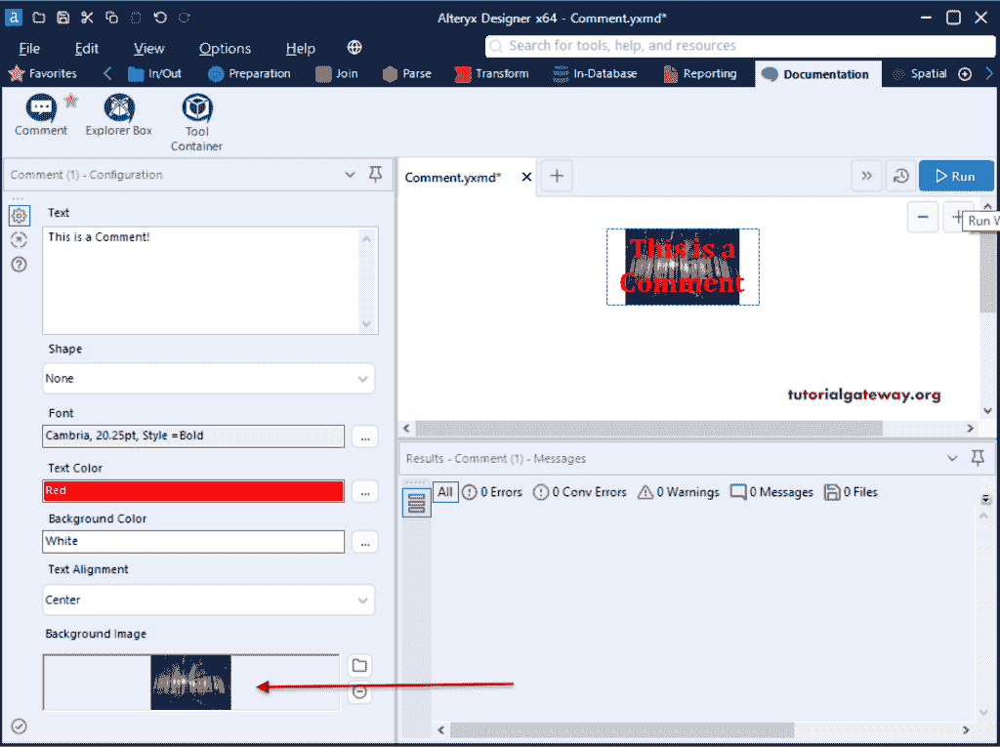
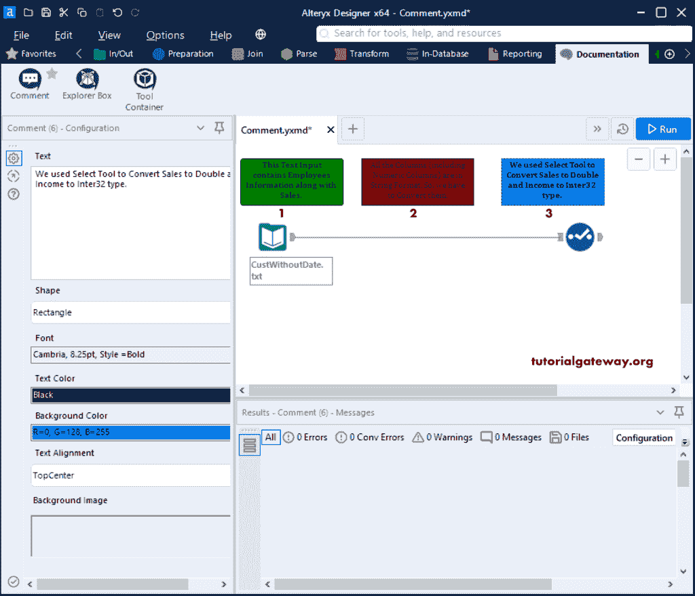
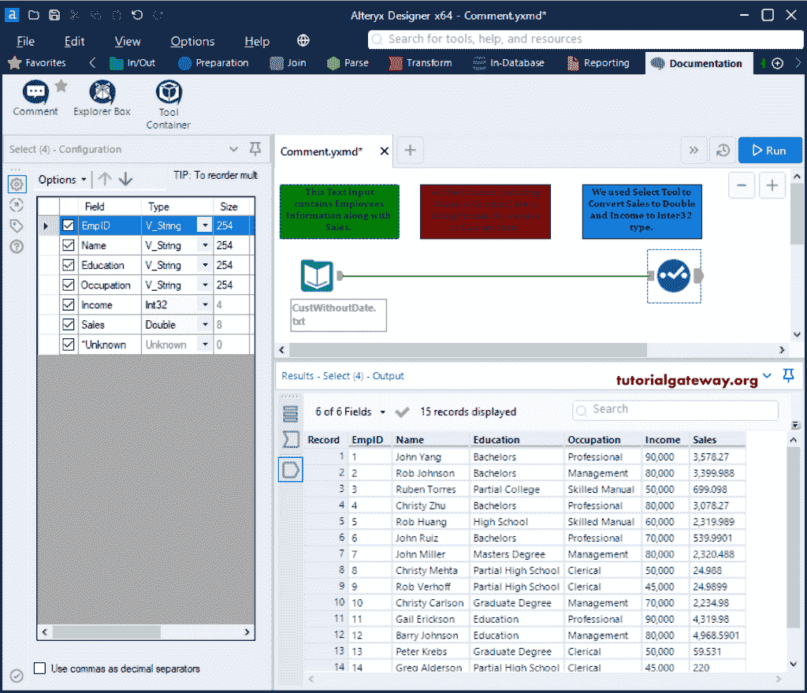

# Alteryx 注释工具

> 原文：<https://www.tutorialgateway.org/alteryx-comment-tool/>

Alteryx 注释工具有助于向工作流中添加注释/信息或图像。我们可以使用这个 Alteryx 注释工具来解释我们正在执行的工作流或操作。您可以在“文档和收藏夹”选项卡下找到这个。

## Alteryx 注释工具示例

请导航到文档选项卡，并将注释工具添加到工作流中。

在 Alteryx 注释配置部分，您可以添加文本、字体样式、格式、颜色、背景图像等。

首先，我们添加了一条示例消息作为文本。然后，我们将字体更改为坎布里亚，样式更改为粗体，字体大小更改为 20。

接下来，我们将文本颜色、背景颜色和文本对齐方式改为居中。

从下面的 Alteryx Comment 图片，可以看到预览。

这里，我们添加了背景图像。

### 有意义的例子

首先，我们添加了文本输入，并使用选择工具将一些字符串列转换为数字。

接下来，我们添加了三个 [Alteryx](https://www.tutorialgateway.org/alteryx-tutorial/) 注释工具来解释工作流程。

1.  此文本输入包含员工信息和销售信息。
2.  所有列(包括数字列)都是字符串格式。所以，我们必须改变他们。
3.  我们使用选择工具将销售额转换为双倍，将收入转换为 32 倍。

让我运行这个工作流来看看结果。

