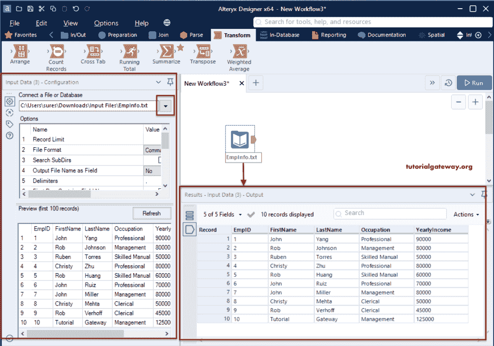
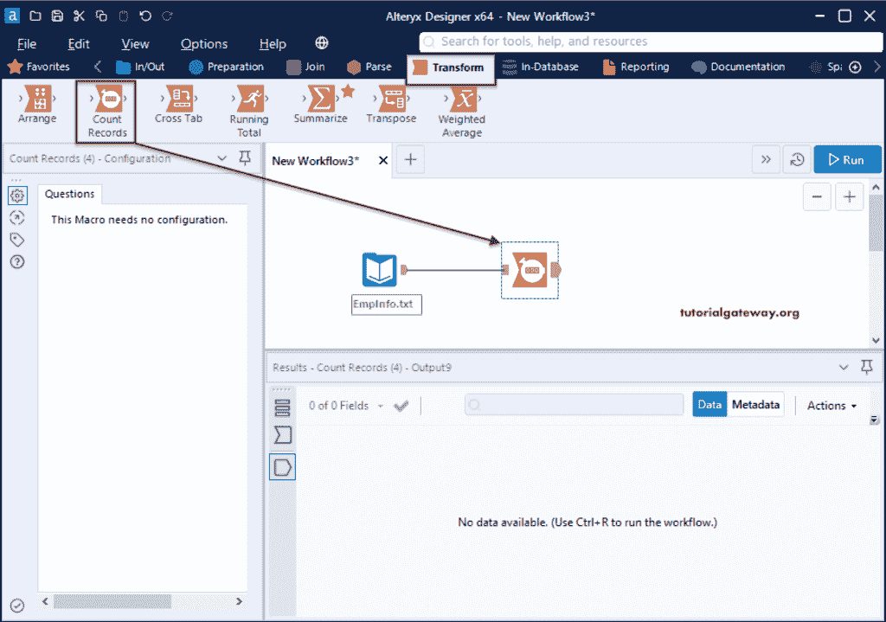
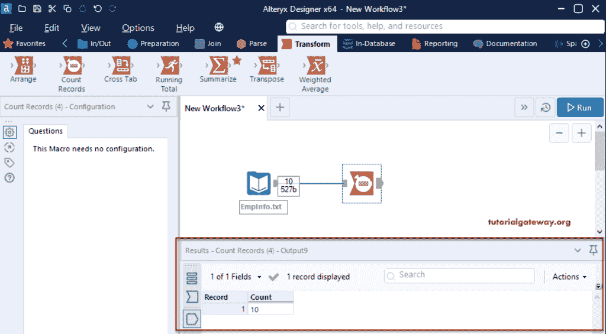

# Alteryx 计数记录工具

> 原文：<https://www.tutorialgateway.org/alteryx-count-records-tool/>

Alteryx 记录计数工具对记录总数进行计数，并将该数字作为输出返回。为了演示这个计数记录工具，我们使用了包含十条记录的 EmpInfo 文本文件。

## Alteryx 计数记录工具示例

首先，拖放输入数据工具，并从连接文件或数据库选项配置选项卡中选择 EmpInfo 文本文件。从下图中，你可以看到那十条记录。

请转到转换选项卡，将计数记录工具拖放到画布，并将计数记录连接到输入工具。如果您观察计数记录配置部分，您将无能为力。所以，让我运行这个计数记录工作流。

从下方 [Alteryx](https://www.tutorialgateway.org/alteryx-tutorial/) 截图，可以看到记录数量。

