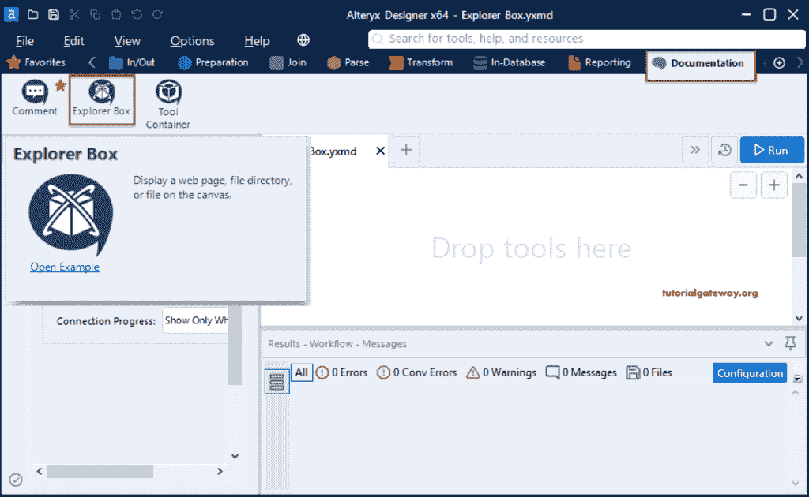
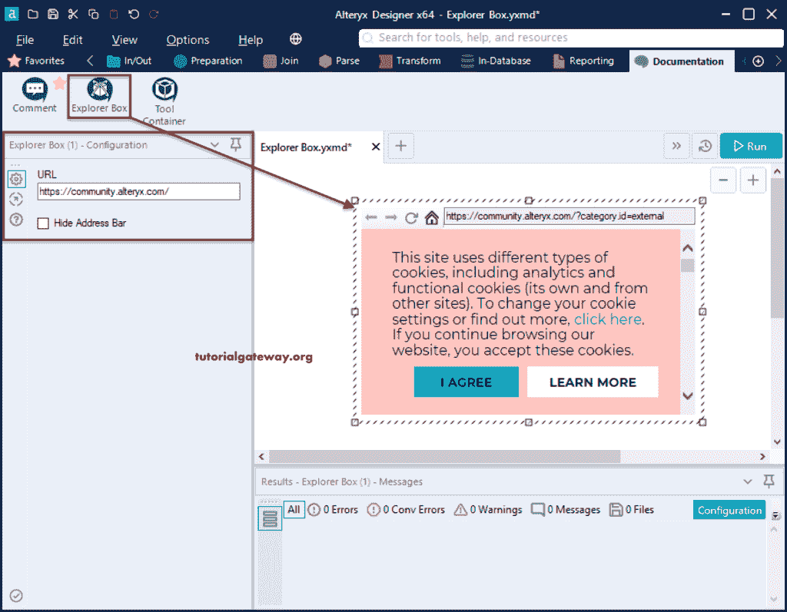
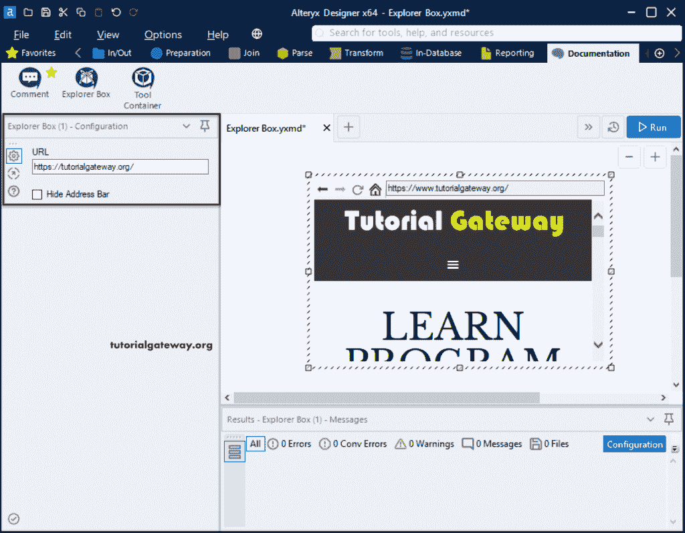
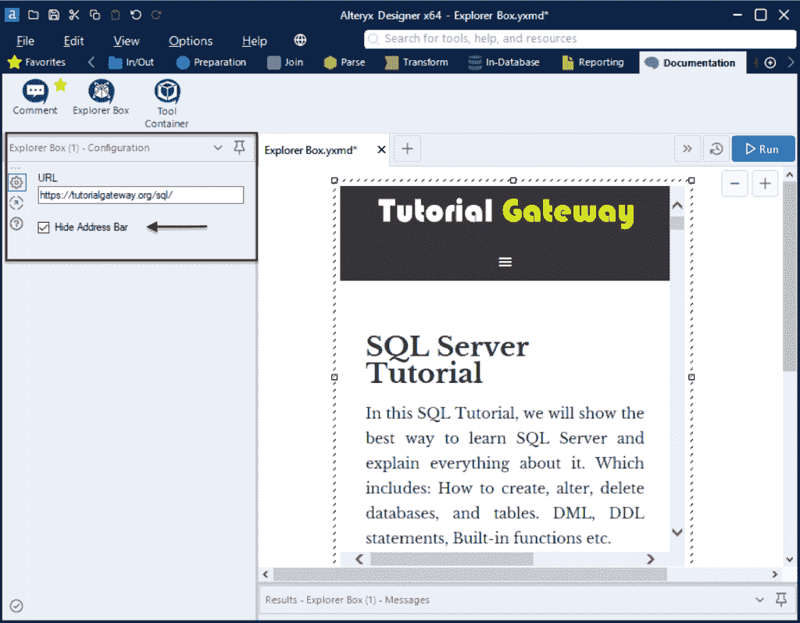
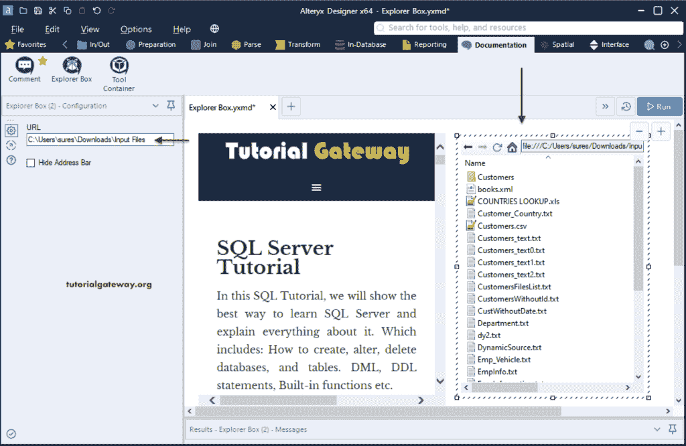

# Alteryx 浏览器框

> 原文：<https://www.tutorialgateway.org/alteryx-explorer-box/>

Alteryx 浏览器框允许您在画布上显示或添加网页、文件或文件目录。您可以在“文档”选项卡下找到此浏览器框。

## Alteryx 浏览器框示例

请导航到文档选项卡，并将浏览器框添加到工作流中。

默认情况下，它将使用默认的 Alteryx 社区 URL 添加网页。

在浏览器框配置部分，请根据您的要求更改网址。现在，让我们用 tutorialgateway.org。如您所见， [Alteryx](https://www.tutorialgateway.org/alteryx-tutorial/) 正在自动显示或展示我们的网站。

有一个隐藏地址栏选项，当你选中这个选项时，它会隐藏网页或文件浏览器的地址栏。

这一次，我们添加了另一个探索者盒子。我们添加了本地文件系统地址来显示输入文件文件夹中的文件。

