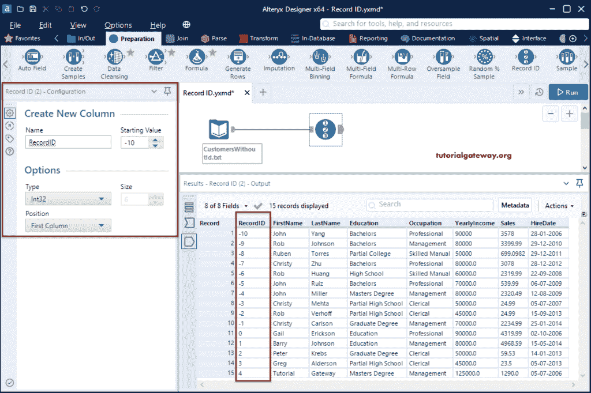

# Alteryx记录ID

> 原文：<https://www.tutorialgateway.org/alteryx-record-id/>

Alteryx 记录ID为每个记录分配一个唯一的值或标识符。我们可以使用这个记录ID来设置订单标识、订单标识等。为了演示这个Alteryx记录ID，我们使用了 CustomersWithoutId 文本文件。

首先，拖放输入数据工具，并从配置选项卡中选择 CustomersWithoutId 文本文件。

## Alteryx记录ID工具示例

请转到准备选项卡，并将记录ID工具拖到画布上。在记录ID配置选项卡中，我们必须分配新的列名、起始值(标识从该值开始)、数据类型、大小和列位置。

首先，将输入工具连接到这个 [Alteryx](https://www.tutorialgateway.org/alteryx-tutorial/) 记录 ID 工具。现在，我们保留新列的默认值。这意味着记录ID将在值从 1 开始的第一个位置创建一个整数类型的新列。

我们将起始值更改为 20 (ID 从 20 开始)，并将列位置更改为最后一列。

您也可以使用负值作为记录ID的起始值。

让我将数据类型更改为开始，并将起始值更改为 222。不要忘记分配适当的大小。

